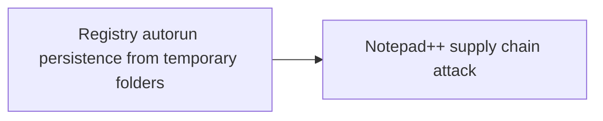
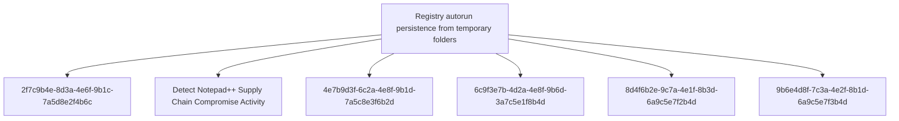

# Registry autorun persistence from temporary folders

## Metadata

- **UUID**: `55eaa437-5a25-4c29-b1fc-9c0fba4a18ad`
- **Schema**: `threat::1.0`
- **TLP**: clear

## Description
## Overview

This threat vector describes a Windows persistence technique that combines two
suspicious behaviors: dropping malicious executables into temporary/roaming 
application data folders (%appdata%) and establishing persistence through the
Windows registry autorun mechanism via Run keys. This technique ensures that
malicious programs start automatically when a user logs in, allowing attackers
to maintain access across system reboots.

## Attack Mechanism

The persistence technique follows a multi-step pattern:

1. **Payload Deployment**: Malicious files are dropped to unusual locations 
   within the user's application data directories, typically:
   - `%appdata%\ProShow\`
   - `%appdata%\Adobe\Scripts\`
   - `%appdata%\Bluetooth\`
   
2. **Registry Modification**: The attacker adds entries to the Windows Registry
   Run key at:
   - `HKEY_CURRENT_USER\SOFTWARE\Microsoft\Windows\CurrentVersion\Run`
   
3. **Persistence Establishment**: The registry entries point directly to the
   malicious executables in the temporary/appdata locations, ensuring automatic
   execution at user logon.

## Why This Pattern is Suspicious

According to Kaspersky security researchers, "In this case, a clear sign of 
malicious activity is gaining persistence through the autorun mechanism via the 
Windows registry, specifically the Run key, which ensures that programs start 
automatically when the user logs in."

The combination of these behaviors is particularly suspicious because:

- **Legitimate software rarely uses %appdata% for persistence**: Well-designed
  applications typically install to Program Files and use proper installer mechanisms
- **Temporary folders indicate ephemeral content**: %appdata% subdirectories are
  generally used for user-specific configuration data, not executable programs
- **Run key pointing to temporary locations**: Legitimate autostart entries
  typically reference stable installation paths in system directories

## Detection Approach: temporary_folder_in_registry_autorun

Kaspersky KEDR Expert detection system identifies this activity through the
`temporary_folder_in_registry_autorun` rule, which specifically looks for:

1. Registry autorun entries (Run keys) being created or modified
2. The target path of these entries pointing to:
   - %appdata% subdirectories
   - Roaming profile directories
   - Other temporary/cache locations
3. Executable files residing in these non-standard locations

### Detection Logic

The detection rule triggers when:
- A new registry value is created in autorun keys (Run/RunOnce)
- The value data contains a path to %appdata% or similar temporary directories
- The referenced file is an executable (PE file, script, or DLL)

### Observed Malicious File Paths

In the Notepad++ supply chain attack, the following suspicious paths were observed:

```
%appdata%\ProShow\load
%appdata%\Adobe\Scripts\alien.ini
%appdata%\Bluetooth\BluetoothService
```

These paths exhibit clear indicators of compromise:
- **ProShow**: Not a legitimate ProShow installation directory
- **Adobe\Scripts**: Unusual location for Adobe scripting components
- **Bluetooth**: Mimics legitimate Windows Bluetooth services but resides in user profile

## Technical Details

### Registry Keys Targeted

```
HKEY_CURRENT_USER\SOFTWARE\Microsoft\Windows\CurrentVersion\Run
HKEY_CURRENT_USER\SOFTWARE\Microsoft\Windows\CurrentVersion\RunOnce
```

### Typical Registry Entry Format

```
Name: <Random or legitimate-looking name>
Type: REG_SZ
Data: C:\Users\<username>\AppData\Roaming\<subfolder>\<malicious.exe>
```

### Execution Flow

1. User logs into Windows
2. Windows reads registry Run keys during logon process
3. Windows executes all programs referenced in Run keys
4. Malicious payload launches automatically with user privileges
5. Malware establishes C2 communication and executes its objectives

## Detection Opportunities

### File System Monitoring

Monitor for suspicious file creation patterns:
- Executable files dropped to %appdata% subdirectories
- Particularly focus on non-standard subdirectory names (ProShow, Adobe\Scripts, Bluetooth)
- Files with misleading names mimicking legitimate software

### Registry Monitoring

Monitor registry operations:
- Creation/modification of values under Run/RunOnce keys
- Specifically flag entries pointing to %appdata%, %temp%, or %localappdata%
- Alert on registry changes made by non-installer processes

### Behavioral Analysis

Look for behavioral chains:
- Network-downloaded file → %appdata% storage → Registry modification
- Installer execution → Suspicious subdirectory creation → Autorun registration
- Script execution → Binary deployment → Persistence establishment

## MITRE ATT&CK Mapping

**T1547.001 - Boot or Logon Autostart Execution: Registry Run Keys / Startup Folder**

This technique directly maps to MITRE ATT&CK's description of persistence through
registry Run keys. Adversaries achieve persistence by adding programs to startup
folders or registry Run keys that execute at user logon.

**Key Characteristics**:
- **Tactic**: Persistence, Privilege Escalation
- **Privileges Required**: User (for HKCU keys)
- **Platforms**: Windows
- **Data Sources**: Command execution, file monitoring, registry monitoring, Windows registry key modification

## Mitigation Recommendations

### Detection Rules

Implement the following detection logic:

```
IF (Registry Key Modified OR Registry Value Created)
AND (Key Path CONTAINS "CurrentVersion\Run")
AND (Value Data CONTAINS "%appdata%" OR "%temp%" OR "%localappdata%")
THEN Alert: "Suspicious autorun persistence from temporary folder"
```

### Preventive Measures

1. **Registry Protection**: Enable registry protection features in EDR/EPP solutions
2. **Application Whitelisting**: Restrict execution from %appdata% locations
3. **User Education**: Train users to recognize suspicious installer behavior
4. **Monitoring**: Deploy the temporary_folder_in_registry_autorun detection rule
5. **Group Policy**: Consider restricting Run key modifications via Group Policy

### Response Actions

When this persistence technique is detected:

1. **Immediate Containment**:
   - Isolate affected endpoint from network
   - Prevent user logon to stop autorun execution
   - Create forensic disk image for analysis

2. **Investigation**:
   - Examine registry Run keys for suspicious entries
   - Check %appdata% subdirectories for malicious files
   - Review parent process that created registry entry
   - Search for lateral movement indicators
   - Check for associated C2 network connections

3. **Remediation**:
   - Delete malicious registry entries
   - Remove malicious files from %appdata% locations
   - Scan for additional persistence mechanisms
   - Reset user credentials
   - Apply security patches and updates

4. **Recovery**:
   - Monitor for re-infection attempts
   - Verify complete malware removal
   - Restore normal operations
   - Update detection rules based on IoCs

## Real-World Context: Notepad++ Supply Chain Attack

This persistence technique was actively exploited in the Notepad++ supply chain
compromise (June-December 2025), where attackers:

- Compromised legitimate Notepad++ update infrastructure
- Delivered malicious NSIS installers disguised as authentic updates
- Deployed payloads to suspicious %appdata% subdirectories
- Established persistence via registry Run keys
- Maintained access across multiple infection chains

The attack demonstrated sophisticated tradecraft by:
- Evolving payloads across three distinct infection chains
- Using legitimate-looking subdirectory names (ProShow, Adobe, Bluetooth)
- Combining multiple techniques for defense evasion
- Targeting government, financial, and IT service sectors globally

## Indicators of Compromise

### Registry IoCs

Monitor for registry values in Run keys pointing to:
```
*\AppData\Roaming\ProShow\*
*\AppData\Roaming\Adobe\Scripts\*
*\AppData\Roaming\Bluetooth\*
```

### File System IoCs

Check for suspicious files in:
```
%appdata%\ProShow\load
%appdata%\Adobe\Scripts\alien.ini
%appdata%\Bluetooth\BluetoothService
```

### Process IoCs

Watch for suspicious parent-child process relationships:
- NSIS installer → Registry modification process
- Non-installer process → Registry Run key modification
- Script interpreter → Executable creation in %appdata%

## Conclusion

Registry autorun persistence from temporary folders represents a high-confidence
indicator of malicious activity. The combination of autorun registry modifications
and temporary folder execution is rarely used by legitimate software and should
trigger immediate investigation. Organizations should implement the 
temporary_folder_in_registry_autorun detection rule and establish monitoring
for this specific behavioral pattern.

This technique's confirmation in the Notepad++ supply chain attack demonstrates
its active use by sophisticated threat actors and underscores the importance of
robust detection and response capabilities for registry-based persistence mechanisms.

## Techniques
- T1547.001

## Chaining


## Relations

