# Resource Secret Reveal in Azure

## Metadata
| Field | Value |
| --- | --- |
| UUID | `37381f28-ad9f-40c3-80f8-d8a82d6ce9a3` |
| Schema | `threat::1.0` |
| Version | `1` |
| Created | `2025-09-15` |
| Modified | `2025-09-15` |
| TLP | clear (`TLP:CLEAR`) |
| Organisation | EC DIGIT CSOC (`56b0a0f0-b0bc-47d9-bb46-02f80ae2065a`) |

## References
### Public
- **1**: [https://microsoft.github.io/Azure-Threat-Research-Matrix/CredentialAccess/AZT605/AZT605/](https://microsoft.github.io/Azure-Threat-Research-Matrix/CredentialAccess/AZT605/AZT605/)
- **2**: [https://learn.microsoft.com/en-us/azure/defender-for-cloud/secrets-scanning](https://learn.microsoft.com/en-us/azure/defender-for-cloud/secrets-scanning)

## Description
The following threat vector involves adversaries accessing sensitive secrets, keys, 
or credentials stored or used by Azure resources such as KeyVaults, Storage Accounts, 
Automation Accounts, or within deployment histories.

### Example Attack Scenario

An attacker with sufficient privileged access in Azure exploits misconfigured permissions, 
allowing them to access a Storage Account and execute the `listkeys` action. This 
reveals access keys that grant full control over the account's data. Alternatively, 
by editing or viewing Azure Automation Account runbooks or Resource Group deployment 
history, the attacker discovers embedded credentials or secrets used in automation 
processes, which may then be used to escalate privileges or move laterally within 
the environment.

### Attack Goals and Impact

- **Primary goal:** Exfiltrate sensitive secrets, such as Storage Account access 
keys, service principal credentials, KeyVault secrets, or any plaintext credentials 
exposed in ARM templates or automation runbooks.
- **Impact:** Once these secrets are exposed, attackers can impersonate service 
identities, gain unauthorized access to data, break the integrity and confidentiality 
of cloud services, or launch further attacks including data exfiltration, lateral 
movement, persistence, or privilege escalation.

### Attack Flow and Methodology

- **Reconnaissance:** Identifies potential resources containing secrets, such as 
Storage Accounts, Automation Accounts, or deployment resource groups.
- **Execution:** 
    - For Storage Accounts: Executes `Microsoft.Storage/storageAccounts/listkeys/action` 
    to dump access keys.
    - For Automation Accounts: Edits or reviews runbooks to extract embedded credentials.
    - For Resource Groups: Reads deployment history to extract secrets/credentials 
    embedded in ARM templates.
- **Objective:** Uses the exfiltrated secrets to access additional resources, escalate 
privileges, or maintain persistence in the Azure environment.

## Criticality
**High** - A High priority incident is likely to result in a demonstrable impact to public health or safety, national security, economic security, foreign relations, civil liberties, or public confidence.

## Terrain
Adversaries obtains sufficient privileges (via phishing,
misconfigurations, lateral movement, or exploitation of
weak access controls).

## Surface
> **Azure**
> Microsoft Azure cloud platform

> **Azure::Security::Entra ID**
> Microsoft Entra ID in Azure (cloud identity)

> **Azure::Security::Key Vault**
> Azure Key Vault secrets and key management

> **AWS::Storage**
> AWS storage services

## Threat Assessment
| Dimension | Assessment | Description |
| --- | --- | --- |
| Severity | Significant incident | A cyber attack which has a serious impact on a large organisation or on wider / local government, or which poses a considerable risk to central government or (inter)national essential services. |
| Impact | IP Loss Reputational Damages Identity Theft Business disruption | Particular, key data, information and blueprint conducive to the organization capability to gain and retain a commercial or geopolitical advantage has been accessed, and their content potentially used by competitors or other adversaries. Damages to the organization public view may be achieved by using directly the access gained, or indirectly with data gathered. Acquisition of sufficient information and privileges to profess as a given individual, for the purpose of abusing and deceiving human trust relationships. Business disruption |
| Leverage | Information Disclosure Elevation of privilege Modify privileges | Threat action intending to read a file that one was not granted access to, or to read data in transit. Capacity to augment leverage over the target system by upgrading the compromised access rights Modify privileges or permissions |
| Viability | Likely | Probable (probably) - 55-80% |
| Kill Chain | Credential Access | Techniques resulting in the access of, or control over, system, service or domain credentials. |

## ATT&CK Techniques
| Technique | Name | Description |
| --- | --- | --- |
| `T1552` | [Unsecured Credentials](https://attack.mitre.org/techniques/T1552) | Adversaries may search compromised systems to find and obtain insecurely stored credentials. These credentials can be stored and/or misplaced in many locations on a system, including plaintext files (e.g. [Bash History](https://attack.mitre.org/techniques/T1552/003)), operating system or application-specific repositories (e.g. [Credentials in Registry](https://attack.mitre.org/techniques/T1552/002)),  or other specialized files/artifacts (e.g. [Private Keys](https://attack.mitre.org/techniques/T1552/004)).(Citation: Brining MimiKatz to Unix) |
| `T1003` | [OS Credential Dumping](https://attack.mitre.org/techniques/T1003) | Adversaries may attempt to dump credentials to obtain account login and credential material, normally in the form of a hash or a clear text password. Credentials can be obtained from OS caches, memory, or structures.(Citation: Brining MimiKatz to Unix) Credentials can then be used to perform [Lateral Movement](https://attack.mitre.org/tactics/TA0008) and access restricted information.  Several of the tools mentioned in associated sub-techniques may be used by both adversaries and professional security testers. Additional custom tools likely exist as well. |
| `T1555` | [Credentials from Password Stores](https://attack.mitre.org/techniques/T1555) | Adversaries may search for common password storage locations to obtain user credentials.(Citation: F-Secure The Dukes) Passwords are stored in several places on a system, depending on the operating system or application holding the credentials. There are also specific applications and services that store passwords to make them easier for users to manage and maintain, such as password managers and cloud secrets vaults. Once credentials are obtained, they can be used to perform lateral movement and access restricted information. |

## Chaining

```mermaid
flowchart LR
subgraph "Credential Access"
37381f28_ad9f_40c3_80f8_d8a82d6ce9a3{{"Resource Secret Reveal<br>in Azure"}}
09aec351_7dfb_4cde_8570_d3c7a36e1241{{"Azure - KeyVault Dumping"}}
ce7194f8_2398_4e79_b964_162ca5ee175b{{"Secrets stored in<br>repository"}}
2743bf18_3b86_4721_bf3e_153dcda0b149{{"Azure - Valid<br>Credentials"}}
66aafb61_9a46_4287_8b40_4785b42b77a3{{"Adversary in the Middle<br>phishing sites to bypass<br>MFA"}}
6e988fa7_69c9_4aef_897c_a34fa5066dac{{"Ghost logins attempts"}}
4a807ac4_f764_41b1_ae6f_94239041d349{{"MFA Bypass Techniques"}}
6a7a493a_511a_4c9d_aa9c_4427c832a322{{"SIM-card swapping"}}
end
subgraph "Persistence"
bcf3bb96_ed97_4853_98ab_937c2d214f4e{{"Azure - Key Vault<br>persistence"}}
5d43ef75_4637_4a75_b1ed_6716052cff0e{{"Azure - App registration<br>persistence"}}
50c7e353_ac1c_48a7_8c98_2515b45f31f4{{"Persistence through<br>automation runbooks in<br>Azure"}}
23f6a192_a25d_48b8_a235_7bb55e483682{{"Persistence with Azure<br>Automanage Machine<br>Configuration"}}
end
subgraph "Reconnaissance"
81338b90_f80c_40cc_8a57_ba97cdf86948{{"Azure - Key Vault<br>reconnaissance"}}
b1593e0b_1b3b_462d_9ab6_21d1c136469d{{"Azure - Gather Resource<br>Data"}}
53063205_4404_4e6d_a2f5_d566c6085d96{{"Data collection using<br>SharpHound, SoapHound,<br>Bloodhound and<br>Azurehound"}}
4e7eae8e_6615_41f2_bfe1_21a04f7a6088{{"Azure - Gather Victim<br>Data"}}
41f57a57_1ed6_407e_bb70_a0f6ab52af10{{"Azure - Storage Blobs<br>Reconnaissance"}}
2d7ed070_e5c5_4796_b150_ea1d02ed1785{{"Azure - Storage<br>container reconnaissance"}}
fe6827f2_efb4_43b3_9ca3_b7d417111b32{{"Azure - Gather<br>Application Information"}}
140907eb_c9fb_4330_9d71_656422388b2b{{"Azure - Gather Role<br>Information"}}
2900d389_3098_49d3_8166_5b2612d03576{{"Azure - Gather User<br>Information"}}
end
subgraph "Impact"
4805a7a1_807c_4869_aefe_3047823f64b5{{"Azure - Soft-Delete<br>Recovery"}}
2c6058fb_21db_47fe_99bc_a07cb70c53e4{{"Azure - Backup Delete"}}
end
subgraph "Lateral Movement"
a8c7b250_a2d4_4a0d_82f8_23dc99c77d7b{{"Addition of credentials<br>to OAuth applications<br>and service principals"}}
ca2751c7_8641_4fb0_a90b_30c5987015dc{{"Externally controlled<br>Azure credentials added<br>to an Enterprise app or<br>its SPN"}}
9bb31c65_8abd_48fc_afe3_8aca76109737{{"Azure - Modify<br>federation trust to<br>accept externally signed<br>tokens"}}
end
subgraph "Privilege Escalation"
c698fc79_3ed6_44a7_a9d7_bc447600e4c3{{"Azure AD Connect abuse"}}
c7e260d8_d391_41eb_be1a_7f276c99b383{{"Azure app registration -<br>privilege escalation"}}
bb2501d5_99c7_44a6_ac5a_9510102d6611{{"Azure - Principal<br>Impersonation"}}
f1dc4341_eb45_4d07_8075_b1a6b227cc76{{"Cloud IAM role<br>assumption"}}
10a89280_d42e_446d_9f8d_840b1218f532{{"Azure - Elevated Access<br>Toggle"}}
end
subgraph "Execution"
60c5b065_7d06_4697_850f_c2f80765f10b{{"Changes to Azure<br>infrastructure deployed<br>through Azure CLI"}}
61ddc240_e5a6_4ca8_ae77_6b471b498913{{"Code execution via<br>custom script extensions<br>in Azure"}}
end
subgraph "Collection"
78d5e363_14db_40c0_a1c4_4ba02a3e60d4{{"Azure - Hijack Entra ID<br>Applications"}}
f18be76e_f2b3_410a_80c5_d67e7b8e7b03{{"Perform Microsoft Entra<br>ID connectors MITM<br>attack"}}
end
subgraph "Command & Control"
2fd1cddb_c66d_4a99_9779_31e32b67495e{{"Azure - Lateral movement<br>abusing Cross-Tenant<br>Synchronization"}}
end
subgraph "Delivery"
1a68b5eb_0112_424d_a21f_88dda0b6b8df{{"Spearphishing Link"}}
dd5d942c_bac4_4000_b9a6_ca4fef6cfb84{{"Spearphishing Attachment"}}
58b98d75_fc63_4662_8908_a2a7f4200902{{"Spearphishing with an<br>attachment extension<br>.rdp"}}
06c60af1_5fa8_493c_bf9b_6b2e215819f1{{"Social engineering<br>attack using Microsoft<br>Teams"}}
end
subgraph "Social Engineering"
0cdaee96_8595_4f3f_ba07_758b8be9d359{{"Social engineering<br>without attachment or<br>URL"}}
end
20bd3620_b13b_4895_b291_b1a26bd9aef3{{"MS 365 admin compromised<br>account"}}
53f4e2f0_7d11_4629_bb26_905993a589db{{"Azure - Storage account<br>reconnaissance"}}
09aec351_7dfb_4cde_8570_d3c7a36e1241 <-->|synergize| 37381f28_ad9f_40c3_80f8_d8a82d6ce9a3
09aec351_7dfb_4cde_8570_d3c7a36e1241 <-->|synergize| bcf3bb96_ed97_4853_98ab_937c2d214f4e
09aec351_7dfb_4cde_8570_d3c7a36e1241 <-->|synergize| ce7194f8_2398_4e79_b964_162ca5ee175b
09aec351_7dfb_4cde_8570_d3c7a36e1241 -->|enabled| 81338b90_f80c_40cc_8a57_ba97cdf86948
09aec351_7dfb_4cde_8570_d3c7a36e1241 -->|enabled| b1593e0b_1b3b_462d_9ab6_21d1c136469d
09aec351_7dfb_4cde_8570_d3c7a36e1241 -->|enabled| 2743bf18_3b86_4721_bf3e_153dcda0b149
09aec351_7dfb_4cde_8570_d3c7a36e1241 -->|enabled| 53063205_4404_4e6d_a2f5_d566c6085d96
4805a7a1_807c_4869_aefe_3047823f64b5 -->|enabling| 37381f28_ad9f_40c3_80f8_d8a82d6ce9a3
4805a7a1_807c_4869_aefe_3047823f64b5 -->|enabled| 53063205_4404_4e6d_a2f5_d566c6085d96
4805a7a1_807c_4869_aefe_3047823f64b5 -->|enabled| b1593e0b_1b3b_462d_9ab6_21d1c136469d
4805a7a1_807c_4869_aefe_3047823f64b5 -->|enabled| 4e7eae8e_6615_41f2_bfe1_21a04f7a6088
4805a7a1_807c_4869_aefe_3047823f64b5 -->|enabled| 81338b90_f80c_40cc_8a57_ba97cdf86948
4805a7a1_807c_4869_aefe_3047823f64b5 -->|enabled| 41f57a57_1ed6_407e_bb70_a0f6ab52af10
4805a7a1_807c_4869_aefe_3047823f64b5 -->|enabled| 2d7ed070_e5c5_4796_b150_ea1d02ed1785
4805a7a1_807c_4869_aefe_3047823f64b5 -->|implemented| 2743bf18_3b86_4721_bf3e_153dcda0b149
4805a7a1_807c_4869_aefe_3047823f64b5 <-->|synergize| 2c6058fb_21db_47fe_99bc_a07cb70c53e4
81338b90_f80c_40cc_8a57_ba97cdf86948 -->|implements| bcf3bb96_ed97_4853_98ab_937c2d214f4e
81338b90_f80c_40cc_8a57_ba97cdf86948 -->|enabled| 2743bf18_3b86_4721_bf3e_153dcda0b149
81338b90_f80c_40cc_8a57_ba97cdf86948 -->|enabled| b1593e0b_1b3b_462d_9ab6_21d1c136469d
2743bf18_3b86_4721_bf3e_153dcda0b149 -->|preceeds| a8c7b250_a2d4_4a0d_82f8_23dc99c77d7b
2743bf18_3b86_4721_bf3e_153dcda0b149 -->|preceeds| 66aafb61_9a46_4287_8b40_4785b42b77a3
2743bf18_3b86_4721_bf3e_153dcda0b149 -->|preceeds| c698fc79_3ed6_44a7_a9d7_bc447600e4c3
2743bf18_3b86_4721_bf3e_153dcda0b149 -->|preceeds| 5d43ef75_4637_4a75_b1ed_6716052cff0e
2743bf18_3b86_4721_bf3e_153dcda0b149 -->|preceeds| 60c5b065_7d06_4697_850f_c2f80765f10b
2743bf18_3b86_4721_bf3e_153dcda0b149 -->|preceeds| 6e988fa7_69c9_4aef_897c_a34fa5066dac
2743bf18_3b86_4721_bf3e_153dcda0b149 -->|preceeds| 78d5e363_14db_40c0_a1c4_4ba02a3e60d4
2743bf18_3b86_4721_bf3e_153dcda0b149 -->|preceeds| 2fd1cddb_c66d_4a99_9779_31e32b67495e
2743bf18_3b86_4721_bf3e_153dcda0b149 -->|preceeds| 20bd3620_b13b_4895_b291_b1a26bd9aef3
2743bf18_3b86_4721_bf3e_153dcda0b149 -->|preceeds| f18be76e_f2b3_410a_80c5_d67e7b8e7b03
2743bf18_3b86_4721_bf3e_153dcda0b149 -->|preceeds| 50c7e353_ac1c_48a7_8c98_2515b45f31f4
2743bf18_3b86_4721_bf3e_153dcda0b149 -->|preceeds| 23f6a192_a25d_48b8_a235_7bb55e483682
66aafb61_9a46_4287_8b40_4785b42b77a3 -->|implements| 4a807ac4_f764_41b1_ae6f_94239041d349
c698fc79_3ed6_44a7_a9d7_bc447600e4c3 -->|enabled| 2743bf18_3b86_4721_bf3e_153dcda0b149
5d43ef75_4637_4a75_b1ed_6716052cff0e -->|succeeds| c7e260d8_d391_41eb_be1a_7f276c99b383
c7e260d8_d391_41eb_be1a_7f276c99b383 -->|enabled| bb2501d5_99c7_44a6_ac5a_9510102d6611
c7e260d8_d391_41eb_be1a_7f276c99b383 -->|enabled| 2743bf18_3b86_4721_bf3e_153dcda0b149
c7e260d8_d391_41eb_be1a_7f276c99b383 -->|enabled| fe6827f2_efb4_43b3_9ca3_b7d417111b32
bb2501d5_99c7_44a6_ac5a_9510102d6611 -->|preceeds| 2743bf18_3b86_4721_bf3e_153dcda0b149
bb2501d5_99c7_44a6_ac5a_9510102d6611 -->|preceeds| fe6827f2_efb4_43b3_9ca3_b7d417111b32
6e988fa7_69c9_4aef_897c_a34fa5066dac -->|implements| 4a807ac4_f764_41b1_ae6f_94239041d349
fe6827f2_efb4_43b3_9ca3_b7d417111b32 -->|enabled| 140907eb_c9fb_4330_9d71_656422388b2b
fe6827f2_efb4_43b3_9ca3_b7d417111b32 -->|enabled| 53063205_4404_4e6d_a2f5_d566c6085d96
fe6827f2_efb4_43b3_9ca3_b7d417111b32 -->|enabling| ca2751c7_8641_4fb0_a90b_30c5987015dc
fe6827f2_efb4_43b3_9ca3_b7d417111b32 -->|enabling| c7e260d8_d391_41eb_be1a_7f276c99b383
140907eb_c9fb_4330_9d71_656422388b2b -->|preceeds| a8c7b250_a2d4_4a0d_82f8_23dc99c77d7b
140907eb_c9fb_4330_9d71_656422388b2b -->|preceeds| 61ddc240_e5a6_4ca8_ae77_6b471b498913
140907eb_c9fb_4330_9d71_656422388b2b -->|preceeds| f1dc4341_eb45_4d07_8075_b1a6b227cc76
61ddc240_e5a6_4ca8_ae77_6b471b498913 -->|enabled| 140907eb_c9fb_4330_9d71_656422388b2b
61ddc240_e5a6_4ca8_ae77_6b471b498913 -->|enabled| 2743bf18_3b86_4721_bf3e_153dcda0b149
53063205_4404_4e6d_a2f5_d566c6085d96 -->|succeeds| 1a68b5eb_0112_424d_a21f_88dda0b6b8df
53063205_4404_4e6d_a2f5_d566c6085d96 -->|succeeds| dd5d942c_bac4_4000_b9a6_ca4fef6cfb84
b1593e0b_1b3b_462d_9ab6_21d1c136469d -->|succeeds| 66aafb61_9a46_4287_8b40_4785b42b77a3
b1593e0b_1b3b_462d_9ab6_21d1c136469d -->|succeeds| 9bb31c65_8abd_48fc_afe3_8aca76109737
4e7eae8e_6615_41f2_bfe1_21a04f7a6088 -->|preceeds| dd5d942c_bac4_4000_b9a6_ca4fef6cfb84
4e7eae8e_6615_41f2_bfe1_21a04f7a6088 -->|preceeds| 1a68b5eb_0112_424d_a21f_88dda0b6b8df
41f57a57_1ed6_407e_bb70_a0f6ab52af10 -->|enabled| 53f4e2f0_7d11_4629_bb26_905993a589db
41f57a57_1ed6_407e_bb70_a0f6ab52af10 -->|enabled| 2743bf18_3b86_4721_bf3e_153dcda0b149
41f57a57_1ed6_407e_bb70_a0f6ab52af10 -->|enabled| b1593e0b_1b3b_462d_9ab6_21d1c136469d
41f57a57_1ed6_407e_bb70_a0f6ab52af10 -->|enabled| 53063205_4404_4e6d_a2f5_d566c6085d96
53f4e2f0_7d11_4629_bb26_905993a589db -->|enabled| 41f57a57_1ed6_407e_bb70_a0f6ab52af10
53f4e2f0_7d11_4629_bb26_905993a589db -->|enabled| 2743bf18_3b86_4721_bf3e_153dcda0b149
53f4e2f0_7d11_4629_bb26_905993a589db -->|enabled| b1593e0b_1b3b_462d_9ab6_21d1c136469d
53f4e2f0_7d11_4629_bb26_905993a589db -->|enabled| 53063205_4404_4e6d_a2f5_d566c6085d96
2d7ed070_e5c5_4796_b150_ea1d02ed1785 -->|enabled| 53f4e2f0_7d11_4629_bb26_905993a589db
2d7ed070_e5c5_4796_b150_ea1d02ed1785 -->|enabled| 2743bf18_3b86_4721_bf3e_153dcda0b149
2d7ed070_e5c5_4796_b150_ea1d02ed1785 -->|enabled| b1593e0b_1b3b_462d_9ab6_21d1c136469d
2d7ed070_e5c5_4796_b150_ea1d02ed1785 -->|enabled| 53063205_4404_4e6d_a2f5_d566c6085d96
2c6058fb_21db_47fe_99bc_a07cb70c53e4 -->|enabled| b1593e0b_1b3b_462d_9ab6_21d1c136469d
2c6058fb_21db_47fe_99bc_a07cb70c53e4 -->|enabled| 140907eb_c9fb_4330_9d71_656422388b2b
2c6058fb_21db_47fe_99bc_a07cb70c53e4 -->|enabled| 2900d389_3098_49d3_8166_5b2612d03576
2c6058fb_21db_47fe_99bc_a07cb70c53e4 -->|enabled| 10a89280_d42e_446d_9f8d_840b1218f532
2900d389_3098_49d3_8166_5b2612d03576 -->|succeeds| 58b98d75_fc63_4662_8908_a2a7f4200902
2900d389_3098_49d3_8166_5b2612d03576 -->|succeeds| 0cdaee96_8595_4f3f_ba07_758b8be9d359
2900d389_3098_49d3_8166_5b2612d03576 -->|succeeds| 06c60af1_5fa8_493c_bf9b_6b2e215819f1
58b98d75_fc63_4662_8908_a2a7f4200902 -->|implements| dd5d942c_bac4_4000_b9a6_ca4fef6cfb84
0cdaee96_8595_4f3f_ba07_758b8be9d359 -->|preceeds| 1a68b5eb_0112_424d_a21f_88dda0b6b8df
0cdaee96_8595_4f3f_ba07_758b8be9d359 -->|preceeds| dd5d942c_bac4_4000_b9a6_ca4fef6cfb84
0cdaee96_8595_4f3f_ba07_758b8be9d359 -->|preceeds| 6a7a493a_511a_4c9d_aa9c_4427c832a322
6a7a493a_511a_4c9d_aa9c_4427c832a322 -->|implements| 4a807ac4_f764_41b1_ae6f_94239041d349
10a89280_d42e_446d_9f8d_840b1218f532 -->|succeeds| 2900d389_3098_49d3_8166_5b2612d03576
10a89280_d42e_446d_9f8d_840b1218f532 -->|succeeds| 2743bf18_3b86_4721_bf3e_153dcda0b149
10a89280_d42e_446d_9f8d_840b1218f532 -->|preceeds| 5d43ef75_4637_4a75_b1ed_6716052cff0e
10a89280_d42e_446d_9f8d_840b1218f532 -->|preceeds| bcf3bb96_ed97_4853_98ab_937c2d214f4e
37381f28_ad9f_40c3_80f8_d8a82d6ce9a3 -->|implemented| b1593e0b_1b3b_462d_9ab6_21d1c136469d
37381f28_ad9f_40c3_80f8_d8a82d6ce9a3 -->|implemented| 53f4e2f0_7d11_4629_bb26_905993a589db
37381f28_ad9f_40c3_80f8_d8a82d6ce9a3 -->|implemented| 81338b90_f80c_40cc_8a57_ba97cdf86948
37381f28_ad9f_40c3_80f8_d8a82d6ce9a3 -->|enabled| 2743bf18_3b86_4721_bf3e_153dcda0b149
37381f28_ad9f_40c3_80f8_d8a82d6ce9a3 <-->|synergize| bcf3bb96_ed97_4853_98ab_937c2d214f4e
```

### Chaining details
#### implemented -> [Azure - Gather Resource Data](azure-gather-resource-data.md) (`b1593e0b-1b3b-462d-9ab6-21d1c136469d`) (`atomicity::implemented`)
An adversary may obtain information and data within a resource.

- **Target UUID**: `b1593e0b-1b3b-462d-9ab6-21d1c136469d`
#### implemented -> [Azure - Storage account reconnaissance](azure-storage-account-reconnaissance.md) (`53f4e2f0-7d11-4629-bb26-905993a589db`) (`atomicity::implemented`)
Adversaries need to scan and discover publicly accessible storage containers by 
guessing or enumerating storage account and container names.

- **Target UUID**: `53f4e2f0-7d11-4629-bb26-905993a589db`
#### enabled -> [Azure - Valid Credentials](azure-valid-credentials.md) (`2743bf18-3b86-4721-bf3e-153dcda0b149`) (`support::enabled`)
Adversaries obtain the username and password of an AzureAD user either through phishing, 
password spraying, brute-force attacks, or credentials leaked online.

- **Target UUID**: `2743bf18-3b86-4721-bf3e-153dcda0b149`
#### implemented -> [Azure - Key Vault reconnaissance](azure-key-vault-reconnaissance.md) (`81338b90-f80c-40cc-8a57-ba97cdf86948`) (`atomicity::implemented`)
Adversaries must first compromise user accounts, service principals, or managed 
identities that already possess some level of Azure access.

- **Target UUID**: `81338b90-f80c-40cc-8a57-ba97cdf86948`
#### synergize -> [Azure - Key Vault persistence](azure-key-vault-persistence.md) (`bcf3bb96-ed97-4853-98ab-937c2d214f4e`) (`support::synergize`)
Adversaries must first gain access to an Azure environment, typically through compromised 
user accounts, service principals, or managed identities.

- **Target UUID**: `bcf3bb96-ed97-4853-98ab-937c2d214f4e`
