# Resource Secret Reveal in Azure

## Metadata

- **UUID**: `37381f28-ad9f-40c3-80f8-d8a82d6ce9a3`
- **Schema**: `threat::1.0`
- **TLP**: clear

## Description
The following threat vector involves adversaries accessing sensitive secrets, keys, 
or credentials stored or used by Azure resources such as KeyVaults, Storage Accounts, 
Automation Accounts, or within deployment histories.

### Example Attack Scenario

An attacker with sufficient privileged access in Azure exploits misconfigured permissions, 
allowing them to access a Storage Account and execute the `listkeys` action. This 
reveals access keys that grant full control over the account's data. Alternatively, 
by editing or viewing Azure Automation Account runbooks or Resource Group deployment 
history, the attacker discovers embedded credentials or secrets used in automation 
processes, which may then be used to escalate privileges or move laterally within 
the environment.

### Attack Goals and Impact

- **Primary goal:** Exfiltrate sensitive secrets, such as Storage Account access 
keys, service principal credentials, KeyVault secrets, or any plaintext credentials 
exposed in ARM templates or automation runbooks.
- **Impact:** Once these secrets are exposed, attackers can impersonate service 
identities, gain unauthorized access to data, break the integrity and confidentiality 
of cloud services, or launch further attacks including data exfiltration, lateral 
movement, persistence, or privilege escalation.

### Attack Flow and Methodology

- **Reconnaissance:** Identifies potential resources containing secrets, such as 
Storage Accounts, Automation Accounts, or deployment resource groups.
- **Execution:** 
    - For Storage Accounts: Executes `Microsoft.Storage/storageAccounts/listkeys/action` 
    to dump access keys.
    - For Automation Accounts: Edits or reviews runbooks to extract embedded credentials.
    - For Resource Groups: Reads deployment history to extract secrets/credentials 
    embedded in ARM templates.
- **Objective:** Uses the exfiltrated secrets to access additional resources, escalate 
privileges, or maintain persistence in the Azure environment.

## Techniques
- T1552
- T1003
- T1555

## Chaining

```mermaid
flowchart LR
37381f28_ad9f_40c3_80f8_d8a82d6ce9a3["Resource Secret Reveal in Azure"]
b1593e0b_1b3b_462d_9ab6_21d1c136469d["Azure - Gather Resource Data"]
53f4e2f0_7d11_4629_bb26_905993a589db["Azure - Storage account reconnaissance"]
2743bf18_3b86_4721_bf3e_153dcda0b149["Azure - Valid Credentials"]
81338b90_f80c_40cc_8a57_ba97cdf86948["Azure - Key Vault reconnaissance"]
bcf3bb96_ed97_4853_98ab_937c2d214f4e["Azure - Key Vault persistence"]
37381f28_ad9f_40c3_80f8_d8a82d6ce9a3 --> b1593e0b_1b3b_462d_9ab6_21d1c136469d
b1593e0b_1b3b_462d_9ab6_21d1c136469d --> 53f4e2f0_7d11_4629_bb26_905993a589db
53f4e2f0_7d11_4629_bb26_905993a589db --> 2743bf18_3b86_4721_bf3e_153dcda0b149
2743bf18_3b86_4721_bf3e_153dcda0b149 --> 81338b90_f80c_40cc_8a57_ba97cdf86948
81338b90_f80c_40cc_8a57_ba97cdf86948 --> bcf3bb96_ed97_4853_98ab_937c2d214f4e
```

