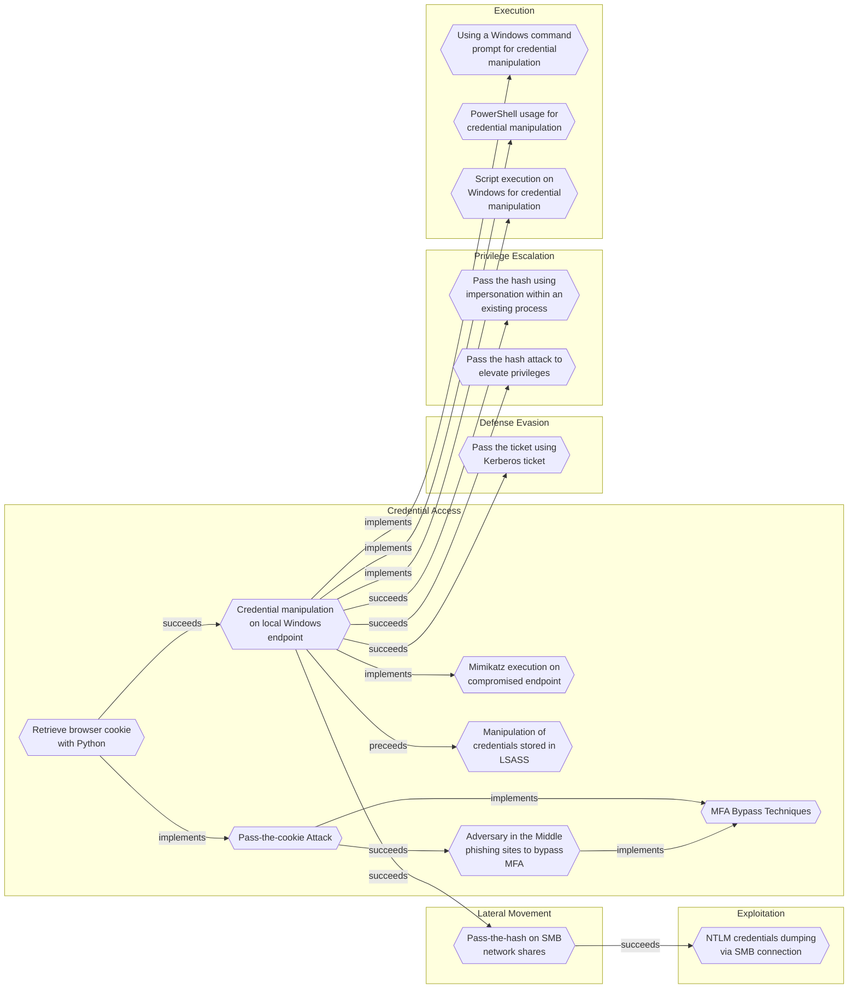

# Retrieve browser cookie with Python

## Metadata
| Field | Value |
| --- | --- |
| UUID | `b5e8300c-6887-48c2-a18d-e3d910478fe8` |
| Schema | `threat::1.0` |
| Version | `1` |
| Created | `2024-11-05` |
| Modified | `2024-11-05` |
| TLP | clear (`TLP:CLEAR`) |
| Organisation | EC DIGIT CSOC (`56b0a0f0-b0bc-47d9-bb46-02f80ae2065a`) |

## References
### Public
- **1**: [https://pypi.org/project/browsercookie/](https://pypi.org/project/browsercookie/)
- **2**: [https://bobbyhadz.com/blog/how-to-use-cookies-in-python-requests](https://bobbyhadz.com/blog/how-to-use-cookies-in-python-requests)
- **3**: [https://www.geeksforgeeks.org/retrieving-cookies-in-python/](https://www.geeksforgeeks.org/retrieving-cookies-in-python/)
- **4**: [https://medium.com/@morgan2000/extracting-cookies-using-python-3-c61b3a3ac356](https://medium.com/@morgan2000/extracting-cookies-using-python-3-c61b3a3ac356)

## Description
Cookies contain information stored in a user browser, such as session state and
user preferences. There are multiple ways to retrieve browser cookies using Python.

Here are several commonly used methods in Python to obtain browser cookies
along with example code:

1. Use the Selenium library to retrieve browser cookies.

  from selenium import webdriver

  Initialize the browser driver
  driver = webdriver.Chrome()

  Open the webpage
  driver.get("http://www.example.com")

  Retrieve browser cookies
  cookies = driver.get_cookies()

  Print the cookies
  for cookie in cookies:
      print(cookie)

  Close the browser
  driver.quit()
  
2. Using the browser developer tools to retrieve browser cookies

  import requests

  send HTTP requests
  response = requests.get("http://www.example.com")

  get response about Cookies
  cookies = response.cookies

  print out Cookies
  for cookie in cookies:
      print(cookie.name, cookie.value)   
      
3. Saving cookies from the browser developer tools as a HAR (HTTP Archive) file

  In the Network panel of the browser developer tools, select a request, right-click,
  and choose “Save All as HAR with Content” to save the request and response as a
  HAR file. Then, use Python to parse the HAR file and extract the cookie information.

  The following is an example code demonstrating how to parse browser cookies using a HAR file:

  import json

  read HAR file
  with open("example.har", "r") as file:
      har_data = json.load(file)

  extract Cookies information
  cookies = har_data["log"]["entries"][0]["response"]["cookies"]

  print out Cookies
  for cookie in cookies:
      print(cookie["name"], cookie["value"])
    
    
4. Use the browsercookie Python module that loads cookies used by the web browser into a
   cookiejar object. This can be useful to download the same content seen in the
   web browser without needing to login.
    
  import urllib.request
  public\_html = urllib.request.urlopen(url).read()
  opener = urllib.request.build\_opener(urllib.request.HTTPCookieProcessor(cj))

## Criticality
**High** - A High priority incident is likely to result in a demonstrable impact to public health or safety, national security, economic security, foreign relations, civil liberties, or public confidence.

## Terrain
Attacker must compromise a user endpoint and exfiltrate the browser cookies.
Cookies can be found on disk, in the process memory of the browser, and in
network traffic to remote systems.

## Surface
> **Microsoft::Microsoft 365**
> Microsoft 365 cloud-based productivity suite (formerly Office 365)

> **Azure::Security::Entra ID**
> Microsoft Entra ID in Azure (cloud identity)

> **OAuth / OIDC**
> OAuth 2.0 and OpenID Connect authorisation/authentication protocols

> **Azure**
> Microsoft Azure cloud platform

> **Windows::Desktop**
> Microsoft Windows desktop editions

> **Entra ID**
> Microsoft Entra ID (formerly Azure Active Directory)

## Threat Assessment
| Dimension | Assessment | Description |
| --- | --- | --- |
| Severity | Moderate incident | A cyber attack on a small organisation, or which poses a considerable risk to a medium-sized organisation, or preliminary indications of cyber activity against a large organisation or the government. |
| Impact | Identity Theft Impairement | Acquisition of sufficient information and privileges to profess as a given individual, for the purpose of abusing and deceiving human trust relationships. Incapacitation of a particular key system that will cause disruptions in day-to-day operations, and eventually service delivery. |
| Leverage | Elevation of privilege Spoofing | Capacity to augment leverage over the target system by upgrading the compromised access rights Threat action aimed at accessing and use of another user’s credentials, such as username and password. |
| Viability | Environment dependent | Depends |
| Kill Chain | Credential Access | Techniques resulting in the access of, or control over, system, service or domain credentials. |

## ATT&CK Techniques
| Technique | Name | Description |
| --- | --- | --- |
| `T1111` | [Multi-Factor Authentication Interception](https://attack.mitre.org/techniques/T1111) | Adversaries may target multi-factor authentication (MFA) mechanisms, (i.e., smart cards, token generators, etc.) to gain access to credentials that can be used to access systems, services, and network resources. Use of MFA is recommended and provides a higher level of security than usernames and passwords alone, but organizations should be aware of techniques that could be used to intercept and bypass these security mechanisms.   If a smart card is used for multi-factor authentication, then a keylogger will need to be used to obtain the password associated with a smart card during normal use. With both an inserted card and access to the smart card password, an adversary can connect to a network resource using the infected system to proxy the authentication with the inserted hardware token. (Citation: Mandiant M Trends 2011)  Adversaries may also employ a keylogger to similarly target other hardware tokens, such as RSA SecurID. Capturing token input (including a user's personal identification code) may provide temporary access (i.e. replay the one-time passcode until the next value rollover) as well as possibly enabling adversaries to reliably predict future authentication values (given access to both the algorithm and any seed values used to generate appended temporary codes). (Citation: GCN RSA June 2011)  Other methods of MFA may be intercepted and used by an adversary to authenticate. It is common for one-time codes to be sent via out-of-band communications (email, SMS). If the device and/or service is not secured, then it may be vulnerable to interception. Service providers can also be targeted: for example, an adversary may compromise an SMS messaging service in order to steal MFA codes sent to users’ phones.(Citation: Okta Scatter Swine 2022) |

## Chaining

### Chaining details
#### succeeds -> [Credential manipulation on local Windows endpoint](credential-manipulation-on-local-windows-endpoint.md) (`ec8201d4-c135-406b-a3b5-4a070e80a2ee`) (`sequence::succeeds`)
Attacker must have a foot on the Windows enpoint to execute Python.

- **Target UUID**: `ec8201d4-c135-406b-a3b5-4a070e80a2ee`
#### implements -> [Pass-the-cookie Attack](pass-the-cookie-attack.md) (`b0d6bf74-b204-4a48-9509-4499ed795771`) (`atomicity::implements`)
Technique used to steal browser cookies

- **Target UUID**: `b0d6bf74-b204-4a48-9509-4499ed795771`
