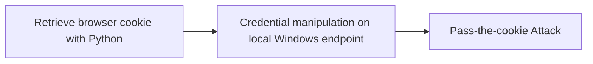

# Retrieve browser cookie with Python

## Metadata

- **UUID**: `b5e8300c-6887-48c2-a18d-e3d910478fe8`
- **Schema**: `threat::1.0`
- **TLP**: clear

## Description
Cookies contain information stored in a user browser, such as session state and
user preferences. There are multiple ways to retrieve browser cookies using Python.

Here are several commonly used methods in Python to obtain browser cookies
along with example code:

1. Use the Selenium library to retrieve browser cookies.

  from selenium import webdriver

  Initialize the browser driver
  driver = webdriver.Chrome()

  Open the webpage
  driver.get("http://www.example.com")

  Retrieve browser cookies
  cookies = driver.get_cookies()

  Print the cookies
  for cookie in cookies:
      print(cookie)

  Close the browser
  driver.quit()
  
2. Using the browser developer tools to retrieve browser cookies

  import requests

  send HTTP requests
  response = requests.get("http://www.example.com")

  get response about Cookies
  cookies = response.cookies

  print out Cookies
  for cookie in cookies:
      print(cookie.name, cookie.value)   
      
3. Saving cookies from the browser developer tools as a HAR (HTTP Archive) file

  In the Network panel of the browser developer tools, select a request, right-click,
  and choose “Save All as HAR with Content” to save the request and response as a
  HAR file. Then, use Python to parse the HAR file and extract the cookie information.

  The following is an example code demonstrating how to parse browser cookies using a HAR file:

  import json

  read HAR file
  with open("example.har", "r") as file:
      har_data = json.load(file)

  extract Cookies information
  cookies = har_data["log"]["entries"][0]["response"]["cookies"]

  print out Cookies
  for cookie in cookies:
      print(cookie["name"], cookie["value"])
    
    
4. Use the browsercookie Python module that loads cookies used by the web browser into a
   cookiejar object. This can be useful to download the same content seen in the
   web browser without needing to login.
    
  import urllib.request
  public\_html = urllib.request.urlopen(url).read()
  opener = urllib.request.build\_opener(urllib.request.HTTPCookieProcessor(cj))

## Techniques
- T1111

## Chaining

