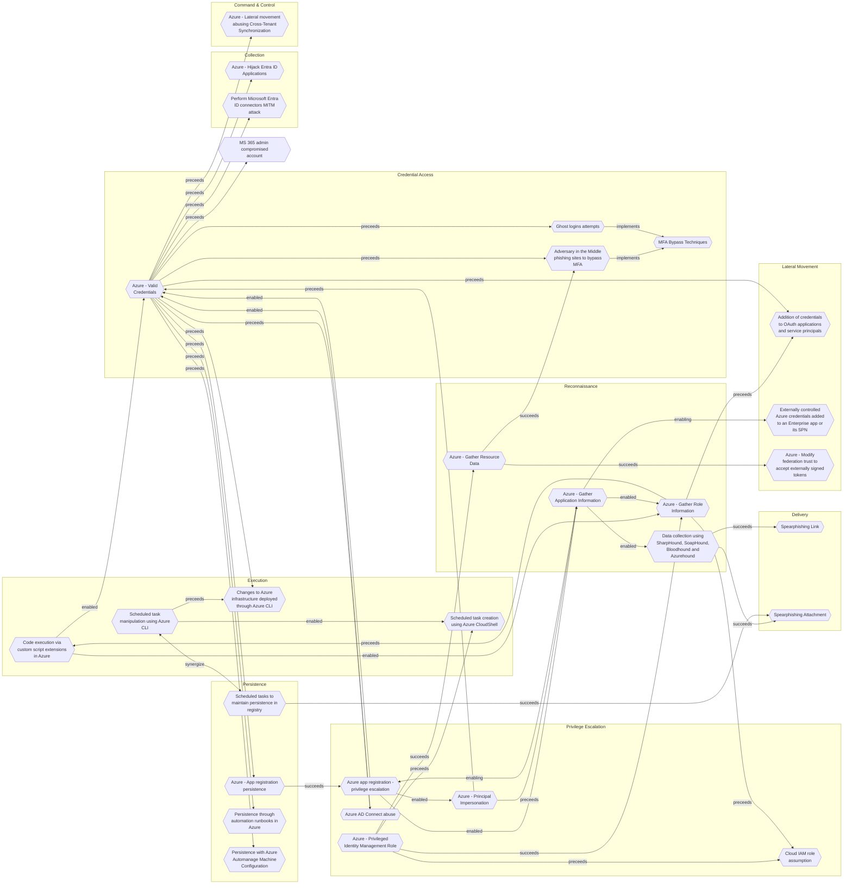

# Scheduled task creation using Azure CloudShell

## Metadata
| Field | Value |
| --- | --- |
| UUID | `670504aa-cfb8-4d1f-a5ad-16193822085f` |
| Schema | `threat::1.0` |
| Version | `4` |
| Created | `2022-12-12` |
| Modified | `2022-12-20` |
| TLP | clear (`TLP:CLEAR`) |
| Organisation | EC DIGIT CSOC (`56b0a0f0-b0bc-47d9-bb46-02f80ae2065a`) |

## References
### Public
- **1**: [https://learn.microsoft.com/en-us/azure/cloud-shell/overview](https://learn.microsoft.com/en-us/azure/cloud-shell/overview)
- **2**: [https://learn.microsoft.com/en-us/powershell/module/scheduledtasks/new-scheduledtasktrigger?view=windowsserver2022-ps](https://learn.microsoft.com/en-us/powershell/module/scheduledtasks/new-scheduledtasktrigger?view=windowsserver2022-ps)
- **3**: [https://learn.microsoft.com/en-us/powershell/module/scheduledtasks/register-scheduledtask?view=windowsserver2022-ps](https://learn.microsoft.com/en-us/powershell/module/scheduledtasks/register-scheduledtask?view=windowsserver2022-ps)
- **4**: [https://www.pdq.com/powershell/register-scheduledtask/](https://www.pdq.com/powershell/register-scheduledtask/)
- **5**: [https://learn.microsoft.com/en-us/azure/batch/jobs-and-tasks](https://learn.microsoft.com/en-us/azure/batch/jobs-and-tasks)
- **6**: [https://learn.microsoft.com/en-us/azure/cloud-shell/using-cloud-shell-editor](https://learn.microsoft.com/en-us/azure/cloud-shell/using-cloud-shell-editor)
- **7**: [https://attack.mitre.org/techniques/T1053/005/](https://attack.mitre.org/techniques/T1053/005/)

## Description
Threat actors can use Azure CloudShell, which is accessible via the Azure
portal or the browser, to create scheduled tasks.

The path to the Action parameter of the scheduled task is set in the task.
Threat actors can also use the Azure CloudShell editor to edit and
visualize in a better format their code before deploying it.

For example, threat actors use "New-ScheduledTaskTrigger" cmdlet to create
a trigger for the new scheduled task and further "New-ScheduledTaskAction"
cmdlet to create a specific action for the task. In the end the 
"Register-ScheduledTask" cmdlet is used to create the scheduled task. 

$Trigger = New-ScheduledTaskTrigger -Daily -At <time: hh:mm>
$Action = New-ScheduledTaskAction -Execute "PowerShell.exe" -Argument "-File C:\Scripts\My_task_script.ps1"
Register-ScheduledTask -TaskName "My Task" -Trigger $Trigger -Action $Action -RunLevel Highest

## Criticality
**Medium** - A Medium priority incident may affect public health or safety, national security, economic security, foreign relations, civil liberties, or public confidence.

## Terrain
A threat actor has gained control over privileges to create scheduled tasks 
on a deployed resource using Azure CloudShell either via a browser or the
Azure portal.

## Surface
> **Azure**
> Microsoft Azure cloud platform

> **Remote Access**
> Remote access solutions (non-VPN)

> **Windows::Desktop**
> Microsoft Windows desktop editions

> **Web Servers**
> HTTP servers and reverse proxies

> **Azure::Compute::Virtual Machines**
> Azure Virtual Machines

## Threat Assessment
| Dimension | Assessment | Description |
| --- | --- | --- |
| Severity | Moderate incident | A cyber attack on a small organisation, or which poses a considerable risk to a medium-sized organisation, or preliminary indications of cyber activity against a large organisation or the government. |
| Impact | Impairement | Incapacitation of a particular key system that will cause disruptions in day-to-day operations, and eventually service delivery. |
| Leverage | Dwelling Elevation of privilege Tampering | Active or passive extended presence in the target, which performs adversarial operations continuously. Capacity to augment leverage over the target system by upgrading the compromised access rights Threat action intending to maliciously change or modify persistent data, such as records in a database, and the alteration of data in transit between two computers over an open network, such as the Internet. |
| Viability | Likely | Probable (probably) - 55-80% |
| Kill Chain | Execution | Techniques that result in execution of attacker-controlled code on a local or remote system. |

## ATT&CK Techniques
| Technique | Name | Description |
| --- | --- | --- |
| `T1053.005` | [Scheduled Task/Job: Scheduled Task](https://attack.mitre.org/techniques/T1053/005) | Adversaries may abuse the Windows Task Scheduler to perform task scheduling for initial or recurring execution of malicious code. There are multiple ways to access the Task Scheduler in Windows. The [schtasks](https://attack.mitre.org/software/S0111) utility can be run directly on the command line, or the Task Scheduler can be opened through the GUI within the Administrator Tools section of the Control Panel.(Citation: Stack Overflow) In some cases, adversaries have used a .NET wrapper for the Windows Task Scheduler, and alternatively, adversaries have used the Windows netapi32 library and [Windows Management Instrumentation](https://attack.mitre.org/techniques/T1047) (WMI) to create a scheduled task. Adversaries may also utilize the Powershell Cmdlet `Invoke-CimMethod`, which leverages WMI class `PS_ScheduledTask` to create a scheduled task via an XML path.(Citation: Red Canary - Atomic Red Team)  An adversary may use Windows Task Scheduler to execute programs at system startup or on a scheduled basis for persistence. The Windows Task Scheduler can also be abused to conduct remote Execution as part of Lateral Movement and/or to run a process under the context of a specified account (such as SYSTEM). Similar to [System Binary Proxy Execution](https://attack.mitre.org/techniques/T1218), adversaries have also abused the Windows Task Scheduler to potentially mask one-time execution under signed/trusted system processes.(Citation: ProofPoint Serpent)  Adversaries may also create "hidden" scheduled tasks (i.e. [Hide Artifacts](https://attack.mitre.org/techniques/T1564)) that may not be visible to defender tools and manual queries used to enumerate tasks. Specifically, an adversary may hide a task from `schtasks /query` and the Task Scheduler by deleting the associated Security Descriptor (SD) registry value (where deletion of this value must be completed using SYSTEM permissions).(Citation: SigmaHQ)(Citation: Tarrask scheduled task) Adversaries may also employ alternate methods to hide tasks, such as altering the metadata (e.g., `Index` value) within associated registry keys.(Citation: Defending Against Scheduled Task Attacks in Windows Environments) |

## Chaining

