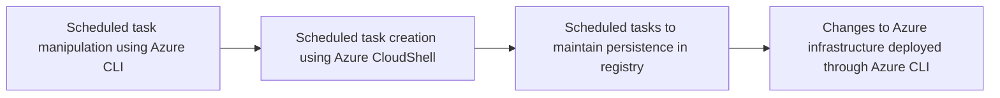

# Scheduled task manipulation using Azure CLI

## Metadata

- **UUID**: `edfe43fd-4a92-4f2d-a733-40e235be1b25`
- **Schema**: `threat::1.0`
- **TLP**: clear

## Description
Scheduled task manipulation using Azure CLI is a sophisticated threat vector that 
allows adversaries to establish persistence and execute malicious code in cloud environments. 
While the search results do not specifically mention Azure CLI, we can extrapolate 
the threat based on the general concept of scheduled task abuse.    

## Key aspects of the threat:    

1. **Persistence mechanism**: Adversaries can create or modify scheduled tasks to 
run malicious code at specified times or system startup, ensuring long-term access 
to compromised systems.    

2. **Privilege escalation**: Tasks can be configured to run with elevated privileges, 
often as SYSTEM, granting attackers the highest level of access on Windows systems.    

3. **Stealth**: Attackers may create "hidden" scheduled tasks by manipulating registry 
values, making them invisible to standard enumeration tools.    

4. **Versatility**: Scheduled tasks can be used for various malicious purposes, 
including initial access, lateral movement, and executing additional payloads.    

## Specific techniques:    

1. **Command execution**: Adversaries often use scheduled tasks to open command 
shells or execute arbitrary binaries from user-writable directories.    

2. **Network connections**: Tasks may be configured to reach out to external domains 
and download malicious payloads on a recurring schedule.    

3. **Abuse of legitimate tools**: Attackers can leverage native Windows utilities 
like schtasks.exe or PowerShell cmdlets to create and manage malicious tasks.    

4. **Registry manipulation**: Advanced adversaries may directly modify registry 
keys related to scheduled tasks to evade detection.    

5. **Masquerading**: Malicious tasks can be disguised as legitimate system processes 
or software updates to avoid suspicion.

## Techniques
- T1053
- T1053.005
- T1053.003
- T1059
- T1078
- T1136

## Chaining

