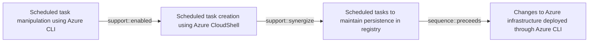

# Scheduled task manipulation using Azure CLI

## Metadata

- **UUID**: `edfe43fd-4a92-4f2d-a733-40e235be1b25`
- **Schema**: `threat::1.0`
- **Version**: `1`
- **Created**: `2024-12-18`
- **Modified**: `2024-12-19`
- **TLP**: clear (`TLP:CLEAR`)
- **Organisation**: EC DIGIT CSOC (`56b0a0f0-b0bc-47d9-bb46-02f80ae2065a`)

## References
### Public
- **1**: [https://redcanary.com/threat-detection-report/techniques/scheduled-task/](https://redcanary.com/threat-detection-report/techniques/scheduled-task/)
- **2**: [https://www.logpoint.com/en/blog/emerging-threats/shenanigans-of-scheduled-tasks/](https://www.logpoint.com/en/blog/emerging-threats/shenanigans-of-scheduled-tasks/)
- **3**: [https://www.securityblue.team/blog/posts/persistence-mechanisms-windows-scheduled-tasks](https://www.securityblue.team/blog/posts/persistence-mechanisms-windows-scheduled-tasks)

## Description
Scheduled task manipulation using Azure CLI is a sophisticated threat vector that 
allows adversaries to establish persistence and execute malicious code in cloud environments. 
While the search results do not specifically mention Azure CLI, we can extrapolate 
the threat based on the general concept of scheduled task abuse.    

## Key aspects of the threat:    

1. **Persistence mechanism**: Adversaries can create or modify scheduled tasks to 
run malicious code at specified times or system startup, ensuring long-term access 
to compromised systems.    

2. **Privilege escalation**: Tasks can be configured to run with elevated privileges, 
often as SYSTEM, granting attackers the highest level of access on Windows systems.    

3. **Stealth**: Attackers may create "hidden" scheduled tasks by manipulating registry 
values, making them invisible to standard enumeration tools.    

4. **Versatility**: Scheduled tasks can be used for various malicious purposes, 
including initial access, lateral movement, and executing additional payloads.    

## Specific techniques:    

1. **Command execution**: Adversaries often use scheduled tasks to open command 
shells or execute arbitrary binaries from user-writable directories.    

2. **Network connections**: Tasks may be configured to reach out to external domains 
and download malicious payloads on a recurring schedule.    

3. **Abuse of legitimate tools**: Attackers can leverage native Windows utilities 
like schtasks.exe or PowerShell cmdlets to create and manage malicious tasks.    

4. **Registry manipulation**: Advanced adversaries may directly modify registry 
keys related to scheduled tasks to evade detection.    

5. **Masquerading**: Malicious tasks can be disguised as legitimate system processes 
or software updates to avoid suspicion.

## Criticality
**High** - A High priority incident is likely to result in a demonstrable impact to public health or safety, national security, economic security, foreign relations, civil liberties, or public confidence.

## Terrain
> **Adversary must have administrative privileges over the Azure CLI environment.

Domains: Public Cloud, Enterprise, Networking
Targets: Cloud Storage Accounts, Identity Services, Virtual Machines, API Endpoints, Cloud Portal
Platforms: Azure, Azure AD, Office 365**

## Threat Assessment
| Dimension | Assessment | Description |
| --- | --- | --- |
| Severity | Significant incident | A cyber attack which has a serious impact on a large organisation or on wider / local government, or which poses a considerable risk to central government or (inter)national essential services. |
| Impact | Data Breach; IP Loss; Reputational Damages; Identity Theft; Monetary Loss | - |
| Leverage | Spoofing; Tampering; Repudiation; Infrastructure Compromise; Information Disclosure | - |
| Viability | Likely | Probable (probably) - 55-80% |
| Kill Chain | Execution | Techniques that result in execution of attacker-controlled code on a local or remote system. |

## ATT&CK Techniques
| Technique | Name | Description |
| --- | --- | --- |
| `T1053` | [Scheduled Task/Job](https://attack.mitre.org/techniques/T1053) | Adversaries may abuse task scheduling functionality to facilitate initial or recurring execution of malicious code. Utilities exist within all major operating systems to schedule programs or scripts to be executed at a specified date and time. A task can also be scheduled on a remote system, provided the proper authentication is met (ex: RPC and file and printer sharing in Windows environments). Scheduling a task on a remote system typically may require being a member of an admin or otherwise privileged group on the remote system.(Citation: TechNet Task Scheduler Security)  Adversaries may use task scheduling to execute programs at system startup or on a scheduled basis for persistence. These mechanisms can also be abused to run a process under the context of a specified account (such as one with elevated permissions/privileges). Similar to [System Binary Proxy Execution](https://attack.mitre.org/techniques/T1218), adversaries have also abused task scheduling to potentially mask one-time execution under a trusted system process.(Citation: ProofPoint Serpent) |
| `T1053.005` | [Scheduled Task/Job: Scheduled Task](https://attack.mitre.org/techniques/T1053/005) | Adversaries may abuse the Windows Task Scheduler to perform task scheduling for initial or recurring execution of malicious code. There are multiple ways to access the Task Scheduler in Windows. The [schtasks](https://attack.mitre.org/software/S0111) utility can be run directly on the command line, or the Task Scheduler can be opened through the GUI within the Administrator Tools section of the Control Panel.(Citation: Stack Overflow) In some cases, adversaries have used a .NET wrapper for the Windows Task Scheduler, and alternatively, adversaries have used the Windows netapi32 library and [Windows Management Instrumentation](https://attack.mitre.org/techniques/T1047) (WMI) to create a scheduled task. Adversaries may also utilize the Powershell Cmdlet `Invoke-CimMethod`, which leverages WMI class `PS_ScheduledTask` to create a scheduled task via an XML path.(Citation: Red Canary - Atomic Red Team)  An adversary may use Windows Task Scheduler to execute programs at system startup or on a scheduled basis for persistence. The Windows Task Scheduler can also be abused to conduct remote Execution as part of Lateral Movement and/or to run a process under the context of a specified account (such as SYSTEM). Similar to [System Binary Proxy Execution](https://attack.mitre.org/techniques/T1218), adversaries have also abused the Windows Task Scheduler to potentially mask one-time execution under signed/trusted system processes.(Citation: ProofPoint Serpent)  Adversaries may also create "hidden" scheduled tasks (i.e. [Hide Artifacts](https://attack.mitre.org/techniques/T1564)) that may not be visible to defender tools and manual queries used to enumerate tasks. Specifically, an adversary may hide a task from `schtasks /query` and the Task Scheduler by deleting the associated Security Descriptor (SD) registry value (where deletion of this value must be completed using SYSTEM permissions).(Citation: SigmaHQ)(Citation: Tarrask scheduled task) Adversaries may also employ alternate methods to hide tasks, such as altering the metadata (e.g., `Index` value) within associated registry keys.(Citation: Defending Against Scheduled Task Attacks in Windows Environments) |
| `T1053.003` | [Scheduled Task/Job: Cron](https://attack.mitre.org/techniques/T1053/003) | Adversaries may abuse the <code>cron</code> utility to perform task scheduling for initial or recurring execution of malicious code.(Citation: 20 macOS Common Tools and Techniques) The <code>cron</code> utility is a time-based job scheduler for Unix-like operating systems.  The <code> crontab</code> file contains the schedule of cron entries to be run and the specified times for execution. Any <code>crontab</code> files are stored in operating system-specific file paths.  An adversary may use <code>cron</code> in Linux or Unix environments to execute programs at system startup or on a scheduled basis for [Persistence](https://attack.mitre.org/tactics/TA0003). In ESXi environments, cron jobs must be created directly via the crontab file (e.g., `/var/spool/cron/crontabs/root`).(Citation: CloudSEK ESXiArgs 2023) |
| `T1059` | [Command and Scripting Interpreter](https://attack.mitre.org/techniques/T1059) | Adversaries may abuse command and script interpreters to execute commands, scripts, or binaries. These interfaces and languages provide ways of interacting with computer systems and are a common feature across many different platforms. Most systems come with some built-in command-line interface and scripting capabilities, for example, macOS and Linux distributions include some flavor of [Unix Shell](https://attack.mitre.org/techniques/T1059/004) while Windows installations include the [Windows Command Shell](https://attack.mitre.org/techniques/T1059/003) and [PowerShell](https://attack.mitre.org/techniques/T1059/001).  There are also cross-platform interpreters such as [Python](https://attack.mitre.org/techniques/T1059/006), as well as those commonly associated with client applications such as [JavaScript](https://attack.mitre.org/techniques/T1059/007) and [Visual Basic](https://attack.mitre.org/techniques/T1059/005).  Adversaries may abuse these technologies in various ways as a means of executing arbitrary commands. Commands and scripts can be embedded in [Initial Access](https://attack.mitre.org/tactics/TA0001) payloads delivered to victims as lure documents or as secondary payloads downloaded from an existing C2. Adversaries may also execute commands through interactive terminals/shells, as well as utilize various [Remote Services](https://attack.mitre.org/techniques/T1021) in order to achieve remote Execution.(Citation: Powershell Remote Commands)(Citation: Cisco IOS Software Integrity Assurance - Command History)(Citation: Remote Shell Execution in Python) |
| `T1078` | [Valid Accounts](https://attack.mitre.org/techniques/T1078) | Adversaries may obtain and abuse credentials of existing accounts as a means of gaining Initial Access, Persistence, Privilege Escalation, or Defense Evasion. Compromised credentials may be used to bypass access controls placed on various resources on systems within the network and may even be used for persistent access to remote systems and externally available services, such as VPNs, Outlook Web Access, network devices, and remote desktop.(Citation: volexity_0day_sophos_FW) Compromised credentials may also grant an adversary increased privilege to specific systems or access to restricted areas of the network. Adversaries may choose not to use malware or tools in conjunction with the legitimate access those credentials provide to make it harder to detect their presence.  In some cases, adversaries may abuse inactive accounts: for example, those belonging to individuals who are no longer part of an organization. Using these accounts may allow the adversary to evade detection, as the original account user will not be present to identify any anomalous activity taking place on their account.(Citation: CISA MFA PrintNightmare)  The overlap of permissions for local, domain, and cloud accounts across a network of systems is of concern because the adversary may be able to pivot across accounts and systems to reach a high level of access (i.e., domain or enterprise administrator) to bypass access controls set within the enterprise.(Citation: TechNet Credential Theft) |
| `T1136` | [Create Account](https://attack.mitre.org/techniques/T1136) | Adversaries may create an account to maintain access to victim systems.(Citation: Symantec WastedLocker June 2020) With a sufficient level of access, creating such accounts may be used to establish secondary credentialed access that do not require persistent remote access tools to be deployed on the system.  Accounts may be created on the local system or within a domain or cloud tenant. In cloud environments, adversaries may create accounts that only have access to specific services, which can reduce the chance of detection. |

## Chaining

### Chaining details
#### enabled -> Scheduled task creation using Azure CloudShell (`support::enabled`)
Threat actors can use Azure CloudShell, which is accessible via the Azure
portal or the browser, to create scheduled tasks. The path to the Action pa...

- **Target UUID**: `670504aa-cfb8-4d1f-a5ad-16193822085f`
#### synergize -> Scheduled tasks to maintain persistence in registry (`support::synergize`)
A threat actor can successfully maintain persistence on a compromised system 
by using scheduled tasks to create or edit registry entries. Windows Sc...

- **Target UUID**: `5e66f826-4c4b-4357-b9c5-2f40da207f34`
#### preceeds -> Changes to Azure infrastructure deployed through Azure CLI (`sequence::preceeds`)
A threat actor in control of the prerequisites may attempt to use the Azure
CLI to perform changes either to the endpoint from which the CLI is acces...

- **Target UUID**: `60c5b065-7d06-4697-850f-c2f80765f10b`
