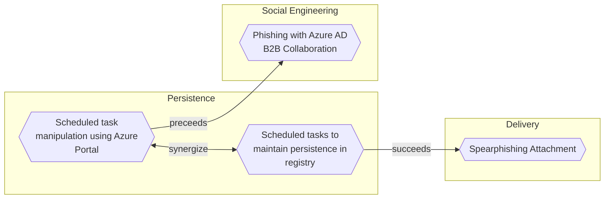

# Scheduled task manipulation using Azure Portal

## Metadata
| Field | Value |
| --- | --- |
| UUID | `437a43b9-6344-45a9-915b-d733d23173ae` |
| Schema | `threat::1.0` |
| Version | `2` |
| Created | `2024-12-17` |
| Modified | `2025-02-26` |
| TLP | clear (`TLP:CLEAR`) |
| Organisation | EC DIGIT CSOC (`56b0a0f0-b0bc-47d9-bb46-02f80ae2065a`) |

## References
### Public
- **1**: [https://learn.microsoft.com/en-us/azure/virtual-machines/windows/scheduled-events](https://learn.microsoft.com/en-us/azure/virtual-machines/windows/scheduled-events)
- **2**: [https://learn.microsoft.com/da-dk/azure/logic-apps/create-automation-tasks-azure-resources](https://learn.microsoft.com/da-dk/azure/logic-apps/create-automation-tasks-azure-resources)
- **3**: [https://xybytes.com/azure/Azure-SSRF/](https://xybytes.com/azure/Azure-SSRF/)
- **4**: [https://community.citrix.com/tech-zone/design/reference-architectures/virtual-apps-and-desktops-azure/](https://community.citrix.com/tech-zone/design/reference-architectures/virtual-apps-and-desktops-azure/)
- **5**: [https://learn.microsoft.com/en-us/azure/automation/shared-resources/schedules](https://learn.microsoft.com/en-us/azure/automation/shared-resources/schedules)

## Description
Scheduled tasks in Azure, often called "WebJobs" or "Azure Functions" with timer 
triggers, are automated processes set to run at specific times or intervals. They 
are used for maintenance, backups, data processing, and other routine operations.

This scheduled tasks can be manipulated by threat actors to execute malicious 
code, steal sensitive information, or disrupt business operations. The manipulation 
of scheduled tasks can be achieved through various means, including:

### Azure metadata service exploitation

Adversaries can abuse the Azure Instance Metadata Service (IMDS) to gather sensitive 
information about virtual machines.  
The IMDSv1 endpoint is particularly vulnerable to Server-Side Request Forgery 
(SSRF) attacks due to its accessibility via GET requests.

### Scheduled events manipulation

Attackers can exploit Azure scheduled events, a feature of the Azure Metadata 
Service, to prepare for and execute attacks during VM maintenance windows.  
This technique allows malicious actors to anticipate system changes and potentially 
exploit vulnerabilities during maintenance periods.

### Custom script extensions

Threat actors can abuse Custom script extensions, which are designed to automate 
post-deployment scripts on VMs.  
This feature can be misused to execute malicious code, install unauthorized software, 
or reconfigure systems for nefarious purposes.      

### Leveraging exploited vulnerabilities

Attackers can use exploited vulnerabilities in Azure services, such as Azure Automation 
or Logic Apps, to create more complex, distributed scheduled actions that are harder to detect.

### Utilizing obfuscated code

Attackers might use obfuscated code within tasks to evade detection and make it 
harder for security teams to identify and mitigate the threat.

### Deleting logs and hiding tracks

Attackers might delete logs related to task creation or modification, and modify 
task descriptions to seem innocuous, in an attempt to hide their tracks and make 
it harder to investigate and remediate the attack.

## Criticality
**High** - A High priority incident is likely to result in a demonstrable impact to public health or safety, national security, economic security, foreign relations, civil liberties, or public confidence.

## Terrain
Adversary must have administrative privileges over Azure Portal or have access to 
Azure credentials.

## Surface
> **Azure**
> Microsoft Azure cloud platform

> **Azure::Security::Entra ID**
> Microsoft Entra ID in Azure (cloud identity)

> **Microsoft::Microsoft 365**
> Microsoft 365 cloud-based productivity suite (formerly Office 365)

> **Windows**
> Microsoft Windows operating systems (all versions)

> **Linux**
> Linux-based operating systems (all distributions)

> **AWS::Storage**
> AWS storage services

> **Azure::Security::Key Vault**
> Azure Key Vault secrets and key management

> **Azure::Compute::Virtual Machines**
> Azure Virtual Machines

> **Application Layer::HTTP**
> Hypertext Transfer Protocol

## Threat Assessment
| Dimension | Assessment | Description |
| --- | --- | --- |
| Severity | Significant incident | A cyber attack which has a serious impact on a large organisation or on wider / local government, or which poses a considerable risk to central government or (inter)national essential services. |
| Impact | Data Breach IP Loss Reputational Damages Identity Theft | Non-public information has been accessed from the outside, and successfully extracted. Particular, key data, information and blueprint conducive to the organization capability to gain and retain a commercial or geopolitical advantage has been accessed, and their content potentially used by competitors or other adversaries. Damages to the organization public view may be achieved by using directly the access gained, or indirectly with data gathered. Acquisition of sufficient information and privileges to profess as a given individual, for the purpose of abusing and deceiving human trust relationships. |
| Leverage | Spoofing Tampering Repudiation Infrastructure Compromise Information Disclosure | Threat action aimed at accessing and use of another user’s credentials, such as username and password. Threat action intending to maliciously change or modify persistent data, such as records in a database, and the alteration of data in transit between two computers over an open network, such as the Internet. Threat action aimed at performing prohibited operations in a system that lacks the ability to trace the operations. The compromised target is likely to be used to further expand the sphere of influence of the attacker and allow more potent vectors to be executed. Threat action intending to read a file that one was not granted access to, or to read data in transit. |
| Viability | Likely | Probable (probably) - 55-80% |
| Kill Chain | Persistence | Any access, action or change to a system that gives an attacker persistent presence on the system. |

## ATT&CK Techniques
| Technique | Name | Description |
| --- | --- | --- |
| `T1053.005` | [Scheduled Task/Job: Scheduled Task](https://attack.mitre.org/techniques/T1053/005) | Adversaries may abuse the Windows Task Scheduler to perform task scheduling for initial or recurring execution of malicious code. There are multiple ways to access the Task Scheduler in Windows. The [schtasks](https://attack.mitre.org/software/S0111) utility can be run directly on the command line, or the Task Scheduler can be opened through the GUI within the Administrator Tools section of the Control Panel.(Citation: Stack Overflow) In some cases, adversaries have used a .NET wrapper for the Windows Task Scheduler, and alternatively, adversaries have used the Windows netapi32 library and [Windows Management Instrumentation](https://attack.mitre.org/techniques/T1047) (WMI) to create a scheduled task. Adversaries may also utilize the Powershell Cmdlet `Invoke-CimMethod`, which leverages WMI class `PS_ScheduledTask` to create a scheduled task via an XML path.(Citation: Red Canary - Atomic Red Team)  An adversary may use Windows Task Scheduler to execute programs at system startup or on a scheduled basis for persistence. The Windows Task Scheduler can also be abused to conduct remote Execution as part of Lateral Movement and/or to run a process under the context of a specified account (such as SYSTEM). Similar to [System Binary Proxy Execution](https://attack.mitre.org/techniques/T1218), adversaries have also abused the Windows Task Scheduler to potentially mask one-time execution under signed/trusted system processes.(Citation: ProofPoint Serpent)  Adversaries may also create "hidden" scheduled tasks (i.e. [Hide Artifacts](https://attack.mitre.org/techniques/T1564)) that may not be visible to defender tools and manual queries used to enumerate tasks. Specifically, an adversary may hide a task from `schtasks /query` and the Task Scheduler by deleting the associated Security Descriptor (SD) registry value (where deletion of this value must be completed using SYSTEM permissions).(Citation: SigmaHQ)(Citation: Tarrask scheduled task) Adversaries may also employ alternate methods to hide tasks, such as altering the metadata (e.g., `Index` value) within associated registry keys.(Citation: Defending Against Scheduled Task Attacks in Windows Environments) |
| `T1651` | [Cloud Administration Command](https://attack.mitre.org/techniques/T1651) | Adversaries may abuse cloud management services to execute commands within virtual machines. Resources such as AWS Systems Manager, Azure RunCommand, and Runbooks allow users to remotely run scripts in virtual machines by leveraging installed virtual machine agents. (Citation: AWS Systems Manager Run Command)(Citation: Microsoft Run Command)  If an adversary gains administrative access to a cloud environment, they may be able to abuse cloud management services to execute commands in the environment’s virtual machines. Additionally, an adversary that compromises a service provider or delegated administrator account may similarly be able to leverage a [Trusted Relationship](https://attack.mitre.org/techniques/T1199) to execute commands in connected virtual machines.(Citation: MSTIC Nobelium Oct 2021) |

## Chaining

### Chaining details
#### synergize -> [Scheduled tasks to maintain persistence in registry](scheduled-tasks-to-maintain-persistence-in-registry.md) (`5e66f826-4c4b-4357-b9c5-2f40da207f34`) (`support::synergize`)
A threat actor can successfully maintain persistence on a compromised system 
by using scheduled tasks to create or edit registry entries. Windows Sc...

- **Target UUID**: `5e66f826-4c4b-4357-b9c5-2f40da207f34`
#### preceeds -> [Phishing with Azure AD B2B Collaboration](phishing-with-azure-ad-b2b-collaboration.md) (`f9a6f927-d08c-40c1-85af-01331c471def`) (`sequence::preceeds`)
Phishing with Azure AD B2B Collaboration involves exploiting the service to send 
malicious invitations that appear to come from Microsoft or other th...

- **Target UUID**: `f9a6f927-d08c-40c1-85af-01331c471def`
