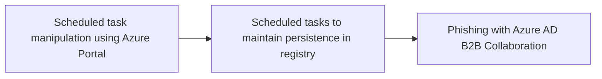

# Scheduled task manipulation using Azure Portal

## Metadata

- **UUID**: `437a43b9-6344-45a9-915b-d733d23173ae`
- **Schema**: `threat::1.0`
- **TLP**: clear

## Description
Scheduled tasks in Azure, often called "WebJobs" or "Azure Functions" with timer 
triggers, are automated processes set to run at specific times or intervals. They 
are used for maintenance, backups, data processing, and other routine operations.

This scheduled tasks can be manipulated by threat actors to execute malicious 
code, steal sensitive information, or disrupt business operations. The manipulation 
of scheduled tasks can be achieved through various means, including:

### Azure metadata service exploitation

Adversaries can abuse the Azure Instance Metadata Service (IMDS) to gather sensitive 
information about virtual machines.  
The IMDSv1 endpoint is particularly vulnerable to Server-Side Request Forgery 
(SSRF) attacks due to its accessibility via GET requests.

### Scheduled events manipulation

Attackers can exploit Azure scheduled events, a feature of the Azure Metadata 
Service, to prepare for and execute attacks during VM maintenance windows.  
This technique allows malicious actors to anticipate system changes and potentially 
exploit vulnerabilities during maintenance periods.

### Custom script extensions

Threat actors can abuse Custom script extensions, which are designed to automate 
post-deployment scripts on VMs.  
This feature can be misused to execute malicious code, install unauthorized software, 
or reconfigure systems for nefarious purposes.      

### Leveraging exploited vulnerabilities

Attackers can use exploited vulnerabilities in Azure services, such as Azure Automation 
or Logic Apps, to create more complex, distributed scheduled actions that are harder to detect.

### Utilizing obfuscated code

Attackers might use obfuscated code within tasks to evade detection and make it 
harder for security teams to identify and mitigate the threat.

### Deleting logs and hiding tracks

Attackers might delete logs related to task creation or modification, and modify 
task descriptions to seem innocuous, in an attempt to hide their tracks and make 
it harder to investigate and remediate the attack.

## Techniques
- T1053.005
- T1651

## Chaining

