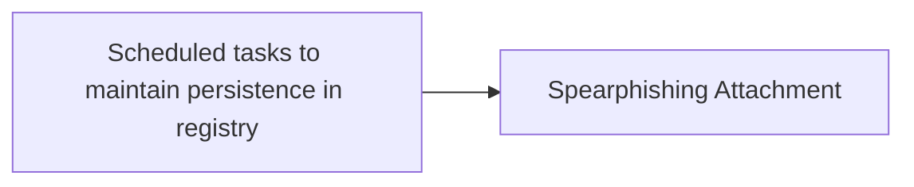

# Scheduled tasks to maintain persistence in registry

## Metadata

- **UUID**: `5e66f826-4c4b-4357-b9c5-2f40da207f34`
- **Schema**: `threat::1.0`
- **TLP**: clear

## Description
A threat actor can successfully maintain persistence on a compromised system 
by using scheduled tasks to create or edit registry entries.

Windows Scheduled Task is a feature of the Windows operating system that 
allows users to schedule a command or program to run automatically at a 
specific time or interval. This can be useful for running tasks that need to
be performed regularly, such as backing up files or checking for updates. 
Scheduled tasks can be configured to run in the background, without the need
for user intervention.

One example for a scheduled task that establish persistence in the registry 
is a task that is configured to run when specific condition is met - as 
example on system start up. The task will have an action configured, which 
might be to download and run a payload, which for example could be a payload
that sets a registry run key. Registry run keys are keys in the Windows 
registry that are called during system start up. These keys enable 
configurations to be loaded automatically. Registry run keys can also 
directly execute binary files on system start up. 

To create a scheduled task that runs at system startup attackers are using 
for example Windows Task Scheduler, cmd.exe or PowerShell commands in a 
script. Once the task has been created, it will be added to the registry and 
will run automatically every time the system starts up, or until discovered 
and deleted.

**Examples for mechanism of persistence in the registries**

 - Run/RunOnce Keys: Malware can add entries to the registry keys
 (or their RunOnce counterparts) to execute every time the system
 boots or a user logs in. An example for such Reg keys:
 
 ` HKEY_CURRENT_USER\Software\Microsoft\Windows\CurrentVersion\Run `
 
 or 
 
 ` HKEY_LOCAL_MACHINE\Software\Microsoft\Windows\CurrentVersion\Run `
 
 
 - Scheduled Tasks: Utilizing the Task Scheduler, malware can create
 tasks that run at specific intervals or times, ensuring persistence.
 These tasks are often registered in the registry under
 
 ` HKEY_LOCAL_MACHINE\SOFTWARE\Microsoft\Windows NT\CurrentVersion\Schedule\TaskCache `.

 - Windows Services: Malicious services can be installed and configured
 to start automatically upon system boot. These are typically registered
 under `HKEY_LOCAL_MACHINE\SYSTEM\CurrentControlSet\Services`.

### Additional persistence techniques

Other common techniques used by malware in general include:

- **Modifying Registry Keys**: Malware often alters specific registry keys 
(like those in `HKEY_CURRENT_USER\Software\Microsoft\Windows\CurrentVersion\Run`) 
to ensure they are executed at startup.

- **Modifying Registry Keys**: The following enables the malware to run for all 
users on the system: (HKEY_LOCAL_MACHINE\Software\Microsoft\Windows\CurrentVersion\Run)

- **Using Startup Folders**: Malware can place executable files in startup
folders so that they run automatically when a user logs into their account.

## Techniques
- T1053.005
- T1112

## Chaining

