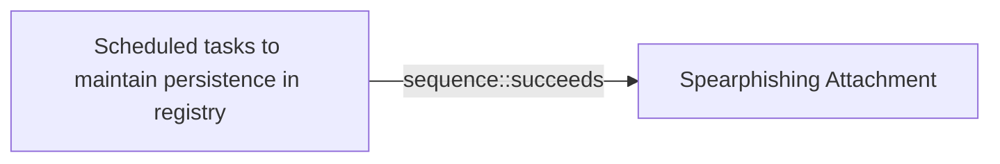

# Scheduled tasks to maintain persistence in registry

## Metadata

- **UUID**: `5e66f826-4c4b-4357-b9c5-2f40da207f34`
- **Schema**: `threat::1.0`
- **Version**: `6`
- **Created**: `2022-12-14`
- **Modified**: `2025-06-11`
- **TLP**: clear (`TLP:CLEAR`)
- **Organisation**: EC DIGIT CSOC (`56b0a0f0-b0bc-47d9-bb46-02f80ae2065a`)

## References
### Public
- **1**: [https://redcanary.com/threat-detection-report/techniques/windows-command-shell/](https://redcanary.com/threat-detection-report/techniques/windows-command-shell/)
- **2**: [https://www.microsoft.com/en-us/security/blog/2022/04/12/tarrask-malware-uses-scheduled-tasks-for-defense-evasion/](https://www.microsoft.com/en-us/security/blog/2022/04/12/tarrask-malware-uses-scheduled-tasks-for-defense-evasion/)
- **3**: [https://attack.mitre.org/techniques/T1053/005/](https://attack.mitre.org/techniques/T1053/005/)
- **4**: [https://learn.microsoft.com/en-us/troubleshoot/developer/webapps/iis/general/use-registry-keys](https://learn.microsoft.com/en-us/troubleshoot/developer/webapps/iis/general/use-registry-keys)
- **5**: [https://dmfrsecurity.com/2021/09/07/scheduled-task-persistence/](https://dmfrsecurity.com/2021/09/07/scheduled-task-persistence/)
- **6**: [https://www.cyborgsecurity.com/cyborg-labs/hunting-for-persistence-registry-run-keys-startup-folder](https://www.cyborgsecurity.com/cyborg-labs/hunting-for-persistence-registry-run-keys-startup-folder)
- **7**: [https://github.com/netero1010/GhostTask](https://github.com/netero1010/GhostTask)

## Description
A threat actor can successfully maintain persistence on a compromised system 
by using scheduled tasks to create or edit registry entries.

Windows Scheduled Task is a feature of the Windows operating system that 
allows users to schedule a command or program to run automatically at a 
specific time or interval. This can be useful for running tasks that need to
be performed regularly, such as backing up files or checking for updates. 
Scheduled tasks can be configured to run in the background, without the need
for user intervention.

One example for a scheduled task that establish persistence in the registry 
is a task that is configured to run when specific condition is met - as 
example on system start up. The task will have an action configured, which 
might be to download and run a payload, which for example could be a payload
that sets a registry run key. Registry run keys are keys in the Windows 
registry that are called during system start up. These keys enable 
configurations to be loaded automatically. Registry run keys can also 
directly execute binary files on system start up. 

To create a scheduled task that runs at system startup attackers are using 
for example Windows Task Scheduler, cmd.exe or PowerShell commands in a 
script. Once the task has been created, it will be added to the registry and 
will run automatically every time the system starts up, or until discovered 
and deleted.

**Examples for mechanism of persistence in the registries**

 - Run/RunOnce Keys: Malware can add entries to the registry keys
 (or their RunOnce counterparts) to execute every time the system
 boots or a user logs in. An example for such Reg keys:
 
 ` HKEY_CURRENT_USER\Software\Microsoft\Windows\CurrentVersion\Run `
 
 or 
 
 ` HKEY_LOCAL_MACHINE\Software\Microsoft\Windows\CurrentVersion\Run `
 
 
 - Scheduled Tasks: Utilizing the Task Scheduler, malware can create
 tasks that run at specific intervals or times, ensuring persistence.
 These tasks are often registered in the registry under
 
 ` HKEY_LOCAL_MACHINE\SOFTWARE\Microsoft\Windows NT\CurrentVersion\Schedule\TaskCache `.

 - Windows Services: Malicious services can be installed and configured
 to start automatically upon system boot. These are typically registered
 under `HKEY_LOCAL_MACHINE\SYSTEM\CurrentControlSet\Services`.

### Additional persistence techniques

Other common techniques used by malware in general include:

- **Modifying Registry Keys**: Malware often alters specific registry keys 
(like those in `HKEY_CURRENT_USER\Software\Microsoft\Windows\CurrentVersion\Run`) 
to ensure they are executed at startup.

- **Modifying Registry Keys**: The following enables the malware to run for all 
users on the system: (HKEY_LOCAL_MACHINE\Software\Microsoft\Windows\CurrentVersion\Run)

- **Using Startup Folders**: Malware can place executable files in startup
folders so that they run automatically when a user logs into their account.

## Criticality
**Medium** - A Medium priority incident may affect public health or safety, national security, economic security, foreign relations, civil liberties, or public confidence.

## Terrain
> **An adversary has gained control over a Windows endpoint and has privileges 
to create scheduled tasks in order to maintain persistence in the registry.

Domains: Enterprise, Public Cloud, Private Cloud
Targets: Workstations, Control Server, Laptop, Desktop, Remote access, Web Application Servers, Public-Facing Servers
Platforms: Windows**

## Threat Assessment
| Dimension | Assessment | Description |
| --- | --- | --- |
| Severity | Moderate incident | A cyber attack on a small organisation, or which poses a considerable risk to a medium-sized organisation, or preliminary indications of cyber activity against a large organisation or the government. |
| Impact | Impairement; Business disruption | - |
| Leverage | Infrastructure Compromise; Tampering; Modify configuration; Modify data | - |
| Viability | Likely | Probable (probably) - 55-80% |
| Kill Chain | Persistence | Any access, action or change to a system that gives an attacker persistent presence on the system. |

## Actors
| Actor | ID | Source | Description |
| --- | --- | --- | --- |
| [[Enterprise] HAFNIUM](https://attack.mitre.org/groups/G0125) | `att&ck::G0125` | ('att&ck',) | [HAFNIUM](https://attack.mitre.org/groups/G0125) is a likely state-sponsored cyber espionage group operating out of China that has been active since at least January 2021. [HAFNIUM](https://attack.mitre.org/groups/G0125) primarily targets entities in the US across a number of industry sectors, including infectious disease researchers, law firms, higher education institutions, defense contractors, policy think tanks, and NGOs. [HAFNIUM](https://attack.mitre.org/groups/G0125) has targeted remote management tools and cloud software for intial access and has demonstrated an ability to quickly operationalize exploits for identified vulnerabilities in edge devices.(Citation: Microsoft HAFNIUM March 2020)(Citation: Volexity Exchange Marauder March 2021)(Citation: Microsoft Silk Typhoon MAR 2025) |
| HAFNIUM | `misp::4f05d6c1-3fc1-4567-91cd-dd4637cc38b5` | ('misp',) | HAFNIUM primarily targets entities in the United States across a number of industry sectors, including infectious disease researchers, law firms, higher education institutions, defense contractors, policy think tanks, and NGOs. Microsoft Threat Intelligence Center (MSTIC) attributes this campaign with high confidence to HAFNIUM, a group assessed to be state-sponsored and operating out of China, based on observed victimology, tactics and procedures. HAFNIUM has previously compromised victims by exploiting vulnerabilities in internet-facing servers, and has used legitimate open-source frameworks, like Covenant, for command and control. Once they’ve gained access to a victim network, HAFNIUM typically exfiltrates data to file sharing sites like MEGA.In campaigns unrelated to these vulnerabilities, Microsoft has observed HAFNIUM interacting with victim Office 365 tenants. While they are often unsuccessful in compromising customer accounts, this reconnaissance activity helps the adversary identify more details about their targets’ environments. HAFNIUM operates primarily from leased virtual private servers (VPS) in the United States. |
| [[Enterprise] Fox Kitten](https://attack.mitre.org/groups/G0117) | `att&ck::G0117` | ('att&ck',) | [Fox Kitten](https://attack.mitre.org/groups/G0117) is threat actor with a suspected nexus to the Iranian government that has been active since at least 2017 against entities in the Middle East, North Africa, Europe, Australia, and North America. [Fox Kitten](https://attack.mitre.org/groups/G0117) has targeted multiple industrial verticals including oil and gas, technology, government, defense, healthcare, manufacturing, and engineering.(Citation: ClearkSky Fox Kitten February 2020)(Citation: CrowdStrike PIONEER KITTEN August 2020)(Citation: Dragos PARISITE )(Citation: ClearSky Pay2Kitten December 2020) |
| Fox Kitten | `misp::bfb0bc20-5bdf-47ff-b07f-dbd9a3cb9772` | ('misp',) | PIONEER KITTEN is an Iran-based adversary that has been active since at least 2017 and has a suspected nexus to the Iranian government. This adversary appears to be primarily focused on gaining and maintaining access to entities possessing sensitive information of likely intelligence interest to the Iranian government. According to DRAGOS, they also targeted ICS-related entities using known VPN vulnerabilities. They are widely known to use open source penetration testing tools for reconnaissance and to establish encrypted communications. |
| [[Enterprise] APT29](https://attack.mitre.org/groups/G0016) | `att&ck::G0016` | ('att&ck',) | [APT29](https://attack.mitre.org/groups/G0016) is threat group that has been attributed to Russia's Foreign Intelligence Service (SVR).(Citation: White House Imposing Costs RU Gov April 2021)(Citation: UK Gov Malign RIS Activity April 2021) They have operated since at least 2008, often targeting government networks in Europe and NATO member countries, research institutes, and think tanks. [APT29](https://attack.mitre.org/groups/G0016) reportedly compromised the Democratic National Committee starting in the summer of 2015.(Citation: F-Secure The Dukes)(Citation: GRIZZLY STEPPE JAR)(Citation: Crowdstrike DNC June 2016)(Citation: UK Gov UK Exposes Russia SolarWinds April 2021)  In April 2021, the US and UK governments attributed the [SolarWinds Compromise](https://attack.mitre.org/campaigns/C0024) to the SVR; public statements included citations to [APT29](https://attack.mitre.org/groups/G0016), Cozy Bear, and The Dukes.(Citation: NSA Joint Advisory SVR SolarWinds April 2021)(Citation: UK NSCS Russia SolarWinds April 2021) Industry reporting also referred to the actors involved in this campaign as UNC2452, NOBELIUM, StellarParticle, Dark Halo, and SolarStorm.(Citation: FireEye SUNBURST Backdoor December 2020)(Citation: MSTIC NOBELIUM Mar 2021)(Citation: CrowdStrike SUNSPOT Implant January 2021)(Citation: Volexity SolarWinds)(Citation: Cybersecurity Advisory SVR TTP May 2021)(Citation: Unit 42 SolarStorm December 2020) |
| UNC2452 | `misp::2ee5ed7a-c4d0-40be-a837-20817474a15b` | ('misp',) | Reporting regarding activity related to the SolarWinds supply chain injection has grown quickly since initial disclosure on 13 December 2020. A significant amount of press reporting has focused on the identification of the actor(s) involved, victim organizations, possible campaign timeline, and potential impact. The US Government and cyber community have also provided detailed information on how the campaign was likely conducted and some of the malware used.  MITRE’s ATT&CK team — with the assistance of contributors — has been mapping techniques used by the actor group, referred to as UNC2452/Dark Halo by FireEye and Volexity respectively, as well as SUNBURST and TEARDROP malware. |

## ATT&CK Techniques
| Technique | Name | Description |
| --- | --- | --- |
| `T1053.005` | [Scheduled Task/Job: Scheduled Task](https://attack.mitre.org/techniques/T1053/005) | Adversaries may abuse the Windows Task Scheduler to perform task scheduling for initial or recurring execution of malicious code. There are multiple ways to access the Task Scheduler in Windows. The [schtasks](https://attack.mitre.org/software/S0111) utility can be run directly on the command line, or the Task Scheduler can be opened through the GUI within the Administrator Tools section of the Control Panel.(Citation: Stack Overflow) In some cases, adversaries have used a .NET wrapper for the Windows Task Scheduler, and alternatively, adversaries have used the Windows netapi32 library and [Windows Management Instrumentation](https://attack.mitre.org/techniques/T1047) (WMI) to create a scheduled task. Adversaries may also utilize the Powershell Cmdlet `Invoke-CimMethod`, which leverages WMI class `PS_ScheduledTask` to create a scheduled task via an XML path.(Citation: Red Canary - Atomic Red Team)  An adversary may use Windows Task Scheduler to execute programs at system startup or on a scheduled basis for persistence. The Windows Task Scheduler can also be abused to conduct remote Execution as part of Lateral Movement and/or to run a process under the context of a specified account (such as SYSTEM). Similar to [System Binary Proxy Execution](https://attack.mitre.org/techniques/T1218), adversaries have also abused the Windows Task Scheduler to potentially mask one-time execution under signed/trusted system processes.(Citation: ProofPoint Serpent)  Adversaries may also create "hidden" scheduled tasks (i.e. [Hide Artifacts](https://attack.mitre.org/techniques/T1564)) that may not be visible to defender tools and manual queries used to enumerate tasks. Specifically, an adversary may hide a task from `schtasks /query` and the Task Scheduler by deleting the associated Security Descriptor (SD) registry value (where deletion of this value must be completed using SYSTEM permissions).(Citation: SigmaHQ)(Citation: Tarrask scheduled task) Adversaries may also employ alternate methods to hide tasks, such as altering the metadata (e.g., `Index` value) within associated registry keys.(Citation: Defending Against Scheduled Task Attacks in Windows Environments) |
| `T1112` | [Modify Registry](https://attack.mitre.org/techniques/T1112) | Adversaries may interact with the Windows Registry as part of a variety of other techniques to aid in defense evasion, persistence, and execution.  Access to specific areas of the Registry depends on account permissions, with some keys requiring administrator-level access. The built-in Windows command-line utility [Reg](https://attack.mitre.org/software/S0075) may be used for local or remote Registry modification.(Citation: Microsoft Reg) Other tools, such as remote access tools, may also contain functionality to interact with the Registry through the Windows API.  The Registry may be modified in order to hide configuration information or malicious payloads via [Obfuscated Files or Information](https://attack.mitre.org/techniques/T1027).(Citation: Unit42 BabyShark Feb 2019)(Citation: Avaddon Ransomware 2021)(Citation: Microsoft BlackCat Jun 2022)(Citation: CISA Russian Gov Critical Infra 2018) The Registry may also be modified to [Impair Defenses](https://attack.mitre.org/techniques/T1562), such as by enabling macros for all Microsoft Office products, allowing privilege escalation without alerting the user, increasing the maximum number of allowed outbound requests, and/or modifying systems to store plaintext credentials in memory.(Citation: CISA LockBit 2023)(Citation: Unit42 BabyShark Feb 2019)  The Registry of a remote system may be modified to aid in execution of files as part of lateral movement. It requires the remote Registry service to be running on the target system.(Citation: Microsoft Remote) Often [Valid Accounts](https://attack.mitre.org/techniques/T1078) are required, along with access to the remote system's [SMB/Windows Admin Shares](https://attack.mitre.org/techniques/T1021/002) for RPC communication.  Finally, Registry modifications may also include actions to hide keys, such as prepending key names with a null character, which will cause an error and/or be ignored when read via [Reg](https://attack.mitre.org/software/S0075) or other utilities using the Win32 API.(Citation: Microsoft Reghide NOV 2006) Adversaries may abuse these pseudo-hidden keys to conceal payloads/commands used to maintain persistence.(Citation: TrendMicro POWELIKS AUG 2014)(Citation: SpectorOps Hiding Reg Jul 2017) |

## Chaining

### Chaining details
#### succeeds -> Spearphishing Attachment (`sequence::succeeds`)
Phishing emails with malicious macros are used to deliver the malware.

- **Target UUID**: `dd5d942c-bac4-4000-b9a6-ca4fef6cfb84`
