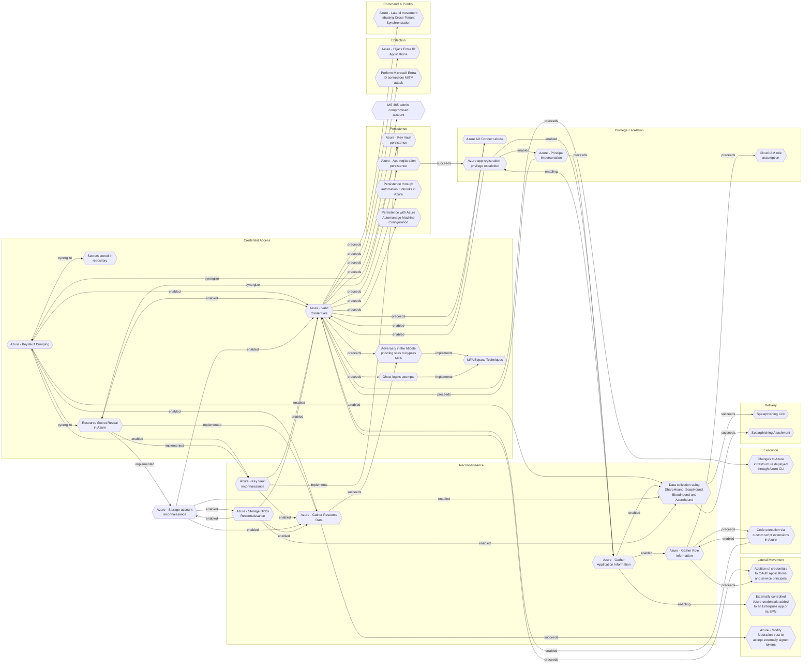

# Secrets stored in repository

## Metadata
| Field | Value |
| --- | --- |
| UUID | `ce7194f8-2398-4e79-b964-162ca5ee175b` |
| Schema | `threat::1.0` |
| Version | `1` |
| Created | `2023-04-13` |
| Modified | `2024-04-12` |
| TLP | clear (`TLP:CLEAR`) |
| Organisation | EC DIGIT CSOC (`56b0a0f0-b0bc-47d9-bb46-02f80ae2065a`) |

## References
### Public
- **1**: [https://cheatsheetseries.owasp.org/cheatsheets/Secrets_Management_Cheat_Sheet.html](https://cheatsheetseries.owasp.org/cheatsheets/Secrets_Management_Cheat_Sheet.html)
- **2**: [https://thehackernews.com/2022/05/how-secrets-lurking-in-source-code-lead.html](https://thehackernews.com/2022/05/how-secrets-lurking-in-source-code-lead.html)
- **3**: [https://blog.developer.adobe.com/getting-secrets-out-of-source-code-f24fd7b7a41f](https://blog.developer.adobe.com/getting-secrets-out-of-source-code-f24fd7b7a41f)

## Description
Secrets are digital authentication credentials such as encryption keys,
passwords, private keys, AWS secrets, Oauth tokens, JWT tokens, Slack
tokens, API secrets and others. Many of the organizations still keep
these secrets in plain-text hardcoded into source code, configuration
files or some of the configuration tools. (ref [1])    

Many developers use GitHub for personal projects and can happen to
leak by mistake corporate credentials even without rrealizing this.
Threat actors usually look first at the public repositories on GitHub,
and then at the ones owned by its employees. They use the collected data
to access company resources and databases and to compromise further the
infrastructure. They may use the collected data also for extortion
purposes threaten to publish it in public. (ref [2])  

This may pose a risk because the secrets could be stolen or leaked
without the knowledge of the internal staff. For example, they may be
accidentally or inadvertently committed in to the source code repository.
Once the secret is saved in history it is accessible and exposed to any 
malicious actor with read access.  

As a good practice make sure secrets are never stored in source code
and Software Control Management (SCM) or other configuration tools.
(ref [3])

Examples for secretes stored in repositories are:  

- Application Programming Interface (API) keys
- Database credentials
- Identity and Access Management (IAM) permissions
- Secure Shell (SSH) keys
- Certificates    

There is a growing need for organizations to centralize the storage,
provisioning, auditing, rotation and management of secrets to control
access to secrets and prevent them from leaking and compromising the
organization. Often, services share the same secrets, which makes
identifying the source of compromise or leak challenging. (ref [1])

## Criticality
**High** - A High priority incident is likely to result in a demonstrable impact to public health or safety, national security, economic security, foreign relations, civil liberties, or public confidence.

## Terrain
Threat actors are scanning for stored secrets in developer's source code
repositories leaked by design or by mistake from the engineering teams.

## Surface
> **Code Repositories::GitHub**
> GitHub source code hosting and collaboration

> **Code Repositories::GitLab**
> GitLab DevOps lifecycle tool

> **Atlassian::Bitbucket**
> Atlassian Bitbucket (see also Code Repositories::Bitbucket for repository-focused context)

> **Code Repositories**
> Source code hosting and version control platforms

## Threat Assessment
| Dimension | Assessment | Description |
| --- | --- | --- |
| Severity | Localised incident | A cyber attack on an individual, or preliminary indications of cyber activity against a small or medium-sized organisation. |
| Impact | Data Breach Business disruption | Non-public information has been accessed from the outside, and successfully extracted. Business disruption |
| Leverage | Information Disclosure Infrastructure Compromise Dwelling Elevation of privilege | Threat action intending to read a file that one was not granted access to, or to read data in transit. The compromised target is likely to be used to further expand the sphere of influence of the attacker and allow more potent vectors to be executed. Active or passive extended presence in the target, which performs adversarial operations continuously. Capacity to augment leverage over the target system by upgrading the compromised access rights |
| Viability | Environment dependent | Depends |
| Kill Chain | Credential Access | Techniques resulting in the access of, or control over, system, service or domain credentials. |

## Actors
| Actor | ID | Source | Description |
| --- | --- | --- | --- |
| [[Enterprise] LAPSUS$](https://attack.mitre.org/groups/G1004) | `att&ck::G1004` | ('att&ck',) | [LAPSUS$](https://attack.mitre.org/groups/G1004) is cyber criminal threat group that has been active since at least mid-2021. [LAPSUS$](https://attack.mitre.org/groups/G1004) specializes in large-scale social engineering and extortion operations, including destructive attacks without the use of ransomware. The group has targeted organizations globally, including in the government, manufacturing, higher education, energy, healthcare, technology, telecommunications, and media sectors.(Citation: BBC LAPSUS Apr 2022)(Citation: MSTIC DEV-0537 Mar 2022)(Citation: UNIT 42 LAPSUS Mar 2022) |
| LAPSUS | `misp::d9e5be22-1a04-4956-af6c-37af02330980` | ('misp',) | An actor group conducting large-scale social engineering and extortion campaign against multiple organizations with some seeing evidence of destructive elements. |

## ATT&CK Techniques
| Technique | Name | Description |
| --- | --- | --- |
| `T1213.003` | [Data from Information Repositories: Code Repositories](https://attack.mitre.org/techniques/T1213/003) | Adversaries may leverage code repositories to collect valuable information. Code repositories are tools/services that store source code and automate software builds. They may be hosted internally or privately on third party sites such as Github, GitLab, SourceForge, and BitBucket. Users typically interact with code repositories through a web application or command-line utilities such as git.  Once adversaries gain access to a victim network or a private code repository, they may collect sensitive information such as proprietary source code or [Unsecured Credentials](https://attack.mitre.org/techniques/T1552) contained within software's source code.  Having access to software's source code may allow adversaries to develop [Exploits](https://attack.mitre.org/techniques/T1587/004), while credentials may provide access to additional resources using [Valid Accounts](https://attack.mitre.org/techniques/T1078).(Citation: Wired Uber Breach)(Citation: Krebs Adobe)  **Note:** This is distinct from [Code Repositories](https://attack.mitre.org/techniques/T1593/003), which focuses on conducting [Reconnaissance](https://attack.mitre.org/tactics/TA0043) via public code repositories. |

## Chaining

