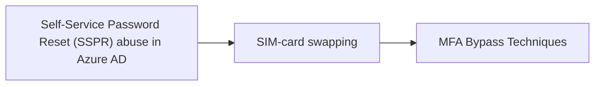

# Self-Service Password Reset (SSPR) abuse in Azure AD

## Metadata

- **UUID**: `a1a17bd4-ec7e-4302-aedf-96ee7c436065`
- **Schema**: `threat::1.0`
- **TLP**: clear

## Description
Self-service password reset (SSPR) is an Azure AD feature that allows users to
reset their password without the involvement of an administrator or help desk. 
It is designed for convenience and productivity so that users who forgot their
password or get locked out can easily reset it themselves with minimal friction.

Administrators are able to configure SSPR for the entire organization or a subset 
of groups via the Azure portal. They can also define requirements for permitted 
forms of verification and the number of verification methods required to perform 
the reset.

## methods

There are two primary methods through which adversaries have been abusing this tool:

- SIM swapping to gain initial access
- Attacker registered MFA to establish persistence

SIM swapping is an increasingly popular tactic that adversaries use to take 
control of a target phone number. This typically involves social engineering a
mobile carrier in order to initiate a number transfer to a new SIM card or
bribing internal employees to execute a swap. 

If an adversary controls the card and the organization SSPR is configured to
only require a single verification method, attackers should have no problem 
establishing initial access and enroll their own MFA methods for persistence,
typically mobile authenticator applications or disposable emails.

## reconnaisance

Successful SIM swapping needs sufficient preliminary SSPR reconnaissance to
identify a viable target. Aside from requiring the information to social engineer
a mobile carrier, the adversary needs to determine whether or not the target is
even susceptible to SSPR abuse.

Given any email address, it is easy to validate if it is a valid Microsoft 365 
account. The below curl command can be used to determine if a given email address
is a managed account in Microsoft 365:

curl -s -X POST https:///login.microsoftonline.com/common/GetCrede... –data ‘{“Username”:”user@domain.com”}’

Once valid Microsoft 365 accounts are identified, attackers initiate the SSPR flow
to see which verification options are available. Attackers likely need to perform
this recon as well if they are going to spend the time and effort performing the
initial SIM swap.

The Microsoft interface that appears during a SSPR clearly indicates whether one 
or two verification methods are required, making it easier for attackers to select
vulnerable target accounts.

## Techniques
- T1621

## Chaining

