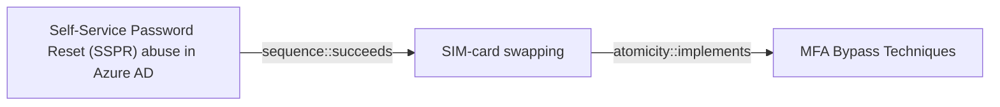

# Self-Service Password Reset (SSPR) abuse in Azure AD

## Metadata

- **UUID**: `a1a17bd4-ec7e-4302-aedf-96ee7c436065`
- **Schema**: `threat::1.0`
- **Version**: `1`
- **Created**: `2024-10-23`
- **Modified**: `2024-11-13`
- **TLP**: clear (`TLP:CLEAR`)
- **Organisation**: EC DIGIT CSOC (`56b0a0f0-b0bc-47d9-bb46-02f80ae2065a`)

## References
### Public
- **1**: [https://learn.microsoft.com/en-us/entra/identity/authentication/concept-sspr-howitworks](https://learn.microsoft.com/en-us/entra/identity/authentication/concept-sspr-howitworks)
- **2**: [https://techcommunity.microsoft.com/t5/core-infrastructure-and-security/the-adventure-continues-azure-ad-self-service-password-reset/ba-p/810776](https://techcommunity.microsoft.com/t5/core-infrastructure-and-security/the-adventure-continues-azure-ad-self-service-password-reset/ba-p/810776)
- **3**: [https://danielchronlund.com/2019/08/26/measure-your-azure-ad-mfa-and-self-service-password-reset-success/](https://danielchronlund.com/2019/08/26/measure-your-azure-ad-mfa-and-self-service-password-reset-success/)
- **4**: [https://www.obsidiansecurity.com/blog/behind-the-breach-self-service-password-reset-azure-ad/](https://www.obsidiansecurity.com/blog/behind-the-breach-self-service-password-reset-azure-ad/)

## Description
Self-service password reset (SSPR) is an Azure AD feature that allows users to
reset their password without the involvement of an administrator or help desk. 
It is designed for convenience and productivity so that users who forgot their
password or get locked out can easily reset it themselves with minimal friction.

Administrators are able to configure SSPR for the entire organization or a subset 
of groups via the Azure portal. They can also define requirements for permitted 
forms of verification and the number of verification methods required to perform 
the reset.

## methods

There are two primary methods through which adversaries have been abusing this tool:

- SIM swapping to gain initial access
- Attacker registered MFA to establish persistence

SIM swapping is an increasingly popular tactic that adversaries use to take 
control of a target phone number. This typically involves social engineering a
mobile carrier in order to initiate a number transfer to a new SIM card or
bribing internal employees to execute a swap. 

If an adversary controls the card and the organization SSPR is configured to
only require a single verification method, attackers should have no problem 
establishing initial access and enroll their own MFA methods for persistence,
typically mobile authenticator applications or disposable emails.

## reconnaisance

Successful SIM swapping needs sufficient preliminary SSPR reconnaissance to
identify a viable target. Aside from requiring the information to social engineer
a mobile carrier, the adversary needs to determine whether or not the target is
even susceptible to SSPR abuse.

Given any email address, it is easy to validate if it is a valid Microsoft 365 
account. The below curl command can be used to determine if a given email address
is a managed account in Microsoft 365:

curl -s -X POST https:///login.microsoftonline.com/common/GetCrede... –data ‘{“Username”:”user@domain.com”}’

Once valid Microsoft 365 accounts are identified, attackers initiate the SSPR flow
to see which verification options are available. Attackers likely need to perform
this recon as well if they are going to spend the time and effort performing the
initial SIM swap.

The Microsoft interface that appears during a SSPR clearly indicates whether one 
or two verification methods are required, making it easier for attackers to select
vulnerable target accounts.

## Criticality
**Medium** - A Medium priority incident may affect public health or safety, national security, economic security, foreign relations, civil liberties, or public confidence.

## Terrain
> **The administrator of the targeted Azure tenant must have SSPR enabled.

Domains: Enterprise, Mobile, Public Cloud
Targets: Auth token, Cloud Portal, End-user, Identity Services, Mobile phone
Platforms: Android, iOS, Azure AD**

## Threat Assessment
| Dimension | Assessment | Description |
| --- | --- | --- |
| Severity | Moderate incident | A cyber attack on a small organisation, or which poses a considerable risk to a medium-sized organisation, or preliminary indications of cyber activity against a large organisation or the government. |
| Impact | Impairement; Identity Theft | - |
| Leverage | Elevation of privilege; Spoofing; Modify configuration | - |
| Viability | Unlikely | Improbable (improbably) - 20-45% |
| Kill Chain | Credential Access | Techniques resulting in the access of, or control over, system, service or domain credentials. |

## Actors
| Actor | ID | Source | Description |
| --- | --- | --- | --- |
| [[Enterprise] LAPSUS$](https://attack.mitre.org/groups/G1004) | `att&ck::G1004` | ('att&ck',) | [LAPSUS$](https://attack.mitre.org/groups/G1004) is cyber criminal threat group that has been active since at least mid-2021. [LAPSUS$](https://attack.mitre.org/groups/G1004) specializes in large-scale social engineering and extortion operations, including destructive attacks without the use of ransomware. The group has targeted organizations globally, including in the government, manufacturing, higher education, energy, healthcare, technology, telecommunications, and media sectors.(Citation: BBC LAPSUS Apr 2022)(Citation: MSTIC DEV-0537 Mar 2022)(Citation: UNIT 42 LAPSUS Mar 2022) |
| LAPSUS | `misp::d9e5be22-1a04-4956-af6c-37af02330980` | ('misp',) | An actor group conducting large-scale social engineering and extortion campaign against multiple organizations with some seeing evidence of destructive elements. |
| [[Enterprise] APT29](https://attack.mitre.org/groups/G0016) | `att&ck::G0016` | ('att&ck',) | [APT29](https://attack.mitre.org/groups/G0016) is threat group that has been attributed to Russia's Foreign Intelligence Service (SVR).(Citation: White House Imposing Costs RU Gov April 2021)(Citation: UK Gov Malign RIS Activity April 2021) They have operated since at least 2008, often targeting government networks in Europe and NATO member countries, research institutes, and think tanks. [APT29](https://attack.mitre.org/groups/G0016) reportedly compromised the Democratic National Committee starting in the summer of 2015.(Citation: F-Secure The Dukes)(Citation: GRIZZLY STEPPE JAR)(Citation: Crowdstrike DNC June 2016)(Citation: UK Gov UK Exposes Russia SolarWinds April 2021)  In April 2021, the US and UK governments attributed the [SolarWinds Compromise](https://attack.mitre.org/campaigns/C0024) to the SVR; public statements included citations to [APT29](https://attack.mitre.org/groups/G0016), Cozy Bear, and The Dukes.(Citation: NSA Joint Advisory SVR SolarWinds April 2021)(Citation: UK NSCS Russia SolarWinds April 2021) Industry reporting also referred to the actors involved in this campaign as UNC2452, NOBELIUM, StellarParticle, Dark Halo, and SolarStorm.(Citation: FireEye SUNBURST Backdoor December 2020)(Citation: MSTIC NOBELIUM Mar 2021)(Citation: CrowdStrike SUNSPOT Implant January 2021)(Citation: Volexity SolarWinds)(Citation: Cybersecurity Advisory SVR TTP May 2021)(Citation: Unit 42 SolarStorm December 2020) |
| UNC2452 | `misp::2ee5ed7a-c4d0-40be-a837-20817474a15b` | ('misp',) | Reporting regarding activity related to the SolarWinds supply chain injection has grown quickly since initial disclosure on 13 December 2020. A significant amount of press reporting has focused on the identification of the actor(s) involved, victim organizations, possible campaign timeline, and potential impact. The US Government and cyber community have also provided detailed information on how the campaign was likely conducted and some of the malware used.  MITRE’s ATT&CK team — with the assistance of contributors — has been mapping techniques used by the actor group, referred to as UNC2452/Dark Halo by FireEye and Volexity respectively, as well as SUNBURST and TEARDROP malware. |

## ATT&CK Techniques
| Technique | Name | Description |
| --- | --- | --- |
| `T1621` | [Multi-Factor Authentication Request Generation](https://attack.mitre.org/techniques/T1621) | Adversaries may attempt to bypass multi-factor authentication (MFA) mechanisms and gain access to accounts by generating MFA requests sent to users.  Adversaries in possession of credentials to [Valid Accounts](https://attack.mitre.org/techniques/T1078) may be unable to complete the login process if they lack access to the 2FA or MFA mechanisms required as an additional credential and security control. To circumvent this, adversaries may abuse the automatic generation of push notifications to MFA services such as Duo Push, Microsoft Authenticator, Okta, or similar services to have the user grant access to their account. If adversaries lack credentials to victim accounts, they may also abuse automatic push notification generation when this option is configured for self-service password reset (SSPR).(Citation: Obsidian SSPR Abuse 2023)  In some cases, adversaries may continuously repeat login attempts in order to bombard users with MFA push notifications, SMS messages, and phone calls, potentially resulting in the user finally accepting the authentication request in response to “MFA fatigue.”(Citation: Russian 2FA Push Annoyance - Cimpanu)(Citation: MFA Fatigue Attacks - PortSwigger)(Citation: Suspected Russian Activity Targeting Government and Business Entities Around the Globe) |

## Chaining

### Chaining details
#### succeeds -> SIM-card swapping (`sequence::succeeds`)
After swap the SIM card of the user, attackers can go for the SPPR in Azure AD

- **Target UUID**: `6a7a493a-511a-4c9d-aa9c-4427c832a322`
#### implements -> MFA Bypass Techniques (`atomicity::implements`)
MFA bypass technique

- **Target UUID**: `4a807ac4-f764-41b1-ae6f-94239041d349`
