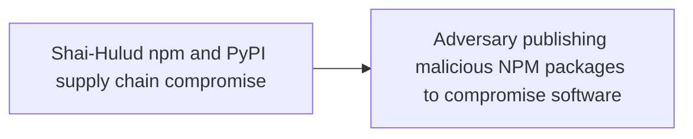

# Shai-Hulud npm and PyPI supply chain compromise

## Metadata

- **UUID**: `59548b96-9b01-414c-badd-c0bf2ab40d9a`
- **Schema**: `threat::1.0`
- **TLP**: clear

## Description
## Executive Summary

On 11 May 2026, a coordinated supply-chain campaign publicly tracked
as **Shai-Hulud** / **mini Shai-Hulud** compromised packages across the
npm and PyPI ecosystems. Wiz assesses with high confidence that the
activity aligns with **TeamPCP**, the cluster behind prior SAP,
Checkmarx, Bitwarden, Lightning, Intercom, and Trivy compromises.
Unlike maintainer-credential theft alone, the TanStack wave chained
GitHub Actions `pull_request_target` cache poisoning with in-memory OIDC
token extraction on release runners to publish malicious versions
without stealing npm passwords. Published packages embed lifecycle
hooks and obfuscated payloads that harvest CI/CD, cloud, Vault,
Kubernetes, and package-registry credentials, exfiltrate them over
redundant channels, and **self-propagate** by republishing poisoned
versions of other packages the victim can write to.

## Attack Timeline (UTC) — TanStack anchor incident

- **2026-05-10 17:16** — Attacker forks `TanStack/router` to
  `zblgg/configuration` (renamed to evade fork searches).
- **2026-05-10 23:29** — Malicious commit adds bundled payload under
  `packages/history/vite_setup.mjs` (cache-poisoning stage).
- **2026-05-11 ~10:49–11:29** — PR #7378 triggers
  `pull_request_target` workflows; poisoned pnpm store cached against
  `main` scope.
- **2026-05-11 19:20–19:26** — 84 malicious `@tanstack/*` versions
  (42 packages × 2) published via OIDC trusted publishing, minted
  from runner memory rather than the intended publish step.
- **2026-05-11 19:46** — External detection (StepSecurity issue
  #7383); maintainer response and deprecation begin within ~1 hour.
- **2026-05-11 22:13–23:55** — npm removes affected tarballs
  registry-side.
- **2026-05-11 onward** — Parallel waves against `@uipath/*`,
  `@mistralai/*`, and additional npm namespaces; PyPI trojans for
  `guardrails-ai` and `mistralai` observed the same week.

## Initial Access and Delivery Vectors

### TanStack — GitHub Actions cache poisoning + OIDC abuse

Three vulnerabilities chained: (1) `pull_request_target` workflow
checked out and built untrusted fork code; (2) poisoned pnpm store
written to a cache key later restored by `release.yml` on `main`;
(3) attacker binaries scraped `/proc/<pid>/mem` for lazily minted OIDC
tokens (`id-token: write`) and POSTed directly to
`registry.npmjs.org`, bypassing the workflow's publish step.

Trojanised tarballs carried:
- `optionalDependencies` pointing at orphan git commit
  `github:tanstack/router#79ac49eedf774dd4b0cfa308722bc463cfe5885c`
  with a malicious `prepare` script.
- Embedded ~2.3 MB obfuscated `router_init.js` in the package root.

### UiPath and related npm waves — preinstall + Bun

Multiple `@uipath/*` packages used `preinstall: node setup.mjs`,
downloading the Bun runtime and executing a re-obfuscated payload
(same C2 infrastructure, different campaign key). This delivery
mechanism mirrors the earlier SAP compromise pattern.

### PyPI — minimal stub, remote stage

`guardrails-ai@0.10.1` and `mistralai@2.4.6` added short bootstrap
code that downloads and executes
`https://git-tanstack[.]com/tmp/transformers.pyz` — a modular Linux-
only credential stealer (also targets 1Password / Bitwarden vaults).

## Payload Behaviour (defender-relevant)

When lifecycle hooks run during package install, the payload typically:

1. Harvests credentials from `.npmrc`, `.env`, `~/.git-credentials`,
   cloud metadata (AWS IMDSv2, GCP, Azure), Kubernetes service-account
   tokens, HashiCorp Vault, GitHub / GitLab / CircleCI tokens, and
   SSH private keys.
2. Exfiltrates via **three redundant channels**:
   - Typosquat domain `git-tanstack[.]com`
   - Session messenger network (`*.getsession.org`,
     recipient ID `05f9e609d79eed391015e11380dee4b5c9ead0b6e2e7f0134e6e51767a87323026`)
   - GitHub API dead drops (repositories with description
     `Shai-Hulud: Here We Go Again` or `PUSH UR T3MPRR`)
3. Self-propagates by searching `registry.npmjs.org/-/v1/search?text=maintainer:`
   and republishing trojanised versions of packages the victim maintains.
4. On developer hosts with high-value `ghp_` / `gho_` tokens, may
   install persistent `gh-token-monitor` daemon (macOS LaunchAgent or
   Linux systemd) that polls GitHub every 60 seconds and runs
   `rm -rf ~/` if the monitored token is revoked — remove the daemon
   **before** revoking tokens.
5. Checks for Russian locale and exits without exfiltration (noise
   reduction for the operator).

## Affected Packages and Versions (representative — not exhaustive)

### High-visibility npm namespaces

- **@tanstack/***: 42 packages, 84 versions (e.g.
  `@tanstack/react-router@1.169.5`, `@tanstack/react-router@1.169.8`).
  See TanStack GHSA-g7cv-rxg3-hmpx for the full matrix.
- **@uipath/***: dozens of packages including `@uipath/apollo-core@5.9.2`
  (payload bug rendered some variants non-functional per later analysis).
- **@mistralai/mistralai**: `2.2.2`–`2.2.4` (and related Azure/GCP
  client packages).
- Additional npm packages listed in Wiz / Aikido advisories (OpenSearch,
  Squawk, TallyUI, and others).

### PyPI

- `guardrails-ai@0.10.1`
- `mistralai@2.4.6`

## Indicators of Compromise (IOCs)

### File artefacts

- `router_init.js` (SHA-256 examples:
  `ab4fcadaec49c03278063dd269ea5eef82d24f2124a8e15d7b90f2fa8601266c`,
  `2258284d65f63829bd67eaba01ef6f1ada2f593f9bbe41678b2df360bd90d3df`)
- `setup.mjs` (SHA-256:
  `2ec78d556d696e208927cc503d48e4b5eb56b31abc2870c2ed2e98d6be27fc96`)
- `router_runtime.js`, `tanstack_runner.js` (IDE / post-uninstall
  persistence under `.claude/` or `.vscode/`)
- `gh-token-monitor` service / LaunchAgent:
  `~/Library/LaunchAgents/com.user.gh-token-monitor.plist`,
  `~/.config/systemd/user/gh-token-monitor.service`

### Manifest fingerprints

```json
"optionalDependencies": {
  "@tanstack/setup": "github:tanstack/router#79ac49eedf774dd4b0cfa308722bc463cfe5885c"
}
```

```json
"scripts": { "preinstall": "node setup.mjs" }
```

### Network indicators

- C2 domain: `git-tanstack[.]com`
- PyPI stage URL: `git-tanstack[.]com/tmp/transformers.pyz`
- C2 IP: `83.142.209[.]194`
- Session infrastructure: `seed1.getsession.org`,
  `seed2.getsession.org`, `seed3.getsession.org`,
  `filev2.getsession.org`
- Session recipient ID:
  `05f9e609d79eed391015e11380dee4b5c9ead0b6e2e7f0134e6e51767a87323026`

### GitHub dead-drop markers

- Repository description: `Shai-Hulud: Here We Go Again`
- Repository description: `PUSH UR T3MPRR` (PyPI variant)
- Commit message: `IfYouRevokeThisTokenItWillWipeTheComputerOfTheOwner`

## Impacted Telemetry / Log Sources

- Endpoint: process creation with npm/pnpm/yarn/pip parent chains;
  file reads of `.npmrc`, `.env`, cloud credential paths; outbound
  HTTP/DNS to indicator domains; persistence file creation.
- CI/CD: GitHub Actions workflow and cache audit logs; npm publish
  audit events; OIDC token minting outside expected workflow steps.
- Cloud / identity: GitHub audit logs (repo creation, workflow changes,
  package publish); cloud metadata access from build agents.
- Source control: lockfile / SBOM diffs showing affected versions;
     presence of `router_init.js` or `setup.mjs` at package roots.

## Mitigation and Hardening Recommendations

1. **Immediate**
   - Search lockfiles, SBOMs, and CI logs for affected package versions;
     pin to known-good releases and regenerate lockfiles from clean state.
   - Hunt for `router_init.js`, `setup.mjs`, `gh-token-monitor`, and
     IDE-resident `router_runtime.js` before uninstalling packages.
   - Remove `gh-token-monitor` persistence **before** revoking GitHub
     tokens to avoid the home-directory wiper.
   - Rotate every credential reachable from exposed hosts: GitHub PATs,
     npm tokens, cloud keys, Vault tokens, Kubernetes service accounts,
     SSH keys, and CI secrets.
   - Block egress to `git-tanstack[.]com` and `*.getsession.org`.
2. **Hardening**
   - Eliminate dangerous `pull_request_target` patterns; never checkout
     untrusted PR code in `pull_request_target` jobs; pin Actions to
     commit SHAs; scope caches per trust boundary.
   - Default CI to `npm ci --ignore-scripts` where feasible; gate
     installs on malicious-package feeds (Socket, StepSecurity, Aikido).
   - Monitor npm publishes for provenance regressions and anomalous
     OIDC publish paths on critical scopes.
   - Subscribe to registry change alerts for packages your organisation
     maintains or depends on critically.

## Key Takeaways for Defenders

- This campaign is **worm-capable**: compromise of one maintainer or CI
  runner can cascade into additional poisoned packages without further
  social engineering.
- TanStack demonstrated that **OIDC trusted publishing does not
  prevent publish abuse** when arbitrary code executes on the runner
  with `id-token: write`.
- Detection must span **endpoint install-time behaviour**, **secret-
  file access**, **cloud/GitHub audit telemetry**, and **indicator
  matching** — no single log source is sufficient.
- Token revocation can trigger **destructive follow-on behaviour**;
  sequence containment carefully on developer laptops.

## Techniques
- T1195.001
- T1195.002
- T1546.016
- T1059.007
- T1059.006
- T1552.001
- T1550.001
- T1567.002
- T1071.001
- T1078
- T1027
- T1547
- T1485

## Chaining


## Relations

```mermaid
flowchart TB
59548b96_9b01_414c_badd_c0bf2ab40d9a["Shai-Hulud npm and PyPI supply chain compromise"]
0924c742_8fdb_4ee2_95fe_91d2e5725a90["Shai-Hulud Large Encoded Payload in Outbound HTTP from Developer or Build Hosts"]
21a527de_8635_4187_87d4_c9e5f5c1badc["21a527de-8635-4187-87d4-c9e5f5c1badc"]
287114bd_7d58_422d_9711_f5516900b9ce["287114bd-7d58-422d-9711-f5516900b9ce"]
2fe6575d_513c_4588_999f_19c13d0fa4f9["Shai-Hulud Known On-Disk and Network Indicator Match"]
365e23e8_0367_4adf_b18a_f1440cc66005["365e23e8-0367-4adf-b18a-f1440cc66005"]
678d0786_dfd7_40fb_ba90_3c368ed00342["678d0786-dfd7-40fb-ba90-3c368ed00342"]
7eb85d22_2e60_449f_b92c_8cecc28d34c6["Shai-Hulud Unexpected GitHub Repository or Workflow Creation"]
9f3abdc4_7c6e_480e_b722_6d31ddd9b2d2["9f3abdc4-7c6e-480e-b722-6d31ddd9b2d2"]
a3f7d796_146c_44b0_8d22_7a08daa0d963["a3f7d796-146c-44b0-8d22-7a08daa0d963"]
b49d0a94_ae13_49b3_8ad8_6c035fa3d681["b49d0a94-ae13-49b3-8ad8-6c035fa3d681"]
bfae62bb_7ce1_46cd_a131_39803832fa9d["Shai-Hulud Package Manager Install Spawning Suspicious Child Processes"]
c82cfa6b_066f_4ba3_ba07_d7eb642c8099["Shai-Hulud Bulk Credential-Candidate File Access on Developer Hosts"]
ecd096d2_7fc5_45e3_803f_82d13f940210["Shai-Hulud Developer Secret-File Access Followed by Outbound Egress"]
fae8ef2d_99e9_42f4_81ed_d40c515e8d3d["Shai-Hulud Anomalous npm Package Publish from Non-Baseline Identity"]
fb62e879_9e91_4c5b_aaa7_999b2b1b3897["Detect Shai-Hulud npm and PyPI Supply Chain Compromise Activity"]
59548b96_9b01_414c_badd_c0bf2ab40d9a --> 0924c742_8fdb_4ee2_95fe_91d2e5725a90
59548b96_9b01_414c_badd_c0bf2ab40d9a --> 21a527de_8635_4187_87d4_c9e5f5c1badc
59548b96_9b01_414c_badd_c0bf2ab40d9a --> 287114bd_7d58_422d_9711_f5516900b9ce
59548b96_9b01_414c_badd_c0bf2ab40d9a --> 2fe6575d_513c_4588_999f_19c13d0fa4f9
59548b96_9b01_414c_badd_c0bf2ab40d9a --> 365e23e8_0367_4adf_b18a_f1440cc66005
59548b96_9b01_414c_badd_c0bf2ab40d9a --> 678d0786_dfd7_40fb_ba90_3c368ed00342
59548b96_9b01_414c_badd_c0bf2ab40d9a --> 7eb85d22_2e60_449f_b92c_8cecc28d34c6
59548b96_9b01_414c_badd_c0bf2ab40d9a --> 9f3abdc4_7c6e_480e_b722_6d31ddd9b2d2
59548b96_9b01_414c_badd_c0bf2ab40d9a --> a3f7d796_146c_44b0_8d22_7a08daa0d963
59548b96_9b01_414c_badd_c0bf2ab40d9a --> b49d0a94_ae13_49b3_8ad8_6c035fa3d681
59548b96_9b01_414c_badd_c0bf2ab40d9a --> bfae62bb_7ce1_46cd_a131_39803832fa9d
59548b96_9b01_414c_badd_c0bf2ab40d9a --> c82cfa6b_066f_4ba3_ba07_d7eb642c8099
59548b96_9b01_414c_badd_c0bf2ab40d9a --> ecd096d2_7fc5_45e3_803f_82d13f940210
59548b96_9b01_414c_badd_c0bf2ab40d9a --> fae8ef2d_99e9_42f4_81ed_d40c515e8d3d
59548b96_9b01_414c_badd_c0bf2ab40d9a --> fb62e879_9e91_4c5b_aaa7_999b2b1b3897
```

