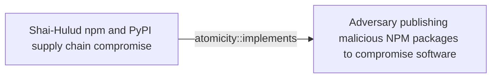

# Shai-Hulud npm and PyPI supply chain compromise

## Metadata

- **UUID**: `59548b96-9b01-414c-badd-c0bf2ab40d9a`
- **Schema**: `threat::1.0`
- **Version**: `1`
- **Created**: `2026-06-16`
- **Modified**: `2026-06-16`
- **TLP**: clear (`TLP:CLEAR`)
- **Organisation**: EC DIGIT CSOC (`56b0a0f0-b0bc-47d9-bb46-02f80ae2065a`)

## References
### Public
- **1**: [https://www.wiz.io/blog/mini-shai-hulud-strikes-again-tanstack-more-npm-packages-compromised](https://www.wiz.io/blog/mini-shai-hulud-strikes-again-tanstack-more-npm-packages-compromised)
- **2**: [https://www.aikido.dev/blog/mini-shai-hulud-is-back-tanstack-compromised](https://www.aikido.dev/blog/mini-shai-hulud-is-back-tanstack-compromised)
- **3**: [https://tanstack.com/blog/npm-supply-chain-compromise-postmortem](https://tanstack.com/blog/npm-supply-chain-compromise-postmortem)
- **4**: [https://www.stepsecurity.io/blog/mini-shai-hulud-is-back-a-self-spreading-supply-chain-attack-hits-the-npm-ecosystem](https://www.stepsecurity.io/blog/mini-shai-hulud-is-back-a-self-spreading-supply-chain-attack-hits-the-npm-ecosystem)

## Description
## Executive Summary

On 11 May 2026, a coordinated supply-chain campaign publicly tracked
as **Shai-Hulud** / **mini Shai-Hulud** compromised packages across the
npm and PyPI ecosystems. Wiz assesses with high confidence that the
activity aligns with **TeamPCP**, the cluster behind prior SAP,
Checkmarx, Bitwarden, Lightning, Intercom, and Trivy compromises.
Unlike maintainer-credential theft alone, the TanStack wave chained
GitHub Actions `pull_request_target` cache poisoning with in-memory OIDC
token extraction on release runners to publish malicious versions
without stealing npm passwords. Published packages embed lifecycle
hooks and obfuscated payloads that harvest CI/CD, cloud, Vault,
Kubernetes, and package-registry credentials, exfiltrate them over
redundant channels, and **self-propagate** by republishing poisoned
versions of other packages the victim can write to.

## Attack Timeline (UTC) — TanStack anchor incident

- **2026-05-10 17:16** — Attacker forks `TanStack/router` to
  `zblgg/configuration` (renamed to evade fork searches).
- **2026-05-10 23:29** — Malicious commit adds bundled payload under
  `packages/history/vite_setup.mjs` (cache-poisoning stage).
- **2026-05-11 ~10:49–11:29** — PR #7378 triggers
  `pull_request_target` workflows; poisoned pnpm store cached against
  `main` scope.
- **2026-05-11 19:20–19:26** — 84 malicious `@tanstack/*` versions
  (42 packages × 2) published via OIDC trusted publishing, minted
  from runner memory rather than the intended publish step.
- **2026-05-11 19:46** — External detection (StepSecurity issue
  #7383); maintainer response and deprecation begin within ~1 hour.
- **2026-05-11 22:13–23:55** — npm removes affected tarballs
  registry-side.
- **2026-05-11 onward** — Parallel waves against `@uipath/*`,
  `@mistralai/*`, and additional npm namespaces; PyPI trojans for
  `guardrails-ai` and `mistralai` observed the same week.

## Initial Access and Delivery Vectors

### TanStack — GitHub Actions cache poisoning + OIDC abuse

Three vulnerabilities chained: (1) `pull_request_target` workflow
checked out and built untrusted fork code; (2) poisoned pnpm store
written to a cache key later restored by `release.yml` on `main`;
(3) attacker binaries scraped `/proc/<pid>/mem` for lazily minted OIDC
tokens (`id-token: write`) and POSTed directly to
`registry.npmjs.org`, bypassing the workflow's publish step.

Trojanised tarballs carried:
- `optionalDependencies` pointing at orphan git commit
  `github:tanstack/router#79ac49eedf774dd4b0cfa308722bc463cfe5885c`
  with a malicious `prepare` script.
- Embedded ~2.3 MB obfuscated `router_init.js` in the package root.

### UiPath and related npm waves — preinstall + Bun

Multiple `@uipath/*` packages used `preinstall: node setup.mjs`,
downloading the Bun runtime and executing a re-obfuscated payload
(same C2 infrastructure, different campaign key). This delivery
mechanism mirrors the earlier SAP compromise pattern.

### PyPI — minimal stub, remote stage

`guardrails-ai@0.10.1` and `mistralai@2.4.6` added short bootstrap
code that downloads and executes
`https://git-tanstack[.]com/tmp/transformers.pyz` — a modular Linux-
only credential stealer (also targets 1Password / Bitwarden vaults).

## Payload Behaviour (defender-relevant)

When lifecycle hooks run during package install, the payload typically:

1. Harvests credentials from `.npmrc`, `.env`, `~/.git-credentials`,
   cloud metadata (AWS IMDSv2, GCP, Azure), Kubernetes service-account
   tokens, HashiCorp Vault, GitHub / GitLab / CircleCI tokens, and
   SSH private keys.
2. Exfiltrates via **three redundant channels**:
   - Typosquat domain `git-tanstack[.]com`
   - Session messenger network (`*.getsession.org`,
     recipient ID `05f9e609d79eed391015e11380dee4b5c9ead0b6e2e7f0134e6e51767a87323026`)
   - GitHub API dead drops (repositories with description
     `Shai-Hulud: Here We Go Again` or `PUSH UR T3MPRR`)
3. Self-propagates by searching `registry.npmjs.org/-/v1/search?text=maintainer:`
   and republishing trojanised versions of packages the victim maintains.
4. On developer hosts with high-value `ghp_` / `gho_` tokens, may
   install persistent `gh-token-monitor` daemon (macOS LaunchAgent or
   Linux systemd) that polls GitHub every 60 seconds and runs
   `rm -rf ~/` if the monitored token is revoked — remove the daemon
   **before** revoking tokens.
5. Checks for Russian locale and exits without exfiltration (noise
   reduction for the operator).

## Affected Packages and Versions (representative — not exhaustive)

### High-visibility npm namespaces

- **@tanstack/***: 42 packages, 84 versions (e.g.
  `@tanstack/react-router@1.169.5`, `@tanstack/react-router@1.169.8`).
  See TanStack GHSA-g7cv-rxg3-hmpx for the full matrix.
- **@uipath/***: dozens of packages including `@uipath/apollo-core@5.9.2`
  (payload bug rendered some variants non-functional per later analysis).
- **@mistralai/mistralai**: `2.2.2`–`2.2.4` (and related Azure/GCP
  client packages).
- Additional npm packages listed in Wiz / Aikido advisories (OpenSearch,
  Squawk, TallyUI, and others).

### PyPI

- `guardrails-ai@0.10.1`
- `mistralai@2.4.6`

## Indicators of Compromise (IOCs)

### File artefacts

- `router_init.js` (SHA-256 examples:
  `ab4fcadaec49c03278063dd269ea5eef82d24f2124a8e15d7b90f2fa8601266c`,
  `2258284d65f63829bd67eaba01ef6f1ada2f593f9bbe41678b2df360bd90d3df`)
- `setup.mjs` (SHA-256:
  `2ec78d556d696e208927cc503d48e4b5eb56b31abc2870c2ed2e98d6be27fc96`)
- `router_runtime.js`, `tanstack_runner.js` (IDE / post-uninstall
  persistence under `.claude/` or `.vscode/`)
- `gh-token-monitor` service / LaunchAgent:
  `~/Library/LaunchAgents/com.user.gh-token-monitor.plist`,
  `~/.config/systemd/user/gh-token-monitor.service`

### Manifest fingerprints

```json
"optionalDependencies": {
  "@tanstack/setup": "github:tanstack/router#79ac49eedf774dd4b0cfa308722bc463cfe5885c"
}
```

```json
"scripts": { "preinstall": "node setup.mjs" }
```

### Network indicators

- C2 domain: `git-tanstack[.]com`
- PyPI stage URL: `git-tanstack[.]com/tmp/transformers.pyz`
- C2 IP: `83.142.209[.]194`
- Session infrastructure: `seed1.getsession.org`,
  `seed2.getsession.org`, `seed3.getsession.org`,
  `filev2.getsession.org`
- Session recipient ID:
  `05f9e609d79eed391015e11380dee4b5c9ead0b6e2e7f0134e6e51767a87323026`

### GitHub dead-drop markers

- Repository description: `Shai-Hulud: Here We Go Again`
- Repository description: `PUSH UR T3MPRR` (PyPI variant)
- Commit message: `IfYouRevokeThisTokenItWillWipeTheComputerOfTheOwner`

## Impacted Telemetry / Log Sources

- Endpoint: process creation with npm/pnpm/yarn/pip parent chains;
  file reads of `.npmrc`, `.env`, cloud credential paths; outbound
  HTTP/DNS to indicator domains; persistence file creation.
- CI/CD: GitHub Actions workflow and cache audit logs; npm publish
  audit events; OIDC token minting outside expected workflow steps.
- Cloud / identity: GitHub audit logs (repo creation, workflow changes,
  package publish); cloud metadata access from build agents.
- Source control: lockfile / SBOM diffs showing affected versions;
     presence of `router_init.js` or `setup.mjs` at package roots.

## Mitigation and Hardening Recommendations

1. **Immediate**
   - Search lockfiles, SBOMs, and CI logs for affected package versions;
     pin to known-good releases and regenerate lockfiles from clean state.
   - Hunt for `router_init.js`, `setup.mjs`, `gh-token-monitor`, and
     IDE-resident `router_runtime.js` before uninstalling packages.
   - Remove `gh-token-monitor` persistence **before** revoking GitHub
     tokens to avoid the home-directory wiper.
   - Rotate every credential reachable from exposed hosts: GitHub PATs,
     npm tokens, cloud keys, Vault tokens, Kubernetes service accounts,
     SSH keys, and CI secrets.
   - Block egress to `git-tanstack[.]com` and `*.getsession.org`.
2. **Hardening**
   - Eliminate dangerous `pull_request_target` patterns; never checkout
     untrusted PR code in `pull_request_target` jobs; pin Actions to
     commit SHAs; scope caches per trust boundary.
   - Default CI to `npm ci --ignore-scripts` where feasible; gate
     installs on malicious-package feeds (Socket, StepSecurity, Aikido).
   - Monitor npm publishes for provenance regressions and anomalous
     OIDC publish paths on critical scopes.
   - Subscribe to registry change alerts for packages your organisation
     maintains or depends on critically.

## Key Takeaways for Defenders

- This campaign is **worm-capable**: compromise of one maintainer or CI
  runner can cascade into additional poisoned packages without further
  social engineering.
- TanStack demonstrated that **OIDC trusted publishing does not
  prevent publish abuse** when arbitrary code executes on the runner
  with `id-token: write`.
- Detection must span **endpoint install-time behaviour**, **secret-
  file access**, **cloud/GitHub audit telemetry**, and **indicator
  matching** — no single log source is sufficient.
- Token revocation can trigger **destructive follow-on behaviour**;
  sequence containment carefully on developer laptops.

## Criticality
**Severe** - A Severe priority incident is likely to result in a significant impact to public health or safety, national security, economic security, foreign relations, or civil liberties.

## Terrain
> **Any organisation, developer workstation, CI/CD runner, or build pipeline
that resolved affected npm or PyPI package versions during the May 2026
exposure windows. The TanStack incident alone affected 42 `@tanstack/*`
packages (84 malicious versions published on 2026-05-11) via poisoned
GitHub Actions cache and OIDC token extraction on release runners;
parallel waves hit `@uipath/*`, `@mistralai/*`, and numerous additional
npm namespaces, plus PyPI packages `guardrails-ai@0.10.1` and
`mistralai@2.4.6`. Because payloads execute during `npm install`,
`pnpm install`, `yarn install`, or `pip install`, any host that
resolved a compromised version during the window must be treated as
potentially compromised. Self-propagation logic enumerates packages the
victim maintains and republishes trojanised versions, amplifying blast
radius beyond the initial namespace.

Surface: OS::Windows::Desktop, OS::macOS, OS::Linux, Application::Development::Package Management::npm, Application::Development::Package Management::PyPI, Application::Development::CI/CD::GitHub Actions**

## Threat Assessment
| Dimension | Assessment | Description |
| --- | --- | --- |
| Severity | Highly significant incident | A cyber attack which has a serious impact on central government, (inter)national essential services, a large proportion of the (inter)national population, or the (inter)national economy. |
| Impact | Data Breach; Business disruption; Lose Capabilities; Reputational Damages; Operating costs | - |
| Leverage | Infrastructure Compromise; Tampering; Software installation; Information Gathering; Information Disclosure | - |
| Viability | Almost certain | Nearly certain - 95-99% |
| Kill Chain | Delivery | Techniques resulting in the transmission of a weaponized object to the targeted environment. |

## ATT&CK Techniques
| Technique | Name | Description |
| --- | --- | --- |
| `T1195.001` | [Supply Chain Compromise: Compromise Software Dependencies and Development Tools](https://attack.mitre.org/techniques/T1195/001) | Adversaries may manipulate software dependencies and development tools prior to receipt by a final consumer for the purpose of data or system compromise. Applications often depend on external software to function properly. Popular open source projects that are used as dependencies in many applications may be targeted as a means to add malicious code to users of the dependency.(Citation: Trendmicro NPM Compromise)    Targeting may be specific to a desired victim set or may be distributed to a broad set of consumers but only move on to additional tactics on specific victims. |
| `T1195.002` | [Supply Chain Compromise: Compromise Software Supply Chain](https://attack.mitre.org/techniques/T1195/002) | Adversaries may manipulate application software prior to receipt by a final consumer for the purpose of data or system compromise. Supply chain compromise of software can take place in a number of ways, including manipulation of the application source code, manipulation of the update/distribution mechanism for that software, or replacing compiled releases with a modified version.  Targeting may be specific to a desired victim set or may be distributed to a broad set of consumers but only move on to additional tactics on specific victims.(Citation: Avast CCleaner3 2018)(Citation: Command Five SK 2011) |
| `T1546.016` | [Event Triggered Execution: Installer Packages](https://attack.mitre.org/techniques/T1546/016) | Adversaries may establish persistence and elevate privileges by using an installer to trigger the execution of malicious content. Installer packages are OS specific and contain the resources an operating system needs to install applications on a system. Installer packages can include scripts that run prior to installation as well as after installation is complete. Installer scripts may inherit elevated permissions when executed. Developers often use these scripts to prepare the environment for installation, check requirements, download dependencies, and remove files after installation.(Citation: Installer Package Scripting Rich Trouton)  Using legitimate applications, adversaries have distributed applications with modified installer scripts to execute malicious content. When a user installs the application, they may be required to grant administrative permissions to allow the installation. At the end of the installation process of the legitimate application, content such as macOS `postinstall` scripts can be executed with the inherited elevated permissions. Adversaries can use these scripts to execute a malicious executable or install other malicious components (such as a [Launch Daemon](https://attack.mitre.org/techniques/T1543/004)) with the elevated permissions.(Citation: Application Bundle Manipulation Brandon Dalton)(Citation: wardle evilquest parti)(Citation: Windows AppleJeus GReAT)(Citation: Debian Manual Maintainer Scripts)  Depending on the distribution, Linux versions of package installer scripts are sometimes called maintainer scripts or post installation scripts. These scripts can include `preinst`, `postinst`, `prerm`, `postrm` scripts and run as root when executed.  For Windows, the Microsoft Installer services uses `.msi` files to manage the installing, updating, and uninstalling of applications. These installation routines may also include instructions to perform additional actions that may be abused by adversaries.(Citation: Microsoft Installation Procedures) |
| `T1059.007` | [Command and Scripting Interpreter: JavaScript](https://attack.mitre.org/techniques/T1059/007) | Adversaries may abuse various implementations of JavaScript for execution. JavaScript (JS) is a platform-independent scripting language (compiled just-in-time at runtime) commonly associated with scripts in webpages, though JS can be executed in runtime environments outside the browser.(Citation: NodeJS)  JScript is the Microsoft implementation of the same scripting standard. JScript is interpreted via the Windows Script engine and thus integrated with many components of Windows such as the [Component Object Model](https://attack.mitre.org/techniques/T1559/001) and Internet Explorer HTML Application (HTA) pages.(Citation: JScrip May 2018)(Citation: Microsoft JScript 2007)(Citation: Microsoft Windows Scripts)  JavaScript for Automation (JXA) is a macOS scripting language based on JavaScript, included as part of Apple’s Open Scripting Architecture (OSA), that was introduced in OSX 10.10. Apple’s OSA provides scripting capabilities to control applications, interface with the operating system, and bridge access into the rest of Apple’s internal APIs. As of OSX 10.10, OSA only supports two languages, JXA and [AppleScript](https://attack.mitre.org/techniques/T1059/002). Scripts can be executed via the command line utility <code>osascript</code>, they can be compiled into applications or script files via <code>osacompile</code>, and they can be compiled and executed in memory of other programs by leveraging the OSAKit Framework.(Citation: Apple About Mac Scripting 2016)(Citation: SpecterOps JXA 2020)(Citation: SentinelOne macOS Red Team)(Citation: Red Canary Silver Sparrow Feb2021)(Citation: MDSec macOS JXA and VSCode)  Adversaries may abuse various implementations of JavaScript to execute various behaviors. Common uses include hosting malicious scripts on websites as part of a [Drive-by Compromise](https://attack.mitre.org/techniques/T1189) or downloading and executing these script files as secondary payloads. Since these payloads are text-based, it is also very common for adversaries to obfuscate their content as part of [Obfuscated Files or Information](https://attack.mitre.org/techniques/T1027). |
| `T1059.006` | [Command and Scripting Interpreter: Python](https://attack.mitre.org/techniques/T1059/006) | Adversaries may abuse Python commands and scripts for execution. Python is a very popular scripting/programming language, with capabilities to perform many functions. Python can be executed interactively from the command-line (via the <code>python.exe</code> interpreter) or via scripts (.py) that can be written and distributed to different systems. Python code can also be compiled into binary executables.(Citation: Zscaler APT31 Covid-19 October 2020)  Python comes with many built-in packages to interact with the underlying system, such as file operations and device I/O. Adversaries can use these libraries to download and execute commands or other scripts as well as perform various malicious behaviors. |
| `T1552.001` | [Unsecured Credentials: Credentials In Files](https://attack.mitre.org/techniques/T1552/001) | Adversaries may search local file systems and remote file shares for files containing insecurely stored credentials. These can be files created by users to store their own credentials, shared credential stores for a group of individuals, configuration files containing passwords for a system or service, or source code/binary files containing embedded passwords.  It is possible to extract passwords from backups or saved virtual machines through [OS Credential Dumping](https://attack.mitre.org/techniques/T1003).(Citation: CG 2014) Passwords may also be obtained from Group Policy Preferences stored on the Windows Domain Controller.(Citation: SRD GPP)  In cloud and/or containerized environments, authenticated user and service account credentials are often stored in local configuration and credential files.(Citation: Unit 42 Hildegard Malware) They may also be found as parameters to deployment commands in container logs.(Citation: Unit 42 Unsecured Docker Daemons) In some cases, these files can be copied and reused on another machine or the contents can be read and then used to authenticate without needing to copy any files.(Citation: Specter Ops - Cloud Credential Storage) |
| `T1550.001` | [Use Alternate Authentication Material: Application Access Token](https://attack.mitre.org/techniques/T1550/001) | Adversaries may use stolen application access tokens to bypass the typical authentication process and access restricted accounts, information, or services on remote systems. These tokens are typically stolen from users or services and used in lieu of login credentials.  Application access tokens are used to make authorized API requests on behalf of a user or service and are commonly used to access resources in cloud, container-based applications, and software-as-a-service (SaaS).(Citation: Auth0 - Why You Should Always Use Access Tokens to Secure APIs Sept 2019)   OAuth is one commonly implemented framework that issues tokens to users for access to systems. These frameworks are used collaboratively to verify the user and determine what actions the user is allowed to perform. Once identity is established, the token allows actions to be authorized, without passing the actual credentials of the user. Therefore, compromise of the token can grant the adversary access to resources of other sites through a malicious application.(Citation: okta)  For example, with a cloud-based email service, once an OAuth access token is granted to a malicious application, it can potentially gain long-term access to features of the user account if a "refresh" token enabling background access is awarded.(Citation: Microsoft Identity Platform Access 2019) With an OAuth access token an adversary can use the user-granted REST API to perform functions such as email searching and contact enumeration.(Citation: Staaldraad Phishing with OAuth 2017)  Compromised access tokens may be used as an initial step in compromising other services. For example, if a token grants access to a victim’s primary email, the adversary may be able to extend access to all other services which the target subscribes by triggering forgotten password routines. In AWS and GCP environments, adversaries can trigger a request for a short-lived access token with the privileges of another user account.(Citation: Google Cloud Service Account Credentials)(Citation: AWS Temporary Security Credentials) The adversary can then use this token to request data or perform actions the original account could not. If permissions for this feature are misconfigured – for example, by allowing all users to request a token for a particular account - an adversary may be able to gain initial access to a Cloud Account or escalate their privileges.(Citation: Rhino Security Labs Enumerating AWS Roles)  Direct API access through a token negates the effectiveness of a second authentication factor and may be immune to intuitive countermeasures like changing passwords.  For example, in AWS environments, an adversary who compromises a user’s AWS API credentials may be able to use the `sts:GetFederationToken` API call to create a federated user session, which will have the same permissions as the original user but may persist even if the original user credentials are deactivated.(Citation: Crowdstrike AWS User Federation Persistence) Additionally, access abuse over an API channel can be difficult to detect even from the service provider end, as the access can still align well with a legitimate workflow. |
| `T1567.002` | [Exfiltration Over Web Service: Exfiltration to Cloud Storage](https://attack.mitre.org/techniques/T1567/002) | Adversaries may exfiltrate data to a cloud storage service rather than over their primary command and control channel. Cloud storage services allow for the storage, edit, and retrieval of data from a remote cloud storage server over the Internet.  Examples of cloud storage services include Dropbox and Google Docs. Exfiltration to these cloud storage services can provide a significant amount of cover to the adversary if hosts within the network are already communicating with the service. |
| `T1071.001` | [Application Layer Protocol: Web Protocols](https://attack.mitre.org/techniques/T1071/001) | Adversaries may communicate using application layer protocols associated with web traffic to avoid detection/network filtering by blending in with existing traffic. Commands to the remote system, and often the results of those commands, will be embedded within the protocol traffic between the client and server.   Protocols such as HTTP/S(Citation: CrowdStrike Putter Panda) and WebSocket(Citation: Brazking-Websockets) that carry web traffic may be very common in environments. HTTP/S packets have many fields and headers in which data can be concealed. An adversary may abuse these protocols to communicate with systems under their control within a victim network while also mimicking normal, expected traffic. |
| `T1078` | [Valid Accounts](https://attack.mitre.org/techniques/T1078) | Adversaries may obtain and abuse credentials of existing accounts as a means of gaining Initial Access, Persistence, Privilege Escalation, or Defense Evasion. Compromised credentials may be used to bypass access controls placed on various resources on systems within the network and may even be used for persistent access to remote systems and externally available services, such as VPNs, Outlook Web Access, network devices, and remote desktop.(Citation: volexity_0day_sophos_FW) Compromised credentials may also grant an adversary increased privilege to specific systems or access to restricted areas of the network. Adversaries may choose not to use malware or tools in conjunction with the legitimate access those credentials provide to make it harder to detect their presence.  In some cases, adversaries may abuse inactive accounts: for example, those belonging to individuals who are no longer part of an organization. Using these accounts may allow the adversary to evade detection, as the original account user will not be present to identify any anomalous activity taking place on their account.(Citation: CISA MFA PrintNightmare)  The overlap of permissions for local, domain, and cloud accounts across a network of systems is of concern because the adversary may be able to pivot across accounts and systems to reach a high level of access (i.e., domain or enterprise administrator) to bypass access controls set within the enterprise.(Citation: TechNet Credential Theft) |
| `T1027` | [Obfuscated Files or Information](https://attack.mitre.org/techniques/T1027) | Adversaries may attempt to make an executable or file difficult to discover or analyze by encrypting, encoding, or otherwise obfuscating its contents on the system or in transit. This is common behavior that can be used across different platforms and the network to evade defenses.   Payloads may be compressed, archived, or encrypted in order to avoid detection. These payloads may be used during Initial Access or later to mitigate detection. Sometimes a user's action may be required to open and [Deobfuscate/Decode Files or Information](https://attack.mitre.org/techniques/T1140) for [User Execution](https://attack.mitre.org/techniques/T1204). The user may also be required to input a password to open a password protected compressed/encrypted file that was provided by the adversary. (Citation: Volexity PowerDuke November 2016) Adversaries may also use compressed or archived scripts, such as JavaScript.   Portions of files can also be encoded to hide the plain-text strings that would otherwise help defenders with discovery. (Citation: Linux/Cdorked.A We Live Security Analysis) Payloads may also be split into separate, seemingly benign files that only reveal malicious functionality when reassembled. (Citation: Carbon Black Obfuscation Sept 2016)  Adversaries may also abuse [Command Obfuscation](https://attack.mitre.org/techniques/T1027/010) to obscure commands executed from payloads or directly via [Command and Scripting Interpreter](https://attack.mitre.org/techniques/T1059). Environment variables, aliases, characters, and other platform/language specific semantics can be used to evade signature based detections and application control mechanisms. (Citation: FireEye Obfuscation June 2017) (Citation: FireEye Revoke-Obfuscation July 2017)(Citation: PaloAlto EncodedCommand March 2017) |
| `T1547` | [Boot or Logon Autostart Execution](https://attack.mitre.org/techniques/T1547) | Adversaries may configure system settings to automatically execute a program during system boot or logon to maintain persistence or gain higher-level privileges on compromised systems. Operating systems may have mechanisms for automatically running a program on system boot or account logon.(Citation: Microsoft Run Key)(Citation: MSDN Authentication Packages)(Citation: Microsoft TimeProvider)(Citation: Cylance Reg Persistence Sept 2013)(Citation: Linux Kernel Programming) These mechanisms may include automatically executing programs that are placed in specially designated directories or are referenced by repositories that store configuration information, such as the Windows Registry. An adversary may achieve the same goal by modifying or extending features of the kernel.  Since some boot or logon autostart programs run with higher privileges, an adversary may leverage these to elevate privileges. |
| `T1485` | [Data Destruction](https://attack.mitre.org/techniques/T1485) | Adversaries may destroy data and files on specific systems or in large numbers on a network to interrupt availability to systems, services, and network resources. Data destruction is likely to render stored data irrecoverable by forensic techniques through overwriting files or data on local and remote drives.(Citation: Symantec Shamoon 2012)(Citation: FireEye Shamoon Nov 2016)(Citation: Palo Alto Shamoon Nov 2016)(Citation: Kaspersky StoneDrill 2017)(Citation: Unit 42 Shamoon3 2018)(Citation: Talos Olympic Destroyer 2018) Common operating system file deletion commands such as <code>del</code> and <code>rm</code> often only remove pointers to files without wiping the contents of the files themselves, making the files recoverable by proper forensic methodology. This behavior is distinct from [Disk Content Wipe](https://attack.mitre.org/techniques/T1561/001) and [Disk Structure Wipe](https://attack.mitre.org/techniques/T1561/002) because individual files are destroyed rather than sections of a storage disk or the disk's logical structure.  Adversaries may attempt to overwrite files and directories with randomly generated data to make it irrecoverable.(Citation: Kaspersky StoneDrill 2017)(Citation: Unit 42 Shamoon3 2018) In some cases politically oriented image files have been used to overwrite data.(Citation: FireEye Shamoon Nov 2016)(Citation: Palo Alto Shamoon Nov 2016)(Citation: Kaspersky StoneDrill 2017)  To maximize impact on the target organization in operations where network-wide availability interruption is the goal, malware designed for destroying data may have worm-like features to propagate across a network by leveraging additional techniques like [Valid Accounts](https://attack.mitre.org/techniques/T1078), [OS Credential Dumping](https://attack.mitre.org/techniques/T1003), and [SMB/Windows Admin Shares](https://attack.mitre.org/techniques/T1021/002).(Citation: Symantec Shamoon 2012)(Citation: FireEye Shamoon Nov 2016)(Citation: Palo Alto Shamoon Nov 2016)(Citation: Kaspersky StoneDrill 2017)(Citation: Talos Olympic Destroyer 2018).  In cloud environments, adversaries may leverage access to delete cloud storage objects, machine images, database instances, and other infrastructure crucial to operations to damage an organization or their customers.(Citation: Data Destruction - Threat Post)(Citation: DOJ  - Cisco Insider) Similarly, they may delete virtual machines from on-prem virtualized environments. |

## Chaining

### Chaining details
#### implements -> Adversary publishing malicious NPM packages to compromise software (`atomicity::implements`)
The Shai-Hulud / mini Shai-Hulud campaign is a concrete, named
instance of adversaries publishing malicious npm and PyPI packages
to compromise downstream software. It implements that generic
vector via trojanised maintainer releases, lifecycle-hook execution
on install, and worm-like republication using stolen registry and
CI publishing credentials rather than typosquatting alone.

- **Target UUID**: `d24f2b4a-80fc-4ee7-9293-3f6e9e3bbbe4`

## Relations

```mermaid
flowchart TB
subgraph "Objective"
fb62e879_9e91_4c5b_aaa7_999b2b1b3897["Detect Shai-Hulud npm and PyPI Supply Chain Compromise Activity"]
end
subgraph "Signal"
21a527de_8635_4187_87d4_c9e5f5c1badc["21a527de-8635-4187-87d4-c9e5f5c1badc"]
287114bd_7d58_422d_9711_f5516900b9ce["287114bd-7d58-422d-9711-f5516900b9ce"]
365e23e8_0367_4adf_b18a_f1440cc66005["365e23e8-0367-4adf-b18a-f1440cc66005"]
678d0786_dfd7_40fb_ba90_3c368ed00342["678d0786-dfd7-40fb-ba90-3c368ed00342"]
9f3abdc4_7c6e_480e_b722_6d31ddd9b2d2["9f3abdc4-7c6e-480e-b722-6d31ddd9b2d2"]
a3f7d796_146c_44b0_8d22_7a08daa0d963["a3f7d796-146c-44b0-8d22-7a08daa0d963"]
b49d0a94_ae13_49b3_8ad8_6c035fa3d681["b49d0a94-ae13-49b3-8ad8-6c035fa3d681"]
end
subgraph "Rule"
0924c742_8fdb_4ee2_95fe_91d2e5725a90["Shai-Hulud Large Encoded Payload in Outbound HTTP from Developer or Build Hosts"]
2fe6575d_513c_4588_999f_19c13d0fa4f9["Shai-Hulud Known On-Disk and Network Indicator Match"]
7eb85d22_2e60_449f_b92c_8cecc28d34c6["Shai-Hulud Unexpected GitHub Repository or Workflow Creation"]
bfae62bb_7ce1_46cd_a131_39803832fa9d["Shai-Hulud Package Manager Install Spawning Suspicious Child Processes"]
c82cfa6b_066f_4ba3_ba07_d7eb642c8099["Shai-Hulud Bulk Credential-Candidate File Access on Developer Hosts"]
ecd096d2_7fc5_45e3_803f_82d13f940210["Shai-Hulud Developer Secret-File Access Followed by Outbound Egress"]
fae8ef2d_99e9_42f4_81ed_d40c515e8d3d["Shai-Hulud Anomalous npm Package Publish from Non-Baseline Identity"]
end
59548b96_9b01_414c_badd_c0bf2ab40d9a["Shai-Hulud npm and PyPI supply chain compromise"]
59548b96_9b01_414c_badd_c0bf2ab40d9a -->|objective| fb62e879_9e91_4c5b_aaa7_999b2b1b3897
59548b96_9b01_414c_badd_c0bf2ab40d9a -->|signal| 21a527de_8635_4187_87d4_c9e5f5c1badc
59548b96_9b01_414c_badd_c0bf2ab40d9a -->|signal| 287114bd_7d58_422d_9711_f5516900b9ce
59548b96_9b01_414c_badd_c0bf2ab40d9a -->|signal| 365e23e8_0367_4adf_b18a_f1440cc66005
59548b96_9b01_414c_badd_c0bf2ab40d9a -->|signal| 678d0786_dfd7_40fb_ba90_3c368ed00342
59548b96_9b01_414c_badd_c0bf2ab40d9a -->|signal| 9f3abdc4_7c6e_480e_b722_6d31ddd9b2d2
59548b96_9b01_414c_badd_c0bf2ab40d9a -->|signal| a3f7d796_146c_44b0_8d22_7a08daa0d963
59548b96_9b01_414c_badd_c0bf2ab40d9a -->|signal| b49d0a94_ae13_49b3_8ad8_6c035fa3d681
59548b96_9b01_414c_badd_c0bf2ab40d9a -->|rule| 0924c742_8fdb_4ee2_95fe_91d2e5725a90
59548b96_9b01_414c_badd_c0bf2ab40d9a -->|rule| 2fe6575d_513c_4588_999f_19c13d0fa4f9
59548b96_9b01_414c_badd_c0bf2ab40d9a -->|rule| 7eb85d22_2e60_449f_b92c_8cecc28d34c6
59548b96_9b01_414c_badd_c0bf2ab40d9a -->|rule| bfae62bb_7ce1_46cd_a131_39803832fa9d
59548b96_9b01_414c_badd_c0bf2ab40d9a -->|rule| c82cfa6b_066f_4ba3_ba07_d7eb642c8099
59548b96_9b01_414c_badd_c0bf2ab40d9a -->|rule| ecd096d2_7fc5_45e3_803f_82d13f940210
59548b96_9b01_414c_badd_c0bf2ab40d9a -->|rule| fae8ef2d_99e9_42f4_81ed_d40c515e8d3d
```

