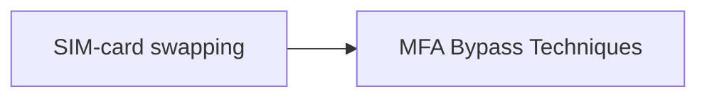

# SIM-card swapping

## Metadata

- **UUID**: `6a7a493a-511a-4c9d-aa9c-4427c832a322`
- **Schema**: `threat::1.0`
- **TLP**: clear

## Description
SIM swapping is a malicious technique where threat actors target mobile carriers to gain access to
users bank accounts, virtual currency accounts, and other sensitive information.
They primarily conduct SIM swap schemes using social engineering, insider threat, or phishing techniques.

Social engineering involves impersonating an user and tricking the mobile carrier into switching the
user's mobile number to a SIM card in the attackers' possession.

Attackers using insider threat to conduct SIM swap schemes pay off a mobile carrier employee to switch an
user's mobile number to a SIM card in the attackers' possession. They often use phishing techniques to
deceive employees into downloading malware used to hack mobile carrier systems that carry out SIM swaps.

Once the SIM is swapped, the user's calls, texts, and other data are diverted to the attackers' device.
This access allow the attackers to send 'Forgot Password' or 'Account Recovery' requests to the 
user's email and other online accounts associated with the user's mobile telephone number. 

Using SMS-based two-factor authentication, mobile application providers send a link or one-time passcode 
via text to the user's number, now owned by the attackers, to access accounts. The attacker uses the codes
to login and reset passwords, gaining control of online accounts associated with the user's phone profile.

## Techniques
- T1541

## Chaining

