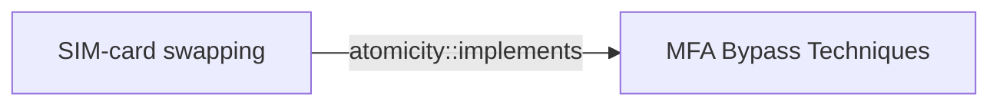

# SIM-card swapping

## Metadata

- **UUID**: `6a7a493a-511a-4c9d-aa9c-4427c832a322`
- **Schema**: `threat::1.0`
- **Version**: `1`
- **Created**: `2024-10-23`
- **Modified**: `2024-11-13`
- **TLP**: clear (`TLP:CLEAR`)
- **Organisation**: EC DIGIT CSOC (`56b0a0f0-b0bc-47d9-bb46-02f80ae2065a`)

## References
### Public
- **1**: [https://www.theguardian.com/money/2016/apr/16/sim-swap-fraud-mobile-banking-fraudsters](https://www.theguardian.com/money/2016/apr/16/sim-swap-fraud-mobile-banking-fraudsters)
- **2**: [https://www.vice.com/en/article/hackers-sim-swapping-steal-phone-numbers-instagram-bitcoin/](https://www.vice.com/en/article/hackers-sim-swapping-steal-phone-numbers-instagram-bitcoin/)
- **3**: [https://krebsonsecurity.com/2018/05/t-mobile-employee-made-unauthorized-sim-swap-to-steal-instagram-account/](https://krebsonsecurity.com/2018/05/t-mobile-employee-made-unauthorized-sim-swap-to-steal-instagram-account/)
- **4**: [https://techcrunch.com/2017/08/23/i-was-hacked/](https://techcrunch.com/2017/08/23/i-was-hacked/)

## Description
SIM swapping is a malicious technique where threat actors target mobile carriers to gain access to
users bank accounts, virtual currency accounts, and other sensitive information.
They primarily conduct SIM swap schemes using social engineering, insider threat, or phishing techniques.

Social engineering involves impersonating an user and tricking the mobile carrier into switching the
user's mobile number to a SIM card in the attackers' possession.

Attackers using insider threat to conduct SIM swap schemes pay off a mobile carrier employee to switch an
user's mobile number to a SIM card in the attackers' possession. They often use phishing techniques to
deceive employees into downloading malware used to hack mobile carrier systems that carry out SIM swaps.

Once the SIM is swapped, the user's calls, texts, and other data are diverted to the attackers' device.
This access allow the attackers to send 'Forgot Password' or 'Account Recovery' requests to the 
user's email and other online accounts associated with the user's mobile telephone number. 

Using SMS-based two-factor authentication, mobile application providers send a link or one-time passcode 
via text to the user's number, now owned by the attackers, to access accounts. The attacker uses the codes
to login and reset passwords, gaining control of online accounts associated with the user's phone profile.

## Criticality
**Medium** - A Medium priority incident may affect public health or safety, national security, economic security, foreign relations, civil liberties, or public confidence.

## Terrain
> **Attacker must convince the mobile network operator (e.g. through social networking, forged
identification, or insider attacks performed by trusted employees) to issue a new SIM card

Domains: Enterprise, Mobile, Public Cloud
Targets: Auth token, Cloud Portal, End-user, Helpdesk, Identity Services, Mobile phone
Platforms: Android, iOS**

## Threat Assessment
| Dimension | Assessment | Description |
| --- | --- | --- |
| Severity | Moderate incident | A cyber attack on a small organisation, or which poses a considerable risk to a medium-sized organisation, or preliminary indications of cyber activity against a large organisation or the government. |
| Impact | Identity Theft; Impairement | - |
| Leverage | Elevation of privilege; Spoofing | - |
| Viability | Roughly even chance | Roughly even odds - 45-55% |
| Kill Chain | Credential Access | Techniques resulting in the access of, or control over, system, service or domain credentials. |

## Actors
| Actor | ID | Source | Description |
| --- | --- | --- | --- |
| [[Enterprise] LAPSUS$](https://attack.mitre.org/groups/G1004) | `att&ck::G1004` | ('att&ck',) | [LAPSUS$](https://attack.mitre.org/groups/G1004) is cyber criminal threat group that has been active since at least mid-2021. [LAPSUS$](https://attack.mitre.org/groups/G1004) specializes in large-scale social engineering and extortion operations, including destructive attacks without the use of ransomware. The group has targeted organizations globally, including in the government, manufacturing, higher education, energy, healthcare, technology, telecommunications, and media sectors.(Citation: BBC LAPSUS Apr 2022)(Citation: MSTIC DEV-0537 Mar 2022)(Citation: UNIT 42 LAPSUS Mar 2022) |
| LAPSUS | `misp::d9e5be22-1a04-4956-af6c-37af02330980` | ('misp',) | An actor group conducting large-scale social engineering and extortion campaign against multiple organizations with some seeing evidence of destructive elements. |
| [[Enterprise] APT29](https://attack.mitre.org/groups/G0016) | `att&ck::G0016` | ('att&ck',) | [APT29](https://attack.mitre.org/groups/G0016) is threat group that has been attributed to Russia's Foreign Intelligence Service (SVR).(Citation: White House Imposing Costs RU Gov April 2021)(Citation: UK Gov Malign RIS Activity April 2021) They have operated since at least 2008, often targeting government networks in Europe and NATO member countries, research institutes, and think tanks. [APT29](https://attack.mitre.org/groups/G0016) reportedly compromised the Democratic National Committee starting in the summer of 2015.(Citation: F-Secure The Dukes)(Citation: GRIZZLY STEPPE JAR)(Citation: Crowdstrike DNC June 2016)(Citation: UK Gov UK Exposes Russia SolarWinds April 2021)  In April 2021, the US and UK governments attributed the [SolarWinds Compromise](https://attack.mitre.org/campaigns/C0024) to the SVR; public statements included citations to [APT29](https://attack.mitre.org/groups/G0016), Cozy Bear, and The Dukes.(Citation: NSA Joint Advisory SVR SolarWinds April 2021)(Citation: UK NSCS Russia SolarWinds April 2021) Industry reporting also referred to the actors involved in this campaign as UNC2452, NOBELIUM, StellarParticle, Dark Halo, and SolarStorm.(Citation: FireEye SUNBURST Backdoor December 2020)(Citation: MSTIC NOBELIUM Mar 2021)(Citation: CrowdStrike SUNSPOT Implant January 2021)(Citation: Volexity SolarWinds)(Citation: Cybersecurity Advisory SVR TTP May 2021)(Citation: Unit 42 SolarStorm December 2020) |
| UNC2452 | `misp::2ee5ed7a-c4d0-40be-a837-20817474a15b` | ('misp',) | Reporting regarding activity related to the SolarWinds supply chain injection has grown quickly since initial disclosure on 13 December 2020. A significant amount of press reporting has focused on the identification of the actor(s) involved, victim organizations, possible campaign timeline, and potential impact. The US Government and cyber community have also provided detailed information on how the campaign was likely conducted and some of the malware used.  MITRE’s ATT&CK team — with the assistance of contributors — has been mapping techniques used by the actor group, referred to as UNC2452/Dark Halo by FireEye and Volexity respectively, as well as SUNBURST and TEARDROP malware. |

## ATT&CK Techniques
| Technique | Name | Description |
| --- | --- | --- |
| `T1541` | [Mobile : Foreground Persistence](https://attack.mitre.org/techniques/T1541) | Adversaries may abuse Android's `startForeground()` API method to maintain continuous sensor access. Beginning in Android 9, idle applications running in the background no longer have access to device sensors, such as the camera, microphone, and gyroscope.(Citation: Android-SensorsOverview) Applications can retain sensor access by running in the foreground, using Android’s `startForeground()` API method. This informs the system that the user is actively interacting with the application, and it should not be killed. The only requirement to start a foreground service is showing a persistent notification to the user.(Citation: Android-ForegroundServices)  Malicious applications may abuse the `startForeground()` API method to continue running in the foreground, while presenting a notification to the user pretending to be a genuine application. This would allow unhindered access to the device’s sensors, assuming permission has been previously granted.(Citation: BlackHat Sutter Android Foreground 2019)  Malicious applications may also abuse the `startForeground()` API to inform the Android system that the user is actively interacting with the application, thus preventing it from being killed by the low memory killer.(Citation: TrendMicro-Yellow Camera) |

## Chaining

### Chaining details
#### implements -> MFA Bypass Techniques (`atomicity::implements`)
MFA bypass technique

- **Target UUID**: `4a807ac4-f764-41b1-ae6f-94239041d349`
