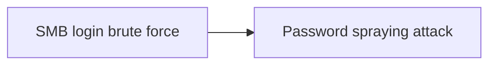

# SMB login brute force

## Metadata

- **UUID**: `fa4c66c6-a69b-4e16-84cb-7ad8c772af41`
- **Schema**: `threat::1.0`
- **TLP**: clear

## Description
SMB (Server Message Block) brute-force is a type of cyber attack where an
attacker attempts to guess the password for an SMB share by trying a large
number of possible passwords. The goal is to gain unauthorised access to
the SMB share, which can contain sensitive data, such as files, folders,
and other resources.

### Different methods and techniques used by the threat actors to brute-force an SMB share

- Dictionary attacks - a threat actor is using in this type of an attack a
list of common passwords, such as words, phrases, and combinations of
characters, to try and guess the password.
- Brute force attacks - a threat actor is trying all possible combinations
of characters, numbers, and special characters to guess the password.
- Password spraying - in this technique a threat actor uses a small number
of common passwords against a large number of usernames, in an attempt to
guess the password for at least one account.
- Hybrid attacks - combining dictionary and brute force attacks to try and
guess the password.
- Rainbow Table Attacks - this is a possible brute-force attack in which a
threat actor is using precomputed tables of hash values for common
passwords to try and guess the password.
- Exploiting weak passwords - a threat actor may identify and exploit weak
passwords, such as default passwords, easily guessable passwords, or
passwords that have not been changed in a long time.

They can use eumeration tools like nmap, smbclient, Metaspoit and others to
listen for an open SMB port and perform automated brute-forcing password
matches against an SMB share. 

### Automated script tools used for SMB brute-force attack

Threat actors may use different automated tools which have the capability
to use a wordlist and to try logon attemts to an SMB share. For example,
bat, batch, PowerShell or other type of scripts and tools based on these
scripts ref [3], [4], [5], [7].  

Examples:

- smbrute.bat              (uses `passlist.txt` wordlist) ref [3];
- Smb.bat script           (uses `Wordlist.txt` wordlist) ref [4];
- SMBLogin.ps1 script      for more information ref [5]. 
- smblogin-extra-mini.ps1  (uses .\smblogin.results.txt wordlist)
  Minimalistic offensive tool based on PowerShell ref [7].

### Metasploit auxiliary module brute-force SMB share

A threat actor can use a Metasploit auxiliary scanner module to brute force
the SMB credentials. In the example below `<user_file>.txt` is a set of
user's possible names and `<password_file>.txt` is a list of possible user's
password for brute-force attack ref [2].   

Example: 

```
> set RHOST <ip_address>
RHOST => <ip_address>
> set PORT 445
RPORT => 445
> set user_file ./<user_file>.txt
user_file => ./<user_file>.txt
> set password_file ./<password_file>.txt
password_file => ./<password_file>.txt

```
Metaspoit `run` command runs the auxiliary module and displays if there are
found successful brute-force credentials matches. 

```
msf5 auxilary(scanner/smb/smb_login) > run

```

## Techniques
- T1110
- T1110.001

## Chaining

