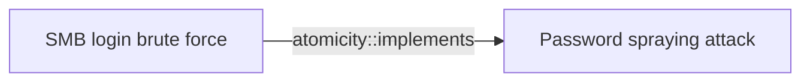

# SMB login brute force

## Metadata

- **UUID**: `fa4c66c6-a69b-4e16-84cb-7ad8c772af41`
- **Schema**: `threat::1.0`
- **Version**: `1`
- **Created**: `2025-07-21`
- **Modified**: `2025-08-07`
- **TLP**: clear (`TLP:CLEAR`)
- **Organisation**: EC DIGIT CSOC (`56b0a0f0-b0bc-47d9-bb46-02f80ae2065a`)

## References
### Public
- **1**: [https://0xma.github.io/hacking/brute_force_windows_server_metasploit.html](https://0xma.github.io/hacking/brute_force_windows_server_metasploit.html)
- **2**: [https://exploit-notes.hdks.org/exploit/windows/active-directory/smb-pentesting](https://exploit-notes.hdks.org/exploit/windows/active-directory/smb-pentesting)
- **3**: [https://github.com/MrUknownm/SMB-Bruteforce](https://github.com/MrUknownm/SMB-Bruteforce)
- **4**: [https://github.com/KunalPsycho100/Simple-SMB-Brute-Forcer](https://github.com/KunalPsycho100/Simple-SMB-Brute-Forcer)
- **5**: [https://www.infosecmatter.com/smb-brute-force-attack-tool-in-powershell-smblogin-ps1](https://www.infosecmatter.com/smb-brute-force-attack-tool-in-powershell-smblogin-ps1)
- **6**: [https://github.com/Liragbr/BruteForce1v](https://github.com/Liragbr/BruteForce1v)
- **7**: [https://github.com/InfosecMatter/Minimalistic-offensive-security-tools/blob/master/smblogin-extra-mini.ps1](https://github.com/InfosecMatter/Minimalistic-offensive-security-tools/blob/master/smblogin-extra-mini.ps1)

## Description
SMB (Server Message Block) brute-force is a type of cyber attack where an
attacker attempts to guess the password for an SMB share by trying a large
number of possible passwords. The goal is to gain unauthorised access to
the SMB share, which can contain sensitive data, such as files, folders,
and other resources.

### Different methods and techniques used by the threat actors to brute-force an SMB share

- Dictionary attacks - a threat actor is using in this type of an attack a
list of common passwords, such as words, phrases, and combinations of
characters, to try and guess the password.
- Brute force attacks - a threat actor is trying all possible combinations
of characters, numbers, and special characters to guess the password.
- Password spraying - in this technique a threat actor uses a small number
of common passwords against a large number of usernames, in an attempt to
guess the password for at least one account.
- Hybrid attacks - combining dictionary and brute force attacks to try and
guess the password.
- Rainbow Table Attacks - this is a possible brute-force attack in which a
threat actor is using precomputed tables of hash values for common
passwords to try and guess the password.
- Exploiting weak passwords - a threat actor may identify and exploit weak
passwords, such as default passwords, easily guessable passwords, or
passwords that have not been changed in a long time.

They can use eumeration tools like nmap, smbclient, Metaspoit and others to
listen for an open SMB port and perform automated brute-forcing password
matches against an SMB share. 

### Automated script tools used for SMB brute-force attack

Threat actors may use different automated tools which have the capability
to use a wordlist and to try logon attemts to an SMB share. For example,
bat, batch, PowerShell or other type of scripts and tools based on these
scripts ref [3], [4], [5], [7].  

Examples:

- smbrute.bat              (uses `passlist.txt` wordlist) ref [3];
- Smb.bat script           (uses `Wordlist.txt` wordlist) ref [4];
- SMBLogin.ps1 script      for more information ref [5]. 
- smblogin-extra-mini.ps1  (uses .\smblogin.results.txt wordlist)
  Minimalistic offensive tool based on PowerShell ref [7].

### Metasploit auxiliary module brute-force SMB share

A threat actor can use a Metasploit auxiliary scanner module to brute force
the SMB credentials. In the example below `<user_file>.txt` is a set of
user's possible names and `<password_file>.txt` is a list of possible user's
password for brute-force attack ref [2].   

Example: 

```
> set RHOST <ip_address>
RHOST => <ip_address>
> set PORT 445
RPORT => 445
> set user_file ./<user_file>.txt
user_file => ./<user_file>.txt
> set password_file ./<password_file>.txt
password_file => ./<password_file>.txt

```
Metaspoit `run` command runs the auxiliary module and displays if there are
found successful brute-force credentials matches. 

```
msf5 auxilary(scanner/smb/smb_login) > run

```

## Criticality
**Medium** - A Medium priority incident may affect public health or safety, national security, economic security, foreign relations, civil liberties, or public confidence.

## Terrain
> **A threat actor needs an access to a compromised host and availability to
try to connect to a SMB share.

Domains: Enterprise
Targets: Workstations, Remote access, Other, Laptop, Customer
Platforms: Windows**

## Threat Assessment
| Dimension | Assessment | Description |
| --- | --- | --- |
| Severity | Moderate incident | A cyber attack on a small organisation, or which poses a considerable risk to a medium-sized organisation, or preliminary indications of cyber activity against a large organisation or the government. |
| Impact | Data Breach; Impairement; Lose Capabilities; Reputational Damages | - |
| Leverage | Information Disclosure; Elevation of privilege; Infrastructure Compromise; Tampering; Denial of Service | - |
| Viability | Likely | Probable (probably) - 55-80% |
| Kill Chain | Credential Access | Techniques resulting in the access of, or control over, system, service or domain credentials. |

## Actors
| Actor | ID | Source | Description |
| --- | --- | --- | --- |
| [[Enterprise] APT41](https://attack.mitre.org/groups/G0096) | `att&ck::G0096` | ('att&ck',) | [APT41](https://attack.mitre.org/groups/G0096) is a threat group that researchers have assessed as Chinese state-sponsored espionage group that also conducts financially-motivated operations. Active since at least 2012, [APT41](https://attack.mitre.org/groups/G0096) has been observed targeting various industries, including but not limited to healthcare, telecom, technology, finance, education, retail and video game industries in 14 countries.(Citation: apt41_mandiant) Notable behaviors include using a wide range of malware and tools to complete mission objectives. [APT41](https://attack.mitre.org/groups/G0096) overlaps at least partially with public reporting on groups including BARIUM and [Winnti Group](https://attack.mitre.org/groups/G0044).(Citation: FireEye APT41 Aug 2019)(Citation: Group IB APT 41 June 2021) |
| APT41 | `misp::9c124874-042d-48cd-b72b-ccdc51ecbbd6` | ('misp',) | APT41 is a prolific cyber threat group that carries out Chinese state-sponsored espionage activity in addition to financially motivated activity potentially outside of state control. |

## ATT&CK Techniques
| Technique | Name | Description |
| --- | --- | --- |
| `T1110` | [Brute Force](https://attack.mitre.org/techniques/T1110) | Adversaries may use brute force techniques to gain access to accounts when passwords are unknown or when password hashes are obtained.(Citation: TrendMicro Pawn Storm Dec 2020) Without knowledge of the password for an account or set of accounts, an adversary may systematically guess the password using a repetitive or iterative mechanism.(Citation: Dragos Crashoverride 2018) Brute forcing passwords can take place via interaction with a service that will check the validity of those credentials or offline against previously acquired credential data, such as password hashes.  Brute forcing credentials may take place at various points during a breach. For example, adversaries may attempt to brute force access to [Valid Accounts](https://attack.mitre.org/techniques/T1078) within a victim environment leveraging knowledge gathered from other post-compromise behaviors such as [OS Credential Dumping](https://attack.mitre.org/techniques/T1003), [Account Discovery](https://attack.mitre.org/techniques/T1087), or [Password Policy Discovery](https://attack.mitre.org/techniques/T1201). Adversaries may also combine brute forcing activity with behaviors such as [External Remote Services](https://attack.mitre.org/techniques/T1133) as part of Initial Access. |
| `T1110.001` | [Brute Force: Password Guessing](https://attack.mitre.org/techniques/T1110/001) | Adversaries with no prior knowledge of legitimate credentials within the system or environment may guess passwords to attempt access to accounts. Without knowledge of the password for an account, an adversary may opt to systematically guess the password using a repetitive or iterative mechanism. An adversary may guess login credentials without prior knowledge of system or environment passwords during an operation by using a list of common passwords. Password guessing may or may not take into account the target's policies on password complexity or use policies that may lock accounts out after a number of failed attempts.  Guessing passwords can be a risky option because it could cause numerous authentication failures and account lockouts, depending on the organization's login failure policies. (Citation: Cylance Cleaver)  Typically, management services over commonly used ports are used when guessing passwords. Commonly targeted services include the following:  * SSH (22/TCP) * Telnet (23/TCP) * FTP (21/TCP) * NetBIOS / SMB / Samba (139/TCP & 445/TCP) * LDAP (389/TCP) * Kerberos (88/TCP) * RDP / Terminal Services (3389/TCP) * HTTP/HTTP Management Services (80/TCP & 443/TCP) * MSSQL (1433/TCP) * Oracle (1521/TCP) * MySQL (3306/TCP) * VNC (5900/TCP) * SNMP (161/UDP and 162/TCP/UDP)  In addition to management services, adversaries may "target single sign-on (SSO) and cloud-based applications utilizing federated authentication protocols," as well as externally facing email applications, such as Office 365.(Citation: US-CERT TA18-068A 2018). Further, adversaries may abuse network device interfaces (such as `wlanAPI`) to brute force accessible wifi-router(s) via wireless authentication protocols.(Citation: Trend Micro Emotet 2020)  In default environments, LDAP and Kerberos connection attempts are less likely to trigger events over SMB, which creates Windows "logon failure" event ID 4625. |

## Chaining

### Chaining details
#### implements -> Password spraying attack (`atomicity::implements`)
A password spraying technique can be used to bruteforce and compromise
an SMB share. Threat actors brute-force the credentials using a list of
common or expected passwords against a set of usernames.

- **Target UUID**: `cc546bbc-f71c-4538-934c-415d6adc293b`
