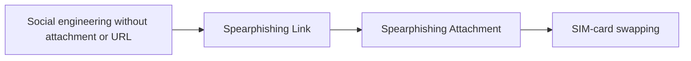

# Social engineering without attachment or URL

## Metadata

- **UUID**: `0cdaee96-8595-4f3f-ba07-758b8be9d359`
- **Schema**: `threat::1.0`
- **TLP**: clear

## Description
TOAD (Telephone-Oriented Attack Delivery) and BEC (Business Email Compromise) attacks 
are sophisticated forms of social engineering that pose significant threats to organizations. 
These attacks often bypass traditional email security measures by avoiding the use 
of malicious attachments or URLs.    

## TOAD Attacks    

TOAD attacks combine email and voice phishing techniques to trick victims into disclosing 
sensitive information or transferring funds.    

Key characteristics of TOAD attacks:    

- Initial contact via email, urging the recipient to call a phone number
- No malicious attachments or URLs in the email
- Social engineering tactics used during phone conversations
- Often impersonate legitimate brands or authority figures    

## BEC Attacks    

BEC attacks involve impersonating or compromising legitimate email accounts to deceive 
individuals into sharing sensitive information or transferring funds.    

Key characteristics of BEC attacks:    

- Highly targeted and personalized emails
- Often impersonate executives, vendors, or trusted partners
- Create a sense of urgency
- Rarely include malicious payloads
- Frequently target Accounts Payable teams

## Techniques
- T1589.001

## Chaining

