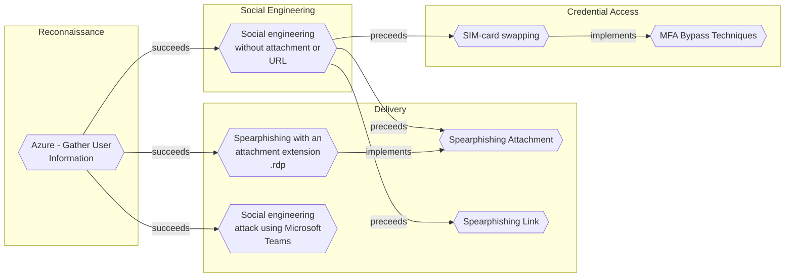

# Social engineering without attachment or URL

## Metadata
| Field | Value |
| --- | --- |
| UUID | `0cdaee96-8595-4f3f-ba07-758b8be9d359` |
| Schema | `threat::1.0` |
| Version | `2` |
| Created | `2024-10-31` |
| Modified | `2025-01-01` |
| TLP | clear (`TLP:CLEAR`) |
| Organisation | EC DIGIT CSOC (`56b0a0f0-b0bc-47d9-bb46-02f80ae2065a`) |

## References
### Public
- **1**: [https://www.proofpoint.com/us/blog/email-and-cloud-threats/actionable-insights-reduce-your-organizations-risk-toad-attack#:~:text=What%20is%20a%20TOAD%20attack%3F%20A%20TOAD%20attack,financial%20data%2C%20by%20impersonating%20a%20trusted%20authority%20figure](https://www.proofpoint.com/us/blog/email-and-cloud-threats/actionable-insights-reduce-your-organizations-risk-toad-attack#:~:text=What%20is%20a%20TOAD%20attack%3F%20A%20TOAD%20attack,financial%20data%2C%20by%20impersonating%20a%20trusted%20authority%20figure)
- **2**: [https://www.microsoft.com/en-us/security/business/security-101/what-is-business-email-compromise-bec](https://www.microsoft.com/en-us/security/business/security-101/what-is-business-email-compromise-bec)
- **3**: [https://www.fbi.gov/how-we-can-help-you/scams-and-safety/common-scams-and-crimes/business-email-compromise](https://www.fbi.gov/how-we-can-help-you/scams-and-safety/common-scams-and-crimes/business-email-compromise)

## Description
TOAD (Telephone-Oriented Attack Delivery) and BEC (Business Email Compromise) attacks 
are sophisticated forms of social engineering that pose significant threats to organizations. 
These attacks often bypass traditional email security measures by avoiding the use 
of malicious attachments or URLs.    

## TOAD Attacks    

TOAD attacks combine email and voice phishing techniques to trick victims into disclosing 
sensitive information or transferring funds.    

Key characteristics of TOAD attacks:    

- Initial contact via email, urging the recipient to call a phone number
- No malicious attachments or URLs in the email
- Social engineering tactics used during phone conversations
- Often impersonate legitimate brands or authority figures    

## BEC Attacks    

BEC attacks involve impersonating or compromising legitimate email accounts to deceive 
individuals into sharing sensitive information or transferring funds.    

Key characteristics of BEC attacks:    

- Highly targeted and personalized emails
- Often impersonate executives, vendors, or trusted partners
- Create a sense of urgency
- Rarely include malicious payloads
- Frequently target Accounts Payable teams

## Criticality
**High** - A High priority incident is likely to result in a demonstrable impact to public health or safety, national security, economic security, foreign relations, civil liberties, or public confidence.

## Terrain
Adversary must have access to legitimate email accounts or impersonate authority 
figures to trick victims into disclosing sensitive information or transferring funds.

## Surface
> **Mobile**
> Mobile operating systems (Android, iOS)

> **AWS**
> Amazon Web Services cloud platform

> **Azure**
> Microsoft Azure cloud platform

> **Microsoft::Microsoft 365**
> Microsoft 365 cloud-based productivity suite (formerly Office 365)

> **Windows**
> Microsoft Windows operating systems (all versions)

> **macOS**
> Apple macOS operating systems (all versions)

> **Mobile::Android**
> Google Android mobile operating system (all versions)

> **Mobile::iOS**
> Apple iOS mobile operating system (all versions)

> **Email**
> Email infrastructure and services

> **AWS::Storage**
> AWS storage services

## Threat Assessment
| Dimension | Assessment | Description |
| --- | --- | --- |
| Severity | Significant incident | A cyber attack which has a serious impact on a large organisation or on wider / local government, or which poses a considerable risk to central government or (inter)national essential services. |
| Impact | Data Breach Monetary Loss Reputational Damages Identity Theft | Non-public information has been accessed from the outside, and successfully extracted. The vector will directly conduct to loss of value directly impacting the bottom line. Damages to the organization public view may be achieved by using directly the access gained, or indirectly with data gathered. Acquisition of sufficient information and privileges to profess as a given individual, for the purpose of abusing and deceiving human trust relationships. |
| Leverage | Spoofing Tampering Information Disclosure Elevation of privilege Fraudulent transaction Infrastructure Compromise | Threat action aimed at accessing and use of another user’s credentials, such as username and password. Threat action intending to maliciously change or modify persistent data, such as records in a database, and the alteration of data in transit between two computers over an open network, such as the Internet. Threat action intending to read a file that one was not granted access to, or to read data in transit. Capacity to augment leverage over the target system by upgrading the compromised access rights Initiate fraudulent transaction The compromised target is likely to be used to further expand the sphere of influence of the attacker and allow more potent vectors to be executed. |
| Viability | Likely | Probable (probably) - 55-80% |
| Kill Chain | Social Engineering | Techniques aimed at the manipulation of people to perform unsafe actions. |

## Actors
| Actor | ID | Source | Description |
| --- | --- | --- | --- |
| [[Enterprise] APT38](https://attack.mitre.org/groups/G0082) | `att&ck::G0082` | ('att&ck',) | [APT38](https://attack.mitre.org/groups/G0082) is a North Korean state-sponsored threat group that specializes in financial cyber operations; it has been attributed to the Reconnaissance General Bureau.(Citation: CISA AA20-239A BeagleBoyz August 2020) Active since at least 2014, [APT38](https://attack.mitre.org/groups/G0082) has targeted banks, financial institutions, casinos, cryptocurrency exchanges, SWIFT system endpoints, and ATMs in at least 38 countries worldwide. Significant operations include the 2016 Bank of Bangladesh heist, during which [APT38](https://attack.mitre.org/groups/G0082) stole $81 million, as well as attacks against Bancomext (Citation: FireEye APT38 Oct 2018) and Banco de Chile (Citation: FireEye APT38 Oct 2018); some of their attacks have been destructive.(Citation: CISA AA20-239A BeagleBoyz August 2020)(Citation: FireEye APT38 Oct 2018)(Citation: DOJ North Korea Indictment Feb 2021)(Citation: Kaspersky Lazarus Under The Hood Blog 2017)  North Korean group definitions are known to have significant overlap, and some security researchers report all North Korean state-sponsored cyber activity under the name [Lazarus Group](https://attack.mitre.org/groups/G0032) instead of tracking clusters or subgroups. |
| Lazarus Group | `misp::68391641-859f-4a9a-9a1e-3e5cf71ec376` | ('misp',) | Since 2009, HIDDEN COBRA actors have leveraged their capabilities to target and compromise a range of victims; some intrusions have resulted in the exfiltration of data while others have been disruptive in nature. Commercial reporting has referred to this activity as Lazarus Group and Guardians of Peace. Tools and capabilities used by HIDDEN COBRA actors include DDoS botnets, keyloggers, remote access tools (RATs), and wiper malware. Variants of malware and tools used by HIDDEN COBRA actors include Destover, Duuzer, and Hangman. |

## ATT&CK Techniques
| Technique | Name | Description |
| --- | --- | --- |
| `T1589.001` | [Gather Victim Identity Information: Credentials](https://attack.mitre.org/techniques/T1589/001) | Adversaries may gather credentials that can be used during targeting. Account credentials gathered by adversaries may be those directly associated with the target victim organization or attempt to take advantage of the tendency for users to use the same passwords across personal and business accounts.  Adversaries may gather credentials from potential victims in various ways, such as direct elicitation via [Phishing for Information](https://attack.mitre.org/techniques/T1598). Adversaries may also compromise sites then add malicious content designed to collect website authentication cookies from visitors.(Citation: ATT ScanBox) (Citation: Register Deloitte)(Citation: Register Uber)(Citation: Detectify Slack Tokens)(Citation: Forbes GitHub Creds)(Citation: GitHub truffleHog)(Citation: GitHub Gitrob)(Citation: CNET Leaks) Where multi-factor authentication (MFA) based on out-of-band communications is in use, adversaries may compromise a service provider to gain access to MFA codes and one-time passwords (OTP).(Citation: Okta Scatter Swine 2022)  Credential information may also be exposed to adversaries via leaks to online or other accessible data sets (ex: [Search Engines](https://attack.mitre.org/techniques/T1593/002), breach dumps, code repositories, etc.). Adversaries may purchase credentials from dark web markets, such as Russian Market and 2easy, or through access to Telegram channels that distribute logs from infostealer malware.(Citation: Bleeping Computer 2easy 2021)(Citation: SecureWorks Infostealers 2023)(Citation: Bleeping Computer Stealer Logs 2023)  Gathering this information may reveal opportunities for other forms of reconnaissance (ex: [Search Open Websites/Domains](https://attack.mitre.org/techniques/T1593) or [Phishing for Information](https://attack.mitre.org/techniques/T1598)), establishing operational resources (ex: [Compromise Accounts](https://attack.mitre.org/techniques/T1586)), and/or initial access (ex: [External Remote Services](https://attack.mitre.org/techniques/T1133) or [Valid Accounts](https://attack.mitre.org/techniques/T1078)). |

## Chaining

### Chaining details
#### preceeds -> [Spearphishing Link](spearphishing-link.md) (`1a68b5eb-0112-424d-a21f-88dda0b6b8df`) (`sequence::preceeds`)
After an initial conversation over email, attacker sends the user a malicious link

- **Target UUID**: `1a68b5eb-0112-424d-a21f-88dda0b6b8df`
#### preceeds -> [Spearphishing Attachment](spearphishing-attachment.md) (`dd5d942c-bac4-4000-b9a6-ca4fef6cfb84`) (`sequence::preceeds`)
After an initial conversation over email, attacker sends the user a malicious attachment

- **Target UUID**: `dd5d942c-bac4-4000-b9a6-ca4fef6cfb84`
#### preceeds -> [SIM-card swapping](sim-card-swapping.md) (`6a7a493a-511a-4c9d-aa9c-4427c832a322`) (`sequence::preceeds`)
#After an initial conversation over email, attacker tricks the user pretending to be from IT Helpdesk to swap the SIM card

- **Target UUID**: `6a7a493a-511a-4c9d-aa9c-4427c832a322`
