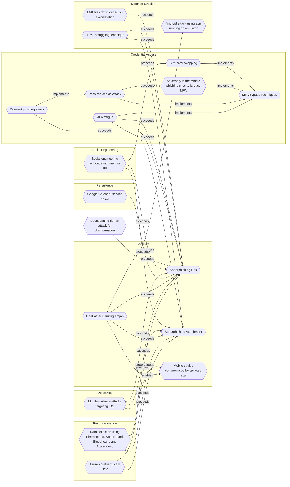

# Spearphishing Link

## Metadata
| Field | Value |
| --- | --- |
| UUID | `1a68b5eb-0112-424d-a21f-88dda0b6b8df` |
| Schema | `threat::1.0` |
| Version | `5` |
| Created | `2022-03-14` |
| Modified | `2025-10-01` |
| TLP | clear (`TLP:CLEAR`) |
| Organisation | EC DIGIT CSOC (`56b0a0f0-b0bc-47d9-bb46-02f80ae2065a`) |

## References
### Public
- **1**: [https://www.greathorn.com/blog/what-are-the-3-phases-of-the-phishing-attack-kill-chain/](https://www.greathorn.com/blog/what-are-the-3-phases-of-the-phishing-attack-kill-chain/)
- **2**: [https://www.zerofox.com/blog/anatomy-of-a-phishing-attack/](https://www.zerofox.com/blog/anatomy-of-a-phishing-attack/)
- **3**: [https://www.csoonline.com/article/3334617/what-is-spear-phishing-examples-tactics-and-techniques.html](https://www.csoonline.com/article/3334617/what-is-spear-phishing-examples-tactics-and-techniques.html)
- **4**: [https://www.aura.com/learn/phishing-email-examples](https://www.aura.com/learn/phishing-email-examples)
- **5**: [https://www.accessnow.org/russian-phishing-campaigns/](https://www.accessnow.org/russian-phishing-campaigns/)

## Description
Adversaries may send spearphishing emails with a malicious link in an
attempt to gain access to victim systems. This sub-technique employs
the use of links to download malware, instead of attaching malicious
files to the email itself to avoid defences that may inspect email
attachments.      

All forms of spearphishing are targeted at a specific individual or
company. Generally, the links will be accompanied by social engineering
text and require the user to actively click or copy and paste an URL into
a browser, leveraging user execution. The visited website may compromise
the web browser using an exploit, or the user will be prompted to download
applications, documents, zip files, or even executables depending on the
pretext for the email in the first place. Attackers may also include links
that are intended to interact directly with an email reader, including
embedded images intended to exploit the end system directly or verify
the receipt of an email (i.e. web bugs/web beacons).  

In this type of phishing a threat actor impersonates to appear as
a user's trusted contact like their colleague or other known friends.
Threat actors can also impersonate a large companies with trustworthy
image, brand and reputation to give the emails more believability and
reach. They put deceptive links in the email to entice a victim to
click on the link ref [4, 5].        

In some of the spearphishing campaigns, a threat actor named Webworm
was using GitHub malicious repositories and links to them to spread and
infect more developers and end-users. As GitHub is one of the top million
domains with a lot of visits and clicks the attacker's goal is to hide
in plain sight.   

#### AI-themed phishing campaigns

Adversaries create spearphishing links or sites that mimic AI
applications, which appear to offer legitimate AI tools, tricking
users into downloading and executing trojanised AI-themed software.
For example, this could lead to the installation of Gipy malware,
a strain of infostealer malware that steals sensitive information
and loads additional malicious software from GitHub, including
various types of information stealers and remote access trojans.  

#### Themed-documents lure campaigns 

Several reports mention that the threat actors prepare their campaign 
by using areas of activity and visual identity of companies or public 
administrations in contact with the targets in order to craft more 
deceiving and appealing emails to lure the targets. This preparation
aims to raise the successful rate of the phishing campaigns.  

Spearphishing emails prepared to deal with topics in the areas of an 
Union entity may decive more Union entity staff to follow the link.
ref [b].  

In one campaign it was observed that after direct exchanges over emails 
and whatsapp messages, the victim received an email having a specifically 
crafted politically oriented subject with a malicious link ref [e].    

#### Spearphishing via QR Codes (Quishing)
##### Description

Spearphishing via QR codes, also known as "quishing," is an emerging
cybersecurity threat where attackers use malicious QR codes to target
specific individuals or organizations. This technique combines the
deceptive nature of phishing with the convenience of QR codes to trick
victims into revealing sensitive information or compromising their
devices.  

##### **How Quishing Works**

1. Attackers generate a QR code that leads to a falsified website or
malicious content.
2. The malicious QR code is distributed through various channels, such as
emails, social media, or even physical locations.
3. Victims are lured into scanning the QR code, often under the guise of
accessing exclusive content or necessary information.
4. Upon scanning, users are directed to phishing websites or trigger the
download of malware.  

#### Spearphishing with enbedded HTML link
##### Description

Embedded HTML links in the context of spear phishing, refer
to malicious links that are embedded within an email or message
using HTML code. These links may appear legitimate from a trusted 
source or known organization but actually they mask their true
destionation. For example, they can be encoded or obfuscated
to hide their source destination.  

Example: 

In one of the reports was observed that clicking a malicious HTML
link redirected a victim first to malicious HubSpot Free Forms and then
to credential harvesting pages mimicking Microsoft Azure and Outlook Web
App (OWA) login portals ref [d].

## Criticality
**Medium** - A Medium priority incident may affect public health or safety, national security, economic security, foreign relations, civil liberties, or public confidence.

## Terrain
Spear phishing requires more preparation and time to achieve success than
a phishing attack. That is because spear-phishing attackers attempt to
obtain vast amounts of personal information about their victims,  
the entities their work for, or their areas of interest.  

Attackers can get the personal information they need using different ways:
to compromise an email or messaging system trough other means, to use OSINT,
scouring Social Media or glean personal information from the user's online
presence.

## Surface
> **Mobile**
> Mobile operating systems (Android, iOS)

> **Windows**
> Microsoft Windows operating systems (all versions)

> **Microsoft::Microsoft 365**
> Microsoft 365 cloud-based productivity suite (formerly Office 365)

> **Mobile::Android**
> Google Android mobile operating system (all versions)

> **Mobile::iOS**
> Apple iOS mobile operating system (all versions)

> **Code Repositories::GitHub**
> GitHub source code hosting and collaboration

> **Code Repositories::GitLab**
> GitLab DevOps lifecycle tool

> **Email**
> Email infrastructure and services

> **Windows::Desktop**
> Microsoft Windows desktop editions

## Threat Assessment
| Dimension | Assessment | Description |
| --- | --- | --- |
| Severity | Significant incident | A cyber attack which has a serious impact on a large organisation or on wider / local government, or which poses a considerable risk to central government or (inter)national essential services. |
| Impact | Reputational Damages Data Breach Identity Theft Business disruption Impairement Operating costs | Damages to the organization public view may be achieved by using directly the access gained, or indirectly with data gathered. Non-public information has been accessed from the outside, and successfully extracted. Acquisition of sufficient information and privileges to profess as a given individual, for the purpose of abusing and deceiving human trust relationships. Business disruption Incapacitation of a particular key system that will cause disruptions in day-to-day operations, and eventually service delivery. Increased operating costs |
| Leverage | Spoofing Software installation Elevation of privilege Information Disclosure Tampering Infrastructure Compromise | Threat action aimed at accessing and use of another user’s credentials, such as username and password. Software installation or code modification Capacity to augment leverage over the target system by upgrading the compromised access rights Threat action intending to read a file that one was not granted access to, or to read data in transit. Threat action intending to maliciously change or modify persistent data, such as records in a database, and the alteration of data in transit between two computers over an open network, such as the Internet. The compromised target is likely to be used to further expand the sphere of influence of the attacker and allow more potent vectors to be executed. |
| Viability | Very Likely | Highly probable - 80-95% |
| Kill Chain | Delivery | Techniques resulting in the transmission of a weaponized object to the targeted environment. |

## Actors
| Actor | ID | Source | Description |
| --- | --- | --- | --- |
| APT42 | `misp::35f887ad-6709-4d0b-8e9c-6b3fa09c783f` | ('misp',) | Iranian state-sponsored cyber espionage group tasked with conducting information collection and surveillance operations against individuals and organizations of strategic interest to the Iranian government. |

## ATT&CK Techniques
| Technique | Name | Description |
| --- | --- | --- |
| `T1566.002` | [Phishing: Spearphishing Link](https://attack.mitre.org/techniques/T1566/002) | Adversaries may send spearphishing emails with a malicious link in an attempt to gain access to victim systems. Spearphishing with a link is a specific variant of spearphishing. It is different from other forms of spearphishing in that it employs the use of links to download malware contained in email, instead of attaching malicious files to the email itself, to avoid defenses that may inspect email attachments. Spearphishing may also involve social engineering techniques, such as posing as a trusted source.  All forms of spearphishing are electronically delivered social engineering targeted at a specific individual, company, or industry. In this case, the malicious emails contain links. Generally, the links will be accompanied by social engineering text and require the user to actively click or copy and paste a URL into a browser, leveraging [User Execution](https://attack.mitre.org/techniques/T1204). The visited website may compromise the web browser using an exploit, or the user will be prompted to download applications, documents, zip files, or even executables depending on the pretext for the email in the first place.  Adversaries may also include links that are intended to interact directly with an email reader, including embedded images intended to exploit the end system directly. Additionally, adversaries may use seemingly benign links that abuse special characters to mimic legitimate websites (known as an "IDN homograph attack").(Citation: CISA IDN ST05-016) URLs may also be obfuscated by taking advantage of quirks in the URL schema, such as the acceptance of integer- or hexadecimal-based hostname formats and the automatic discarding of text before an “@” symbol: for example, `hxxp://google.com@1157586937`.(Citation: Mandiant URL Obfuscation 2023)  Adversaries may also utilize links to perform consent phishing, typically with OAuth 2.0 request URLs that when accepted by the user provide permissions/access for malicious applications, allowing adversaries to  [Steal Application Access Token](https://attack.mitre.org/techniques/T1528)s.(Citation: Trend Micro Pawn Storm OAuth 2017) These stolen access tokens allow the adversary to perform various actions on behalf of the user via API calls. (Citation: Microsoft OAuth 2.0 Consent Phishing 2021)  Adversaries may also utilize spearphishing links to [Steal Application Access Token](https://attack.mitre.org/techniques/T1528)s that grant immediate access to the victim environment. For example, a user may be lured through “consent phishing” into granting adversaries permissions/access via a malicious OAuth 2.0 request URL .(Citation: Trend Micro Pawn Storm OAuth 2017)(Citation: Microsoft OAuth 2.0 Consent Phishing 2021)  Similarly, malicious links may also target device-based authorization, such as OAuth 2.0 device authorization grant flow which is typically used to authenticate devices without UIs/browsers. Known as “device code phishing,” an adversary may send a link that directs the victim to a malicious authorization page where the user is tricked into entering a code/credentials that produces a device token.(Citation: SecureWorks Device Code Phishing 2021)(Citation: Netskope Device Code Phishing 2021)(Citation: Optiv Device Code Phishing 2021) |
| `T1036` | [Masquerading](https://attack.mitre.org/techniques/T1036) | Adversaries may attempt to manipulate features of their artifacts to make them appear legitimate or benign to users and/or security tools. Masquerading occurs when the name or location of an object, legitimate or malicious, is manipulated or abused for the sake of evading defenses and observation. This may include manipulating file metadata, tricking users into misidentifying the file type, and giving legitimate task or service names.  Renaming abusable system utilities to evade security monitoring is also a form of [Masquerading](https://attack.mitre.org/techniques/T1036).(Citation: LOLBAS Main Site) |
| `T1656` | [Impersonation](https://attack.mitre.org/techniques/T1656) | Adversaries may impersonate a trusted person or organization in order to persuade and trick a target into performing some action on their behalf. For example, adversaries may communicate with victims (via [Phishing for Information](https://attack.mitre.org/techniques/T1598), [Phishing](https://attack.mitre.org/techniques/T1566), or [Internal Spearphishing](https://attack.mitre.org/techniques/T1534)) while impersonating a known sender such as an executive, colleague, or third-party vendor. Established trust can then be leveraged to accomplish an adversary’s ultimate goals, possibly against multiple victims.    In many cases of business email compromise or email fraud campaigns, adversaries use impersonation to defraud victims -- deceiving them into sending money or divulging information that ultimately enables [Financial Theft](https://attack.mitre.org/techniques/T1657).  Adversaries will often also use social engineering techniques such as manipulative and persuasive language in email subject lines and body text such as `payment`, `request`, or `urgent` to push the victim to act quickly before malicious activity is detected. These campaigns are often specifically targeted against people who, due to job roles and/or accesses, can carry out the adversary’s goal.      Impersonation is typically preceded by reconnaissance techniques such as [Gather Victim Identity Information](https://attack.mitre.org/techniques/T1589) and [Gather Victim Org Information](https://attack.mitre.org/techniques/T1591) as well as acquiring infrastructure such as email domains (i.e. [Domains](https://attack.mitre.org/techniques/T1583/001)) to substantiate their false identity.(Citation: CrowdStrike-BEC)   There is the potential for multiple victims in campaigns involving impersonation. For example, an adversary may [Compromise Accounts](https://attack.mitre.org/techniques/T1586) targeting one organization which can then be used to support impersonation against other entities.(Citation: VEC) |

## Chaining

