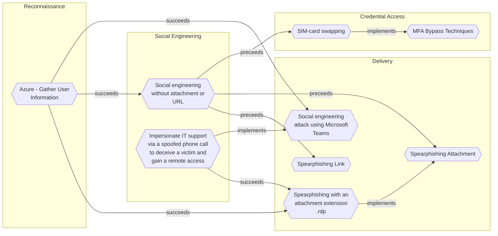

# Spearphishing with an attachment extension .rdp

## Metadata
| Field | Value |
| --- | --- |
| UUID | `58b98d75-fc63-4662-8908-a2a7f4200902` |
| Schema | `threat::1.0` |
| Version | `1` |
| Created | `2024-11-05` |
| Modified | `2024-11-08` |
| TLP | clear (`TLP:CLEAR`) |
| Organisation | EC DIGIT CSOC (`56b0a0f0-b0bc-47d9-bb46-02f80ae2065a`) |

## References
### Public
- **1**: [https://www.cisa.gov/news-events/alerts/2024/10/31/foreign-threat-actor-conducting-large-scale-spear-phishing-campaign-rdp-attachments](https://www.cisa.gov/news-events/alerts/2024/10/31/foreign-threat-actor-conducting-large-scale-spear-phishing-campaign-rdp-attachments)
- **2**: [https://www.microsoft.com/en-us/security/blog/2024/10/29/midnight-blizzard-conducts-large-scale-spear-phishing-campaign-using-rdp-files/?msockid=1a6270d8030166642bf964f6024a6789](https://www.microsoft.com/en-us/security/blog/2024/10/29/midnight-blizzard-conducts-large-scale-spear-phishing-campaign-using-rdp-files/?msockid=1a6270d8030166642bf964f6024a6789)
- **3**: [https://atwork.safeonweb.be/recent-news-tips-and-warning/warning-government-themed-phishing-rdp-attachments](https://atwork.safeonweb.be/recent-news-tips-and-warning/warning-government-themed-phishing-rdp-attachments)

## Description
Spearphishing with an attachment extension .rdp refers to a targeted
cyberattack where a malicious actor sends an email containing a file
with the file extension .RDP (Remote Desktop Protocol) to a specific
individual or organization. The attacker may send an attachment to
the end-users directly or by impersonating companies, institutions
or particular individuals, sending the lure on behalf of them
ref [1, 2].       

On October 22, 2024, the National Cyber Security Centers (NCSC) of two
EU countries, as well as governmental organizations [3] reported that
a spear-phishing campaign with .RDP attachment are impersonating their
entities.      

The emails were highly targeted, using social engineering lures relating
to Microsoft, Amazon Web Services (AWS), and the concept of Zero Trust.
The emails contained a Remote Desktop Protocol (RDP) configuration file
signed with a LetsEncrypt certificate. RDP configuration (.RDP) files
summarize automatic settings and resource mappings that are established
when a successful connection to an RDP server occurs ref [1].       

This allows the adversary to potentially deploy additional payloads,
execute local reconnaissance activities, and to redirect targeted users
to credential harvesting sites.

## Criticality
**High** - A High priority incident is likely to result in a demonstrable impact to public health or safety, national security, economic security, foreign relations, civil liberties, or public confidence.

## Terrain
A threat actor relies on an email attachment lure.
In this case a malicious file is masquerading as a RDP file
in an attempt to deceive a victim about their identity and
true nature of the file. The spear-phishing attachment provides
a threat actor an initial access to the system.

## Surface
> **Windows**
> Microsoft Windows operating systems (all versions)

> **AWS**
> Amazon Web Services cloud platform

> **Windows::Desktop**
> Microsoft Windows desktop editions

> **Email**
> Email infrastructure and services

> **Customer Support**
> Customer support and helpdesk platforms

> **Remote Access**
> Remote access solutions (non-VPN)

## Threat Assessment
| Dimension | Assessment | Description |
| --- | --- | --- |
| Severity | Localised incident | A cyber attack on an individual, or preliminary indications of cyber activity against a small or medium-sized organisation. |
| Impact | Identity Theft Impairement Business disruption | Acquisition of sufficient information and privileges to profess as a given individual, for the purpose of abusing and deceiving human trust relationships. Incapacitation of a particular key system that will cause disruptions in day-to-day operations, and eventually service delivery. Business disruption |
| Leverage | Dwelling Tampering Elevation of privilege Infrastructure Compromise | Active or passive extended presence in the target, which performs adversarial operations continuously. Threat action intending to maliciously change or modify persistent data, such as records in a database, and the alteration of data in transit between two computers over an open network, such as the Internet. Capacity to augment leverage over the target system by upgrading the compromised access rights The compromised target is likely to be used to further expand the sphere of influence of the attacker and allow more potent vectors to be executed. |
| Viability | Likely | Probable (probably) - 55-80% |
| Kill Chain | Delivery | Techniques resulting in the transmission of a weaponized object to the targeted environment. |

## Actors
| Actor | ID | Source | Description |
| --- | --- | --- | --- |
| [[Enterprise] APT29](https://attack.mitre.org/groups/G0016) | `att&ck::G0016` | ('att&ck',) | [APT29](https://attack.mitre.org/groups/G0016) is threat group that has been attributed to Russia's Foreign Intelligence Service (SVR).(Citation: White House Imposing Costs RU Gov April 2021)(Citation: UK Gov Malign RIS Activity April 2021) They have operated since at least 2008, often targeting government networks in Europe and NATO member countries, research institutes, and think tanks. [APT29](https://attack.mitre.org/groups/G0016) reportedly compromised the Democratic National Committee starting in the summer of 2015.(Citation: F-Secure The Dukes)(Citation: GRIZZLY STEPPE JAR)(Citation: Crowdstrike DNC June 2016)(Citation: UK Gov UK Exposes Russia SolarWinds April 2021)  In April 2021, the US and UK governments attributed the [SolarWinds Compromise](https://attack.mitre.org/campaigns/C0024) to the SVR; public statements included citations to [APT29](https://attack.mitre.org/groups/G0016), Cozy Bear, and The Dukes.(Citation: NSA Joint Advisory SVR SolarWinds April 2021)(Citation: UK NSCS Russia SolarWinds April 2021) Industry reporting also referred to the actors involved in this campaign as UNC2452, NOBELIUM, StellarParticle, Dark Halo, and SolarStorm.(Citation: FireEye SUNBURST Backdoor December 2020)(Citation: MSTIC NOBELIUM Mar 2021)(Citation: CrowdStrike SUNSPOT Implant January 2021)(Citation: Volexity SolarWinds)(Citation: Cybersecurity Advisory SVR TTP May 2021)(Citation: Unit 42 SolarStorm December 2020) |
| UNC2452 | `misp::2ee5ed7a-c4d0-40be-a837-20817474a15b` | ('misp',) | Reporting regarding activity related to the SolarWinds supply chain injection has grown quickly since initial disclosure on 13 December 2020. A significant amount of press reporting has focused on the identification of the actor(s) involved, victim organizations, possible campaign timeline, and potential impact. The US Government and cyber community have also provided detailed information on how the campaign was likely conducted and some of the malware used.  MITRE’s ATT&CK team — with the assistance of contributors — has been mapping techniques used by the actor group, referred to as UNC2452/Dark Halo by FireEye and Volexity respectively, as well as SUNBURST and TEARDROP malware. |

## ATT&CK Techniques
| Technique | Name | Description |
| --- | --- | --- |
| `T1566.001` | [Phishing: Spearphishing Attachment](https://attack.mitre.org/techniques/T1566/001) | Adversaries may send spearphishing emails with a malicious attachment in an attempt to gain access to victim systems. Spearphishing attachment is a specific variant of spearphishing. Spearphishing attachment is different from other forms of spearphishing in that it employs the use of malware attached to an email. All forms of spearphishing are electronically delivered social engineering targeted at a specific individual, company, or industry. In this scenario, adversaries attach a file to the spearphishing email and usually rely upon [User Execution](https://attack.mitre.org/techniques/T1204) to gain execution.(Citation: Unit 42 DarkHydrus July 2018) Spearphishing may also involve social engineering techniques, such as posing as a trusted source.  There are many options for the attachment such as Microsoft Office documents, executables, PDFs, or archived files. Upon opening the attachment (and potentially clicking past protections), the adversary's payload exploits a vulnerability or directly executes on the user's system. The text of the spearphishing email usually tries to give a plausible reason why the file should be opened, and may explain how to bypass system protections in order to do so. The email may also contain instructions on how to decrypt an attachment, such as a zip file password, in order to evade email boundary defenses. Adversaries frequently manipulate file extensions and icons in order to make attached executables appear to be document files, or files exploiting one application appear to be a file for a different one. |
| `T1204.002` | [User Execution: Malicious File](https://attack.mitre.org/techniques/T1204/002) | An adversary may rely upon a user opening a malicious file in order to gain execution. Users may be subjected to social engineering to get them to open a file that will lead to code execution. This user action will typically be observed as follow-on behavior from [Spearphishing Attachment](https://attack.mitre.org/techniques/T1566/001). Adversaries may use several types of files that require a user to execute them, including .doc, .pdf, .xls, .rtf, .scr, .exe, .lnk, .pif, .cpl, and .reg.  Adversaries may employ various forms of [Masquerading](https://attack.mitre.org/techniques/T1036) and [Obfuscated Files or Information](https://attack.mitre.org/techniques/T1027) to increase the likelihood that a user will open and successfully execute a malicious file. These methods may include using a familiar naming convention and/or password protecting the file and supplying instructions to a user on how to open it.(Citation: Password Protected Word Docs)   While [Malicious File](https://attack.mitre.org/techniques/T1204/002) frequently occurs shortly after Initial Access it may occur at other phases of an intrusion, such as when an adversary places a file in a shared directory or on a user's desktop hoping that a user will click on it. This activity may also be seen shortly after [Internal Spearphishing](https://attack.mitre.org/techniques/T1534). |
| `T1036` | [Masquerading](https://attack.mitre.org/techniques/T1036) | Adversaries may attempt to manipulate features of their artifacts to make them appear legitimate or benign to users and/or security tools. Masquerading occurs when the name or location of an object, legitimate or malicious, is manipulated or abused for the sake of evading defenses and observation. This may include manipulating file metadata, tricking users into misidentifying the file type, and giving legitimate task or service names.  Renaming abusable system utilities to evade security monitoring is also a form of [Masquerading](https://attack.mitre.org/techniques/T1036).(Citation: LOLBAS Main Site) |

## Chaining

### Chaining details
#### implements -> [Spearphishing Attachment](spearphishing-attachment.md) (`dd5d942c-bac4-4000-b9a6-ca4fef6cfb84`) (`atomicity::implements`)
Spearphishing with an attachment extension .rdp is a sub-category
of spearphishing method with attachment.

- **Target UUID**: `dd5d942c-bac4-4000-b9a6-ca4fef6cfb84`
