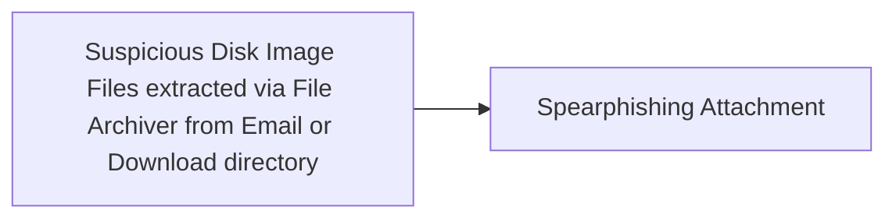

# Suspicious Disk Image Files extracted via File Archiver from Email or Download directory

## Metadata

- **UUID**: `ebdf49a9-52cb-43a5-8849-8110765f4fe1`
- **Schema**: `threat::1.0`
- **TLP**: clear

## Description
Disk image files, such as ISO or IMG files, are being used more lately in malware 
distribution through phishing emails or malicious download links. 
This works because, as part of their nature, disk image files bypass some email 
security filters and may not be automatically viewed as threats to the users 
or security applications. This is traditionally a technique that has been used 
by a number of threat actors. One common example in this regard is when 
spearphishing emails have attached disk image files masquerading as some sort 
of legitimate document or even software updates. Once a user opens the attached 
disk image file, it mounts as a virtual drive on his system. The user may 
then be tricked into running a malicious payload inside, such as a 
shortcut file (.lnk) or an executable with its icon cloaked to appear familiar. 
Users are prone to feel secure when they select files with familiar types 
and might not see the danger in mounting and opening disk images coming 
from unverified sources.

## Techniques
- T0865
- T1204.002
- T1059

## Chaining

