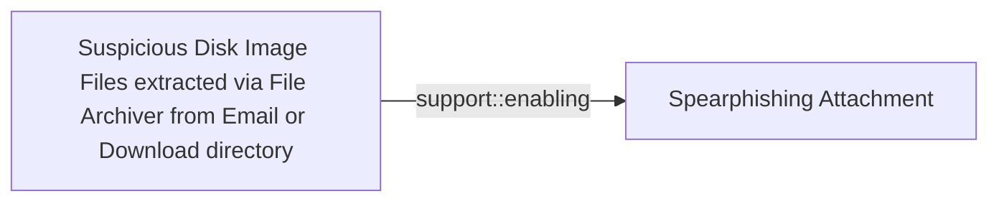

# Suspicious Disk Image Files extracted via File Archiver from Email or Download directory

## Metadata

- **UUID**: `ebdf49a9-52cb-43a5-8849-8110765f4fe1`
- **Schema**: `threat::1.0`
- **Version**: `1`
- **Created**: `2024-10-22`
- **Modified**: `2024-10-22`
- **TLP**: clear (`TLP:CLEAR`)
- **Organisation**: EC DIGIT CSOC (`56b0a0f0-b0bc-47d9-bb46-02f80ae2065a`)

## References
### Public
- **1**: [https://trendmicro.com/vinfo/us/security/news/cybercrime-and-digital-threats/malicious-spam-campaign-uses-iso-image-files-to-deliver-lokibot-and-nanocore](https://trendmicro.com/vinfo/us/security/news/cybercrime-and-digital-threats/malicious-spam-campaign-uses-iso-image-files-to-deliver-lokibot-and-nanocore)
- **2**: [https://thedfirreport.com/2023/04/03/malicious-iso-file-leads-to-domain-wide-ransomware/](https://thedfirreport.com/2023/04/03/malicious-iso-file-leads-to-domain-wide-ransomware/)
- **3**: [https://www.esentire.com/blog/suspected-asyncrat-delivered-via-iso-files-using-html-smuggling-technique](https://www.esentire.com/blog/suspected-asyncrat-delivered-via-iso-files-using-html-smuggling-technique)

## Description
Disk image files, such as ISO or IMG files, are being used more lately in malware 
distribution through phishing emails or malicious download links. 
This works because, as part of their nature, disk image files bypass some email 
security filters and may not be automatically viewed as threats to the users 
or security applications. This is traditionally a technique that has been used 
by a number of threat actors. One common example in this regard is when 
spearphishing emails have attached disk image files masquerading as some sort 
of legitimate document or even software updates. Once a user opens the attached 
disk image file, it mounts as a virtual drive on his system. The user may 
then be tricked into running a malicious payload inside, such as a 
shortcut file (.lnk) or an executable with its icon cloaked to appear familiar. 
Users are prone to feel secure when they select files with familiar types 
and might not see the danger in mounting and opening disk images coming 
from unverified sources.

## Criticality
**Medium** - A Medium priority incident may affect public health or safety, national security, economic security, foreign relations, civil liberties, or public confidence.

## Terrain
> **Adversary requires the user to open the disk image file and execute the malicious content within, 
potentially bypassing security warnings.

Domains: Enterprise
Targets: Desktop, Email Platform, Laptop, Personal Information, Workstations
Platforms: macOS, Linux, Windows**

## Threat Assessment
| Dimension | Assessment | Description |
| --- | --- | --- |
| Severity | Significant incident | A cyber attack which has a serious impact on a large organisation or on wider / local government, or which poses a considerable risk to central government or (inter)national essential services. |
| Impact | Data Breach; Identity Theft | - |
| Leverage | Information Disclosure; Software installation; Spoofing; Tampering | - |
| Viability | Likely | Probable (probably) - 55-80% |
| Kill Chain | Execution | Techniques that result in execution of attacker-controlled code on a local or remote system. |

## Actors
| Actor | ID | Source | Description |
| --- | --- | --- | --- |
| [[Enterprise] APT29](https://attack.mitre.org/groups/G0016) | `att&ck::G0016` | ('att&ck',) | [APT29](https://attack.mitre.org/groups/G0016) is threat group that has been attributed to Russia's Foreign Intelligence Service (SVR).(Citation: White House Imposing Costs RU Gov April 2021)(Citation: UK Gov Malign RIS Activity April 2021) They have operated since at least 2008, often targeting government networks in Europe and NATO member countries, research institutes, and think tanks. [APT29](https://attack.mitre.org/groups/G0016) reportedly compromised the Democratic National Committee starting in the summer of 2015.(Citation: F-Secure The Dukes)(Citation: GRIZZLY STEPPE JAR)(Citation: Crowdstrike DNC June 2016)(Citation: UK Gov UK Exposes Russia SolarWinds April 2021)  In April 2021, the US and UK governments attributed the [SolarWinds Compromise](https://attack.mitre.org/campaigns/C0024) to the SVR; public statements included citations to [APT29](https://attack.mitre.org/groups/G0016), Cozy Bear, and The Dukes.(Citation: NSA Joint Advisory SVR SolarWinds April 2021)(Citation: UK NSCS Russia SolarWinds April 2021) Industry reporting also referred to the actors involved in this campaign as UNC2452, NOBELIUM, StellarParticle, Dark Halo, and SolarStorm.(Citation: FireEye SUNBURST Backdoor December 2020)(Citation: MSTIC NOBELIUM Mar 2021)(Citation: CrowdStrike SUNSPOT Implant January 2021)(Citation: Volexity SolarWinds)(Citation: Cybersecurity Advisory SVR TTP May 2021)(Citation: Unit 42 SolarStorm December 2020) |
| UNC2452 | `misp::2ee5ed7a-c4d0-40be-a837-20817474a15b` | ('misp',) | Reporting regarding activity related to the SolarWinds supply chain injection has grown quickly since initial disclosure on 13 December 2020. A significant amount of press reporting has focused on the identification of the actor(s) involved, victim organizations, possible campaign timeline, and potential impact. The US Government and cyber community have also provided detailed information on how the campaign was likely conducted and some of the malware used.  MITRE’s ATT&CK team — with the assistance of contributors — has been mapping techniques used by the actor group, referred to as UNC2452/Dark Halo by FireEye and Volexity respectively, as well as SUNBURST and TEARDROP malware. |
| [[Enterprise] Wizard Spider](https://attack.mitre.org/groups/G0102) | `att&ck::G0102` | ('att&ck',) | [Wizard Spider](https://attack.mitre.org/groups/G0102) is a Russia-based financially motivated threat group originally known for the creation and deployment of [TrickBot](https://attack.mitre.org/software/S0266) since at least 2016. [Wizard Spider](https://attack.mitre.org/groups/G0102) possesses a diverse arsenal of tools and has conducted ransomware campaigns against a variety of organizations, ranging from major corporations to hospitals.(Citation: CrowdStrike Ryuk January 2019)(Citation: DHS/CISA Ransomware Targeting Healthcare October 2020)(Citation: CrowdStrike Wizard Spider October 2020) |
| UNC1878 | `misp::3c2bb7d7-a085-4594-adc7-4a20cf724abb` | ('misp',) | UNC1878 is a financially motivated threat actor that monetizes network access via the deployment of RYUK ransomware. Earlier this year, Mandiant published a blog on a fast-moving adversary deploying RYUK ransomware, UNC1878. Shortly after its release, there was a significant decrease in observed UNC1878 intrusions and RYUK activity overall almost completely vanishing over the summer. But beginning in early fall, Mandiant has seen a resurgence of RYUK along with TTP overlaps indicating that UNC1878 has returned from the grave and resumed their operations. |
| [[Enterprise] TA505](https://attack.mitre.org/groups/G0092) | `att&ck::G0092` | ('att&ck',) | [TA505](https://attack.mitre.org/groups/G0092) is a cyber criminal group that has been active since at least 2014. [TA505](https://attack.mitre.org/groups/G0092) is known for frequently changing malware, driving global trends in criminal malware distribution, and ransomware campaigns involving [Clop](https://attack.mitre.org/software/S0611).(Citation: Proofpoint TA505 Sep 2017)(Citation: Proofpoint TA505 June 2018)(Citation: Proofpoint TA505 Jan 2019)(Citation: NCC Group TA505)(Citation: Korean FSI TA505 2020) |
| TA505 | `misp::03c80674-35f8-4fe0-be2b-226ed0fcd69f` | ('misp',) | TA505, the name given by Proofpoint, has been in the cybercrime business for at least four years. This is the group behind the infamous Dridex banking trojan and Locky ransomware, delivered through malicious email campaigns via Necurs botnet. Other malware associated with TA505 include Philadelphia and GlobeImposter ransomware families. |

## ATT&CK Techniques
| Technique | Name | Description |
| --- | --- | --- |
| `T0865` | [Industrial : Spearphishing Attachment](https://attack.mitre.org/techniques/T0865) | Adversaries may use a spearphishing attachment, a variant of spearphishing, as a form of a social engineering attack against specific targets. Spearphishing attachments are different from other forms of spearphishing in that they employ malware attached to an email. All forms of spearphishing are electronically delivered and target a specific individual, company, or industry. In this scenario, adversaries attach a file to the spearphishing email and usually rely upon [User Execution](https://attack.mitre.org/techniques/T0863) to gain execution and access. (Citation: Enterprise ATT&CK October 2019)   A Chinese spearphishing campaign running from December 9, 2011 through February 29, 2012, targeted ONG organizations and their employees. The emails were constructed with a high level of sophistication to convince employees to open the malicious file attachments. (Citation: CISA AA21-201A Pipeline Intrusion July 2021) |
| `T1204.002` | [User Execution: Malicious File](https://attack.mitre.org/techniques/T1204/002) | An adversary may rely upon a user opening a malicious file in order to gain execution. Users may be subjected to social engineering to get them to open a file that will lead to code execution. This user action will typically be observed as follow-on behavior from [Spearphishing Attachment](https://attack.mitre.org/techniques/T1566/001). Adversaries may use several types of files that require a user to execute them, including .doc, .pdf, .xls, .rtf, .scr, .exe, .lnk, .pif, .cpl, and .reg.  Adversaries may employ various forms of [Masquerading](https://attack.mitre.org/techniques/T1036) and [Obfuscated Files or Information](https://attack.mitre.org/techniques/T1027) to increase the likelihood that a user will open and successfully execute a malicious file. These methods may include using a familiar naming convention and/or password protecting the file and supplying instructions to a user on how to open it.(Citation: Password Protected Word Docs)   While [Malicious File](https://attack.mitre.org/techniques/T1204/002) frequently occurs shortly after Initial Access it may occur at other phases of an intrusion, such as when an adversary places a file in a shared directory or on a user's desktop hoping that a user will click on it. This activity may also be seen shortly after [Internal Spearphishing](https://attack.mitre.org/techniques/T1534). |
| `T1059` | [Command and Scripting Interpreter](https://attack.mitre.org/techniques/T1059) | Adversaries may abuse command and script interpreters to execute commands, scripts, or binaries. These interfaces and languages provide ways of interacting with computer systems and are a common feature across many different platforms. Most systems come with some built-in command-line interface and scripting capabilities, for example, macOS and Linux distributions include some flavor of [Unix Shell](https://attack.mitre.org/techniques/T1059/004) while Windows installations include the [Windows Command Shell](https://attack.mitre.org/techniques/T1059/003) and [PowerShell](https://attack.mitre.org/techniques/T1059/001).  There are also cross-platform interpreters such as [Python](https://attack.mitre.org/techniques/T1059/006), as well as those commonly associated with client applications such as [JavaScript](https://attack.mitre.org/techniques/T1059/007) and [Visual Basic](https://attack.mitre.org/techniques/T1059/005).  Adversaries may abuse these technologies in various ways as a means of executing arbitrary commands. Commands and scripts can be embedded in [Initial Access](https://attack.mitre.org/tactics/TA0001) payloads delivered to victims as lure documents or as secondary payloads downloaded from an existing C2. Adversaries may also execute commands through interactive terminals/shells, as well as utilize various [Remote Services](https://attack.mitre.org/techniques/T1021) in order to achieve remote Execution.(Citation: Powershell Remote Commands)(Citation: Cisco IOS Software Integrity Assurance - Command History)(Citation: Remote Shell Execution in Python) |

## Chaining

### Chaining details
#### enabling -> Spearphishing Attachment (`support::enabling`)
Email Attachment may contains these kind of file such as archive file
that user enable by decompresing it.

- **Target UUID**: `dd5d942c-bac4-4000-b9a6-ca4fef6cfb84`
