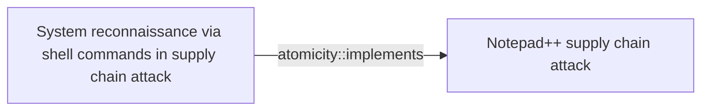
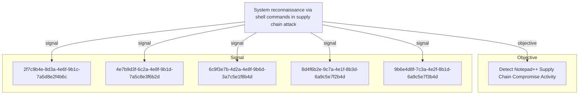

# System reconnaissance via shell commands in supply chain attack

## Metadata

- **UUID**: `bee6e973-b0d0-4735-a26a-003f39b8c08d`
- **Schema**: `threat::1.0`
- **Version**: `1`
- **Created**: `2026-02-09`
- **Modified**: `2026-02-09`
- **TLP**: clear (`TLP:CLEAR`)
- **Organisation**: EC DIGIT CSOC (`56b0a0f0-b0bc-47d9-bb46-02f80ae2065a`)

## References
### Public
- **1**: [https://securelist.com/notepad-supply-chain-attack/115382/](https://securelist.com/notepad-supply-chain-attack/115382/)
- **2**: [https://community.notepad-plus-plus.org/user/soft-parsley](https://community.notepad-plus-plus.org/user/soft-parsley)

## Description
## Executive Summary

In the Notepad++ supply chain attack investigation, Kaspersky's KEDR Expert detection 
system identified systematic reconnaissance activities performed by threat actors 
immediately after successful compromise. These activities consisted of chained Windows 
command-line utilities executed to gather comprehensive system information, with 
results redirected to text files for exfiltration or later analysis.

## Attack Pattern

The reconnaissance activity follows a consistent pattern across both identified 
infection chains, indicating a standardized post-exploitation playbook:

### Chain #1 Reconnaissance (July-August 2025)

**Working Directory**: `%appdata%\ProShow`

**Command Executed**:
```
cmd /c whoami&&tasklist > 1.txt
```

This command combination:
- Identifies the current user context (whoami)
- Enumerates all running processes (tasklist)
- Redirects output to `1.txt` in the ProShow directory

### Chain #2 Reconnaissance (September-October 2025)

**Working Directory**: `%APPDATA%\Adobe\Scripts`

The second chain demonstrates more comprehensive reconnaissance using two approaches:

#### Approach A - Single Chained Command:
```
cmd /c "whoami&&tasklist&&systeminfo&&netstat -ano" > a.txt
```

#### Approach B - Individual Commands:
```
cmd /c whoami > a.txt
cmd /c tasklist > a.txt
cmd /c systeminfo > a.txt
cmd /c netstat -ano > a.txt
```

Both approaches gather identical information but differ in execution methodology.

## Intelligence Gathered

The reconnaissance commands provide threat actors with critical information:

### 1. User Context (`whoami`)

**Purpose**: Determine privilege level and user identity

**Information Obtained**:
- Current username
- Domain membership (if applicable)
- Whether user has administrative privileges

**Attack Value**: Helps determine if privilege escalation is necessary and identifies 
high-value targets (e.g., administrators, domain accounts)

**MITRE ATT&CK**: T1033 - System Owner/User Discovery

### 2. Process Enumeration (`tasklist`)

**Purpose**: Identify running applications and security tools

**Information Obtained**:
- Active processes and their PIDs
- Memory usage per process
- Session identifiers

**Attack Value**: 
- Detect security software (EDR, antivirus, monitoring tools)
- Identify valuable applications (browsers, email clients, development tools)
- Find potential targets for process injection or credential harvesting

**MITRE ATT&CK**: T1057 - Process Discovery

### 3. System Information (`systeminfo`)

**Purpose**: Profile the target system's configuration

**Information Obtained**:
- Operating system version and build
- System architecture (x86/x64)
- Installed hotfixes and patches
- System boot time and uptime
- Domain information
- Network card configurations

**Attack Value**:
- Identify unpatched vulnerabilities for privilege escalation
- Determine system capabilities for payload compatibility
- Assess system criticality and potential value

**MITRE ATT&CK**: T1082 - System Information Discovery

### 4. Network Connections (`netstat -ano`)

**Purpose**: Map active network connections and listening services

**Information Obtained**:
- Active TCP/UDP connections with remote endpoints
- Listening ports and associated processes (via PID)
- Connection states (ESTABLISHED, LISTENING, TIME_WAIT, etc.)

**Attack Value**:
- Identify network communication patterns for stealth
- Discover additional attack surfaces (exposed services)
- Map internal network topology
- Identify potential lateral movement targets

**MITRE ATT&CK**: T1016 - System Network Configuration Discovery

## Technical Analysis

### Command Execution Characteristics

**Output Redirection Strategy**:
- Results written to text files rather than console display
- Enables offline analysis and reduces detection risk
- Facilitates data exfiltration via C2 channels

**File Naming Convention**:
- Simple filenames: `1.txt`, `a.txt`
- Non-descriptive to avoid raising suspicion
- Located in seemingly legitimate application directories

**Directory Selection**:
- `%appdata%\ProShow` - Legitimate media presentation software directory
- `%appdata%\Adobe\Scripts` - Legitimate Adobe application scripts directory
- Both locations appear innocuous and are unlikely to trigger alerts

### Execution Flow

```
Initial Access
     |
     v
cmd.exe spawned
     |
     v
Reconnaissance commands executed
     |
     v
Output redirected to text file
     |
     v
Results exfiltrated or parsed locally
     |
     v
Next stage of attack (lateral movement/data collection)
```

## Detection Opportunities

### 1. KEDR Expert Behavioral Detection

Kaspersky's KEDR Expert system successfully detected this activity through 
behavioral signatures:

- `system_owner_user_discovery`
- `using_whoami_to_check_that_current_user_is_admin`
- `system_information_discovery_win`
- `system_network_connections_discovery_via_standard_windows_utilities`

### 2. Command-Line Monitoring

**Detection Pattern**: Monitor for cmd.exe executing multiple reconnaissance 
commands in rapid succession, especially with output redirection.

**Indicators**:
```
Process: cmd.exe
Command Line: /c whoami&&tasklist&&systeminfo&&netstat -ano
Parent Process: [Suspicious executable or NSIS installer]
Output Redirection: > [filename].txt
Working Directory: %appdata%\[application]\
```

### 3. File System Monitoring

**Detection Pattern**: Creation of text files in AppData subdirectories containing 
system reconnaissance output.

**Indicators**:
- File creation: `%appdata%\ProShow\1.txt`
- File creation: `%appdata%\Adobe\Scripts\a.txt`
- File content contains output from whoami, tasklist, systeminfo, or netstat

### 4. Process Tree Analysis

**Detection Pattern**: Unusual parent-child process relationships

**Suspicious Chains**:
```
NSIS installer/updater.exe
  └─> cmd.exe
      └─> whoami.exe
      └─> tasklist.exe
      └─> systeminfo.exe
      └─> netstat.exe
```

### 5. Timeline Analysis

**Detection Pattern**: Rapid sequential execution of discovery commands

**Indicators**:
- Multiple discovery commands executed within seconds
- Executed from same parent process
- Consistent output redirection pattern

### 6. Behavioral Analytics

**Anomaly Detection**: Development workstations executing reconnaissance commands 
from non-administrative contexts, particularly when spawned by software installers 
or updaters.

**Baseline Deviation**:
- Discovery commands typically executed by administrators or IT staff
- Execution from updater processes is highly unusual
- Output redirection to application directories deviates from normal usage

## Detection Logic Examples

### Sigma Rule Concepts

```yaml
# Detect chained reconnaissance commands
detection:
  selection_cmd:
    Image|endswith: '\cmd.exe'
    CommandLine|contains|all:
      - 'whoami'
      - 'tasklist'
  selection_output:
    CommandLine|contains: '>'
  condition: selection_cmd and selection_output
```

### Sysmon Event Correlation

**Event ID 1 (Process Creation)**:
- Correlation of multiple EventID 1 events
- Same ParentProcessId
- Image paths: whoami.exe, tasklist.exe, systeminfo.exe, netstat.exe
- Short time window (< 60 seconds)
- Parent process: cmd.exe
- Grandparent process: suspicious installer/updater

### EDR Detection Logic

```
IF Process.Name == "cmd.exe" 
  AND CommandLine CONTAINS ("whoami" AND "tasklist")
  OR (CommandLine CONTAINS "systeminfo" AND "netstat")
  AND CommandLine CONTAINS ">"
  AND Parent.Name IN (suspicious_installers_list)
THEN
  ALERT "Potential Post-Compromise Reconnaissance"
  SEVERITY: Medium
  CONFIDENCE: High
```

## Mitigation Strategies

### 1. Application Whitelisting

Restrict execution of reconnaissance utilities:
- Implement AppLocker or Windows Defender Application Control (WDAC)
- Limit cmd.exe execution contexts
- Control access to whoami, systeminfo, netstat from non-administrative contexts

### 2. Command-Line Auditing

Enable comprehensive command-line logging:
- Enable Process Creation auditing (Event ID 4688)
- Enable PowerShell script block logging
- Deploy Sysmon with robust configuration for command-line capture

### 3. EDR Deployment

Deploy endpoint detection and response solutions capable of:
- Detecting behavior-based reconnaissance patterns
- Monitoring process chain relationships
- Alerting on suspicious parent-child process trees

### 4. Network Segmentation

Limit the value of reconnaissance:
- Segment networks to restrict lateral movement
- Implement zero-trust architecture
- Enforce least-privilege access

### 5. User Behavior Analytics

Monitor for anomalous activities:
- Baseline normal reconnaissance command usage per user/role
- Alert on deviations from established patterns
- Correlate with other suspicious indicators

## Threat Actor Objectives

The reconnaissance phase serves multiple attacker objectives:

1. **Situational Awareness**: Understanding the compromised environment
2. **Target Validation**: Confirming the value of the compromised host
3. **Attack Planning**: Determining next steps based on system capabilities
4. **Privilege Assessment**: Identifying need for escalation
5. **Defense Mapping**: Identifying security tools that must be evaded
6. **Network Mapping**: Planning lateral movement paths

## Community Intelligence

The specific command patterns and behaviors were documented by community member 
`soft-parsley` on the Notepad++ community forums, providing valuable intelligence 
that aided in the investigation and response to this supply chain compromise.

## Risk Assessment

**Criticality: Medium** - While reconnaissance itself doesn't cause immediate harm, 
it is a critical precursor to more damaging activities such as lateral movement, 
privilege escalation, and data exfiltration.

**Viability: Likely** - These reconnaissance techniques are standard practice across 
numerous threat actor groups and are observed frequently in post-compromise scenarios.

**Severity: Moderate Incident** - Detection of these activities indicates an active 
breach requiring immediate investigation and response. However, early detection at 
this stage provides opportunities to prevent more severe impacts.

## Response Actions

Upon detection of this reconnaissance pattern:

1. **Immediate Isolation**: Isolate the affected system from the network
2. **Forensic Collection**: Preserve reconnaissance output files for analysis
3. **Memory Dump**: Capture system memory for malware analysis
4. **Process Investigation**: Identify parent processes and investigate infection vector
5. **Network Analysis**: Review network connections for C2 communication
6. **Lateral Movement Check**: Investigate if attacker has moved beyond initial host
7. **Credential Reset**: Reset credentials for affected user accounts
8. **Patch Verification**: Ensure systems are patched and verify update sources

## Conclusion

System reconnaissance via shell commands represents a critical phase in the attack 
lifecycle where defenders have high-confidence detection opportunities. The specific 
patterns observed in the Notepad++ supply chain attack demonstrate that even 
sophisticated threat actors rely on standard Windows utilities for post-compromise 
reconnaissance, providing defenders with reliable behavioral indicators for detection 
and response.

The combination of command-line monitoring, behavioral analytics, and process tree 
analysis provides robust detection capabilities against this threat vector. Organizations 
should prioritize detection of these patterns as part of their broader supply chain 
risk management strategy.

## Criticality
**Medium** - A Medium priority incident may affect public health or safety, national security, economic security, foreign relations, civil liberties, or public confidence.

## Terrain
> **Following successful exploitation via a compromised software supply chain, threat 
actors execute a series of standard Windows reconnaissance commands to gather 
information about the compromised system. This activity is typically observed 
immediately after initial access is established, as attackers assess the value 
of the compromised host and determine next steps for lateral movement or data 
exfiltration. The reconnaissance commands are executed through cmd.exe with output 
redirection to text files stored in seemingly legitimate application directories.

Surface: OS::Windows::Desktop**

## Threat Assessment
| Dimension | Assessment | Description |
| --- | --- | --- |
| Severity | Moderate incident | A cyber attack on a small organisation, or which poses a considerable risk to a medium-sized organisation, or preliminary indications of cyber activity against a large organisation or the government. |
| Impact | Data Breach; Business disruption | - |
| Leverage | Information Disclosure | Threat action intending to read a file that one was not granted access to, or to read data in transit. |
| Viability | Likely | Probable (probably) - 55-80% |
| Kill Chain | Reconnaissance | Researching, identifying and selecting targets using active or passive reconnaissance. |

## ATT&CK Techniques
| Technique | Name | Description |
| --- | --- | --- |
| `T1082` | [System Information Discovery](https://attack.mitre.org/techniques/T1082) | An adversary may attempt to get detailed information about the operating system and hardware, including version, patches, hotfixes, service packs, and architecture. Adversaries may use the information from [System Information Discovery](https://attack.mitre.org/techniques/T1082) during automated discovery to shape follow-on behaviors, including whether or not the adversary fully infects the target and/or attempts specific actions.  Tools such as [Systeminfo](https://attack.mitre.org/software/S0096) can be used to gather detailed system information. If running with privileged access, a breakdown of system data can be gathered through the <code>systemsetup</code> configuration tool on macOS. As an example, adversaries with user-level access can execute the <code>df -aH</code> command to obtain currently mounted disks and associated freely available space. Adversaries may also leverage a [Network Device CLI](https://attack.mitre.org/techniques/T1059/008) on network devices to gather detailed system information (e.g. <code>show version</code>).(Citation: US-CERT-TA18-106A) On ESXi servers, threat actors may gather system information from various esxcli utilities, such as `system hostname get`, `system version get`, and `storage filesystem list` (to list storage volumes).(Citation: Crowdstrike Hypervisor Jackpotting Pt 2 2021)(Citation: Varonis)  Infrastructure as a Service (IaaS) cloud providers such as AWS, GCP, and Azure allow access to instance and virtual machine information via APIs. Successful authenticated API calls can return data such as the operating system platform and status of a particular instance or the model view of a virtual machine.(Citation: Amazon Describe Instance)(Citation: Google Instances Resource)(Citation: Microsoft Virutal Machine API)  [System Information Discovery](https://attack.mitre.org/techniques/T1082) combined with information gathered from other forms of discovery and reconnaissance can drive payload development and concealment.(Citation: OSX.FairyTale)(Citation: 20 macOS Common Tools and Techniques) |
| `T1016` | [System Network Configuration Discovery](https://attack.mitre.org/techniques/T1016) | Adversaries may look for details about the network configuration and settings, such as IP and/or MAC addresses, of systems they access or through information discovery of remote systems. Several operating system administration utilities exist that can be used to gather this information. Examples include [Arp](https://attack.mitre.org/software/S0099), [ipconfig](https://attack.mitre.org/software/S0100)/[ifconfig](https://attack.mitre.org/software/S0101), [nbtstat](https://attack.mitre.org/software/S0102), and [route](https://attack.mitre.org/software/S0103).  Adversaries may also leverage a [Network Device CLI](https://attack.mitre.org/techniques/T1059/008) on network devices to gather information about configurations and settings, such as IP addresses of configured interfaces and static/dynamic routes (e.g. <code>show ip route</code>, <code>show ip interface</code>).(Citation: US-CERT-TA18-106A)(Citation: Mandiant APT41 Global Intrusion ) On ESXi, adversaries may leverage esxcli to gather network configuration information. For example, the command `esxcli network nic list` will retrieve the MAC address, while `esxcli network ip interface ipv4 get` will retrieve the local IPv4 address.(Citation: Trellix Rnasomhouse 2024)  Adversaries may use the information from [System Network Configuration Discovery](https://attack.mitre.org/techniques/T1016) during automated discovery to shape follow-on behaviors, including determining certain access within the target network and what actions to do next. |
| `T1033` | [System Owner/User Discovery](https://attack.mitre.org/techniques/T1033) | Adversaries may attempt to identify the primary user, currently logged in user, set of users that commonly uses a system, or whether a user is actively using the system. They may do this, for example, by retrieving account usernames or by using [OS Credential Dumping](https://attack.mitre.org/techniques/T1003). The information may be collected in a number of different ways using other Discovery techniques, because user and username details are prevalent throughout a system and include running process ownership, file/directory ownership, session information, and system logs. Adversaries may use the information from [System Owner/User Discovery](https://attack.mitre.org/techniques/T1033) during automated discovery to shape follow-on behaviors, including whether or not the adversary fully infects the target and/or attempts specific actions.  Various utilities and commands may acquire this information, including <code>whoami</code>. In macOS and Linux, the currently logged in user can be identified with <code>w</code> and <code>who</code>. On macOS the <code>dscl . list /Users \| grep -v '_'</code> command can also be used to enumerate user accounts. Environment variables, such as <code>%USERNAME%</code> and <code>$USER</code>, may also be used to access this information.  On network devices, [Network Device CLI](https://attack.mitre.org/techniques/T1059/008) commands such as `show users` and `show ssh` can be used to display users currently logged into the device.(Citation: show_ssh_users_cmd_cisco)(Citation: US-CERT TA18-106A Network Infrastructure Devices 2018) |
| `T1057` | [Process Discovery](https://attack.mitre.org/techniques/T1057) | Adversaries may attempt to get information about running processes on a system. Information obtained could be used to gain an understanding of common software/applications running on systems within the network. Administrator or otherwise elevated access may provide better process details. Adversaries may use the information from [Process Discovery](https://attack.mitre.org/techniques/T1057) during automated discovery to shape follow-on behaviors, including whether or not the adversary fully infects the target and/or attempts specific actions.  In Windows environments, adversaries could obtain details on running processes using the [Tasklist](https://attack.mitre.org/software/S0057) utility via [cmd](https://attack.mitre.org/software/S0106) or <code>Get-Process</code> via [PowerShell](https://attack.mitre.org/techniques/T1059/001). Information about processes can also be extracted from the output of [Native API](https://attack.mitre.org/techniques/T1106) calls such as <code>CreateToolhelp32Snapshot</code>. In Mac and Linux, this is accomplished with the <code>ps</code> command. Adversaries may also opt to enumerate processes via `/proc`. ESXi also supports use of the `ps` command, as well as `esxcli system process list`.(Citation: Sygnia ESXi Ransomware 2025)(Citation: Crowdstrike Hypervisor Jackpotting Pt 2 2021)  On network devices, [Network Device CLI](https://attack.mitre.org/techniques/T1059/008) commands such as `show processes` can be used to display current running processes.(Citation: US-CERT-TA18-106A)(Citation: show_processes_cisco_cmd) |

## Chaining

### Chaining details
#### implements -> Notepad++ supply chain attack (`atomicity::implements`)
This TVM implements specific post-compromise reconnaissance activities observed 
in the Notepad++ supply chain attack. These commands were executed immediately 
after successful initial access through the compromised update mechanism.

- **Target UUID**: `8b7cae6f-b6cf-4414-9cdc-fe8c8ee7ee22`

## Relations

