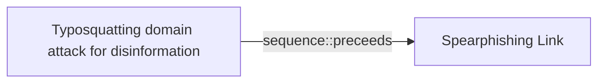

# Typosquatting domain attack for disinformation

## Metadata

- **UUID**: `db3cae2f-3e6b-4aed-b346-43686bbb382e`
- **Schema**: `threat::1.0`
- **Version**: `1`
- **Created**: `2025-01-09`
- **Modified**: `2025-01-09`
- **TLP**: clear (`TLP:CLEAR`)
- **Organisation**: EC DIGIT CSOC (`56b0a0f0-b0bc-47d9-bb46-02f80ae2065a`)

## References
### Public
- **1**: [https://www.csoonline.com/article/570173/what-is-typosquatting-a-simple-but-effective-attack-technique.html](https://www.csoonline.com/article/570173/what-is-typosquatting-a-simple-but-effective-attack-technique.html)
- **2**: [https://www.comparitech.com/blog/information-security/typosquatting-cybersquatting-combosquatting/](https://www.comparitech.com/blog/information-security/typosquatting-cybersquatting-combosquatting/)
- **3**: [https://www.proofpoint.com/us/threat-reference/typosquatting](https://www.proofpoint.com/us/threat-reference/typosquatting)
- **4**: [https://www.authentic8.com/blog/what-is-typosquatting](https://www.authentic8.com/blog/what-is-typosquatting)

## Description
Typosquatting, also known as URL hijacking, is a form of cyber attack
where an attacker registers a domain name that is very similar to a
legitimate and popular website, often by exploiting common typing
errors or misspellings. This is done to deceive users into visiting
the fake domain, usually with the intention of spreading disinformation,
stealing personal information, or installing malware ref [1].  

In the context of disinformation, typosquatting can be used to create
a fake version of a trusted news source or government website in order
to spread false or misleading information. By exploiting users' trust
in familiar domain names, attackers can manipulate public opinion,
confusion, and undermine the credibility of legitimate sources.  

Threat actors can impersonate domains in different ways.

Some of them are:

- A common misspelling of the target domain (example: CSOnline.com rather than CSOOnline.com)
- A different top-level domain (example: using .uk rather than .co.uk)
- Combining related words into the domain (CSOOnline-Cybersecurity.com)
- Adding periods to the URL (CSO.Online.com)
- Using similar looking letters to hide the false domain (ÇSÓOnliné.com)

Typosquatting is a lookalike domain with one or two wrong or different
characters with the aim of trying to trick people onto the wrong webpage.

The threat actors can buy and use a domain only with a little change
compared to the legitimate and official site of some service.
It can be difficult for the end user to recognise the difference, for
example between goggle.com and google.com or google.com written with
similar character for the character "o" but actually from different
UTF encoding system. It can looks like a well known and legit
domain but to be actually a malicious one with a very close name.

In some of the cases regarding the security reports typosquatting
domain attack is used in malicious campaigns for disinformation.
For example, Doppelganger is a pro-Russian misleading information
operation targeting the European Union (EU) and other geopolitical
actors. This campaign exploits political, economic, and social
divisions within the EU and its member states.

## Criticality
**Medium** - A Medium priority incident may affect public health or safety, national security, economic security, foreign relations, civil liberties, or public confidence.

## Terrain
> **A threat actor use vulnerabilities in domain providers to buy similar
to a legit domain and to use them for malicious purposes.

Usually the threat actors are buying as much as possible domains
on a bulk with impersonation goal, social engineering or just spreading
disinformation.

Domains: Enterprise, Mobile, IoT, Private Cloud, Public Cloud
Targets: Customer, End-user, Email Platform, Other, Public-Facing Servers
Platforms: Windows, Linux**

## Threat Assessment
| Dimension | Assessment | Description |
| --- | --- | --- |
| Severity | Moderate incident | A cyber attack on a small organisation, or which poses a considerable risk to a medium-sized organisation, or preliminary indications of cyber activity against a large organisation or the government. |
| Impact | Impairement; Asset and fraud; Identity Theft | - |
| Leverage | Spoofing; Infrastructure Compromise | - |
| Viability | Likely | Probable (probably) - 55-80% |

## Actors
| Actor | ID | Source | Description |
| --- | --- | --- | --- |
| [[Enterprise] APT29](https://attack.mitre.org/groups/G0016) | `att&ck::G0016` | ('att&ck',) | [APT29](https://attack.mitre.org/groups/G0016) is threat group that has been attributed to Russia's Foreign Intelligence Service (SVR).(Citation: White House Imposing Costs RU Gov April 2021)(Citation: UK Gov Malign RIS Activity April 2021) They have operated since at least 2008, often targeting government networks in Europe and NATO member countries, research institutes, and think tanks. [APT29](https://attack.mitre.org/groups/G0016) reportedly compromised the Democratic National Committee starting in the summer of 2015.(Citation: F-Secure The Dukes)(Citation: GRIZZLY STEPPE JAR)(Citation: Crowdstrike DNC June 2016)(Citation: UK Gov UK Exposes Russia SolarWinds April 2021)  In April 2021, the US and UK governments attributed the [SolarWinds Compromise](https://attack.mitre.org/campaigns/C0024) to the SVR; public statements included citations to [APT29](https://attack.mitre.org/groups/G0016), Cozy Bear, and The Dukes.(Citation: NSA Joint Advisory SVR SolarWinds April 2021)(Citation: UK NSCS Russia SolarWinds April 2021) Industry reporting also referred to the actors involved in this campaign as UNC2452, NOBELIUM, StellarParticle, Dark Halo, and SolarStorm.(Citation: FireEye SUNBURST Backdoor December 2020)(Citation: MSTIC NOBELIUM Mar 2021)(Citation: CrowdStrike SUNSPOT Implant January 2021)(Citation: Volexity SolarWinds)(Citation: Cybersecurity Advisory SVR TTP May 2021)(Citation: Unit 42 SolarStorm December 2020) |
| UNC2452 | `misp::2ee5ed7a-c4d0-40be-a837-20817474a15b` | ('misp',) | Reporting regarding activity related to the SolarWinds supply chain injection has grown quickly since initial disclosure on 13 December 2020. A significant amount of press reporting has focused on the identification of the actor(s) involved, victim organizations, possible campaign timeline, and potential impact. The US Government and cyber community have also provided detailed information on how the campaign was likely conducted and some of the malware used.  MITRE’s ATT&CK team — with the assistance of contributors — has been mapping techniques used by the actor group, referred to as UNC2452/Dark Halo by FireEye and Volexity respectively, as well as SUNBURST and TEARDROP malware. |
| [[Enterprise] APT28](https://attack.mitre.org/groups/G0007) | `att&ck::G0007` | ('att&ck',) | [APT28](https://attack.mitre.org/groups/G0007) is a threat group that has been attributed to Russia's General Staff Main Intelligence Directorate (GRU) 85th Main Special Service Center (GTsSS) military unit 26165.(Citation: NSA/FBI Drovorub August 2020)(Citation: Cybersecurity Advisory GRU Brute Force Campaign July 2021) This group has been active since at least 2004.(Citation: DOJ GRU Indictment Jul 2018)(Citation: Ars Technica GRU indictment Jul 2018)(Citation: Crowdstrike DNC June 2016)(Citation: FireEye APT28)(Citation: SecureWorks TG-4127)(Citation: FireEye APT28 January 2017)(Citation: GRIZZLY STEPPE JAR)(Citation: Sofacy DealersChoice)(Citation: Palo Alto Sofacy 06-2018)(Citation: Symantec APT28 Oct 2018)(Citation: ESET Zebrocy May 2019)  [APT28](https://attack.mitre.org/groups/G0007) reportedly compromised the Hillary Clinton campaign, the Democratic National Committee, and the Democratic Congressional Campaign Committee in 2016 in an attempt to interfere with the U.S. presidential election.(Citation: Crowdstrike DNC June 2016) In 2018, the US indicted five GRU Unit 26165 officers associated with [APT28](https://attack.mitre.org/groups/G0007) for cyber operations (including close-access operations) conducted between 2014 and 2018 against the World Anti-Doping Agency (WADA), the US Anti-Doping Agency, a US nuclear facility, the Organization for the Prohibition of Chemical Weapons (OPCW), the Spiez Swiss Chemicals Laboratory, and other organizations.(Citation: US District Court Indictment GRU Oct 2018) Some of these were conducted with the assistance of GRU Unit 74455, which is also referred to as [Sandworm Team](https://attack.mitre.org/groups/G0034). |
| APT28 | `misp::5b4ee3ea-eee3-4c8e-8323-85ae32658754` | ('misp',) | The Sofacy Group (also known as APT28, Pawn Storm, Fancy Bear and Sednit) is a cyber espionage group believed to have ties to the Russian government. Likely operating since 2007, the group is known to target government, military, and security organizations. It has been characterized as an advanced persistent threat. |
| [[Enterprise] APT38](https://attack.mitre.org/groups/G0082) | `att&ck::G0082` | ('att&ck',) | [APT38](https://attack.mitre.org/groups/G0082) is a North Korean state-sponsored threat group that specializes in financial cyber operations; it has been attributed to the Reconnaissance General Bureau.(Citation: CISA AA20-239A BeagleBoyz August 2020) Active since at least 2014, [APT38](https://attack.mitre.org/groups/G0082) has targeted banks, financial institutions, casinos, cryptocurrency exchanges, SWIFT system endpoints, and ATMs in at least 38 countries worldwide. Significant operations include the 2016 Bank of Bangladesh heist, during which [APT38](https://attack.mitre.org/groups/G0082) stole $81 million, as well as attacks against Bancomext (Citation: FireEye APT38 Oct 2018) and Banco de Chile (Citation: FireEye APT38 Oct 2018); some of their attacks have been destructive.(Citation: CISA AA20-239A BeagleBoyz August 2020)(Citation: FireEye APT38 Oct 2018)(Citation: DOJ North Korea Indictment Feb 2021)(Citation: Kaspersky Lazarus Under The Hood Blog 2017)  North Korean group definitions are known to have significant overlap, and some security researchers report all North Korean state-sponsored cyber activity under the name [Lazarus Group](https://attack.mitre.org/groups/G0032) instead of tracking clusters or subgroups. |
| Lazarus Group | `misp::68391641-859f-4a9a-9a1e-3e5cf71ec376` | ('misp',) | Since 2009, HIDDEN COBRA actors have leveraged their capabilities to target and compromise a range of victims; some intrusions have resulted in the exfiltration of data while others have been disruptive in nature. Commercial reporting has referred to this activity as Lazarus Group and Guardians of Peace. Tools and capabilities used by HIDDEN COBRA actors include DDoS botnets, keyloggers, remote access tools (RATs), and wiper malware. Variants of malware and tools used by HIDDEN COBRA actors include Destover, Duuzer, and Hangman. |
| [[Enterprise] FIN7](https://attack.mitre.org/groups/G0046) | `att&ck::G0046` | ('att&ck',) | [FIN7](https://attack.mitre.org/groups/G0046) is a financially-motivated threat group that has been active since 2013. [FIN7](https://attack.mitre.org/groups/G0046) has primarily targeted the retail, restaurant, hospitality, software, consulting, financial services, medical equipment, cloud services, media, food and beverage, transportation, and utilities industries in the U.S. A portion of [FIN7](https://attack.mitre.org/groups/G0046) was run out of a front company called Combi Security and often used point-of-sale malware for targeting efforts. Since 2020, [FIN7](https://attack.mitre.org/groups/G0046) shifted operations to a big game hunting (BGH) approach including use of [REvil](https://attack.mitre.org/software/S0496) ransomware and their own Ransomware as a Service (RaaS), Darkside. FIN7 may be linked to the [Carbanak](https://attack.mitre.org/groups/G0008) Group, but there appears to be several groups using [Carbanak](https://attack.mitre.org/software/S0030) malware and are therefore tracked separately.(Citation: FireEye FIN7 March 2017)(Citation: FireEye FIN7 April 2017)(Citation: FireEye CARBANAK June 2017)(Citation: FireEye FIN7 Aug 2018)(Citation: CrowdStrike Carbon Spider August 2021)(Citation: Mandiant FIN7 Apr 2022) |
| FIN7 | `misp::00220228-a5a4-4032-a30d-826bb55aa3fb` | ('misp',) | Groups targeting financial organizations or people with significant financial assets. |

## ATT&CK Techniques
| Technique | Name | Description |
| --- | --- | --- |
| `T1583.001` | [Acquire Infrastructure: Domains](https://attack.mitre.org/techniques/T1583/001) | Adversaries may acquire domains that can be used during targeting. Domain names are the human readable names used to represent one or more IP addresses. They can be purchased or, in some cases, acquired for free.  Adversaries may use acquired domains for a variety of purposes, including for [Phishing](https://attack.mitre.org/techniques/T1566), [Drive-by Compromise](https://attack.mitre.org/techniques/T1189), and Command and Control.(Citation: CISA MSS Sep 2020) Adversaries may choose domains that are similar to legitimate domains, including through use of homoglyphs or use of a different top-level domain (TLD).(Citation: FireEye APT28)(Citation: PaypalScam) Typosquatting may be used to aid in delivery of payloads via [Drive-by Compromise](https://attack.mitre.org/techniques/T1189). Adversaries may also use internationalized domain names (IDNs) and different character sets (e.g. Cyrillic, Greek, etc.) to execute "IDN homograph attacks," creating visually similar lookalike domains used to deliver malware to victim machines.(Citation: CISA IDN ST05-016)(Citation: tt_httrack_fake_domains)(Citation: tt_obliqueRAT)(Citation: httrack_unhcr)(Citation: lazgroup_idn_phishing)  Different URIs/URLs may also be dynamically generated to uniquely serve malicious content to victims (including one-time, single use domain names).(Citation: iOS URL Scheme)(Citation: URI)(Citation: URI Use)(Citation: URI Unique)  Adversaries may also acquire and repurpose expired domains, which may be potentially already allowlisted/trusted by defenders based on an existing reputation/history.(Citation: Categorisation_not_boundary)(Citation: Domain_Steal_CC)(Citation: Redirectors_Domain_Fronting)(Citation: bypass_webproxy_filtering)  Domain registrars each maintain a publicly viewable database that displays contact information for every registered domain. Private WHOIS services display alternative information, such as their own company data, rather than the owner of the domain. Adversaries may use such private WHOIS services to obscure information about who owns a purchased domain. Adversaries may further interrupt efforts to track their infrastructure by using varied registration information and purchasing domains with different domain registrars.(Citation: Mandiant APT1)  In addition to legitimately purchasing a domain, an adversary may register a new domain in a compromised environment. For example, in AWS environments, adversaries may leverage the Route53 domain service to register a domain and create hosted zones pointing to resources of the threat actor’s choosing.(Citation: Invictus IR DangerDev 2024) |

## Chaining

### Chaining details
#### preceeds -> Spearphishing Link (`sequence::preceeds`)
Malicious spearphishing campaign can use a typosquatting domain
technique - a threat actor may embed fraudulent web pages / domains
in the links in a customized and initially prepared emails.

- **Target UUID**: `1a68b5eb-0112-424d-a21f-88dda0b6b8df`
