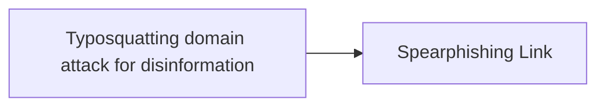

# Typosquatting domain attack for disinformation

## Metadata

- **UUID**: `db3cae2f-3e6b-4aed-b346-43686bbb382e`
- **Schema**: `threat::1.0`
- **TLP**: clear

## Description
Typosquatting, also known as URL hijacking, is a form of cyber attack
where an attacker registers a domain name that is very similar to a
legitimate and popular website, often by exploiting common typing
errors or misspellings. This is done to deceive users into visiting
the fake domain, usually with the intention of spreading disinformation,
stealing personal information, or installing malware ref [1].  

In the context of disinformation, typosquatting can be used to create
a fake version of a trusted news source or government website in order
to spread false or misleading information. By exploiting users' trust
in familiar domain names, attackers can manipulate public opinion,
confusion, and undermine the credibility of legitimate sources.  

Threat actors can impersonate domains in different ways.

Some of them are:

- A common misspelling of the target domain (example: CSOnline.com rather than CSOOnline.com)
- A different top-level domain (example: using .uk rather than .co.uk)
- Combining related words into the domain (CSOOnline-Cybersecurity.com)
- Adding periods to the URL (CSO.Online.com)
- Using similar looking letters to hide the false domain (ÇSÓOnliné.com)

Typosquatting is a lookalike domain with one or two wrong or different
characters with the aim of trying to trick people onto the wrong webpage.

The threat actors can buy and use a domain only with a little change
compared to the legitimate and official site of some service.
It can be difficult for the end user to recognise the difference, for
example between goggle.com and google.com or google.com written with
similar character for the character "o" but actually from different
UTF encoding system. It can looks like a well known and legit
domain but to be actually a malicious one with a very close name.

In some of the cases regarding the security reports typosquatting
domain attack is used in malicious campaigns for disinformation.
For example, Doppelganger is a pro-Russian misleading information
operation targeting the European Union (EU) and other geopolitical
actors. This campaign exploits political, economic, and social
divisions within the EU and its member states.

## Techniques
- T1583.001

## Chaining

