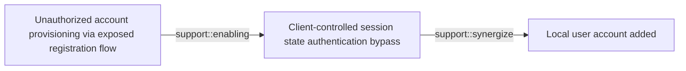
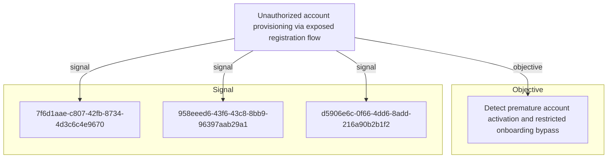

# Unauthorized account provisioning via exposed registration flow

## Metadata

- **UUID**: `3d7dada6-5f9d-4f67-952e-faa2ab794fde`
- **Schema**: `threat::1.0`
- **Version**: `2`
- **Created**: `2026-05-04`
- **Modified**: `2026-05-04`
- **TLP**: clear (`TLP:CLEAR`)
- **Contributors**: Hold Security Threat Research
- **Organisation**: EC DIGIT CSOC (`56b0a0f0-b0bc-47d9-bb46-02f80ae2065a`)

## References
### Public
- **1**: [https://owasp.org/Top10/A01_2021-Broken_Access_Control/](https://owasp.org/Top10/A01_2021-Broken_Access_Control/)
- **2**: [https://owasp.org/Top10/A07_2021-Identification_and_Authentication_Failures/](https://owasp.org/Top10/A07_2021-Identification_and_Authentication_Failures/)
- **3**: [https://cwe.mitre.org/data/definitions/306.html](https://cwe.mitre.org/data/definitions/306.html)
- **4**: [https://cwe.mitre.org/data/definitions/287.html](https://cwe.mitre.org/data/definitions/287.html)
- **5**: [https://cwe.mitre.org/data/definitions/284.html](https://cwe.mitre.org/data/definitions/284.html)

## Description
An adversary provisions an unauthorised account through exposed registration or account lifecycle
endpoints despite intended onboarding restrictions. The application may hide or remove the
registration UI, but backend routes such as /register, /signup, API registration endpoints,
password reset, or token issuance flows remain active and insufficiently gated.

The flawed workflow creates an account object before approval, invite validation, or domain
eligibility is enforced. Approval may be implemented only as a notification to a reviewer or a
manual delete process rather than as a blocking state transition. Once the account exists, related
flows may allow password reset, login, or token issuance for the unapproved account. Depending on
default role assignment and access checks, the adversary may gain partial or full access to the
application UI or APIs.

Detection and validation require replaying the lifecycle end to end: submit a registration request,
confirm account creation before approval, attempt password reset, and test whether a session or
token can be issued. The exposure may be systemic across deployments because registration paths
and account-state checks are reused across environments, cloud-hosted instances, or tenants.

The vector enables bypass of onboarding controls, internal enumeration from a trusted application
context, and a foothold for additional abuse. Severity should be finalised from evidence of the
endpoint, request and response pairs, reset behaviour, token issuance, and access level achieved.

## Criticality
**High** - A High priority incident is likely to result in a demonstrable impact to public health or safety, national security, economic security, foreign relations, civil liberties, or public confidence.

## Terrain
> **External web applications with registration, signup, password-reset, or token issuance endpoints
that remain reachable even when the user interface is hidden or onboarding is intended to be
invite-only, partner-only, domain-restricted, or approval-based. The weak terrain is account
lifecycle logic where account records are created before approval is enforced and downstream
authentication, password reset, or session issuance does not consistently check approval state.**

## Threat Assessment
| Dimension | Assessment | Description |
| --- | --- | --- |
| Severity | Substantial incident | A cyber attack which has a serious impact on a medium-sized organisation, or which poses a considerable risk to a large organisation or wider / local government. |
| Impact | Data Breach; Identity Theft; Business disruption; Legal and regulatory | - |
| Leverage | New Accounts; Elevation of privilege; Information Disclosure | - |
| Viability | Likely | Probable (probably) - 55-80% |
| Kill Chain | Exploitation | Techniques to exploit vulnerabilities in systems that may, amongst others, result in code execution. |

## ATT&CK Techniques
| Technique | Name | Description |
| --- | --- | --- |
| `T1190` | [Exploit Public-Facing Application](https://attack.mitre.org/techniques/T1190) | Adversaries may attempt to exploit a weakness in an Internet-facing host or system to initially access a network. The weakness in the system can be a software bug, a temporary glitch, or a misconfiguration.  Exploited applications are often websites/web servers, but can also include databases (like SQL), standard services (like SMB or SSH), network device administration and management protocols (like SNMP and Smart Install), and any other system with Internet-accessible open sockets.(Citation: NVD CVE-2016-6662)(Citation: CIS Multiple SMB Vulnerabilities)(Citation: US-CERT TA18-106A Network Infrastructure Devices 2018)(Citation: Cisco Blog Legacy Device Attacks)(Citation: NVD CVE-2014-7169) On ESXi infrastructure, adversaries may exploit exposed OpenSLP services; they may alternatively exploit exposed VMware vCenter servers.(Citation: Recorded Future ESXiArgs Ransomware 2023)(Citation: Ars Technica VMWare Code Execution Vulnerability 2021) Depending on the flaw being exploited, this may also involve [Exploitation for Defense Evasion](https://attack.mitre.org/techniques/T1211) or [Exploitation for Client Execution](https://attack.mitre.org/techniques/T1203).  If an application is hosted on cloud-based infrastructure and/or is containerized, then exploiting it may lead to compromise of the underlying instance or container. This can allow an adversary a path to access the cloud or container APIs (e.g., via the [Cloud Instance Metadata API](https://attack.mitre.org/techniques/T1552/005)), exploit container host access via [Escape to Host](https://attack.mitre.org/techniques/T1611), or take advantage of weak identity and access management policies.  Adversaries may also exploit edge network infrastructure and related appliances, specifically targeting devices that do not support robust host-based defenses.(Citation: Mandiant Fortinet Zero Day)(Citation: Wired Russia Cyberwar)  For websites and databases, the OWASP top 10 and CWE top 25 highlight the most common web-based vulnerabilities.(Citation: OWASP Top 10)(Citation: CWE top 25) |
| `T1136` | [Create Account](https://attack.mitre.org/techniques/T1136) | Adversaries may create an account to maintain access to victim systems.(Citation: Symantec WastedLocker June 2020) With a sufficient level of access, creating such accounts may be used to establish secondary credentialed access that do not require persistent remote access tools to be deployed on the system.  Accounts may be created on the local system or within a domain or cloud tenant. In cloud environments, adversaries may create accounts that only have access to specific services, which can reduce the chance of detection. |

## Chaining

### Chaining details
#### enabling -> Client-controlled session state authentication bypass (`support::enabling`)
Client-controlled session-state trust can allow an unapproved or partially provisioned account
to become usable by bypassing the server-side approval state that should block authentication
or token issuance.

- **Target UUID**: `38adba1e-0961-4417-bd84-33fa9c42439f`
#### synergize -> Local user account added (`support::synergize`)
Both vectors involve unauthorised account creation, but at different layers. This vector is a
web-application business-logic failure, while the linked vector covers host-local account
creation after administrative compromise.

- **Target UUID**: `e2d8ce6b-f21e-4444-a828-0c6b722a9c93`

## Relations

