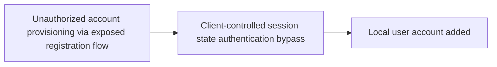
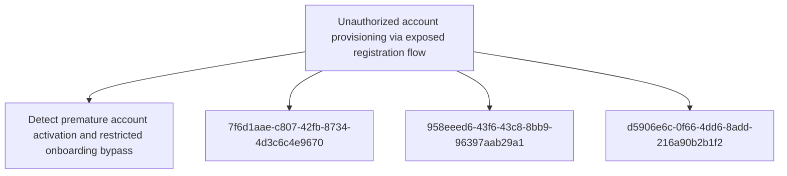

# Unauthorized account provisioning via exposed registration flow

## Metadata

- **UUID**: `3d7dada6-5f9d-4f67-952e-faa2ab794fde`
- **Schema**: `threat::1.0`
- **TLP**: clear

## Description
An adversary provisions an unauthorised account through exposed registration or account lifecycle
endpoints despite intended onboarding restrictions. The application may hide or remove the
registration UI, but backend routes such as /register, /signup, API registration endpoints,
password reset, or token issuance flows remain active and insufficiently gated.

The flawed workflow creates an account object before approval, invite validation, or domain
eligibility is enforced. Approval may be implemented only as a notification to a reviewer or a
manual delete process rather than as a blocking state transition. Once the account exists, related
flows may allow password reset, login, or token issuance for the unapproved account. Depending on
default role assignment and access checks, the adversary may gain partial or full access to the
application UI or APIs.

Detection and validation require replaying the lifecycle end to end: submit a registration request,
confirm account creation before approval, attempt password reset, and test whether a session or
token can be issued. The exposure may be systemic across deployments because registration paths
and account-state checks are reused across environments, cloud-hosted instances, or tenants.

The vector enables bypass of onboarding controls, internal enumeration from a trusted application
context, and a foothold for additional abuse. Severity should be finalised from evidence of the
endpoint, request and response pairs, reset behaviour, token issuance, and access level achieved.

## Techniques
- T1190
- T1136

## Chaining

## Relations

