# Use Windows utilities to manipulate a local account or group

## Metadata

- **UUID**: `596d294a-9aa8-41b2-9507-5c9d605de6b4`
- **Schema**: `threat::1.0`
- **Version**: `3`
- **Created**: `2024-11-06`
- **Modified**: `2025-02-10`
- **TLP**: clear (`TLP:CLEAR`)
- **Organisation**: EC DIGIT CSOC (`56b0a0f0-b0bc-47d9-bb46-02f80ae2065a`)

## References
### Public
- **1**: [https://www.manageengine.com/products/eventlog/cyber-security/account-manipulation.html](https://www.manageengine.com/products/eventlog/cyber-security/account-manipulation.html)
- **2**: [https://d3fend.mitre.org/offensive-technique/attack/T1098/](https://d3fend.mitre.org/offensive-technique/attack/T1098/)

## Description
Local account manipulation involves creating, modifying, or exploiting local 
user accounts on a computer system, typically for malicious purposes. Local 
accounts are user accounts stored and managed locally on a specific computer 
device.

### Utilities Related to Local Account Manipulation:

#### 1. net.exe
**Description**: A command-line utility used for network administration tasks, 
including managing user accounts and network shares. Threat actors can use 
it to create new user accounts and add them to privileged groups.

Example:

```bash
net user attacker P@ssw0rd! /add
net localgroup administrators attacker /add
```
This sequence creates a new user named "attacker" and adds them to the local 
administrators group, granting full system access.

#### PowerShell Cmdlets
##### New-LocalUser 
The New-LocalUser cmdlet is used to create a new local 
user account on a Windows machine.
`New-LocalUser -Name "username" -Password (ConvertTo-SecureString "P@ssw0rd!"
 -AsPlainText -Force) -Description "Description" -FullName "Full Name"`

Parameters:
-Name: Specifies the name of the new local user.
-Password: Assigns a password to the new user account. The password must be 
provided as a **secure string.**
-Description: (Optional) Adds a description for the user account.
-FullName: (Optional) Provides the full name of the user.

##### Add-LocalGroupMember
The Add-LocalGroupMember cmdlet adds a user to a local group, which can be 
used to grant the user additional privileges.
`Add-LocalGroupMember -Group "Administrators" -Member "username"`

Parameters:
-Group: Specifies the local group to which the user will be added.
-Member: Specifies the user account to add to the group.


#### Changing a Local Password
Using net.exe: The net.exe utility can be used to change a user's 
password.  

`net user username newpassword``

Using PowerShell: PowerShell can also be used to change a 
local user's password.  

```
$user = [ADSI]("WinNT://./username,user")
$user.SetPassword("NewP@ssw0rd!")

## Criticality
**Medium** - A Medium priority incident may affect public health or safety, national security, economic security, foreign relations, civil liberties, or public confidence.

## Terrain
> **Threat actors must have access to a Windows system with sufficient privileges 
to execute administrative utilities.

Domains: Enterprise
Targets: Workstations, Laptop, Directory, Customer, End-user, Code Repositories, Other
Platforms: Windows**

## Threat Assessment
| Dimension | Assessment | Description |
| --- | --- | --- |
| Severity | Significant incident | A cyber attack which has a serious impact on a large organisation or on wider / local government, or which poses a considerable risk to central government or (inter)national essential services. |
| Impact | Data Breach; Reputational Damages; Business disruption; Operating costs | - |
| Leverage | Elevation of privilege; Modify configuration; New Accounts; Information Disclosure; Infrastructure Compromise; Dwelling; Tampering | - |
| Viability | Likely | Probable (probably) - 55-80% |
| Kill Chain | Execution | Techniques that result in execution of attacker-controlled code on a local or remote system. |

## Actors
| Actor | ID | Source | Description |
| --- | --- | --- | --- |
| WIZARD SPIDER | `misp::bdf4fe4f-af8a-495f-a719-cf175cecda1f` | ('misp',) | Wizard Spider is reportedly associated with Grim Spider and Lunar Spider. The WIZARD SPIDER threat group is the Russia-based operator of the TrickBot banking malware. This group represents a growing criminal enterprise of which GRIM SPIDER appears to be a subset. The LUNAR SPIDER threat group is the Eastern European-based operator and developer of the commodity banking malware called BokBot (aka IcedID), which was first observed in April 2017. The BokBot malware provides LUNAR SPIDER affiliates with a variety of capabilities to enable credential theft and wire fraud, through the use of webinjects and a malware distribution function. GRIM SPIDER is a sophisticated eCrime group that has been operating the Ryuk ransomware since August 2018, targeting large organizations for a high-ransom return. This methodology, known as “big game hunting,” signals a shift in operations for WIZARD SPIDER, a criminal enterprise of which GRIM SPIDER appears to be a cell. The WIZARD SPIDER threat group, known as the Russia-based operator of the TrickBot banking malware, had focused primarily on wire fraud in the past. |
| APT29 | `misp::b2056ff0-00b9-482e-b11c-c771daa5f28a` | ('misp',) | A 2015 report by F-Secure describe APT29 as: 'The Dukes are a well-resourced, highly dedicated and organized cyberespionage group that we believe has been working for the Russian Federation since at least 2008 to collect intelligence in support of foreign and security policy decision-making. The Dukes show unusual confidence in their ability to continue successfully compromising their targets, as well as in their ability to operate with impunity. The Dukes primarily target Western governments and related organizations, such as government ministries and agencies, political think tanks, and governmental subcontractors. Their targets have also included the governments of members of the Commonwealth of Independent States;Asian, African, and Middle Eastern governments;organizations associated with Chechen extremism;and Russian speakers engaged in the illicit trade of controlled substances and drugs. The Dukes are known to employ a vast arsenal of malware toolsets, which we identify as MiniDuke, CosmicDuke, OnionDuke, CozyDuke, CloudDuke, SeaDuke, HammerDuke, PinchDuke, and GeminiDuke. In recent years, the Dukes have engaged in apparently biannual large - scale spear - phishing campaigns against hundreds or even thousands of recipients associated with governmental institutions and affiliated organizations. These campaigns utilize a smash - and - grab approach involving a fast but noisy breakin followed by the rapid collection and exfiltration of as much data as possible.If the compromised target is discovered to be of value, the Dukes will quickly switch the toolset used and move to using stealthier tactics focused on persistent compromise and long - term intelligence gathering. This threat actor targets government ministries and agencies in the West, Central Asia, East Africa, and the Middle East; Chechen extremist groups; Russian organized crime; and think tanks. It is suspected to be behind the 2015 compromise of unclassified networks at the White House, Department of State, Pentagon, and the Joint Chiefs of Staff. The threat actor includes all of the Dukes tool sets, including MiniDuke, CosmicDuke, OnionDuke, CozyDuke, SeaDuke, CloudDuke (aka MiniDionis), and HammerDuke (aka Hammertoss). ' |
| Lazarus Group | `misp::68391641-859f-4a9a-9a1e-3e5cf71ec376` | ('misp',) | Since 2009, HIDDEN COBRA actors have leveraged their capabilities to target and compromise a range of victims; some intrusions have resulted in the exfiltration of data while others have been disruptive in nature. Commercial reporting has referred to this activity as Lazarus Group and Guardians of Peace. Tools and capabilities used by HIDDEN COBRA actors include DDoS botnets, keyloggers, remote access tools (RATs), and wiper malware. Variants of malware and tools used by HIDDEN COBRA actors include Destover, Duuzer, and Hangman. |

## ATT&CK Techniques
| Technique | Name | Description |
| --- | --- | --- |
| `T1546` | [Event Triggered Execution](https://attack.mitre.org/techniques/T1546) | Adversaries may establish persistence and/or elevate privileges using system mechanisms that trigger execution based on specific events. Various operating systems have means to monitor and subscribe to events such as logons or other user activity such as running specific applications/binaries. Cloud environments may also support various functions and services that monitor and can be invoked in response to specific cloud events.(Citation: Backdooring an AWS account)(Citation: Varonis Power Automate Data Exfiltration)(Citation: Microsoft DART Case Report 001)  Adversaries may abuse these mechanisms as a means of maintaining persistent access to a victim via repeatedly executing malicious code. After gaining access to a victim system, adversaries may create/modify event triggers to point to malicious content that will be executed whenever the event trigger is invoked.(Citation: FireEye WMI 2015)(Citation: Malware Persistence on OS X)(Citation: amnesia malware)  Since the execution can be proxied by an account with higher permissions, such as SYSTEM or service accounts, an adversary may be able to abuse these triggered execution mechanisms to escalate their privileges. |
| `T1562.001` | [Impair Defenses: Disable or Modify Tools](https://attack.mitre.org/techniques/T1562/001) | Adversaries may modify and/or disable security tools to avoid possible detection of their malware/tools and activities. This may take many forms, such as killing security software processes or services, modifying / deleting Registry keys or configuration files so that tools do not operate properly, or other methods to interfere with security tools scanning or reporting information. Adversaries may also disable updates to prevent the latest security patches from reaching tools on victim systems.(Citation: SCADAfence_ransomware)  Adversaries may also tamper with artifacts deployed and utilized by security tools. Security tools may make dynamic changes to system components in order to maintain visibility into specific events. For example, security products may load their own modules and/or modify those loaded by processes to facilitate data collection. Similar to [Indicator Blocking](https://attack.mitre.org/techniques/T1562/006), adversaries may unhook or otherwise modify these features added by tools (especially those that exist in userland or are otherwise potentially accessible to adversaries) to avoid detection.(Citation: OutFlank System Calls)(Citation: MDSec System Calls) Alternatively, they may add new directories to an endpoint detection and response (EDR) tool’s exclusion list, enabling them to hide malicious files via [File/Path Exclusions](https://attack.mitre.org/techniques/T1564/012).(Citation: BlackBerry WhisperGate 2022)(Citation: Google Cloud Threat Intelligence FIN13 2021)  Adversaries may also focus on specific applications such as Sysmon. For example, the “Start” and “Enable” values in <code>HKEY_LOCAL_MACHINE\SYSTEM\CurrentControlSet\Control\WMI\Autologger\EventLog-Microsoft-Windows-Sysmon-Operational</code> may be modified to tamper with and potentially disable Sysmon logging.(Citation: disable_win_evt_logging)   On network devices, adversaries may attempt to skip digital signature verification checks by altering startup configuration files and effectively disabling firmware verification that typically occurs at boot.(Citation: Fortinet Zero-Day and Custom Malware Used by Suspected Chinese Actor in Espionage Operation)(Citation: Analysis of FG-IR-22-369)  In cloud environments, tools disabled by adversaries may include cloud monitoring agents that report back to services such as AWS CloudWatch or Google Cloud Monitor.  Furthermore, although defensive tools may have anti-tampering mechanisms, adversaries may abuse tools such as legitimate rootkit removal kits to impair and/or disable these tools.(Citation: chasing_avaddon_ransomware)(Citation: dharma_ransomware)(Citation: demystifying_ryuk)(Citation: doppelpaymer_crowdstrike) For example, adversaries have used tools such as GMER to find and shut down hidden processes and antivirus software on infected systems.(Citation: demystifying_ryuk)  Additionally, adversaries may exploit legitimate drivers from anti-virus software to gain access to kernel space (i.e. [Exploitation for Privilege Escalation](https://attack.mitre.org/techniques/T1068)), which may lead to bypassing anti-tampering features.(Citation: avoslocker_ransomware) |
| `T1078.003` | [Valid Accounts: Local Accounts](https://attack.mitre.org/techniques/T1078/003) | Adversaries may obtain and abuse credentials of a local account as a means of gaining Initial Access, Persistence, Privilege Escalation, or Defense Evasion. Local accounts are those configured by an organization for use by users, remote support, services, or for administration on a single system or service.  Local Accounts may also be abused to elevate privileges and harvest credentials through [OS Credential Dumping](https://attack.mitre.org/techniques/T1003). Password reuse may allow the abuse of local accounts across a set of machines on a network for the purposes of Privilege Escalation and Lateral Movement. |
| `T1136.001` | [Create Account: Local Account](https://attack.mitre.org/techniques/T1136/001) | Adversaries may create a local account to maintain access to victim systems. Local accounts are those configured by an organization for use by users, remote support, services, or for administration on a single system or service.   For example, with a sufficient level of access, the Windows <code>net user /add</code> command can be used to create a local account.  In Linux, the `useradd` command can be used, while on macOS systems, the <code>dscl -create</code> command can be used. Local accounts may also be added to network devices, often via common [Network Device CLI](https://attack.mitre.org/techniques/T1059/008) commands such as <code>username</code>, to ESXi servers via `esxcli system account add`, or to Kubernetes clusters using the `kubectl` utility.(Citation: cisco_username_cmd)(Citation: Kubernetes Service Accounts Security)  Such accounts may be used to establish secondary credentialed access that do not require persistent remote access tools to be deployed on the system. |
| `T1087.001` | [Account Discovery: Local Account](https://attack.mitre.org/techniques/T1087/001) | Adversaries may attempt to get a listing of local system accounts. This information can help adversaries determine which local accounts exist on a system to aid in follow-on behavior.  Commands such as <code>net user</code> and <code>net localgroup</code> of the [Net](https://attack.mitre.org/software/S0039) utility and <code>id</code> and <code>groups</code> on macOS and Linux can list local users and groups.(Citation: Mandiant APT1)(Citation: id man page)(Citation: groups man page) On Linux, local users can also be enumerated through the use of the <code>/etc/passwd</code> file. On macOS, the <code>dscl . list /Users</code> command can be used to enumerate local accounts. On ESXi servers, the `esxcli system account list` command can list local user accounts.(Citation: Crowdstrike Hypervisor Jackpotting Pt 2 2021) |
| `T1098.007` | [Account Manipulation: Additional Local or Domain Groups](https://attack.mitre.org/techniques/T1098/007) | An adversary may add additional local or domain groups to an adversary-controlled account to maintain persistent access to a system or domain.  On Windows, accounts may use the `net localgroup` and `net group` commands to add existing users to local and domain groups.(Citation: Microsoft Net Localgroup)(Citation: Microsoft Net Group) On Linux, adversaries may use the `usermod` command for the same purpose.(Citation: Linux Usermod)  For example, accounts may be added to the local administrators group on Windows devices to maintain elevated privileges. They may also be added to the Remote Desktop Users group, which allows them to leverage [Remote Desktop Protocol](https://attack.mitre.org/techniques/T1021/001) to log into the endpoints in the future.(Citation: Microsoft RDP Logons) On Linux, accounts may be added to the sudoers group, allowing them to persistently leverage [Sudo and Sudo Caching](https://attack.mitre.org/techniques/T1548/003) for elevated privileges.   In Windows environments, machine accounts may also be added to domain groups. This allows the local SYSTEM account to gain privileges on the domain.(Citation: RootDSE AD Detection 2022) |

## Chaining

```mermaid
flowchart LR
596d294a_9aa8_41b2_9507_5c9d605de6b4["Use Windows utilities to manipulate a local account or group"]
d5039f2c_9fcc_4ba3_ad6a_da8c891ba745["Abuse of Windows Utilities"]
e3d7cb59_7aca_4c3d_b488_48c785930b6d["PowerShell usage for credential manipulation"]
06523ed4_7881_4466_9ac5_f8417e972d13["Using a Windows command prompt for credential manipulation"]
66277f27_d57b_47f8_bc9c_b024c7cd1313["Abuse Windows Utilities to Enable Persistence"]
596d294a_9aa8_41b2_9507_5c9d605de6b4 -->|atomicity::implements| d5039f2c_9fcc_4ba3_ad6a_da8c891ba745
d5039f2c_9fcc_4ba3_ad6a_da8c891ba745 -->|sequence::preceeds| e3d7cb59_7aca_4c3d_b488_48c785930b6d
e3d7cb59_7aca_4c3d_b488_48c785930b6d -->|sequence::preceeds| 06523ed4_7881_4466_9ac5_f8417e972d13
06523ed4_7881_4466_9ac5_f8417e972d13 -->|sequence::preceeds| 66277f27_d57b_47f8_bc9c_b024c7cd1313
```

### Chaining details
#### implements -> Abuse of Windows Utilities (`atomicity::implements`)
This TVM is implementing the bigger TVM : Abuse of Windows Utilities

- **Target UUID**: `d5039f2c-9fcc-4ba3-ad6a-da8c891ba745`
#### preceeds -> PowerShell usage for credential manipulation (`sequence::preceeds`)
PowerShell cmdlets and functions can be used to list and manipulate
current user account (example Get-Credential).

- **Target UUID**: `e3d7cb59-7aca-4c3d-b488-48c785930b6d`
#### preceeds -> Using a Windows command prompt for credential manipulation (`sequence::preceeds`)
A threat actor can use command prompt (CMD) utility to create,
modify, delete or read a local user account.

- **Target UUID**: `06523ed4-7881-4466-9ac5-f8417e972d13`
#### preceeds -> Abuse Windows Utilities to Enable Persistence (`sequence::preceeds`)
A threat actor can abuse drop a web shell on Windows or
to exploit native Windows tools and applications for
malicious purposes (example: Microsoft Web Deployment
tool, Windows Terminal Service, WMIC command-line tool
and others).

- **Target UUID**: `66277f27-d57b-47f8-bc9c-b024c7cd1313`
