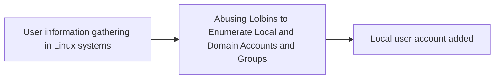

# User information gathering in Linux systems

## Metadata

- **UUID**: `8bc82ff8-e106-4377-98f1-2cb912631ffa`
- **Schema**: `threat::1.0`
- **TLP**: clear

## Description
Threat actors use various methods and tools to collect user data on Linux
systems. Some of them are given below.

### Common methods used for gathering of user's information on Linux

Examples:

- Current user: for reconnaissance purposes on a Linux system threat actors
  are using commands like `whoami` to retrieve the current username running
  on the system. Threat actors can use and `lslogins` to list an information
  about known users in the system, which typically includes details such as
  the username, UID (User ID), GID (Group ID), home directory, shell, last
  login time, and more, depending on the options used and the system
  configuration ref [1].  
- User list: a threat actor group can use a `getent` command with an option
  `passwd` or `cat /etc/passwd` command to retrieve a list of all users on
  the system ref [1].
- User ID and group ID: the `id` command can be used to retrieve the user ID
  and a group ID of the current user ref [2].
- Group list: a command `groups` <group_name> can be used in Linux to view
  user's group membership. Or with other command `getent group` or cat
  `/etc/group` thereat actors can retrieve a list of all groups on the
  system ref [1],[4].  
- Other user's information: commands like `who` can show an information for
  the current logged-in user. A threat actor may use and `users` command
  to display the list of currently logged-in users on the Linux system
  ref [1].
- Linux user's activity: `w` coomand executed on Linux shows the current
  logged users activity on the system ref [1]. 
- User shell: a threat actor may run the command `getent passwd <username>`
  to retrieve the user's shell. The command output lists the user details
  from the 'passwd' database, including the username, user ID, group ID,
  home directory, and default shell ref [5].  
- Last login: an adversary can use the `lastlog` command to retrieve
  information about the last user's login ref [6]. 
- Failed login attempts: with the `faillog` command a threat actor may
  retrieve information about failed login attempts ref [7].

### Some of the known tools used for Linux user's information collection

- `Metasploit`: A penetration testing framework that includes tools for
  collecting user data and exploiting vulnerabilities.
- `Linux.Ekoms`: This is a custom tool that can collect user data, including
  login credentials and credit card numbers.
- `Linux.Mumblehard`: it's a malware that collects user data and uses it for
  spamming and phishing campaigns.
- `TsarSapphire`: This utility can collect user data, including login
  credentials and sensitive information.
- `Remaiten`: A payload for Linux which collects user data and uses it for
  malicious activities.
- `Kaiten`: A Linux malware that collects user data and potentially can use
  it further for distributed denial-of-service (DDoS) attacks.
- `Linux.Keylogger`: A keylogger that collects user keystrokes, including
  login credentials and sensitive information.
- `Mayhem`: This is a malware that can collect user data on Linux, including
  login credentials and sensitive information, and uses it for malicious
  activities.

## Techniques
- T1589

## Chaining

