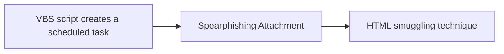

# VBS script creates a scheduled task

## Metadata

- **UUID**: `53ca52ed-a7e7-4094-95ec-b4ef522dc689`
- **Schema**: `threat::1.0`
- **TLP**: clear

## Description
Threat actors often use Visual Basic Scripting (VBS) to create scheduled
tasks on compromised Windows systems. VBS is a built-in scripting language
on Windows systems, making it an attractive choice for threat actors. It
allows the threat actors to execute code without relying on external tools
or binaries, reducing the risk of detection.    

Once executed by the victim, the VBScript establishes persistence on
infected machines by creating scheduled tasks and modifying the Windows
Registry.

### Creating a scheduled task using a VBS script

To create a scheduled task using VBS, threat actors typically follow the
steps provided below:
1. An initial VBS script creation - the attacker creates a VBS script that
contains the malicious code. This script can be embedded in an email
attachment, downloaded from a compromised website, or created locally on
the compromised system.  
2. The created VBS script uses `schtasks` - the VBS script uses the
`schtasks` to create a new scheduled task. The `SchTasks` command is a
built-in Windows utility that allows users to create, delete, and manage
scheduled tasks.
3. Task details: The VBS script specifies the task details, including the
task name, description, and the command or script to be executed.
4. Set a task trigger - the VBS script may set a task trigger, which defines
when the task should be executed. This can be a specific time, daily,
weekly, or on system startup.
5. A task preservation - the VBS scrip

### Some of the techniques used to achieve VBS persistence and
obfuscation

- Obfuscation: Threat actors often obfuscate their VBS scripts to evade
detection by security software. They use techniques like random variable
names, fake function calls or garbage code to hide the function of the
malicious code.  

- Scheduled task chaining: Threat actors create as tasks under the current
user or if allowed under SYSTEM to elevate privileges and maintain foothold
onto the system.  

### An example for a VBS script which creates a scheduled task

Below is given an example of a VBS (Visual Basic Scripting) script that
creates a scheduled task to run a command or application at a specified
time. This script uses the Windows Task Scheduler to schedule the task.  

```visualbasic

' Create a new task
Dim sch, task
Set sch = CreateObject("Schedule.Service")
sch.Connect()

' Define the task
Dim taskDefinition
Set taskDefinition = sch.CreateNewTask(0)

' Set task registration info
taskDefinition.RegistrationInfo.Description = "This is a test task created by VBS script"
taskDefinition.RegistrationInfo.Author = "Your Name"

' Set task principal (who runs the task)
Dim principal
Set principal = taskDefinition.Principal
principal.LogonType = 3 ' Interactive or 3 for S4U
principal.UserId = "NT AUTHORITY\SYSTEM" ' You can change this to a different user

' Set task trigger (when to run the task)
Dim trigger
Set trigger = taskDefinition.Triggers.Create(_
TaskTriggerType2.Daily)
trigger.StartTime = "08:00:00" ' 8 AM daily
trigger.Id = "DailyTrigger"

' Set task action (what to run)
Dim action
Set action = taskDefinition.Actions.Create(_
TaskActionType.Exec)
action.Path = "C:\Windows\System32\notepad.exe" ' Path to the application to run
action.Arguments = "" ' Arguments if any

' Register the task
Dim taskFolder
Set taskFolder = sch.GetFolder("\")
taskFolder.RegisterTaskDefinition "TestVBS Task", taskDefinition, 6, , , 3, , , task

```

## Techniques
- T1569.002
- T1053
- T1082
- T1005
- T1112
- T1053.005

## Chaining

