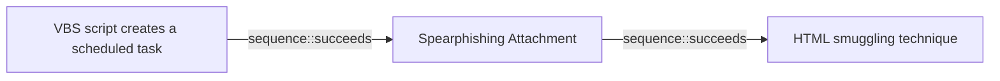

# VBS script creates a scheduled task

## Metadata

- **UUID**: `53ca52ed-a7e7-4094-95ec-b4ef522dc689`
- **Schema**: `threat::1.0`
- **Version**: `1`
- **Created**: `2025-06-25`
- **Modified**: `2025-07-08`
- **TLP**: clear (`TLP:CLEAR`)
- **Organisation**: EC DIGIT CSOC (`56b0a0f0-b0bc-47d9-bb46-02f80ae2065a`)

## References
### Public
- **1**: [https://stackoverflow.com/questions/31549393/vbscript-for-creating-a-scheduled-task](https://stackoverflow.com/questions/31549393/vbscript-for-creating-a-scheduled-task)
- **2**: [https://www.picussecurity.com/resource/blog/picus-10-critical-mitre-attck-techniques-t1060-registry-run-keys-startup-folder](https://www.picussecurity.com/resource/blog/picus-10-critical-mitre-attck-techniques-t1060-registry-run-keys-startup-folder)
- **3**: [https://www.tek-tips.com/threads/create-scheduled-task-using-vbscript.1802745](https://www.tek-tips.com/threads/create-scheduled-task-using-vbscript.1802745)
- **4**: [https://www.itninja.com/question/vbscript-to-create-a-scheduled-task](https://www.itninja.com/question/vbscript-to-create-a-scheduled-task)
- **5**: [https://cloud.google.com/blog/topics/threat-intelligence/fin7-phishing-lnk](https://cloud.google.com/blog/topics/threat-intelligence/fin7-phishing-lnk)
- **6**: [https://www.virusbulletin.com/virusbulletin/2018/11/vb2018-paper-hacking-sony-pictures](https://www.virusbulletin.com/virusbulletin/2018/11/vb2018-paper-hacking-sony-pictures)
- **7**: [https://www.kaspersky.com/blog/operation-blockbuster/11407](https://www.kaspersky.com/blog/operation-blockbuster/11407)

## Description
Threat actors often use Visual Basic Scripting (VBS) to create scheduled
tasks on compromised Windows systems. VBS is a built-in scripting language
on Windows systems, making it an attractive choice for threat actors. It
allows the threat actors to execute code without relying on external tools
or binaries, reducing the risk of detection.    

Once executed by the victim, the VBScript establishes persistence on
infected machines by creating scheduled tasks and modifying the Windows
Registry.

### Creating a scheduled task using a VBS script

To create a scheduled task using VBS, threat actors typically follow the
steps provided below:
1. An initial VBS script creation - the attacker creates a VBS script that
contains the malicious code. This script can be embedded in an email
attachment, downloaded from a compromised website, or created locally on
the compromised system.  
2. The created VBS script uses `schtasks` - the VBS script uses the
`schtasks` to create a new scheduled task. The `SchTasks` command is a
built-in Windows utility that allows users to create, delete, and manage
scheduled tasks.
3. Task details: The VBS script specifies the task details, including the
task name, description, and the command or script to be executed.
4. Set a task trigger - the VBS script may set a task trigger, which defines
when the task should be executed. This can be a specific time, daily,
weekly, or on system startup.
5. A task preservation - the VBS scrip

### Some of the techniques used to achieve VBS persistence and
obfuscation

- Obfuscation: Threat actors often obfuscate their VBS scripts to evade
detection by security software. They use techniques like random variable
names, fake function calls or garbage code to hide the function of the
malicious code.  

- Scheduled task chaining: Threat actors create as tasks under the current
user or if allowed under SYSTEM to elevate privileges and maintain foothold
onto the system.  

### An example for a VBS script which creates a scheduled task

Below is given an example of a VBS (Visual Basic Scripting) script that
creates a scheduled task to run a command or application at a specified
time. This script uses the Windows Task Scheduler to schedule the task.  

```visualbasic

' Create a new task
Dim sch, task
Set sch = CreateObject("Schedule.Service")
sch.Connect()

' Define the task
Dim taskDefinition
Set taskDefinition = sch.CreateNewTask(0)

' Set task registration info
taskDefinition.RegistrationInfo.Description = "This is a test task created by VBS script"
taskDefinition.RegistrationInfo.Author = "Your Name"

' Set task principal (who runs the task)
Dim principal
Set principal = taskDefinition.Principal
principal.LogonType = 3 ' Interactive or 3 for S4U
principal.UserId = "NT AUTHORITY\SYSTEM" ' You can change this to a different user

' Set task trigger (when to run the task)
Dim trigger
Set trigger = taskDefinition.Triggers.Create(_
TaskTriggerType2.Daily)
trigger.StartTime = "08:00:00" ' 8 AM daily
trigger.Id = "DailyTrigger"

' Set task action (what to run)
Dim action
Set action = taskDefinition.Actions.Create(_
TaskActionType.Exec)
action.Path = "C:\Windows\System32\notepad.exe" ' Path to the application to run
action.Arguments = "" ' Arguments if any

' Register the task
Dim taskFolder
Set taskFolder = sch.GetFolder("\")
taskFolder.RegisterTaskDefinition "TestVBS Task", taskDefinition, 6, , , 3, , , task

```

## Criticality
**High** - A High priority incident is likely to result in a demonstrable impact to public health or safety, national security, economic security, foreign relations, civil liberties, or public confidence.

## Terrain
> **A threat actor needs to entice an end user to execute VBScript loader to
gain an initial access to the system. Some of these techniques include
social engineering and targeted (spear-phishing) or mass-spread phishing
campaigns.

Domains: Enterprise
Targets: Customer, End-user, Workstations, Other, Laptop, Remote access
Platforms: Windows**

## Threat Assessment
| Dimension | Assessment | Description |
| --- | --- | --- |
| Severity | Significant incident | A cyber attack which has a serious impact on a large organisation or on wider / local government, or which poses a considerable risk to central government or (inter)national essential services. |
| Impact | Impairement; Data Breach; Lose Capabilities | - |
| Leverage | Elevation of privilege; Infrastructure Compromise; Information Disclosure; Tampering | - |
| Viability | Likely | Probable (probably) - 55-80% |
| Kill Chain | Persistence | Any access, action or change to a system that gives an attacker persistent presence on the system. |

## Actors
| Actor | ID | Source | Description |
| --- | --- | --- | --- |
| [[Enterprise] FIN7](https://attack.mitre.org/groups/G0046) | `att&ck::G0046` | ('att&ck',) | [FIN7](https://attack.mitre.org/groups/G0046) is a financially-motivated threat group that has been active since 2013. [FIN7](https://attack.mitre.org/groups/G0046) has primarily targeted the retail, restaurant, hospitality, software, consulting, financial services, medical equipment, cloud services, media, food and beverage, transportation, and utilities industries in the U.S. A portion of [FIN7](https://attack.mitre.org/groups/G0046) was run out of a front company called Combi Security and often used point-of-sale malware for targeting efforts. Since 2020, [FIN7](https://attack.mitre.org/groups/G0046) shifted operations to a big game hunting (BGH) approach including use of [REvil](https://attack.mitre.org/software/S0496) ransomware and their own Ransomware as a Service (RaaS), Darkside. FIN7 may be linked to the [Carbanak](https://attack.mitre.org/groups/G0008) Group, but there appears to be several groups using [Carbanak](https://attack.mitre.org/software/S0030) malware and are therefore tracked separately.(Citation: FireEye FIN7 March 2017)(Citation: FireEye FIN7 April 2017)(Citation: FireEye CARBANAK June 2017)(Citation: FireEye FIN7 Aug 2018)(Citation: CrowdStrike Carbon Spider August 2021)(Citation: Mandiant FIN7 Apr 2022) |
| FIN7 | `misp::00220228-a5a4-4032-a30d-826bb55aa3fb` | ('misp',) | Groups targeting financial organizations or people with significant financial assets. |
| [[Enterprise] Lazarus Group](https://attack.mitre.org/groups/G0032) | `att&ck::G0032` | ('att&ck',) | [Lazarus Group](https://attack.mitre.org/groups/G0032) is a North Korean state-sponsored cyber threat group that has been attributed to the Reconnaissance General Bureau.(Citation: US-CERT HIDDEN COBRA June 2017)(Citation: Treasury North Korean Cyber Groups September 2019) The group has been active since at least 2009 and was reportedly responsible for the November 2014 destructive wiper attack against Sony Pictures Entertainment as part of a campaign named Operation Blockbuster by Novetta. Malware used by [Lazarus Group](https://attack.mitre.org/groups/G0032) correlates to other reported campaigns, including Operation Flame, Operation 1Mission, Operation Troy, DarkSeoul, and Ten Days of Rain.(Citation: Novetta Blockbuster)  North Korean group definitions are known to have significant overlap, and some security researchers report all North Korean state-sponsored cyber activity under the name [Lazarus Group](https://attack.mitre.org/groups/G0032) instead of tracking clusters or subgroups, such as [Andariel](https://attack.mitre.org/groups/G0138), [APT37](https://attack.mitre.org/groups/G0067), [APT38](https://attack.mitre.org/groups/G0082), and [Kimsuky](https://attack.mitre.org/groups/G0094). |
| Lazarus Group | `misp::68391641-859f-4a9a-9a1e-3e5cf71ec376` | ('misp',) | Since 2009, HIDDEN COBRA actors have leveraged their capabilities to target and compromise a range of victims; some intrusions have resulted in the exfiltration of data while others have been disruptive in nature. Commercial reporting has referred to this activity as Lazarus Group and Guardians of Peace. Tools and capabilities used by HIDDEN COBRA actors include DDoS botnets, keyloggers, remote access tools (RATs), and wiper malware. Variants of malware and tools used by HIDDEN COBRA actors include Destover, Duuzer, and Hangman. |
| [[Enterprise] APT29](https://attack.mitre.org/groups/G0016) | `att&ck::G0016` | ('att&ck',) | [APT29](https://attack.mitre.org/groups/G0016) is threat group that has been attributed to Russia's Foreign Intelligence Service (SVR).(Citation: White House Imposing Costs RU Gov April 2021)(Citation: UK Gov Malign RIS Activity April 2021) They have operated since at least 2008, often targeting government networks in Europe and NATO member countries, research institutes, and think tanks. [APT29](https://attack.mitre.org/groups/G0016) reportedly compromised the Democratic National Committee starting in the summer of 2015.(Citation: F-Secure The Dukes)(Citation: GRIZZLY STEPPE JAR)(Citation: Crowdstrike DNC June 2016)(Citation: UK Gov UK Exposes Russia SolarWinds April 2021)  In April 2021, the US and UK governments attributed the [SolarWinds Compromise](https://attack.mitre.org/campaigns/C0024) to the SVR; public statements included citations to [APT29](https://attack.mitre.org/groups/G0016), Cozy Bear, and The Dukes.(Citation: NSA Joint Advisory SVR SolarWinds April 2021)(Citation: UK NSCS Russia SolarWinds April 2021) Industry reporting also referred to the actors involved in this campaign as UNC2452, NOBELIUM, StellarParticle, Dark Halo, and SolarStorm.(Citation: FireEye SUNBURST Backdoor December 2020)(Citation: MSTIC NOBELIUM Mar 2021)(Citation: CrowdStrike SUNSPOT Implant January 2021)(Citation: Volexity SolarWinds)(Citation: Cybersecurity Advisory SVR TTP May 2021)(Citation: Unit 42 SolarStorm December 2020) |
| APT29 | `misp::b2056ff0-00b9-482e-b11c-c771daa5f28a` | ('misp',) | A 2015 report by F-Secure describe APT29 as: 'The Dukes are a well-resourced, highly dedicated and organized cyberespionage group that we believe has been working for the Russian Federation since at least 2008 to collect intelligence in support of foreign and security policy decision-making. The Dukes show unusual confidence in their ability to continue successfully compromising their targets, as well as in their ability to operate with impunity. The Dukes primarily target Western governments and related organizations, such as government ministries and agencies, political think tanks, and governmental subcontractors. Their targets have also included the governments of members of the Commonwealth of Independent States;Asian, African, and Middle Eastern governments;organizations associated with Chechen extremism;and Russian speakers engaged in the illicit trade of controlled substances and drugs. The Dukes are known to employ a vast arsenal of malware toolsets, which we identify as MiniDuke, CosmicDuke, OnionDuke, CozyDuke, CloudDuke, SeaDuke, HammerDuke, PinchDuke, and GeminiDuke. In recent years, the Dukes have engaged in apparently biannual large - scale spear - phishing campaigns against hundreds or even thousands of recipients associated with governmental institutions and affiliated organizations. These campaigns utilize a smash - and - grab approach involving a fast but noisy breakin followed by the rapid collection and exfiltration of as much data as possible.If the compromised target is discovered to be of value, the Dukes will quickly switch the toolset used and move to using stealthier tactics focused on persistent compromise and long - term intelligence gathering. This threat actor targets government ministries and agencies in the West, Central Asia, East Africa, and the Middle East; Chechen extremist groups; Russian organized crime; and think tanks. It is suspected to be behind the 2015 compromise of unclassified networks at the White House, Department of State, Pentagon, and the Joint Chiefs of Staff. The threat actor includes all of the Dukes tool sets, including MiniDuke, CosmicDuke, OnionDuke, CozyDuke, SeaDuke, CloudDuke (aka MiniDionis), and HammerDuke (aka Hammertoss). ' |

## ATT&CK Techniques
| Technique | Name | Description |
| --- | --- | --- |
| `T1569.002` | [System Services: Service Execution](https://attack.mitre.org/techniques/T1569/002) | Adversaries may abuse the Windows service control manager to execute malicious commands or payloads. The Windows service control manager (<code>services.exe</code>) is an interface to manage and manipulate services.(Citation: Microsoft Service Control Manager) The service control manager is accessible to users via GUI components as well as system utilities such as <code>sc.exe</code> and [Net](https://attack.mitre.org/software/S0039).  [PsExec](https://attack.mitre.org/software/S0029) can also be used to execute commands or payloads via a temporary Windows service created through the service control manager API.(Citation: Russinovich Sysinternals) Tools such as [PsExec](https://attack.mitre.org/software/S0029) and <code>sc.exe</code> can accept remote servers as arguments and may be used to conduct remote execution.  Adversaries may leverage these mechanisms to execute malicious content. This can be done by either executing a new or modified service. This technique is the execution used in conjunction with [Windows Service](https://attack.mitre.org/techniques/T1543/003) during service persistence or privilege escalation. |
| `T1053` | [Scheduled Task/Job](https://attack.mitre.org/techniques/T1053) | Adversaries may abuse task scheduling functionality to facilitate initial or recurring execution of malicious code. Utilities exist within all major operating systems to schedule programs or scripts to be executed at a specified date and time. A task can also be scheduled on a remote system, provided the proper authentication is met (ex: RPC and file and printer sharing in Windows environments). Scheduling a task on a remote system typically may require being a member of an admin or otherwise privileged group on the remote system.(Citation: TechNet Task Scheduler Security)  Adversaries may use task scheduling to execute programs at system startup or on a scheduled basis for persistence. These mechanisms can also be abused to run a process under the context of a specified account (such as one with elevated permissions/privileges). Similar to [System Binary Proxy Execution](https://attack.mitre.org/techniques/T1218), adversaries have also abused task scheduling to potentially mask one-time execution under a trusted system process.(Citation: ProofPoint Serpent) |
| `T1082` | [System Information Discovery](https://attack.mitre.org/techniques/T1082) | An adversary may attempt to get detailed information about the operating system and hardware, including version, patches, hotfixes, service packs, and architecture. Adversaries may use the information from [System Information Discovery](https://attack.mitre.org/techniques/T1082) during automated discovery to shape follow-on behaviors, including whether or not the adversary fully infects the target and/or attempts specific actions.  Tools such as [Systeminfo](https://attack.mitre.org/software/S0096) can be used to gather detailed system information. If running with privileged access, a breakdown of system data can be gathered through the <code>systemsetup</code> configuration tool on macOS. As an example, adversaries with user-level access can execute the <code>df -aH</code> command to obtain currently mounted disks and associated freely available space. Adversaries may also leverage a [Network Device CLI](https://attack.mitre.org/techniques/T1059/008) on network devices to gather detailed system information (e.g. <code>show version</code>).(Citation: US-CERT-TA18-106A) On ESXi servers, threat actors may gather system information from various esxcli utilities, such as `system hostname get`, `system version get`, and `storage filesystem list` (to list storage volumes).(Citation: Crowdstrike Hypervisor Jackpotting Pt 2 2021)(Citation: Varonis)  Infrastructure as a Service (IaaS) cloud providers such as AWS, GCP, and Azure allow access to instance and virtual machine information via APIs. Successful authenticated API calls can return data such as the operating system platform and status of a particular instance or the model view of a virtual machine.(Citation: Amazon Describe Instance)(Citation: Google Instances Resource)(Citation: Microsoft Virutal Machine API)  [System Information Discovery](https://attack.mitre.org/techniques/T1082) combined with information gathered from other forms of discovery and reconnaissance can drive payload development and concealment.(Citation: OSX.FairyTale)(Citation: 20 macOS Common Tools and Techniques) |
| `T1005` | [Data from Local System](https://attack.mitre.org/techniques/T1005) | Adversaries may search local system sources, such as file systems, configuration files, local databases, or virtual machine files, to find files of interest and sensitive data prior to Exfiltration.  Adversaries may do this using a [Command and Scripting Interpreter](https://attack.mitre.org/techniques/T1059), such as [cmd](https://attack.mitre.org/software/S0106) as well as a [Network Device CLI](https://attack.mitre.org/techniques/T1059/008), which have functionality to interact with the file system to gather information.(Citation: show_run_config_cmd_cisco) Adversaries may also use [Automated Collection](https://attack.mitre.org/techniques/T1119) on the local system. |
| `T1112` | [Modify Registry](https://attack.mitre.org/techniques/T1112) | Adversaries may interact with the Windows Registry as part of a variety of other techniques to aid in defense evasion, persistence, and execution.  Access to specific areas of the Registry depends on account permissions, with some keys requiring administrator-level access. The built-in Windows command-line utility [Reg](https://attack.mitre.org/software/S0075) may be used for local or remote Registry modification.(Citation: Microsoft Reg) Other tools, such as remote access tools, may also contain functionality to interact with the Registry through the Windows API.  The Registry may be modified in order to hide configuration information or malicious payloads via [Obfuscated Files or Information](https://attack.mitre.org/techniques/T1027).(Citation: Unit42 BabyShark Feb 2019)(Citation: Avaddon Ransomware 2021)(Citation: Microsoft BlackCat Jun 2022)(Citation: CISA Russian Gov Critical Infra 2018) The Registry may also be modified to [Impair Defenses](https://attack.mitre.org/techniques/T1562), such as by enabling macros for all Microsoft Office products, allowing privilege escalation without alerting the user, increasing the maximum number of allowed outbound requests, and/or modifying systems to store plaintext credentials in memory.(Citation: CISA LockBit 2023)(Citation: Unit42 BabyShark Feb 2019)  The Registry of a remote system may be modified to aid in execution of files as part of lateral movement. It requires the remote Registry service to be running on the target system.(Citation: Microsoft Remote) Often [Valid Accounts](https://attack.mitre.org/techniques/T1078) are required, along with access to the remote system's [SMB/Windows Admin Shares](https://attack.mitre.org/techniques/T1021/002) for RPC communication.  Finally, Registry modifications may also include actions to hide keys, such as prepending key names with a null character, which will cause an error and/or be ignored when read via [Reg](https://attack.mitre.org/software/S0075) or other utilities using the Win32 API.(Citation: Microsoft Reghide NOV 2006) Adversaries may abuse these pseudo-hidden keys to conceal payloads/commands used to maintain persistence.(Citation: TrendMicro POWELIKS AUG 2014)(Citation: SpectorOps Hiding Reg Jul 2017) |
| `T1053.005` | [Scheduled Task/Job: Scheduled Task](https://attack.mitre.org/techniques/T1053/005) | Adversaries may abuse the Windows Task Scheduler to perform task scheduling for initial or recurring execution of malicious code. There are multiple ways to access the Task Scheduler in Windows. The [schtasks](https://attack.mitre.org/software/S0111) utility can be run directly on the command line, or the Task Scheduler can be opened through the GUI within the Administrator Tools section of the Control Panel.(Citation: Stack Overflow) In some cases, adversaries have used a .NET wrapper for the Windows Task Scheduler, and alternatively, adversaries have used the Windows netapi32 library and [Windows Management Instrumentation](https://attack.mitre.org/techniques/T1047) (WMI) to create a scheduled task. Adversaries may also utilize the Powershell Cmdlet `Invoke-CimMethod`, which leverages WMI class `PS_ScheduledTask` to create a scheduled task via an XML path.(Citation: Red Canary - Atomic Red Team)  An adversary may use Windows Task Scheduler to execute programs at system startup or on a scheduled basis for persistence. The Windows Task Scheduler can also be abused to conduct remote Execution as part of Lateral Movement and/or to run a process under the context of a specified account (such as SYSTEM). Similar to [System Binary Proxy Execution](https://attack.mitre.org/techniques/T1218), adversaries have also abused the Windows Task Scheduler to potentially mask one-time execution under signed/trusted system processes.(Citation: ProofPoint Serpent)  Adversaries may also create "hidden" scheduled tasks (i.e. [Hide Artifacts](https://attack.mitre.org/techniques/T1564)) that may not be visible to defender tools and manual queries used to enumerate tasks. Specifically, an adversary may hide a task from `schtasks /query` and the Task Scheduler by deleting the associated Security Descriptor (SD) registry value (where deletion of this value must be completed using SYSTEM permissions).(Citation: SigmaHQ)(Citation: Tarrask scheduled task) Adversaries may also employ alternate methods to hide tasks, such as altering the metadata (e.g., `Index` value) within associated registry keys.(Citation: Defending Against Scheduled Task Attacks in Windows Environments) |

## Chaining

### Chaining details
#### succeeds -> Spearphishing Attachment (`sequence::succeeds`)
A threat actor may use a delivery technique - for example spreading
password protected documents which looks legitimate. This is a
spear-phishing technique and the goal is a user interaction which
leads to a payload execution and infection with a malware.

- **Target UUID**: `dd5d942c-bac4-4000-b9a6-ca4fef6cfb84`
#### succeeds -> HTML smuggling technique (`sequence::succeeds`)
In one of the malicious campaigns a threat actor used HTML smuggling to
deliver a password-protected ZIP archive containing a VBScript loader
for remote access capabilities.

- **Target UUID**: `c7ed4fad-a58f-47da-9938-4a673526b3f4`
