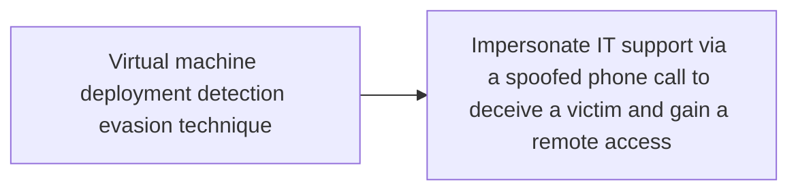

# Virtual machine deployment detection evasion technique

## Metadata

- **UUID**: `60bd6a35-3a71-47c2-8110-4562fb40976c`
- **Schema**: `threat::1.0`
- **TLP**: clear

## Description
A threat actor can use virtualisation platforms and utilities
to compromise an environment. For example, an installed virtual
machine can be used for an entry point to the rest of the
environment or as an entry point for reconnaissance and
pivoting to the system host and further potentially to
other systems in the environment.  

The goal is to establish persistence on the victim's system. 
Once inside, the threat actor deploy's virtual machine using
any virtualisation technology, which may contain a backdoor, allowing
them to maintain a covert presence on the network in days, weeks or
even longer ref [1].     

### Possible platforms for virtualisation used for detection evasion

A threat actor can deploy a virtual machine using one of the virtualisation
platforms below:

- Hyper-V
- EXS/ESXi (VMware virtualisation)
- QEMU virtualisation
- Virtual box

Once deployed, the virtual machine may contain a backdoor or another
type of a malware (example: QDoor backdoor). This technique allows
a threat actor to maintain a covert channel on the network for unnoticed
period of time. During this period, they can escalate privileges, move
laterally across the environment, and exfiltrate valuable or sensitive
organisational data using data-exfiltration tools. For example, such
data-exfiltration tool can be `GoodSync` tool ref [1], [2].

## Techniques
- T1497

## Chaining

