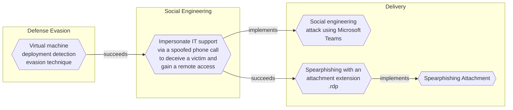

# Virtual machine deployment detection evasion technique

## Metadata
| Field | Value |
| --- | --- |
| UUID | `60bd6a35-3a71-47c2-8110-4562fb40976c` |
| Schema | `threat::1.0` |
| Version | `1` |
| Created | `2025-06-02` |
| Modified | `2025-07-04` |
| TLP | clear (`TLP:CLEAR`) |
| Organisation | EC DIGIT CSOC (`56b0a0f0-b0bc-47d9-bb46-02f80ae2065a`) |

## References
### Public
- **1**: [https://news.sophos.com/en-us/2025/05/20/a-familiar-playbook-with-a-twist-3am-ransomware-actors-dropped-virtual-machine-with-vishing-and-quick-assist](https://news.sophos.com/en-us/2025/05/20/a-familiar-playbook-with-a-twist-3am-ransomware-actors-dropped-virtual-machine-with-vishing-and-quick-assist)
- **2**: [https://www.bleepingcomputer.com/news/security/3am-ransomware-uses-spoofed-it-calls-email-bombing-to-breach-networks/](https://www.bleepingcomputer.com/news/security/3am-ransomware-uses-spoofed-it-calls-email-bombing-to-breach-networks/)
- **3**: [https://www.intrinsec.com/wp-content/uploads/2024/01/TLP-CLEAR-2024-01-09-ThreeAM-EN-Information-report.pdf](https://www.intrinsec.com/wp-content/uploads/2024/01/TLP-CLEAR-2024-01-09-ThreeAM-EN-Information-report.pdf)
- **4**: [https://www.security.com/threat-intelligence/3am-ransomware-lockbit](https://www.security.com/threat-intelligence/3am-ransomware-lockbit)
- **5**: [https://www.ransomlook.io/group/3am](https://www.ransomlook.io/group/3am)

## Description
A threat actor can use virtualisation platforms and utilities
to compromise an environment. For example, an installed virtual
machine can be used for an entry point to the rest of the
environment or as an entry point for reconnaissance and
pivoting to the system host and further potentially to
other systems in the environment.  

The goal is to establish persistence on the victim's system. 
Once inside, the threat actor deploy's virtual machine using
any virtualisation technology, which may contain a backdoor, allowing
them to maintain a covert presence on the network in days, weeks or
even longer ref [1].     

### Possible platforms for virtualisation used for detection evasion

A threat actor can deploy a virtual machine using one of the virtualisation
platforms below:

- Hyper-V
- EXS/ESXi (VMware virtualisation)
- QEMU virtualisation
- Virtual box

Once deployed, the virtual machine may contain a backdoor or another
type of a malware (example: QDoor backdoor). This technique allows
a threat actor to maintain a covert channel on the network for unnoticed
period of time. During this period, they can escalate privileges, move
laterally across the environment, and exfiltrate valuable or sensitive
organisational data using data-exfiltration tools. For example, such
data-exfiltration tool can be `GoodSync` tool ref [1], [2].

## Criticality
**Medium** - A Medium priority incident may affect public health or safety, national security, economic security, foreign relations, civil liberties, or public confidence.

## Terrain
A threat actor needs an initial privileged access
to already compromised host system.

## Surface
> **Windows**
> Microsoft Windows operating systems (all versions)

> **macOS**
> Apple macOS operating systems (all versions)

> **Linux**
> Linux-based operating systems (all distributions)

> **Windows::Desktop**
> Microsoft Windows desktop editions

> **Customer Support**
> Customer support and helpdesk platforms

> **Azure::Compute::Virtual Machines**
> Azure Virtual Machines

> **Virtualisation::VMware ESXi**
> Broadcom VMware ESXi bare-metal Type 1 hypervisor

## Threat Assessment
| Dimension | Assessment | Description |
| --- | --- | --- |
| Severity | Moderate incident | A cyber attack on a small organisation, or which poses a considerable risk to a medium-sized organisation, or preliminary indications of cyber activity against a large organisation or the government. |
| Impact | Impairement Data Breach Business disruption Reputational Damages Nuisance | Incapacitation of a particular key system that will cause disruptions in day-to-day operations, and eventually service delivery. Non-public information has been accessed from the outside, and successfully extracted. Business disruption Damages to the organization public view may be achieved by using directly the access gained, or indirectly with data gathered. Small and mostly inconsequential to day to day operations, but noticed. |
| Leverage | Infrastructure Compromise Elevation of privilege Information Disclosure Software installation Tampering | The compromised target is likely to be used to further expand the sphere of influence of the attacker and allow more potent vectors to be executed. Capacity to augment leverage over the target system by upgrading the compromised access rights Threat action intending to read a file that one was not granted access to, or to read data in transit. Software installation or code modification Threat action intending to maliciously change or modify persistent data, such as records in a database, and the alteration of data in transit between two computers over an open network, such as the Internet. |
| Viability | Likely | Probable (probably) - 55-80% |
| Kill Chain | Defense Evasion | Techniques an attacker may specifically use for evading detection or avoiding other defenses. |

## ATT&CK Techniques
| Technique | Name | Description |
| --- | --- | --- |
| `T1497` | [Virtualization/Sandbox Evasion](https://attack.mitre.org/techniques/T1497) | Adversaries may employ various means to detect and avoid virtualization and analysis environments. This may include changing behaviors based on the results of checks for the presence of artifacts indicative of a virtual machine environment (VME) or sandbox. If the adversary detects a VME, they may alter their malware to disengage from the victim or conceal the core functions of the implant. They may also search for VME artifacts before dropping secondary or additional payloads. Adversaries may use the information learned from [Virtualization/Sandbox Evasion](https://attack.mitre.org/techniques/T1497) during automated discovery to shape follow-on behaviors.(Citation: Deloitte Environment Awareness)  Adversaries may use several methods to accomplish [Virtualization/Sandbox Evasion](https://attack.mitre.org/techniques/T1497) such as checking for security monitoring tools (e.g., Sysinternals, Wireshark, etc.) or other system artifacts associated with analysis or virtualization. Adversaries may also check for legitimate user activity to help determine if it is in an analysis environment. Additional methods include use of sleep timers or loops within malware code to avoid operating within a temporary sandbox.(Citation: Unit 42 Pirpi July 2015) |

## Chaining

### Chaining details
#### succeeds -> [Impersonate IT support via a spoofed phone call to deceive a victim and gain a remote access](impersonate-it-support-via-a-spoofed-phone-call-to-deceive-a-victim-and-gain-a-remote-access.md) (`c4456134-df7b-4969-b5ff-a24794996890`) (`sequence::succeeds`)
Threat actors are flooding initially a specific user within
an organisation with unsolicited emails and/or messages and
manage to gain unauthorised access to the host. The threat
actors then use this initial access for other actions as
deployment of a virtual machine to maintain their
persistence and to evade the security detections
mechanisms.

- **Target UUID**: `c4456134-df7b-4969-b5ff-a24794996890`
