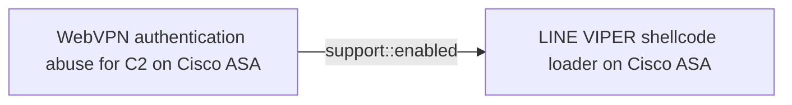
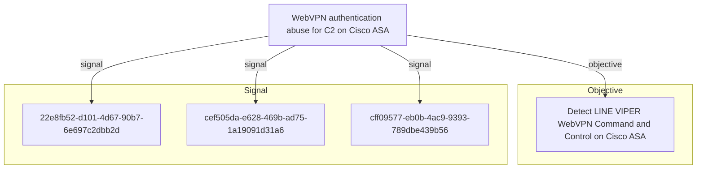

# WebVPN authentication abuse for C2 on Cisco ASA

## Metadata

- **UUID**: `fcc552fb-b4d1-4b47-b366-104ec4d806ef`
- **Schema**: `threat::1.0`
- **Version**: `1`
- **Created**: `2026-06-18`
- **Modified**: `2026-06-18`
- **TLP**: clear (`TLP:CLEAR`)
- **Organisation**: EC DIGIT CSOC (`56b0a0f0-b0bc-47d9-bb46-02f80ae2065a`)

## References
### Public
- **1**: [https://www.ncsc.gov.uk/static-assets/documents/malware-analysis-reports/RayInitiator-LINE-VIPER/ncsc-mar-rayinitiator-line-viper.pdf](https://www.ncsc.gov.uk/static-assets/documents/malware-analysis-reports/RayInitiator-LINE-VIPER/ncsc-mar-rayinitiator-line-viper.pdf)

## Description
LINE VIPER implements a sophisticated command and control mechanism
that abuses legitimate WebVPN client authentication functionality on
Cisco ASA devices [1]. This technique allows attackers to task the
malware and exfiltrate data while blending with normal VPN
authentication traffic.

#### Deployment Mechanism

LINE VIPER is initially loaded into memory through a specially
crafted WebVPN client authentication request. The request contains
a partial PKCS7 certificate followed by shellcode, which is
processed by a handler installed in the lina binary by the
RayInitiator bootkit [1].

#### Communication Protocol

The WebVPN-based C2 channel uses HTTPS to communicate with the
compromised device. The protocol leverages standard WebVPN
authentication endpoints, making malicious traffic difficult to
distinguish from legitimate VPN authentication attempts [1].

**Request Structure:** Tasking commands are delivered through HTTP
POST requests to the WebVPN endpoint with carefully crafted XML
payloads. The requests include standard WebVPN headers such as
X-Transcend-Version, X-Aggregate-Auth, and Content-Type set to
application/x-www-form-urlencoded [1].

Example request format includes:
- XML version declaration
- config-auth element with client="vpn" and type="init"
- aggregate-auth-version="2"
- version, device-id, and platform information
- mac-address-list elements
- opaque section containing tunnel-group and authentication details

The tasking data is embedded within device-type or similar fields
in the XML structure [1].

**Response Structure:** Actor tasking responses return HTTP 200 OK
status with XML content. The response includes standard security
headers (X-Frame-Options, Strict-Transport-Security,
X-Content-Type-Options, X-XSS-Protection, Content-Security-Policy)
and the tasking response data embedded in the message element of
the XML [1].

#### Encryption and Authentication

LINE VIPER implements multiple layers of cryptographic protection
for its C2 communications [1]:

- **Per-Victim RSA Keys:** Each compromised device uses a unique
  RSA public key for asymmetric cryptography. This key is used to
  perform symmetric key exchange operations, ensuring that only the
  actor with the corresponding private key can task the device.

- **Per-Request AES Encryption:** Tasking commands are encrypted
  using AES with a unique symmetric key for each request. This
  provides an additional layer of encryption beyond HTTPS and
  prevents replay attacks.

- **Victim-Specific Tokens:** Tasking payloads sent to victim
  devices are validated against multiple victim-specific tokens
  before execution. This environmental keying ensures that captured
  tasking commands cannot be replayed against different devices.

#### Operational Security

The abuse of WebVPN authentication for C2 provides several
operational security benefits to the attacker [1]:

- **Traffic Blending:** C2 traffic appears as legitimate WebVPN
  authentication attempts, making it difficult to identify through
  network monitoring.

- **Encrypted Channel:** HTTPS encryption provides a legitimate
  encrypted channel that network security devices typically allow.

- **No Unusual Ports:** Communication uses standard HTTPS port 443,
  avoiding the need for unusual firewall rules or exceptions.

- **Expected Behaviour:** WebVPN authentication attempts are
  expected traffic for ASA devices, reducing suspicion during
  investigation.

This technique demonstrates sophisticated understanding of Cisco ASA
WebVPN implementation and represents a significant advancement in
C2 channel design for network device implants. The use of
legitimate functionality for malicious purposes makes detection
challenging and requires deep packet inspection or behavioural
analysis beyond standard network monitoring.

## Criticality
**High** - A High priority incident is likely to result in a demonstrable impact to public health or safety, national security, economic security, foreign relations, civil liberties, or public confidence.

## Terrain
> **Cisco ASA devices with WebVPN functionality enabled and accessible
to attacker infrastructure [1]. The WebVPN client authentication
mechanism processes XML data containing device-id, version, and form
elements through a large codebase in lina. This XML processing does
not adequately validate or sanitise crafted authentication requests,
allowing arbitrary data to be embedded in standard authentication
fields like device-type within the XML structure.

Domains: Enterprise, Networking
Targets: Network Equipment, VPN Client
Platforms: Network Router**

## Threat Assessment
| Dimension | Assessment | Description |
| --- | --- | --- |
| Severity | Substantial incident | A cyber attack which has a serious impact on a medium-sized organisation, or which poses a considerable risk to a large organisation or wider / local government. |
| Impact | Data Breach; Lose Capabilities; Reputational Damages; National Security | - |
| Leverage | Spoofing; Information Disclosure; Infrastructure Compromise | - |
| Viability | Likely | Probable (probably) - 55-80% |
| Kill Chain | Command & Control | Techniques that allow attackers to communicate with controlled systems within a target network. |

## ATT&CK Techniques
| Technique | Name | Description |
| --- | --- | --- |
| `T1071.001` | [Application Layer Protocol: Web Protocols](https://attack.mitre.org/techniques/T1071/001) | Adversaries may communicate using application layer protocols associated with web traffic to avoid detection/network filtering by blending in with existing traffic. Commands to the remote system, and often the results of those commands, will be embedded within the protocol traffic between the client and server.   Protocols such as HTTP/S(Citation: CrowdStrike Putter Panda) and WebSocket(Citation: Brazking-Websockets) that carry web traffic may be very common in environments. HTTP/S packets have many fields and headers in which data can be concealed. An adversary may abuse these protocols to communicate with systems under their control within a victim network while also mimicking normal, expected traffic. |
| `T1573.001` | [Encrypted Channel: Symmetric Cryptography](https://attack.mitre.org/techniques/T1573/001) | Adversaries may employ a known symmetric encryption algorithm to conceal command and control traffic rather than relying on any inherent protections provided by a communication protocol. Symmetric encryption algorithms use the same key for plaintext encryption and ciphertext decryption. Common symmetric encryption algorithms include AES, DES, 3DES, Blowfish, and RC4. |
| `T1573.002` | [Encrypted Channel: Asymmetric Cryptography](https://attack.mitre.org/techniques/T1573/002) | Adversaries may employ a known asymmetric encryption algorithm to conceal command and control traffic rather than relying on any inherent protections provided by a communication protocol. Asymmetric cryptography, also known as public key cryptography, uses a keypair per party: one public that can be freely distributed, and one private. Due to how the keys are generated, the sender encrypts data with the receiver’s public key and the receiver decrypts the data with their private key. This ensures that only the intended recipient can read the encrypted data. Common public key encryption algorithms include RSA and ElGamal.  For efficiency, many protocols (including SSL/TLS) use symmetric cryptography once a connection is established, but use asymmetric cryptography to establish or transmit a key. As such, these protocols are classified as [Asymmetric Cryptography](https://attack.mitre.org/techniques/T1573/002). |
| `T1090` | [Proxy](https://attack.mitre.org/techniques/T1090) | Adversaries may use a connection proxy to direct network traffic between systems or act as an intermediary for network communications to a command and control server to avoid direct connections to their infrastructure. Many tools exist that enable traffic redirection through proxies or port redirection, including [HTRAN](https://attack.mitre.org/software/S0040), ZXProxy, and ZXPortMap. (Citation: Trend Micro APT Attack Tools) Adversaries use these types of proxies to manage command and control communications, reduce the number of simultaneous outbound network connections, provide resiliency in the face of connection loss, or to ride over existing trusted communications paths between victims to avoid suspicion. Adversaries may chain together multiple proxies to further disguise the source of malicious traffic.  Adversaries can also take advantage of routing schemes in Content Delivery Networks (CDNs) to proxy command and control traffic. |

## Chaining

### Chaining details
#### enabled -> LINE VIPER shellcode loader on Cisco ASA (`support::enabled`)
This WebVPN-based C2 channel is enabled by the LINE VIPER
implant, which hooks XML form element processing in lina to
intercept crafted authentication requests. The initial LINE VIPER
shellcode delivery itself also uses this WebVPN channel,
embedding a partial PKCS7 certificate followed by shellcode in
a crafted authentication request [1].

- **Target UUID**: `b6175f16-2b61-4116-bd97-de54b02b197e`

## Relations

