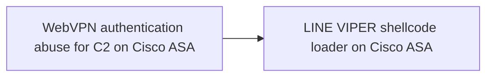
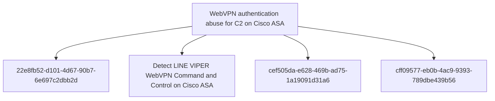

# WebVPN authentication abuse for C2 on Cisco ASA

## Metadata

- **UUID**: `fcc552fb-b4d1-4b47-b366-104ec4d806ef`
- **Schema**: `threat::1.0`
- **TLP**: clear

## Description
LINE VIPER implements a sophisticated command and control mechanism
that abuses legitimate WebVPN client authentication functionality on
Cisco ASA devices [1]. This technique allows attackers to task the
malware and exfiltrate data while blending with normal VPN
authentication traffic.

#### Deployment Mechanism

LINE VIPER is initially loaded into memory through a specially
crafted WebVPN client authentication request. The request contains
a partial PKCS7 certificate followed by shellcode, which is
processed by a handler installed in the lina binary by the
RayInitiator bootkit [1].

#### Communication Protocol

The WebVPN-based C2 channel uses HTTPS to communicate with the
compromised device. The protocol leverages standard WebVPN
authentication endpoints, making malicious traffic difficult to
distinguish from legitimate VPN authentication attempts [1].

**Request Structure:** Tasking commands are delivered through HTTP
POST requests to the WebVPN endpoint with carefully crafted XML
payloads. The requests include standard WebVPN headers such as
X-Transcend-Version, X-Aggregate-Auth, and Content-Type set to
application/x-www-form-urlencoded [1].

Example request format includes:
- XML version declaration
- config-auth element with client="vpn" and type="init"
- aggregate-auth-version="2"
- version, device-id, and platform information
- mac-address-list elements
- opaque section containing tunnel-group and authentication details

The tasking data is embedded within device-type or similar fields
in the XML structure [1].

**Response Structure:** Actor tasking responses return HTTP 200 OK
status with XML content. The response includes standard security
headers (X-Frame-Options, Strict-Transport-Security,
X-Content-Type-Options, X-XSS-Protection, Content-Security-Policy)
and the tasking response data embedded in the message element of
the XML [1].

#### Encryption and Authentication

LINE VIPER implements multiple layers of cryptographic protection
for its C2 communications [1]:

- **Per-Victim RSA Keys:** Each compromised device uses a unique
  RSA public key for asymmetric cryptography. This key is used to
  perform symmetric key exchange operations, ensuring that only the
  actor with the corresponding private key can task the device.

- **Per-Request AES Encryption:** Tasking commands are encrypted
  using AES with a unique symmetric key for each request. This
  provides an additional layer of encryption beyond HTTPS and
  prevents replay attacks.

- **Victim-Specific Tokens:** Tasking payloads sent to victim
  devices are validated against multiple victim-specific tokens
  before execution. This environmental keying ensures that captured
  tasking commands cannot be replayed against different devices.

#### Operational Security

The abuse of WebVPN authentication for C2 provides several
operational security benefits to the attacker [1]:

- **Traffic Blending:** C2 traffic appears as legitimate WebVPN
  authentication attempts, making it difficult to identify through
  network monitoring.

- **Encrypted Channel:** HTTPS encryption provides a legitimate
  encrypted channel that network security devices typically allow.

- **No Unusual Ports:** Communication uses standard HTTPS port 443,
  avoiding the need for unusual firewall rules or exceptions.

- **Expected Behaviour:** WebVPN authentication attempts are
  expected traffic for ASA devices, reducing suspicion during
  investigation.

This technique demonstrates sophisticated understanding of Cisco ASA
WebVPN implementation and represents a significant advancement in
C2 channel design for network device implants. The use of
legitimate functionality for malicious purposes makes detection
challenging and requires deep packet inspection or behavioural
analysis beyond standard network monitoring.

## Techniques
- T1071.001
- T1573.001
- T1573.002
- T1090

## Chaining

## Relations

