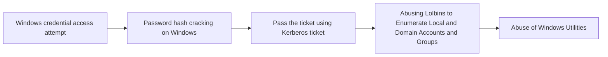

# Windows credential access attempt

## Metadata

- **UUID**: `d0522985-6001-4e25-a5ff-2dc87bf2fee8`
- **Schema**: `threat::1.0`
- **TLP**: clear

## Description
Windows credential access refers to techniques used by threat
actors to steal authentication information such as passwords,
hashes, tokens, or Kerberos tickets stored on or transmitted
by Windows systems. These credentials enable unauthorized
access to systems, networks, or sensitive data, facilitating
lateral movement, privilege escalation, or persistent control.  

Threat actors exploit Windows credential access using various tools
and Living Off The Land Binaries (LOLBins) utilities to gain
unauthorized access to sensitive information.  

Windows credentials usually are stored in two main locations.

### Credentials folder (Windows Vault)

This folder stores encrypted copies of user credentials used
by Windows services, applications, and scheduled tasks.
Example for path storing credentials in Windows

`C:\Users\<username>\AppData\Local\Microsoft\Credentials`
`C:\Users\<username>\%LocalAppData%\Microsoft\Credentials\`

where <username> is the logged-in user's account name.  

### Credential Manager

It's location is not fixed. The store of the user credentisls
in this case may vary depending on the user account and other
system settings as language and preferences.  

The Windows OS has many different places it stores or caches its 
credentials, such as:  

- Security Accounts Manager (SAM) database. 
The SAM database is a file present on all Windows systems. This file 
contains all accounts created, as well as all built-in accounts.
Passwords are stored here as hashes. (NT password hash) 
- Other Files 
Passwords can also be found in configuration files and user created files 
(usually plaintext). Certain log files may contain credential information,
such as installer logs, and can also sometimes be found in crash reports. 
- Cached Credentials 
Domain credentials are cached in the registry to allow users to log into their
system when it is not connected to the domain. The Windows system caches the last
10 logon hashes, and some store up to 25 by default. This number is configurable. 
- Local Security Authority Secret (LSA) 
LSA secrets are stored in the registry and allow services to run with user privileges.
This includes VPNs, scheduled tasks, auto-logins, backup service accounts, IIS websites, etc.
They are included in the Security/Policy/Secrets registry in encrypted form. 
- Local Security Authority Subsystem Service Process (LSASS) 
When logging into a Windows machine, credentials are stored in the LSASS process in memory. 
This is primarily used to allow the user to access other resources on the network that they
are authorized to access without having to re-authenticate. The stored formats can be
plaintext (reversable encryption), NT and LM hash, and Kerberos tickets. 
- Credential Store Manager 
The manager is available with Windows 7 and higher. It is basically a digital vault that 
allows users to store user credentials “safely.” All the credentials are stored in a 
specific folder on the Windows system. Windows and Web credentials can be stored here. 
- AD Domain database (NTDS.DIT)
This database stores all credentials for users and computers located on every
AD Domain controller server in an active directory domain environment. (%SystemRoot%\NTDS folder) 

### Known used tools for Windows credential dumping and access ref [1]

- Mimikatz: A popular tool used to extract plaintext passwords,
hash, PIN codes, and Kerberos tickets from memory. It can also
perform pass-the-hash, pass-the-ticket, and build Golden Tickets.
- CrackMapExec: An open-source hacking tool for Windows Active
Directory environments.
- Empire: a post-exploitation and adversary emulation framework
- BloodHound: An open-source tool that uses graph theory to reveal
the hidden and often unintended relationships within an Active
Directory environment. 
- Hashcat: A password cracking tool that can crack Windows hashes,
including NTLM and LM hashes.
- John the Ripper: A password cracking tool that can crack Windows
passwords using dictionary attacks, brute-force attacks, or rainbow
table attacks.
- PsExec: A tool that allows executing commands on remote systems,
which can be used to extract credentials.
- Built-in Windows OS utilities as reg.exe for registry access,
WMI Windows utility, cmd, tasklist and others. 

### Possible used LOLBins utilities ref [2]:

- Windows Credential Editor (WCE): A utility that allows modifying
Windows credentials, including adding new credentials or modifying
existing ones.
- cmdkey: A built-in Windows utility that allows managing cached
credentials, including adding, deleting, or listing credentials.
- runas: A built-in Windows utility that allows running commands
under a different user context, which can be used to exploit
credentials.
- PowerShell: A powerful scripting language that can be used to
exploit credentials, including using cmdlets like Get-Credential
or Invoke-Command.
- tasklist: A built-in Windows utility that can be used to list
running processes, including those running under different user
contexts, which can help identify potential credential
exploitation opportunities.
- wmic: A built-in Windows utility that provides a command-line
interface to the Windows Management Instrumentation (WMI) repository,
which can be used to exploit credentials.

## Techniques
- T1003.002
- T1110.003
- T1557
- T1550.002
- T1110

## Chaining

