# Windows credential access attempt

## Metadata

- **UUID**: `d0522985-6001-4e25-a5ff-2dc87bf2fee8`
- **Schema**: `threat::1.0`
- **Version**: `1`
- **Created**: `2025-02-03`
- **Modified**: `2025-02-11`
- **TLP**: clear (`TLP:CLEAR`)
- **Organisation**: EC DIGIT CSOC (`56b0a0f0-b0bc-47d9-bb46-02f80ae2065a`)

## References
### Public
- **1**: [https://github.com/manikanta-suru/Credential-Dumping-Cheat-Sheet](https://github.com/manikanta-suru/Credential-Dumping-Cheat-Sheet)
- **2**: [https://karim-ashraf.gitbook.io/karim_ashraf_space/writeups/advanced-log-analysis/how-to-detect-the-use-of-living-off-the-land-binaries-lolbins-in-logs](https://karim-ashraf.gitbook.io/karim_ashraf_space/writeups/advanced-log-analysis/how-to-detect-the-use-of-living-off-the-land-binaries-lolbins-in-logs)
- **3**: [https://networkencyclopedia.com/security-account-manager-sam-database/](https://networkencyclopedia.com/security-account-manager-sam-database/)
- **4**: [https://www.techtarget.com/searchenterprisedesktop/definition/Security-Accounts-Manager](https://www.techtarget.com/searchenterprisedesktop/definition/Security-Accounts-Manager)
- **5**: [https://support.passware.com/hc/en-us/articles/360058211414-Extracting-Passwords-from-the-Acquired-Windows-Registry/](https://support.passware.com/hc/en-us/articles/360058211414-Extracting-Passwords-from-the-Acquired-Windows-Registry/)
- **6**: [https://www.fortinet.com/blog/threat-research/offense-and-defense-a-tale-of-two-sides-windows-os-credential-dumping](https://www.fortinet.com/blog/threat-research/offense-and-defense-a-tale-of-two-sides-windows-os-credential-dumping)

## Description
Windows credential access refers to techniques used by threat
actors to steal authentication information such as passwords,
hashes, tokens, or Kerberos tickets stored on or transmitted
by Windows systems. These credentials enable unauthorized
access to systems, networks, or sensitive data, facilitating
lateral movement, privilege escalation, or persistent control.  

Threat actors exploit Windows credential access using various tools
and Living Off The Land Binaries (LOLBins) utilities to gain
unauthorized access to sensitive information.  

Windows credentials usually are stored in two main locations.

### Credentials folder (Windows Vault)

This folder stores encrypted copies of user credentials used
by Windows services, applications, and scheduled tasks.
Example for path storing credentials in Windows

`C:\Users\<username>\AppData\Local\Microsoft\Credentials`
`C:\Users\<username>\%LocalAppData%\Microsoft\Credentials\`

where <username> is the logged-in user's account name.  

### Credential Manager

It's location is not fixed. The store of the user credentisls
in this case may vary depending on the user account and other
system settings as language and preferences.  

The Windows OS has many different places it stores or caches its 
credentials, such as:  

- Security Accounts Manager (SAM) database. 
The SAM database is a file present on all Windows systems. This file 
contains all accounts created, as well as all built-in accounts.
Passwords are stored here as hashes. (NT password hash) 
- Other Files 
Passwords can also be found in configuration files and user created files 
(usually plaintext). Certain log files may contain credential information,
such as installer logs, and can also sometimes be found in crash reports. 
- Cached Credentials 
Domain credentials are cached in the registry to allow users to log into their
system when it is not connected to the domain. The Windows system caches the last
10 logon hashes, and some store up to 25 by default. This number is configurable. 
- Local Security Authority Secret (LSA) 
LSA secrets are stored in the registry and allow services to run with user privileges.
This includes VPNs, scheduled tasks, auto-logins, backup service accounts, IIS websites, etc.
They are included in the Security/Policy/Secrets registry in encrypted form. 
- Local Security Authority Subsystem Service Process (LSASS) 
When logging into a Windows machine, credentials are stored in the LSASS process in memory. 
This is primarily used to allow the user to access other resources on the network that they
are authorized to access without having to re-authenticate. The stored formats can be
plaintext (reversable encryption), NT and LM hash, and Kerberos tickets. 
- Credential Store Manager 
The manager is available with Windows 7 and higher. It is basically a digital vault that 
allows users to store user credentials “safely.” All the credentials are stored in a 
specific folder on the Windows system. Windows and Web credentials can be stored here. 
- AD Domain database (NTDS.DIT)
This database stores all credentials for users and computers located on every
AD Domain controller server in an active directory domain environment. (%SystemRoot%\NTDS folder) 

### Known used tools for Windows credential dumping and access ref [1]

- Mimikatz: A popular tool used to extract plaintext passwords,
hash, PIN codes, and Kerberos tickets from memory. It can also
perform pass-the-hash, pass-the-ticket, and build Golden Tickets.
- CrackMapExec: An open-source hacking tool for Windows Active
Directory environments.
- Empire: a post-exploitation and adversary emulation framework
- BloodHound: An open-source tool that uses graph theory to reveal
the hidden and often unintended relationships within an Active
Directory environment. 
- Hashcat: A password cracking tool that can crack Windows hashes,
including NTLM and LM hashes.
- John the Ripper: A password cracking tool that can crack Windows
passwords using dictionary attacks, brute-force attacks, or rainbow
table attacks.
- PsExec: A tool that allows executing commands on remote systems,
which can be used to extract credentials.
- Built-in Windows OS utilities as reg.exe for registry access,
WMI Windows utility, cmd, tasklist and others. 

### Possible used LOLBins utilities ref [2]:

- Windows Credential Editor (WCE): A utility that allows modifying
Windows credentials, including adding new credentials or modifying
existing ones.
- cmdkey: A built-in Windows utility that allows managing cached
credentials, including adding, deleting, or listing credentials.
- runas: A built-in Windows utility that allows running commands
under a different user context, which can be used to exploit
credentials.
- PowerShell: A powerful scripting language that can be used to
exploit credentials, including using cmdlets like Get-Credential
or Invoke-Command.
- tasklist: A built-in Windows utility that can be used to list
running processes, including those running under different user
contexts, which can help identify potential credential
exploitation opportunities.
- wmic: A built-in Windows utility that provides a command-line
interface to the Windows Management Instrumentation (WMI) repository,
which can be used to exploit credentials.

## Criticality
**Medium** - A Medium priority incident may affect public health or safety, national security, economic security, foreign relations, civil liberties, or public confidence.

## Terrain
> **Adversaries can use different open source tools
(or specially created by themselves) to attempt
stealing Windows credentials from different places
(SAM database, LSA, LSASS, NTDS.DIT and others).

Domains: Enterprise, Public Cloud, Private Cloud
Targets: Workstations, Desktop, Laptop, Virtual Machines
Platforms: Windows, Active Directory**

## Threat Assessment
| Dimension | Assessment | Description |
| --- | --- | --- |
| Severity | Moderate incident | A cyber attack on a small organisation, or which poses a considerable risk to a medium-sized organisation, or preliminary indications of cyber activity against a large organisation or the government. |
| Impact | Reputational Damages; Data Breach; Identity Theft | - |
| Leverage | Tampering; Dwelling; Infrastructure Compromise | - |
| Viability | Likely | Probable (probably) - 55-80% |
| Kill Chain | Credential Access | Techniques resulting in the access of, or control over, system, service or domain credentials. |

## Actors
| Actor | ID | Source | Description |
| --- | --- | --- | --- |
| APT29 | `misp::b2056ff0-00b9-482e-b11c-c771daa5f28a` | ('misp',) | A 2015 report by F-Secure describe APT29 as: 'The Dukes are a well-resourced, highly dedicated and organized cyberespionage group that we believe has been working for the Russian Federation since at least 2008 to collect intelligence in support of foreign and security policy decision-making. The Dukes show unusual confidence in their ability to continue successfully compromising their targets, as well as in their ability to operate with impunity. The Dukes primarily target Western governments and related organizations, such as government ministries and agencies, political think tanks, and governmental subcontractors. Their targets have also included the governments of members of the Commonwealth of Independent States;Asian, African, and Middle Eastern governments;organizations associated with Chechen extremism;and Russian speakers engaged in the illicit trade of controlled substances and drugs. The Dukes are known to employ a vast arsenal of malware toolsets, which we identify as MiniDuke, CosmicDuke, OnionDuke, CozyDuke, CloudDuke, SeaDuke, HammerDuke, PinchDuke, and GeminiDuke. In recent years, the Dukes have engaged in apparently biannual large - scale spear - phishing campaigns against hundreds or even thousands of recipients associated with governmental institutions and affiliated organizations. These campaigns utilize a smash - and - grab approach involving a fast but noisy breakin followed by the rapid collection and exfiltration of as much data as possible.If the compromised target is discovered to be of value, the Dukes will quickly switch the toolset used and move to using stealthier tactics focused on persistent compromise and long - term intelligence gathering. This threat actor targets government ministries and agencies in the West, Central Asia, East Africa, and the Middle East; Chechen extremist groups; Russian organized crime; and think tanks. It is suspected to be behind the 2015 compromise of unclassified networks at the White House, Department of State, Pentagon, and the Joint Chiefs of Staff. The threat actor includes all of the Dukes tool sets, including MiniDuke, CosmicDuke, OnionDuke, CozyDuke, SeaDuke, CloudDuke (aka MiniDionis), and HammerDuke (aka Hammertoss). ' |
| [[Enterprise] APT29](https://attack.mitre.org/groups/G0016) | `att&ck::G0016` | ('att&ck',) | [APT29](https://attack.mitre.org/groups/G0016) is threat group that has been attributed to Russia's Foreign Intelligence Service (SVR).(Citation: White House Imposing Costs RU Gov April 2021)(Citation: UK Gov Malign RIS Activity April 2021) They have operated since at least 2008, often targeting government networks in Europe and NATO member countries, research institutes, and think tanks. [APT29](https://attack.mitre.org/groups/G0016) reportedly compromised the Democratic National Committee starting in the summer of 2015.(Citation: F-Secure The Dukes)(Citation: GRIZZLY STEPPE JAR)(Citation: Crowdstrike DNC June 2016)(Citation: UK Gov UK Exposes Russia SolarWinds April 2021)  In April 2021, the US and UK governments attributed the [SolarWinds Compromise](https://attack.mitre.org/campaigns/C0024) to the SVR; public statements included citations to [APT29](https://attack.mitre.org/groups/G0016), Cozy Bear, and The Dukes.(Citation: NSA Joint Advisory SVR SolarWinds April 2021)(Citation: UK NSCS Russia SolarWinds April 2021) Industry reporting also referred to the actors involved in this campaign as UNC2452, NOBELIUM, StellarParticle, Dark Halo, and SolarStorm.(Citation: FireEye SUNBURST Backdoor December 2020)(Citation: MSTIC NOBELIUM Mar 2021)(Citation: CrowdStrike SUNSPOT Implant January 2021)(Citation: Volexity SolarWinds)(Citation: Cybersecurity Advisory SVR TTP May 2021)(Citation: Unit 42 SolarStorm December 2020) |
| [[Enterprise] APT28](https://attack.mitre.org/groups/G0007) | `att&ck::G0007` | ('att&ck',) | [APT28](https://attack.mitre.org/groups/G0007) is a threat group that has been attributed to Russia's General Staff Main Intelligence Directorate (GRU) 85th Main Special Service Center (GTsSS) military unit 26165.(Citation: NSA/FBI Drovorub August 2020)(Citation: Cybersecurity Advisory GRU Brute Force Campaign July 2021) This group has been active since at least 2004.(Citation: DOJ GRU Indictment Jul 2018)(Citation: Ars Technica GRU indictment Jul 2018)(Citation: Crowdstrike DNC June 2016)(Citation: FireEye APT28)(Citation: SecureWorks TG-4127)(Citation: FireEye APT28 January 2017)(Citation: GRIZZLY STEPPE JAR)(Citation: Sofacy DealersChoice)(Citation: Palo Alto Sofacy 06-2018)(Citation: Symantec APT28 Oct 2018)(Citation: ESET Zebrocy May 2019)  [APT28](https://attack.mitre.org/groups/G0007) reportedly compromised the Hillary Clinton campaign, the Democratic National Committee, and the Democratic Congressional Campaign Committee in 2016 in an attempt to interfere with the U.S. presidential election.(Citation: Crowdstrike DNC June 2016) In 2018, the US indicted five GRU Unit 26165 officers associated with [APT28](https://attack.mitre.org/groups/G0007) for cyber operations (including close-access operations) conducted between 2014 and 2018 against the World Anti-Doping Agency (WADA), the US Anti-Doping Agency, a US nuclear facility, the Organization for the Prohibition of Chemical Weapons (OPCW), the Spiez Swiss Chemicals Laboratory, and other organizations.(Citation: US District Court Indictment GRU Oct 2018) Some of these were conducted with the assistance of GRU Unit 74455, which is also referred to as [Sandworm Team](https://attack.mitre.org/groups/G0034). |
| APT28 | `misp::5b4ee3ea-eee3-4c8e-8323-85ae32658754` | ('misp',) | The Sofacy Group (also known as APT28, Pawn Storm, Fancy Bear and Sednit) is a cyber espionage group believed to have ties to the Russian government. Likely operating since 2007, the group is known to target government, military, and security organizations. It has been characterized as an advanced persistent threat. |
| [[Enterprise] APT28](https://attack.mitre.org/groups/G0007) | `att&ck::G0007` | ('att&ck',) | [APT28](https://attack.mitre.org/groups/G0007) is a threat group that has been attributed to Russia's General Staff Main Intelligence Directorate (GRU) 85th Main Special Service Center (GTsSS) military unit 26165.(Citation: NSA/FBI Drovorub August 2020)(Citation: Cybersecurity Advisory GRU Brute Force Campaign July 2021) This group has been active since at least 2004.(Citation: DOJ GRU Indictment Jul 2018)(Citation: Ars Technica GRU indictment Jul 2018)(Citation: Crowdstrike DNC June 2016)(Citation: FireEye APT28)(Citation: SecureWorks TG-4127)(Citation: FireEye APT28 January 2017)(Citation: GRIZZLY STEPPE JAR)(Citation: Sofacy DealersChoice)(Citation: Palo Alto Sofacy 06-2018)(Citation: Symantec APT28 Oct 2018)(Citation: ESET Zebrocy May 2019)  [APT28](https://attack.mitre.org/groups/G0007) reportedly compromised the Hillary Clinton campaign, the Democratic National Committee, and the Democratic Congressional Campaign Committee in 2016 in an attempt to interfere with the U.S. presidential election.(Citation: Crowdstrike DNC June 2016) In 2018, the US indicted five GRU Unit 26165 officers associated with [APT28](https://attack.mitre.org/groups/G0007) for cyber operations (including close-access operations) conducted between 2014 and 2018 against the World Anti-Doping Agency (WADA), the US Anti-Doping Agency, a US nuclear facility, the Organization for the Prohibition of Chemical Weapons (OPCW), the Spiez Swiss Chemicals Laboratory, and other organizations.(Citation: US District Court Indictment GRU Oct 2018) Some of these were conducted with the assistance of GRU Unit 74455, which is also referred to as [Sandworm Team](https://attack.mitre.org/groups/G0034). |
| [[Enterprise] Lazarus Group](https://attack.mitre.org/groups/G0032) | `att&ck::G0032` | ('att&ck',) | [Lazarus Group](https://attack.mitre.org/groups/G0032) is a North Korean state-sponsored cyber threat group that has been attributed to the Reconnaissance General Bureau.(Citation: US-CERT HIDDEN COBRA June 2017)(Citation: Treasury North Korean Cyber Groups September 2019) The group has been active since at least 2009 and was reportedly responsible for the November 2014 destructive wiper attack against Sony Pictures Entertainment as part of a campaign named Operation Blockbuster by Novetta. Malware used by [Lazarus Group](https://attack.mitre.org/groups/G0032) correlates to other reported campaigns, including Operation Flame, Operation 1Mission, Operation Troy, DarkSeoul, and Ten Days of Rain.(Citation: Novetta Blockbuster)  North Korean group definitions are known to have significant overlap, and some security researchers report all North Korean state-sponsored cyber activity under the name [Lazarus Group](https://attack.mitre.org/groups/G0032) instead of tracking clusters or subgroups, such as [Andariel](https://attack.mitre.org/groups/G0138), [APT37](https://attack.mitre.org/groups/G0067), [APT38](https://attack.mitre.org/groups/G0082), and [Kimsuky](https://attack.mitre.org/groups/G0094). |
| Lazarus Group | `misp::68391641-859f-4a9a-9a1e-3e5cf71ec376` | ('misp',) | Since 2009, HIDDEN COBRA actors have leveraged their capabilities to target and compromise a range of victims; some intrusions have resulted in the exfiltration of data while others have been disruptive in nature. Commercial reporting has referred to this activity as Lazarus Group and Guardians of Peace. Tools and capabilities used by HIDDEN COBRA actors include DDoS botnets, keyloggers, remote access tools (RATs), and wiper malware. Variants of malware and tools used by HIDDEN COBRA actors include Destover, Duuzer, and Hangman. |
| [[Enterprise] Lazarus Group](https://attack.mitre.org/groups/G0032) | `att&ck::G0032` | ('att&ck',) | [Lazarus Group](https://attack.mitre.org/groups/G0032) is a North Korean state-sponsored cyber threat group that has been attributed to the Reconnaissance General Bureau.(Citation: US-CERT HIDDEN COBRA June 2017)(Citation: Treasury North Korean Cyber Groups September 2019) The group has been active since at least 2009 and was reportedly responsible for the November 2014 destructive wiper attack against Sony Pictures Entertainment as part of a campaign named Operation Blockbuster by Novetta. Malware used by [Lazarus Group](https://attack.mitre.org/groups/G0032) correlates to other reported campaigns, including Operation Flame, Operation 1Mission, Operation Troy, DarkSeoul, and Ten Days of Rain.(Citation: Novetta Blockbuster)  North Korean group definitions are known to have significant overlap, and some security researchers report all North Korean state-sponsored cyber activity under the name [Lazarus Group](https://attack.mitre.org/groups/G0032) instead of tracking clusters or subgroups, such as [Andariel](https://attack.mitre.org/groups/G0138), [APT37](https://attack.mitre.org/groups/G0067), [APT38](https://attack.mitre.org/groups/G0082), and [Kimsuky](https://attack.mitre.org/groups/G0094). |

## ATT&CK Techniques
| Technique | Name | Description |
| --- | --- | --- |
| `T1003.002` | [OS Credential Dumping: Security Account Manager](https://attack.mitre.org/techniques/T1003/002) | Adversaries may attempt to extract credential material from the Security Account Manager (SAM) database either through in-memory techniques or through the Windows Registry where the SAM database is stored. The SAM is a database file that contains local accounts for the host, typically those found with the <code>net user</code> command. Enumerating the SAM database requires SYSTEM level access.  A number of tools can be used to retrieve the SAM file through in-memory techniques:  * pwdumpx.exe * [gsecdump](https://attack.mitre.org/software/S0008) * [Mimikatz](https://attack.mitre.org/software/S0002) * secretsdump.py  Alternatively, the SAM can be extracted from the Registry with Reg:  * <code>reg save HKLM\sam sam</code> * <code>reg save HKLM\system system</code>  Creddump7 can then be used to process the SAM database locally to retrieve hashes.(Citation: GitHub Creddump7)  Notes:   * RID 500 account is the local, built-in administrator. * RID 501 is the guest account. * User accounts start with a RID of 1,000+. |
| `T1110.003` | [Brute Force: Password Spraying](https://attack.mitre.org/techniques/T1110/003) | Adversaries may use a single or small list of commonly used passwords against many different accounts to attempt to acquire valid account credentials. Password spraying uses one password (e.g. 'Password01'), or a small list of commonly used passwords, that may match the complexity policy of the domain. Logins are attempted with that password against many different accounts on a network to avoid account lockouts that would normally occur when brute forcing a single account with many passwords. (Citation: BlackHillsInfosec Password Spraying)  Typically, management services over commonly used ports are used when password spraying. Commonly targeted services include the following:  * SSH (22/TCP) * Telnet (23/TCP) * FTP (21/TCP) * NetBIOS / SMB / Samba (139/TCP & 445/TCP) * LDAP (389/TCP) * Kerberos (88/TCP) * RDP / Terminal Services (3389/TCP) * HTTP/HTTP Management Services (80/TCP & 443/TCP) * MSSQL (1433/TCP) * Oracle (1521/TCP) * MySQL (3306/TCP) * VNC (5900/TCP)  In addition to management services, adversaries may "target single sign-on (SSO) and cloud-based applications utilizing federated authentication protocols," as well as externally facing email applications, such as Office 365.(Citation: US-CERT TA18-068A 2018)  In default environments, LDAP and Kerberos connection attempts are less likely to trigger events over SMB, which creates Windows "logon failure" event ID 4625. |
| `T1557` | [Adversary-in-the-Middle](https://attack.mitre.org/techniques/T1557) | Adversaries may attempt to position themselves between two or more networked devices using an adversary-in-the-middle (AiTM) technique to support follow-on behaviors such as [Network Sniffing](https://attack.mitre.org/techniques/T1040), [Transmitted Data Manipulation](https://attack.mitre.org/techniques/T1565/002), or replay attacks ([Exploitation for Credential Access](https://attack.mitre.org/techniques/T1212)). By abusing features of common networking protocols that can determine the flow of network traffic (e.g. ARP, DNS, LLMNR, etc.), adversaries may force a device to communicate through an adversary controlled system so they can collect information or perform additional actions.(Citation: Rapid7 MiTM Basics)  For example, adversaries may manipulate victim DNS settings to enable other malicious activities such as preventing/redirecting users from accessing legitimate sites and/or pushing additional malware.(Citation: ttint_rat)(Citation: dns_changer_trojans)(Citation: ad_blocker_with_miner) Adversaries may also manipulate DNS and leverage their position in order to intercept user credentials, including access tokens ([Steal Application Access Token](https://attack.mitre.org/techniques/T1528)) and session cookies ([Steal Web Session Cookie](https://attack.mitre.org/techniques/T1539)).(Citation: volexity_0day_sophos_FW)(Citation: Token tactics) [Downgrade Attack](https://attack.mitre.org/techniques/T1562/010)s can also be used to establish an AiTM position, such as by negotiating a less secure, deprecated, or weaker version of communication protocol (SSL/TLS) or encryption algorithm.(Citation: mitm_tls_downgrade_att)(Citation: taxonomy_downgrade_att_tls)(Citation: tlseminar_downgrade_att)  Adversaries may also leverage the AiTM position to attempt to monitor and/or modify traffic, such as in [Transmitted Data Manipulation](https://attack.mitre.org/techniques/T1565/002). Adversaries can setup a position similar to AiTM to prevent traffic from flowing to the appropriate destination, potentially to [Impair Defenses](https://attack.mitre.org/techniques/T1562) and/or in support of a [Network Denial of Service](https://attack.mitre.org/techniques/T1498). |
| `T1550.002` | [Use Alternate Authentication Material: Pass the Hash](https://attack.mitre.org/techniques/T1550/002) | Adversaries may “pass the hash” using stolen password hashes to move laterally within an environment, bypassing normal system access controls. Pass the hash (PtH) is a method of authenticating as a user without having access to the user's cleartext password. This method bypasses standard authentication steps that require a cleartext password, moving directly into the portion of the authentication that uses the password hash.  When performing PtH, valid password hashes for the account being used are captured using a [Credential Access](https://attack.mitre.org/tactics/TA0006) technique. Captured hashes are used with PtH to authenticate as that user. Once authenticated, PtH may be used to perform actions on local or remote systems.  Adversaries may also use stolen password hashes to "overpass the hash." Similar to PtH, this involves using a password hash to authenticate as a user but also uses the password hash to create a valid Kerberos ticket. This ticket can then be used to perform [Pass the Ticket](https://attack.mitre.org/techniques/T1550/003) attacks.(Citation: Stealthbits Overpass-the-Hash) |
| `T1110` | [Brute Force](https://attack.mitre.org/techniques/T1110) | Adversaries may use brute force techniques to gain access to accounts when passwords are unknown or when password hashes are obtained.(Citation: TrendMicro Pawn Storm Dec 2020) Without knowledge of the password for an account or set of accounts, an adversary may systematically guess the password using a repetitive or iterative mechanism.(Citation: Dragos Crashoverride 2018) Brute forcing passwords can take place via interaction with a service that will check the validity of those credentials or offline against previously acquired credential data, such as password hashes.  Brute forcing credentials may take place at various points during a breach. For example, adversaries may attempt to brute force access to [Valid Accounts](https://attack.mitre.org/techniques/T1078) within a victim environment leveraging knowledge gathered from other post-compromise behaviors such as [OS Credential Dumping](https://attack.mitre.org/techniques/T1003), [Account Discovery](https://attack.mitre.org/techniques/T1087), or [Password Policy Discovery](https://attack.mitre.org/techniques/T1201). Adversaries may also combine brute forcing activity with behaviors such as [External Remote Services](https://attack.mitre.org/techniques/T1133) as part of Initial Access. |

## Chaining

```mermaid
flowchart LR
d0522985_6001_4e25_a5ff_2dc87bf2fee8["Windows credential access attempt"]
35c76d6c_2ac7_486e_b0b7_b56f6b110bec["Password hash cracking on Windows"]
03cc9593_e7cf_484b_ae9c_684bf6f7199f["Pass the ticket using Kerberos ticket"]
3b1026c6_7d04_4b91_ba6f_abc68e993616["Abusing Lolbins to Enumerate Local and Domain Accounts and Groups"]
d5039f2c_9fcc_4ba3_ad6a_da8c891ba745["Abuse of Windows Utilities"]
d0522985_6001_4e25_a5ff_2dc87bf2fee8 -->|sequence::preceeds| 35c76d6c_2ac7_486e_b0b7_b56f6b110bec
35c76d6c_2ac7_486e_b0b7_b56f6b110bec -->|sequence::preceeds| 03cc9593_e7cf_484b_ae9c_684bf6f7199f
03cc9593_e7cf_484b_ae9c_684bf6f7199f -->|sequence::preceeds| 3b1026c6_7d04_4b91_ba6f_abc68e993616
3b1026c6_7d04_4b91_ba6f_abc68e993616 -->|sequence::preceeds| d5039f2c_9fcc_4ba3_ad6a_da8c891ba745
```

### Chaining details
#### preceeds -> Password hash cracking on Windows (`sequence::preceeds`)
Using a hashed password to authenticate to a system without
knowing the plaintext password.

- **Target UUID**: `35c76d6c-2ac7-486e-b0b7-b56f6b110bec`
#### preceeds -> Pass the ticket using Kerberos ticket (`sequence::preceeds`)
Exploiting Kerberos authentication tickets, which can include
ticket forgery, ticket passing, or exploiting vulnerabilities
in the Kerberos protocol.

- **Target UUID**: `03cc9593-e7cf-484b-ae9c-684bf6f7199f`
#### preceeds -> Abusing Lolbins to Enumerate Local and Domain Accounts and Groups (`sequence::preceeds`)
A threat actor can perform reconnaissance and gathering of user's account
information. For example, listing of the local system and domain accounts
and groups with an attempt and goal to collect Windows credentials.

- **Target UUID**: `3b1026c6-7d04-4b91-ba6f-abc68e993616`
#### preceeds -> Abuse of Windows Utilities (`sequence::preceeds`)
A threat actor can abuse Windows utilities, for example installed
and native Windows tools like WCE, cmd runas, builded functionality
and filters like wmic which can be used for enumeration credentials.

- **Target UUID**: `d5039f2c-9fcc-4ba3-ad6a-da8c891ba745`
