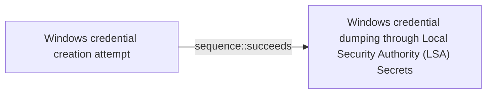

# Windows credential creation attempt

## Metadata

- **UUID**: `09b9aee8-3849-4578-8243-17157d6d54e0`
- **Schema**: `threat::1.0`
- **Version**: `1`
- **Created**: `2025-02-10`
- **Modified**: `2025-02-14`
- **TLP**: clear (`TLP:CLEAR`)
- **Organisation**: EC DIGIT CSOC (`56b0a0f0-b0bc-47d9-bb46-02f80ae2065a`)

## References
### Public
- **1**: [https://learn.microsoft.com/en-us/windows-server/security/windows-authentication/credentials-processes-in-windows-authentication](https://learn.microsoft.com/en-us/windows-server/security/windows-authentication/credentials-processes-in-windows-authentication)
- **2**: [https://woshub.com/saved-passwords-windows-credential-manager/](https://woshub.com/saved-passwords-windows-credential-manager/)
- **3**: [https://help.fortinet.com/fsiem/Public_Resource_Access/7_1_0/rules/PH_RULE_Windows_Credential_Editor.htm](https://help.fortinet.com/fsiem/Public_Resource_Access/7_1_0/rules/PH_RULE_Windows_Credential_Editor.htm)

## Description
### Windows Credential Creation Attempt
A Windows credential creation attempt refers to 
activities where a user or system processes aim 
to create, store, or manipulate sets of credentials 
(e.g., username and password) within a Windows 
environment. This can involve legitimate system 
operations or malicious activities by threat actors 
seeking unauthorized access.

#### Examples of Windows Credential Creation Attempt
**User Account Creation:**

- Using administrative command-line tools such as 
`net user` to add new user accounts.
- Leveraging PowerShell scripts or commands to automate 
the creation of user accounts.
`New-LocalUser`: Create a new local user account with 
`New-LocalUser -Name "[username]"` 
`-Password (ConvertTo-SecureString "[password]"` 
`-AsPlainText -Force)`.

**Abuse of Winlogon:**  

Winlogon.exe is responsible for managing secure user 
interactions during logon. Threat actors can exploit 
this process to pass harvested credentials to the 
Local Security Authority (LSA), thereby impersonating 
legitimate users.

**Saved Passwords in Credential Manager:**  

Threat actors can exploit stored credentials in the 
Windows Credential Manager. These credentials can be 
used to automatically log into various services or 
create new user accounts using the gathered information.

**Credential Injection:**  

Using tools or scripts to inject credentials directly 
into the Windows Security Accounts Manager (SAM) 
database or LSA to create or modify credentials.

**Known Tools for Credential Creation and Manipulation**

- **Windows Credential Editor (WCE):** 
WCE is a tool capable of listing logon sessions and 
modifying associated credentials, such as adding or 
changing NTLM hashes, plaintext passwords, and 
Kerberos tickets. It can be misused to create unauthorised 
credentials on a Windows system.

## Criticality
**High** - A High priority incident is likely to result in a demonstrable impact to public health or safety, national security, economic security, foreign relations, civil liberties, or public confidence.

## Terrain
> **A threat actor needs a valid and privileged accounts 
or equivalent

Domains: Enterprise, Private Cloud, Public Cloud
Targets: Auth token, Customer, Laptop, Web Application Servers, Workstations, Remote access
Platforms: Windows**

## Threat Assessment
| Dimension | Assessment | Description |
| --- | --- | --- |
| Severity | Significant incident | A cyber attack which has a serious impact on a large organisation or on wider / local government, or which poses a considerable risk to central government or (inter)national essential services. |
| Impact | Business disruption; Identity Theft; Impairement; Lose Capabilities; Reputational Damages | - |
| Leverage | Dwelling; Elevation of privilege; New Accounts; Modify configuration; Tampering | - |
| Viability | Environment dependent | Depends |
| Kill Chain | Credential Access | Techniques resulting in the access of, or control over, system, service or domain credentials. |

## Actors
| Actor | ID | Source | Description |
| --- | --- | --- | --- |
| WIZARD SPIDER | `misp::bdf4fe4f-af8a-495f-a719-cf175cecda1f` | ('misp',) | Wizard Spider is reportedly associated with Grim Spider and Lunar Spider. The WIZARD SPIDER threat group is the Russia-based operator of the TrickBot banking malware. This group represents a growing criminal enterprise of which GRIM SPIDER appears to be a subset. The LUNAR SPIDER threat group is the Eastern European-based operator and developer of the commodity banking malware called BokBot (aka IcedID), which was first observed in April 2017. The BokBot malware provides LUNAR SPIDER affiliates with a variety of capabilities to enable credential theft and wire fraud, through the use of webinjects and a malware distribution function. GRIM SPIDER is a sophisticated eCrime group that has been operating the Ryuk ransomware since August 2018, targeting large organizations for a high-ransom return. This methodology, known as “big game hunting,” signals a shift in operations for WIZARD SPIDER, a criminal enterprise of which GRIM SPIDER appears to be a cell. The WIZARD SPIDER threat group, known as the Russia-based operator of the TrickBot banking malware, had focused primarily on wire fraud in the past. |
| [[Enterprise] Wizard Spider](https://attack.mitre.org/groups/G0102) | `att&ck::G0102` | ('att&ck',) | [Wizard Spider](https://attack.mitre.org/groups/G0102) is a Russia-based financially motivated threat group originally known for the creation and deployment of [TrickBot](https://attack.mitre.org/software/S0266) since at least 2016. [Wizard Spider](https://attack.mitre.org/groups/G0102) possesses a diverse arsenal of tools and has conducted ransomware campaigns against a variety of organizations, ranging from major corporations to hospitals.(Citation: CrowdStrike Ryuk January 2019)(Citation: DHS/CISA Ransomware Targeting Healthcare October 2020)(Citation: CrowdStrike Wizard Spider October 2020) |
| LAPSUS | `misp::d9e5be22-1a04-4956-af6c-37af02330980` | ('misp',) | An actor group conducting large-scale social engineering and extortion campaign against multiple organizations with some seeing evidence of destructive elements. |
| [[Enterprise] LAPSUS$](https://attack.mitre.org/groups/G1004) | `att&ck::G1004` | ('att&ck',) | [LAPSUS$](https://attack.mitre.org/groups/G1004) is cyber criminal threat group that has been active since at least mid-2021. [LAPSUS$](https://attack.mitre.org/groups/G1004) specializes in large-scale social engineering and extortion operations, including destructive attacks without the use of ransomware. The group has targeted organizations globally, including in the government, manufacturing, higher education, energy, healthcare, technology, telecommunications, and media sectors.(Citation: BBC LAPSUS Apr 2022)(Citation: MSTIC DEV-0537 Mar 2022)(Citation: UNIT 42 LAPSUS Mar 2022) |

## ATT&CK Techniques
| Technique | Name | Description |
| --- | --- | --- |
| `T1078` | [Valid Accounts](https://attack.mitre.org/techniques/T1078) | Adversaries may obtain and abuse credentials of existing accounts as a means of gaining Initial Access, Persistence, Privilege Escalation, or Defense Evasion. Compromised credentials may be used to bypass access controls placed on various resources on systems within the network and may even be used for persistent access to remote systems and externally available services, such as VPNs, Outlook Web Access, network devices, and remote desktop.(Citation: volexity_0day_sophos_FW) Compromised credentials may also grant an adversary increased privilege to specific systems or access to restricted areas of the network. Adversaries may choose not to use malware or tools in conjunction with the legitimate access those credentials provide to make it harder to detect their presence.  In some cases, adversaries may abuse inactive accounts: for example, those belonging to individuals who are no longer part of an organization. Using these accounts may allow the adversary to evade detection, as the original account user will not be present to identify any anomalous activity taking place on their account.(Citation: CISA MFA PrintNightmare)  The overlap of permissions for local, domain, and cloud accounts across a network of systems is of concern because the adversary may be able to pivot across accounts and systems to reach a high level of access (i.e., domain or enterprise administrator) to bypass access controls set within the enterprise.(Citation: TechNet Credential Theft) |
| `T1552.001` | [Unsecured Credentials: Credentials In Files](https://attack.mitre.org/techniques/T1552/001) | Adversaries may search local file systems and remote file shares for files containing insecurely stored credentials. These can be files created by users to store their own credentials, shared credential stores for a group of individuals, configuration files containing passwords for a system or service, or source code/binary files containing embedded passwords.  It is possible to extract passwords from backups or saved virtual machines through [OS Credential Dumping](https://attack.mitre.org/techniques/T1003).(Citation: CG 2014) Passwords may also be obtained from Group Policy Preferences stored on the Windows Domain Controller.(Citation: SRD GPP)  In cloud and/or containerized environments, authenticated user and service account credentials are often stored in local configuration and credential files.(Citation: Unit 42 Hildegard Malware) They may also be found as parameters to deployment commands in container logs.(Citation: Unit 42 Unsecured Docker Daemons) In some cases, these files can be copied and reused on another machine or the contents can be read and then used to authenticate without needing to copy any files.(Citation: Specter Ops - Cloud Credential Storage) |
| `T1003` | [OS Credential Dumping](https://attack.mitre.org/techniques/T1003) | Adversaries may attempt to dump credentials to obtain account login and credential material, normally in the form of a hash or a clear text password. Credentials can be obtained from OS caches, memory, or structures.(Citation: Brining MimiKatz to Unix) Credentials can then be used to perform [Lateral Movement](https://attack.mitre.org/tactics/TA0008) and access restricted information.  Several of the tools mentioned in associated sub-techniques may be used by both adversaries and professional security testers. Additional custom tools likely exist as well. |
| `T1078.003` | [Valid Accounts: Local Accounts](https://attack.mitre.org/techniques/T1078/003) | Adversaries may obtain and abuse credentials of a local account as a means of gaining Initial Access, Persistence, Privilege Escalation, or Defense Evasion. Local accounts are those configured by an organization for use by users, remote support, services, or for administration on a single system or service.  Local Accounts may also be abused to elevate privileges and harvest credentials through [OS Credential Dumping](https://attack.mitre.org/techniques/T1003). Password reuse may allow the abuse of local accounts across a set of machines on a network for the purposes of Privilege Escalation and Lateral Movement. |
| `T1136` | [Create Account](https://attack.mitre.org/techniques/T1136) | Adversaries may create an account to maintain access to victim systems.(Citation: Symantec WastedLocker June 2020) With a sufficient level of access, creating such accounts may be used to establish secondary credentialed access that do not require persistent remote access tools to be deployed on the system.  Accounts may be created on the local system or within a domain or cloud tenant. In cloud environments, adversaries may create accounts that only have access to specific services, which can reduce the chance of detection. |
| `T1550.004` | [Use Alternate Authentication Material: Web Session Cookie](https://attack.mitre.org/techniques/T1550/004) | Adversaries can use stolen session cookies to authenticate to web applications and services. This technique bypasses some multi-factor authentication protocols since the session is already authenticated.(Citation: Pass The Cookie)  Authentication cookies are commonly used in web applications, including cloud-based services, after a user has authenticated to the service so credentials are not passed and re-authentication does not need to occur as frequently. Cookies are often valid for an extended period of time, even if the web application is not actively used. After the cookie is obtained through [Steal Web Session Cookie](https://attack.mitre.org/techniques/T1539) or [Web Cookies](https://attack.mitre.org/techniques/T1606/001), the adversary may then import the cookie into a browser they control and is then able to use the site or application as the user for as long as the session cookie is active. Once logged into the site, an adversary can access sensitive information, read email, or perform actions that the victim account has permissions to perform.  There have been examples of malware targeting session cookies to bypass multi-factor authentication systems.(Citation: Unit 42 Mac Crypto Cookies January 2019) |

## Chaining

### Chaining details
#### succeeds -> Windows credential dumping through Local Security Authority (LSA) Secrets (`sequence::succeeds`)
A threat actor can use a technique for Local Security Authority
(LSA) Secrets dumping in order to abuse a Windows process and
in this way to initiate a process, passing the credentials
collected by the Windows user.

- **Target UUID**: `444e014f-d830-4d0d-9c2e-1f76d80ba380`
