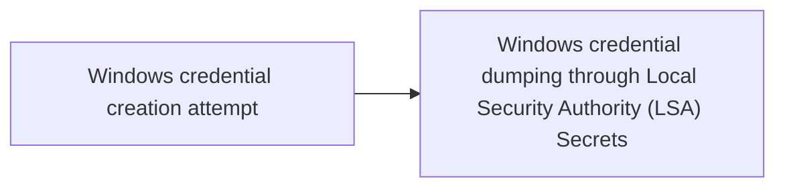

# Windows credential creation attempt

## Metadata

- **UUID**: `09b9aee8-3849-4578-8243-17157d6d54e0`
- **Schema**: `threat::1.0`
- **TLP**: clear

## Description
### Windows Credential Creation Attempt
A Windows credential creation attempt refers to 
activities where a user or system processes aim 
to create, store, or manipulate sets of credentials 
(e.g., username and password) within a Windows 
environment. This can involve legitimate system 
operations or malicious activities by threat actors 
seeking unauthorized access.

#### Examples of Windows Credential Creation Attempt
**User Account Creation:**

- Using administrative command-line tools such as 
`net user` to add new user accounts.
- Leveraging PowerShell scripts or commands to automate 
the creation of user accounts.
`New-LocalUser`: Create a new local user account with 
`New-LocalUser -Name "[username]"` 
`-Password (ConvertTo-SecureString "[password]"` 
`-AsPlainText -Force)`.

**Abuse of Winlogon:**  

Winlogon.exe is responsible for managing secure user 
interactions during logon. Threat actors can exploit 
this process to pass harvested credentials to the 
Local Security Authority (LSA), thereby impersonating 
legitimate users.

**Saved Passwords in Credential Manager:**  

Threat actors can exploit stored credentials in the 
Windows Credential Manager. These credentials can be 
used to automatically log into various services or 
create new user accounts using the gathered information.

**Credential Injection:**  

Using tools or scripts to inject credentials directly 
into the Windows Security Accounts Manager (SAM) 
database or LSA to create or modify credentials.

**Known Tools for Credential Creation and Manipulation**

- **Windows Credential Editor (WCE):** 
WCE is a tool capable of listing logon sessions and 
modifying associated credentials, such as adding or 
changing NTLM hashes, plaintext passwords, and 
Kerberos tickets. It can be misused to create unauthorised 
credentials on a Windows system.

## Techniques
- T1078
- T1552.001
- T1003
- T1078.003
- T1136
- T1550.004

## Chaining

