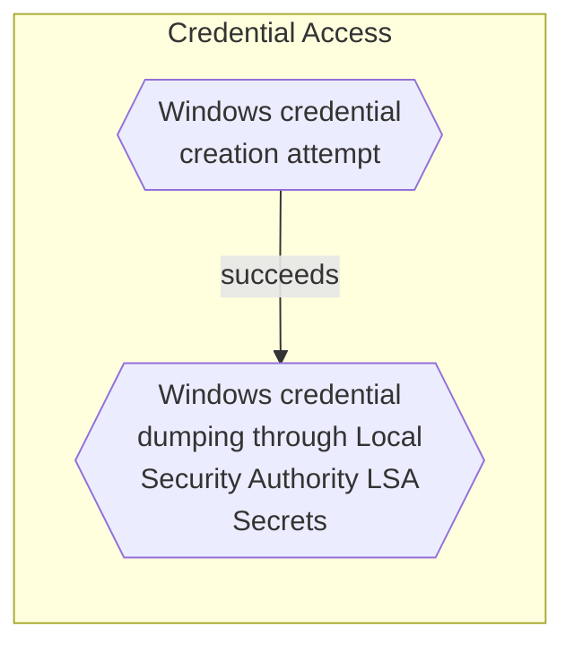

# Windows credential dumping through Local Security Authority (LSA) Secrets

## Metadata
| Field | Value |
| --- | --- |
| UUID | `444e014f-d830-4d0d-9c2e-1f76d80ba380` |
| Schema | `threat::1.0` |
| Version | `2` |
| Created | `2022-11-04` |
| Modified | `2025-10-01` |
| TLP | clear (`TLP:CLEAR`) |
| Organisation | EC DIGIT CSOC (`56b0a0f0-b0bc-47d9-bb46-02f80ae2065a`) |

## References
### Public
- **1**: [https://www.passcape.com/index.php?section=docsys&cmd=details&id=23](https://www.passcape.com/index.php?section=docsys&cmd=details&id=23)
- **2**: [https://attack.mitre.org/software/S0075/](https://attack.mitre.org/software/S0075/)

## Description
Adversaries may attempt to dump credentials to obtain account login
and credentials details, using techniques for Local Security Authority 
(LSA) Secrets dumping. If the attacker has a System access to the host 
this may lead to access LSA secrets database. Local Security Authority
contains credential information related to local and domain based accounts. 
The Registry is used to store the LSA secrets. When services are run under 
the context of local or domain users, their passwords are stored in the 
Registry at HKEY_LOCAL_MACHINE\SECURITY\Policy\Secrets. If auto-logon is 
enabled, this information will be stored in the Registry as well. 
The extracted passwords are UTF-16 encoded, which means that they 
are returned in plaintext. LSA secrets can also be dumped from memory.

Known tools used for LSA credential dumping:

- pwdumpx.exe
- gsecdump
- Mimikatz
- secretsdump.py
- reg.exe (execution file extracts information from the Registry)
- Creddump7 (for gathering of credentials)

Executed commands and arguments that may access to a host may attempt to 
access Local Security Authority (LSA) secrets. Remote access tools may contain 
built-in features or incorporate existing tools like Mimikatz. PowerShell scripts
also can contain credential LSA dumping functionality.

## Criticality
**High** - A High priority incident is likely to result in a demonstrable impact to public health or safety, national security, economic security, foreign relations, civil liberties, or public confidence.

## Terrain
Threat actor is searching entry points in the network to 
gain system level access and registry access. This access 
can be used for dumping information from LSA database and 
further lateral movement in the environment.

## Surface
> **Windows**
> Microsoft Windows operating systems (all versions)

> **Windows::Desktop**
> Microsoft Windows desktop editions

> **Remote Access**
> Remote access solutions (non-VPN)

> **Microsoft::System Center**
> Microsoft System Center enterprise management suite

## Threat Assessment
| Dimension | Assessment | Description |
| --- | --- | --- |
| Severity | Significant incident | A cyber attack which has a serious impact on a large organisation or on wider / local government, or which poses a considerable risk to central government or (inter)national essential services. |
| Impact | Business disruption Identity Theft Impairement Lose Capabilities Nuisance Reputational Damages | Business disruption Acquisition of sufficient information and privileges to profess as a given individual, for the purpose of abusing and deceiving human trust relationships. Incapacitation of a particular key system that will cause disruptions in day-to-day operations, and eventually service delivery. Vector execution will remove key functions to the organization, which will not be easily circumvented. Most day-to-day is heavily impaired, but processes can reorganize at a loss. Small and mostly inconsequential to day to day operations, but noticed. Damages to the organization public view may be achieved by using directly the access gained, or indirectly with data gathered. |
| Leverage | Dwelling Information Disclosure Infrastructure Compromise Elevation of privilege Tampering | Active or passive extended presence in the target, which performs adversarial operations continuously. Threat action intending to read a file that one was not granted access to, or to read data in transit. The compromised target is likely to be used to further expand the sphere of influence of the attacker and allow more potent vectors to be executed. Capacity to augment leverage over the target system by upgrading the compromised access rights Threat action intending to maliciously change or modify persistent data, such as records in a database, and the alteration of data in transit between two computers over an open network, such as the Internet. |
| Viability | Likely | Probable (probably) - 55-80% |
| Kill Chain | Credential Access | Techniques resulting in the access of, or control over, system, service or domain credentials. |

## ATT&CK Techniques
| Technique | Name | Description |
| --- | --- | --- |
| `T1003` | [OS Credential Dumping](https://attack.mitre.org/techniques/T1003) | Adversaries may attempt to dump credentials to obtain account login and credential material, normally in the form of a hash or a clear text password. Credentials can be obtained from OS caches, memory, or structures.(Citation: Brining MimiKatz to Unix) Credentials can then be used to perform [Lateral Movement](https://attack.mitre.org/tactics/TA0008) and access restricted information.  Several of the tools mentioned in associated sub-techniques may be used by both adversaries and professional security testers. Additional custom tools likely exist as well. |
| `T1003.004` | [OS Credential Dumping: LSA Secrets](https://attack.mitre.org/techniques/T1003/004) | Adversaries with SYSTEM access to a host may attempt to access Local Security Authority (LSA) secrets, which can contain a variety of different credential materials, such as credentials for service accounts.(Citation: Passcape LSA Secrets)(Citation: Microsoft AD Admin Tier Model)(Citation: Tilbury Windows Credentials) LSA secrets are stored in the registry at <code>HKEY_LOCAL_MACHINE\SECURITY\Policy\Secrets</code>. LSA secrets can also be dumped from memory.(Citation: ired Dumping LSA Secrets)  [Reg](https://attack.mitre.org/software/S0075) can be used to extract from the Registry. [Mimikatz](https://attack.mitre.org/software/S0002) can be used to extract secrets from memory.(Citation: ired Dumping LSA Secrets) |

## Chaining

