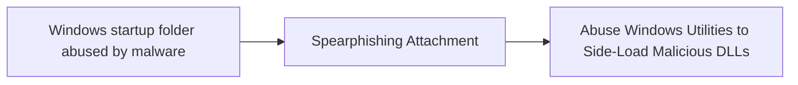

# Windows startup folder abused by malware

## Metadata

- **UUID**: `cce22952-735a-4255-8319-e5e44aef9d85`
- **Schema**: `threat::1.0`
- **TLP**: clear

## Description
The Windows Startup folder is a legitimate feature in Windows that allows
users to specify programs or applications to launch automatically when the
operating system starts. In several reports and analysis different threat
actors have been known to abuse this feature to achieve persistence and
evade detection on compromised systems. 

As a first step the malware is distributed by an initial threat vector, for
example spear-phishing attack. Once the malware is on the targeted system it
creates a shortcut or executable file in the Windows Startup folder
ref [5], [6].

There are several different possible startup locations which can be used
by the threat actors to run malicious programs. 

Examples:

- `C:\Users\<username>\AppData\Roaming\Microsoft\Windows\Start Menu\Programs\Startup`
- `C:\ProgramData\Microsoft\Windows\Start Menu\Programs\Startup`.
- `C:\Users\<username>\AppData\Roaming\Microsoft\Windows\Start Menu\Programs\Startup`
- `C:\ProgramData\Microsoft\Windows\Start Menu\Programs\Startup`

A recent campaign, ref [2], showed threat actors exploiting a vulnerability
in a software application  to deploy shortcut files in the startup folder,
that would point to the malicious executable.

When the user logs in or the system boots, Windows automatically executes
the programs or applications in the Startup folder. Usually the malware is
disguised as a legitimate program and runs in the background, often without 
the user's knowledge or consent.

### Techniques used by malware

- Shortcut files: Malware creates a shortcut file (.lnk) in the Startup
  folder, pointing to the malicious executable.
- Executable files: Malware places an executable file (.exe) directly in the
  Startup folder.
- Registry modifications: Some malware (Amadey) may also overwrite the 
Windows registry key, thush changing the startup folder to the ones 
containing its payload.
- Scripts - some threat actors have used the startup folder as a persistence 
mechanism to execute script files.
- Archive exploitation: WinRAR or crafted installers extract payloads into
  the Startup folder (notably CVE-2023-38831 exploited in the wild).

### Known malware families which can abuse a Windows Startup folder

- Ransomware: Some ransomware variants, like WannaCry and NotPetya, used
  the Startup folder to launch their malicious payloads.
- Trojans: Trojans, such as Emotet and TrickBot, have been known to use the
  Startup folder to maintain persistence on compromised systems.
- Adware/PUP: Adware or Potentially Unwanted Programs (PUPs), like the 
notorious Ask Toolbar, has been found to use the Startup folder to launch 
themselves.  
- LNK Loaders (e.g Gamaredon) ref [7].

## Techniques
- T1547.001

## Chaining

