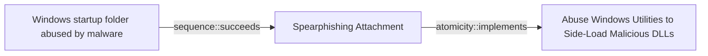

# Windows startup folder abused by malware

## Metadata

- **UUID**: `cce22952-735a-4255-8319-e5e44aef9d85`
- **Schema**: `threat::1.0`
- **Version**: `1`
- **Created**: `2025-08-21`
- **Modified**: `2025-08-22`
- **TLP**: clear (`TLP:CLEAR`)
- **Organisation**: EC DIGIT CSOC (`56b0a0f0-b0bc-47d9-bb46-02f80ae2065a`)

## References
### Public
- **1**: [https://www.bleepingcomputer.com/news/security/winrar-zero-day-flaw-exploited-by-romcom-hackers-in-phishing-attacks](https://www.bleepingcomputer.com/news/security/winrar-zero-day-flaw-exploited-by-romcom-hackers-in-phishing-attacks)
- **2**: [https://www.welivesecurity.com/en/eset-research/update-winrar-tools-now-romcom-and-others-exploiting-zero-day-vulnerability](https://www.welivesecurity.com/en/eset-research/update-winrar-tools-now-romcom-and-others-exploiting-zero-day-vulnerability)
- **3**: [https://www.tenforums.com/general-support/193812-what-3-folders-start-menu-programs-startup.html](https://www.tenforums.com/general-support/193812-what-3-folders-start-menu-programs-startup.html)
- **4**: [https://www.easeus.com/file-recovery/windows-10-startup-folder.html](https://www.easeus.com/file-recovery/windows-10-startup-folder.html)
- **5**: [https://softwarekeep.com/blogs/how-to/how-to-find-the-startup-folder-in-windows-10](https://softwarekeep.com/blogs/how-to/how-to-find-the-startup-folder-in-windows-10)
- **6**: [https://www.tenforums.com/general-support/193812-what-3-folders-start-menu-programs-startup.html](https://www.tenforums.com/general-support/193812-what-3-folders-start-menu-programs-startup.html)
- **7**: [https://www.elastic.co/security-labs/playing-defense-against-gamaredon-group](https://www.elastic.co/security-labs/playing-defense-against-gamaredon-group)

## Description
The Windows Startup folder is a legitimate feature in Windows that allows
users to specify programs or applications to launch automatically when the
operating system starts. In several reports and analysis different threat
actors have been known to abuse this feature to achieve persistence and
evade detection on compromised systems. 

As a first step the malware is distributed by an initial threat vector, for
example spear-phishing attack. Once the malware is on the targeted system it
creates a shortcut or executable file in the Windows Startup folder
ref [5], [6].

There are several different possible startup locations which can be used
by the threat actors to run malicious programs. 

Examples:

- `C:\Users\<username>\AppData\Roaming\Microsoft\Windows\Start Menu\Programs\Startup`
- `C:\ProgramData\Microsoft\Windows\Start Menu\Programs\Startup`.
- `C:\Users\<username>\AppData\Roaming\Microsoft\Windows\Start Menu\Programs\Startup`
- `C:\ProgramData\Microsoft\Windows\Start Menu\Programs\Startup`

A recent campaign, ref [2], showed threat actors exploiting a vulnerability
in a software application  to deploy shortcut files in the startup folder,
that would point to the malicious executable.

When the user logs in or the system boots, Windows automatically executes
the programs or applications in the Startup folder. Usually the malware is
disguised as a legitimate program and runs in the background, often without 
the user's knowledge or consent.

### Techniques used by malware

- Shortcut files: Malware creates a shortcut file (.lnk) in the Startup
  folder, pointing to the malicious executable.
- Executable files: Malware places an executable file (.exe) directly in the
  Startup folder.
- Registry modifications: Some malware (Amadey) may also overwrite the 
Windows registry key, thush changing the startup folder to the ones 
containing its payload.
- Scripts - some threat actors have used the startup folder as a persistence 
mechanism to execute script files.
- Archive exploitation: WinRAR or crafted installers extract payloads into
  the Startup folder (notably CVE-2023-38831 exploited in the wild).

### Known malware families which can abuse a Windows Startup folder

- Ransomware: Some ransomware variants, like WannaCry and NotPetya, used
  the Startup folder to launch their malicious payloads.
- Trojans: Trojans, such as Emotet and TrickBot, have been known to use the
  Startup folder to maintain persistence on compromised systems.
- Adware/PUP: Adware or Potentially Unwanted Programs (PUPs), like the 
notorious Ask Toolbar, has been found to use the Startup folder to launch 
themselves.  
- LNK Loaders (e.g Gamaredon) ref [7].

## Criticality
**High** - A High priority incident is likely to result in a demonstrable impact to public health or safety, national security, economic security, foreign relations, civil liberties, or public confidence.

## Terrain
> **A threat actor needs an initial access to a targeted Windows system.

Domains: Enterprise, Private Cloud, Public Cloud
Cve: CVE-2025-8088
Targets: Directory, Workstations, Laptop, Customer, End-user, Other
Platforms: Windows**

## Threat Assessment
| Dimension | Assessment | Description |
| --- | --- | --- |
| Severity | Significant incident | A cyber attack which has a serious impact on a large organisation or on wider / local government, or which poses a considerable risk to central government or (inter)national essential services. |
| Impact | Impairement; Lose Capabilities | - |
| Leverage | Infrastructure Compromise; Elevation of privilege; Tampering; Modify configuration | - |
| Viability | Likely | Probable (probably) - 55-80% |
| Kill Chain | Persistence | Any access, action or change to a system that gives an attacker persistent presence on the system. |

## Actors
| Actor | ID | Source | Description |
| --- | --- | --- | --- |
| RomCom | `misp::ba9e1ed2-e142-48d0-a593-f73ac6d59ccd` | ('misp',) | ROMCOM is an evolving and sophisticated threat actor group that has been using the malware tool ROMCOM for espionage and financially motivated attacks. They have targeted organizations in Ukraine and NATO countries, including military personnel, government agencies, and political leaders. The ROMCOM backdoor is capable of stealing sensitive information and deploying other malware, showcasing the group's adaptability and growing sophistication. |
| Gamaredon Group | `misp::1a77e156-76bc-43f5-bdd7-bd67f30fbbbb` | ('misp',) | Unit 42 threat researchers have recently observed a threat group distributing new, custom developed malware. We have labelled this threat group the Gamaredon Group and our research shows that the Gamaredon Group has been active since at least 2013.  In the past, the Gamaredon Group has relied heavily on off-the-shelf tools. Our new research shows the Gamaredon Group have made a shift to custom-developed malware. We believe this shift indicates the Gamaredon Group have improved their technical capabilities. |
| [[Enterprise] Gamaredon Group](https://attack.mitre.org/groups/G0047) | `att&ck::G0047` | ('att&ck',) | [Gamaredon Group](https://attack.mitre.org/groups/G0047) is a suspected Russian cyber espionage threat group that has targeted military, NGO, judiciary, law enforcement, and non-profit organizations in Ukraine since at least 2013. The name [Gamaredon Group](https://attack.mitre.org/groups/G0047) comes from a misspelling of the word "Armageddon", which was detected in the adversary's early campaigns.(Citation: Palo Alto Gamaredon Feb 2017)(Citation: TrendMicro Gamaredon April 2020)(Citation: ESET Gamaredon June 2020)(Citation: Symantec Shuckworm January 2022)(Citation: Microsoft Actinium February 2022)  In November 2021, the Ukrainian government publicly attributed [Gamaredon Group](https://attack.mitre.org/groups/G0047) to Russia's Federal Security Service (FSB) Center 18.(Citation: Bleepingcomputer Gamardeon FSB November 2021)(Citation: Microsoft Actinium February 2022) |

## ATT&CK Techniques
| Technique | Name | Description |
| --- | --- | --- |
| `T1547.001` | [Boot or Logon Autostart Execution: Registry Run Keys / Startup Folder](https://attack.mitre.org/techniques/T1547/001) | Adversaries may achieve persistence by adding a program to a startup folder or referencing it with a Registry run key. Adding an entry to the "run keys" in the Registry or startup folder will cause the program referenced to be executed when a user logs in.(Citation: Microsoft Run Key) These programs will be executed under the context of the user and will have the account's associated permissions level.  The following run keys are created by default on Windows systems:  * <code>HKEY_CURRENT_USER\Software\Microsoft\Windows\CurrentVersion\Run</code> * <code>HKEY_CURRENT_USER\Software\Microsoft\Windows\CurrentVersion\RunOnce</code> * <code>HKEY_LOCAL_MACHINE\Software\Microsoft\Windows\CurrentVersion\Run</code> * <code>HKEY_LOCAL_MACHINE\Software\Microsoft\Windows\CurrentVersion\RunOnce</code>  Run keys may exist under multiple hives.(Citation: Microsoft Wow6432Node 2018)(Citation: Malwarebytes Wow6432Node 2016) The <code>HKEY_LOCAL_MACHINE\Software\Microsoft\Windows\CurrentVersion\RunOnceEx</code> is also available but is not created by default on Windows Vista and newer. Registry run key entries can reference programs directly or list them as a dependency.(Citation: Microsoft Run Key) For example, it is possible to load a DLL at logon using a "Depend" key with RunOnceEx: <code>reg add HKLM\SOFTWARE\Microsoft\Windows\CurrentVersion\RunOnceEx\0001\Depend /v 1 /d "C:\temp\evil[.]dll"</code> (Citation: Oddvar Moe RunOnceEx Mar 2018)  Placing a program within a startup folder will also cause that program to execute when a user logs in. There is a startup folder location for individual user accounts as well as a system-wide startup folder that will be checked regardless of which user account logs in. The startup folder path for the current user is <code>C:\Users\\[Username]\AppData\Roaming\Microsoft\Windows\Start Menu\Programs\Startup</code>. The startup folder path for all users is <code>C:\ProgramData\Microsoft\Windows\Start Menu\Programs\StartUp</code>.  The following Registry keys can be used to set startup folder items for persistence:  * <code>HKEY_CURRENT_USER\Software\Microsoft\Windows\CurrentVersion\Explorer\User Shell Folders</code> * <code>HKEY_CURRENT_USER\Software\Microsoft\Windows\CurrentVersion\Explorer\Shell Folders</code> * <code>HKEY_LOCAL_MACHINE\SOFTWARE\Microsoft\Windows\CurrentVersion\Explorer\Shell Folders</code> * <code>HKEY_LOCAL_MACHINE\SOFTWARE\Microsoft\Windows\CurrentVersion\Explorer\User Shell Folders</code>  The following Registry keys can control automatic startup of services during boot:  * <code>HKEY_LOCAL_MACHINE\Software\Microsoft\Windows\CurrentVersion\RunServicesOnce</code> * <code>HKEY_CURRENT_USER\Software\Microsoft\Windows\CurrentVersion\RunServicesOnce</code> * <code>HKEY_LOCAL_MACHINE\Software\Microsoft\Windows\CurrentVersion\RunServices</code> * <code>HKEY_CURRENT_USER\Software\Microsoft\Windows\CurrentVersion\RunServices</code>  Using policy settings to specify startup programs creates corresponding values in either of two Registry keys:  * <code>HKEY_LOCAL_MACHINE\Software\Microsoft\Windows\CurrentVersion\Policies\Explorer\Run</code> * <code>HKEY_CURRENT_USER\Software\Microsoft\Windows\CurrentVersion\Policies\Explorer\Run</code>  Programs listed in the load value of the registry key <code>HKEY_CURRENT_USER\Software\Microsoft\Windows NT\CurrentVersion\Windows</code> run automatically for the currently logged-on user.  By default, the multistring <code>BootExecute</code> value of the registry key <code>HKEY_LOCAL_MACHINE\System\CurrentControlSet\Control\Session Manager</code> is set to <code>autocheck autochk *</code>. This value causes Windows, at startup, to check the file-system integrity of the hard disks if the system has been shut down abnormally. Adversaries can add other programs or processes to this registry value which will automatically launch at boot.  Adversaries can use these configuration locations to execute malware, such as remote access tools, to maintain persistence through system reboots. Adversaries may also use [Masquerading](https://attack.mitre.org/techniques/T1036) to make the Registry entries look as if they are associated with legitimate programs. |

## Chaining

### Chaining details
#### succeeds -> Spearphishing Attachment (`sequence::succeeds`)
A threat actor can use an initial threat vector, for example
spear-phishing with attachment to impant a malware on the system.

- **Target UUID**: `dd5d942c-bac4-4000-b9a6-ca4fef6cfb84`
#### implements -> Abuse Windows Utilities to Side-Load Malicious DLLs (`atomicity::implements`)
Threat actor stores an LNK file in the Startup folder. For example, a
malicious DLL is deployed into ``%TEMP%` directory. Threat actors deploy
malicious .dll binaries with the goal to remain undetected ref [2].

- **Target UUID**: `86f62c3a-6556-4a64-a9f5-a79168ad42d9`
