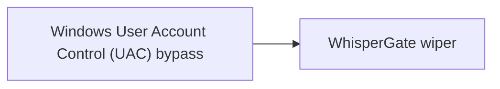

# Windows User Account Control (UAC) bypass

## Metadata

- **UUID**: `d5add960-1b86-41d4-869a-1defd392c8f9`
- **Schema**: `threat::1.0`
- **TLP**: clear

## Description
User Account Control (UAC) is a security feature implemented in the Windows 
operating system to prevent potentially harmful programs from making changes 
to user's computer. The threat actors explore and apply different techniques
and ways to bypass this Winsows security mechanism ref [1].      

For example, some of the used techniques to bypass UAC are:

### DLL Hijacking

This technique involves placing a malicious Dynamic Link Library (DLL) file
in a directory that is part of the system's search path. When the targeted
application loads the required DLL, it inadvertently loads the malicious
DLL instead, granting the attacker elevated privileges.  

Some initially prepared payloads, for example a usage of rundll32.exe can
load a specifically crafted DLL may auto-elevate COM objects and perform
a file operation in a protected directory which would typically require
elevated access.  

### COM Elevation

Component Object Model (COM) is a Microsoft technology used for
communication between software components. By exploiting a vulnerability
in the way the system handles COM objects, an attacker can elevate their
privileges and bypass UAC.  

### Windows Registry modification

A threat actor can change the behavior or the UAC prompt or even completely
turn it off. Their goal is privilege escalation ref [2, 3].    

Example:

```
[HKEY_LOCAL_MACHINE\SOFTWARE\Microsoft\Windows\CurrentVersion\Policies\System]
    "ConsentPromptBehaviorUser"=dword:00000000 ; Automatically deny elevation requests
    "EnableInstallerDetection"=dword:00000000
````

### Fileless Attacks

Fileless attacks, such as PowerShell or Windows Management Instrumentation
(WMI) exploits, can be used to execute malicious code in memory, without
writing any files to the disk. This allows the attacker to bypass UAC,
as it doesn't monitor in-memory activities.

### Privilege Escalation Vulnerabilities

Some applications may have vulnerabilities that can be exploited to gain
elevated privileges. By exploiting these vulnerabilities, an attacker
can bypass UAC and execute code with higher privileges.

For example, the Github readme page for UACMe contains an extensive list of 
methods that have been discovered and implemented within UACMe or the process
eventvwr.exe can auto-elevate and execute a specified binary or script
ref [7].    

### Malicious software installation (skip the UAC prompt)

Another technique to bypass the UAC could be achieved by malicious software
injected into a trusted process to gain elevated privileges without prompting
a user.

## Techniques
- T1548.002

## Chaining

