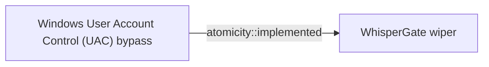

# Windows User Account Control (UAC) bypass

## Metadata

- **UUID**: `d5add960-1b86-41d4-869a-1defd392c8f9`
- **Schema**: `threat::1.0`
- **Version**: `1`
- **Created**: `2025-02-06`
- **Modified**: `2025-02-07`
- **TLP**: clear (`TLP:CLEAR`)
- **Organisation**: EC DIGIT CSOC (`56b0a0f0-b0bc-47d9-bb46-02f80ae2065a`)

## References
### Public
- **1**: [https://infosecwriteups.com/bypassing-uac-1ba99a173b30](https://infosecwriteups.com/bypassing-uac-1ba99a173b30)
- **2**: [https://seclists.org/fulldisclosure/2015/Dec/34](https://seclists.org/fulldisclosure/2015/Dec/34)
- **3**: [https://learn.microsoft.com/en-us/previous-versions/windows/it-pro/windows-server-2008-R2-and-2008/dd835564(v=ws.10)?redirectedfrom=MSDN#BKMK_RegistryKeys](https://learn.microsoft.com/en-us/previous-versions/windows/it-pro/windows-server-2008-R2-and-2008/dd835564(v=ws.10)?redirectedfrom=MSDN#BKMK_RegistryKeys)
- **4**: [https://github.com/hfiref0x/UACME](https://github.com/hfiref0x/UACME)
- **5**: [https://www.elastic.co/security-labs/exploring-windows-uac-bypasses-techniques-and-detection-strategies](https://www.elastic.co/security-labs/exploring-windows-uac-bypasses-techniques-and-detection-strategies)
- **6**: [https://ruuucker.github.io/Bypassing-Windows-uac/](https://ruuucker.github.io/Bypassing-Windows-uac/)
- **7**: [https://github.com/biswajitde/mitre/blob/master/atomics/T1088/T1088.md](https://github.com/biswajitde/mitre/blob/master/atomics/T1088/T1088.md)

## Description
User Account Control (UAC) is a security feature implemented in the Windows 
operating system to prevent potentially harmful programs from making changes 
to user's computer. The threat actors explore and apply different techniques
and ways to bypass this Winsows security mechanism ref [1].      

For example, some of the used techniques to bypass UAC are:

### DLL Hijacking

This technique involves placing a malicious Dynamic Link Library (DLL) file
in a directory that is part of the system's search path. When the targeted
application loads the required DLL, it inadvertently loads the malicious
DLL instead, granting the attacker elevated privileges.  

Some initially prepared payloads, for example a usage of rundll32.exe can
load a specifically crafted DLL may auto-elevate COM objects and perform
a file operation in a protected directory which would typically require
elevated access.  

### COM Elevation

Component Object Model (COM) is a Microsoft technology used for
communication between software components. By exploiting a vulnerability
in the way the system handles COM objects, an attacker can elevate their
privileges and bypass UAC.  

### Windows Registry modification

A threat actor can change the behavior or the UAC prompt or even completely
turn it off. Their goal is privilege escalation ref [2, 3].    

Example:

```
[HKEY_LOCAL_MACHINE\SOFTWARE\Microsoft\Windows\CurrentVersion\Policies\System]
    "ConsentPromptBehaviorUser"=dword:00000000 ; Automatically deny elevation requests
    "EnableInstallerDetection"=dword:00000000
````

### Fileless Attacks

Fileless attacks, such as PowerShell or Windows Management Instrumentation
(WMI) exploits, can be used to execute malicious code in memory, without
writing any files to the disk. This allows the attacker to bypass UAC,
as it doesn't monitor in-memory activities.

### Privilege Escalation Vulnerabilities

Some applications may have vulnerabilities that can be exploited to gain
elevated privileges. By exploiting these vulnerabilities, an attacker
can bypass UAC and execute code with higher privileges.

For example, the Github readme page for UACMe contains an extensive list of 
methods that have been discovered and implemented within UACMe or the process
eventvwr.exe can auto-elevate and execute a specified binary or script
ref [7].    

### Malicious software installation (skip the UAC prompt)

Another technique to bypass the UAC could be achieved by malicious software
injected into a trusted process to gain elevated privileges without prompting
a user.

## Criticality
**High** - A High priority incident is likely to result in a demonstrable impact to public health or safety, national security, economic security, foreign relations, civil liberties, or public confidence.

## Terrain
> **A threat actor uses vulnerabilities in software or applications running on
the system to circumvent UAC (User Account Control) protection mechanism.

Domains: Enterprise, Private Cloud, Public Cloud
Targets: End-user, Customer, Laptop, Workstations, Server Authentication, System admin, Other, Windows API
Platforms: Windows**

## Threat Assessment
| Dimension | Assessment | Description |
| --- | --- | --- |
| Severity | Substantial incident | A cyber attack which has a serious impact on a medium-sized organisation, or which poses a considerable risk to a large organisation or wider / local government. |
| Impact | Lose Capabilities; Business disruption; Impairement; Nuisance; Reputational Damages | - |
| Leverage | Elevation of privilege; Infrastructure Compromise; Dwelling; Tampering; Software installation | - |
| Viability | Likely | Probable (probably) - 55-80% |
| Kill Chain | Defense Evasion | Techniques an attacker may specifically use for evading detection or avoiding other defenses. |

## Actors
| Actor | ID | Source | Description |
| --- | --- | --- | --- |
| [[Enterprise] APT29](https://attack.mitre.org/groups/G0016) | `att&ck::G0016` | ('att&ck',) | [APT29](https://attack.mitre.org/groups/G0016) is threat group that has been attributed to Russia's Foreign Intelligence Service (SVR).(Citation: White House Imposing Costs RU Gov April 2021)(Citation: UK Gov Malign RIS Activity April 2021) They have operated since at least 2008, often targeting government networks in Europe and NATO member countries, research institutes, and think tanks. [APT29](https://attack.mitre.org/groups/G0016) reportedly compromised the Democratic National Committee starting in the summer of 2015.(Citation: F-Secure The Dukes)(Citation: GRIZZLY STEPPE JAR)(Citation: Crowdstrike DNC June 2016)(Citation: UK Gov UK Exposes Russia SolarWinds April 2021)  In April 2021, the US and UK governments attributed the [SolarWinds Compromise](https://attack.mitre.org/campaigns/C0024) to the SVR; public statements included citations to [APT29](https://attack.mitre.org/groups/G0016), Cozy Bear, and The Dukes.(Citation: NSA Joint Advisory SVR SolarWinds April 2021)(Citation: UK NSCS Russia SolarWinds April 2021) Industry reporting also referred to the actors involved in this campaign as UNC2452, NOBELIUM, StellarParticle, Dark Halo, and SolarStorm.(Citation: FireEye SUNBURST Backdoor December 2020)(Citation: MSTIC NOBELIUM Mar 2021)(Citation: CrowdStrike SUNSPOT Implant January 2021)(Citation: Volexity SolarWinds)(Citation: Cybersecurity Advisory SVR TTP May 2021)(Citation: Unit 42 SolarStorm December 2020) |
| APT29 | `misp::b2056ff0-00b9-482e-b11c-c771daa5f28a` | ('misp',) | A 2015 report by F-Secure describe APT29 as: 'The Dukes are a well-resourced, highly dedicated and organized cyberespionage group that we believe has been working for the Russian Federation since at least 2008 to collect intelligence in support of foreign and security policy decision-making. The Dukes show unusual confidence in their ability to continue successfully compromising their targets, as well as in their ability to operate with impunity. The Dukes primarily target Western governments and related organizations, such as government ministries and agencies, political think tanks, and governmental subcontractors. Their targets have also included the governments of members of the Commonwealth of Independent States;Asian, African, and Middle Eastern governments;organizations associated with Chechen extremism;and Russian speakers engaged in the illicit trade of controlled substances and drugs. The Dukes are known to employ a vast arsenal of malware toolsets, which we identify as MiniDuke, CosmicDuke, OnionDuke, CozyDuke, CloudDuke, SeaDuke, HammerDuke, PinchDuke, and GeminiDuke. In recent years, the Dukes have engaged in apparently biannual large - scale spear - phishing campaigns against hundreds or even thousands of recipients associated with governmental institutions and affiliated organizations. These campaigns utilize a smash - and - grab approach involving a fast but noisy breakin followed by the rapid collection and exfiltration of as much data as possible.If the compromised target is discovered to be of value, the Dukes will quickly switch the toolset used and move to using stealthier tactics focused on persistent compromise and long - term intelligence gathering. This threat actor targets government ministries and agencies in the West, Central Asia, East Africa, and the Middle East; Chechen extremist groups; Russian organized crime; and think tanks. It is suspected to be behind the 2015 compromise of unclassified networks at the White House, Department of State, Pentagon, and the Joint Chiefs of Staff. The threat actor includes all of the Dukes tool sets, including MiniDuke, CosmicDuke, OnionDuke, CozyDuke, SeaDuke, CloudDuke (aka MiniDionis), and HammerDuke (aka Hammertoss). ' |
| [[Enterprise] Lazarus Group](https://attack.mitre.org/groups/G0032) | `att&ck::G0032` | ('att&ck',) | [Lazarus Group](https://attack.mitre.org/groups/G0032) is a North Korean state-sponsored cyber threat group that has been attributed to the Reconnaissance General Bureau.(Citation: US-CERT HIDDEN COBRA June 2017)(Citation: Treasury North Korean Cyber Groups September 2019) The group has been active since at least 2009 and was reportedly responsible for the November 2014 destructive wiper attack against Sony Pictures Entertainment as part of a campaign named Operation Blockbuster by Novetta. Malware used by [Lazarus Group](https://attack.mitre.org/groups/G0032) correlates to other reported campaigns, including Operation Flame, Operation 1Mission, Operation Troy, DarkSeoul, and Ten Days of Rain.(Citation: Novetta Blockbuster)  North Korean group definitions are known to have significant overlap, and some security researchers report all North Korean state-sponsored cyber activity under the name [Lazarus Group](https://attack.mitre.org/groups/G0032) instead of tracking clusters or subgroups, such as [Andariel](https://attack.mitre.org/groups/G0138), [APT37](https://attack.mitre.org/groups/G0067), [APT38](https://attack.mitre.org/groups/G0082), and [Kimsuky](https://attack.mitre.org/groups/G0094). |
| Lazarus Group | `misp::68391641-859f-4a9a-9a1e-3e5cf71ec376` | ('misp',) | Since 2009, HIDDEN COBRA actors have leveraged their capabilities to target and compromise a range of victims; some intrusions have resulted in the exfiltration of data while others have been disruptive in nature. Commercial reporting has referred to this activity as Lazarus Group and Guardians of Peace. Tools and capabilities used by HIDDEN COBRA actors include DDoS botnets, keyloggers, remote access tools (RATs), and wiper malware. Variants of malware and tools used by HIDDEN COBRA actors include Destover, Duuzer, and Hangman. |

## ATT&CK Techniques
| Technique | Name | Description |
| --- | --- | --- |
| `T1548.002` | [Abuse Elevation Control Mechanism: Bypass User Account Control](https://attack.mitre.org/techniques/T1548/002) | Adversaries may bypass UAC mechanisms to elevate process privileges on system. Windows User Account Control (UAC) allows a program to elevate its privileges (tracked as integrity levels ranging from low to high) to perform a task under administrator-level permissions, possibly by prompting the user for confirmation. The impact to the user ranges from denying the operation under high enforcement to allowing the user to perform the action if they are in the local administrators group and click through the prompt or allowing them to enter an administrator password to complete the action.(Citation: TechNet How UAC Works)  If the UAC protection level of a computer is set to anything but the highest level, certain Windows programs can elevate privileges or execute some elevated [Component Object Model](https://attack.mitre.org/techniques/T1559/001) objects without prompting the user through the UAC notification box.(Citation: TechNet Inside UAC)(Citation: MSDN COM Elevation) An example of this is use of [Rundll32](https://attack.mitre.org/techniques/T1218/011) to load a specifically crafted DLL which loads an auto-elevated [Component Object Model](https://attack.mitre.org/techniques/T1559/001) object and performs a file operation in a protected directory which would typically require elevated access. Malicious software may also be injected into a trusted process to gain elevated privileges without prompting a user.(Citation: Davidson Windows)  Many methods have been discovered to bypass UAC. The Github readme page for UACME contains an extensive list of methods(Citation: Github UACMe) that have been discovered and implemented, but may not be a comprehensive list of bypasses. Additional bypass methods are regularly discovered and some used in the wild, such as:  * <code>eventvwr.exe</code> can auto-elevate and execute a specified binary or script.(Citation: enigma0x3 Fileless UAC Bypass)(Citation: Fortinet Fareit)  Another bypass is possible through some lateral movement techniques if credentials for an account with administrator privileges are known, since UAC is a single system security mechanism, and the privilege or integrity of a process running on one system will be unknown on remote systems and default to high integrity.(Citation: SANS UAC Bypass) |

## Chaining

### Chaining details
#### implemented -> WhisperGate wiper (`atomicity::implemented`)
WhisperGate wiper is a type of a payload which uses techniques
triggering  User Account Control (UAC) dialog box for evelation
access privilege purposes.

- **Target UUID**: `68ab86f6-378d-4371-ad01-6209fb95d57d`
