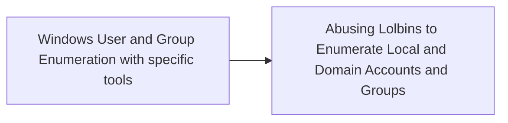

# Windows User and Group Enumeration with specific tools

## Metadata

- **UUID**: `fe243f7f-ffc5-49c0-94e6-293ae2411ad6`
- **Schema**: `threat::1.0`
- **TLP**: clear

## Description
Adversaries may attempt to enumerate the environment and list all local system 
and domain accounts or groups.To achieve this purpose, they can use variety of 
tools and techniques. Their goal is reconnaissance, gathering of user's account 
information on the system or in the domain and further usage of accounts with higher 
privilege access.

There are several tools that can be used by adversaries, such as the following:
  
- Kali Tool like enum4linux 
- Bloodhound can also 
- smbmap, smbclient, etc..
- nmap
- Use of any developped tools or scripts like this one: - windapsearch

Some cases in which adversaries have used such tools include the following:

## Wizard Spider using Bloodhound after Ryuk ransomware compromise:

Ryuk actors quickly map the network to understand the infection scope. They use native 
tools like net view, net computers, and ping to locate network shares and domain controllers. 
For lateral movement, they rely on PowerShell, WMI, Remote Management, RDP, and third-party 
tool Bloodhound.

## Techniques
- T1087.002

## Chaining

